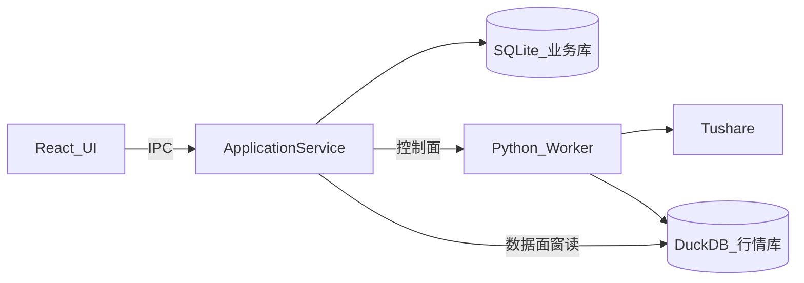

# Sprint1 架构评估与开发计划

## 架构评估结论

整体方向**合理**：本地复盘厚客户端、UI 纯展示、Main 管业务/SQLite、Python 管取数与计算、契约先行——符合「行情重、业务轻、计算可演进」的桌面复盘场景。

当前仓库几乎是空壳（仅 [README.md](README.md)、[frontend/package-backup.json](frontend/package-backup.json)、两份文档），评估对象主要是文档中的目标架构，而非已落地代码。



### 合理之处

- **职责边界清晰**：CRUD/业务配置进 SQLite；行情与指标进 Python/DuckDB；Renderer 不直连 Python。
- **ApplicationService + IPC 适配层**：适合 Electron，便于单测业务、隔离 preload API。
- **控制面 / 数据面分离**：股票列表类小结果走控制面；未来 OHLCV 大表走 Arrow/窗读，避免 IPC 塞大数据。
- **`contracts/` 跨语言契约**：避免 Main/Python 口头约定漂移。

### 需要改进 / 文档缺口

| 问题 | 建议 |
|------|------|
| 缺少进程拓扑与 **Main↔Python 传输**（stdin JSON？命名管道？本地 socket？） | 明确：Main 拉起长期 Python 子进程，**stdin/stdout 行协议**；Sprint1 用 JSON，后续再换 MessagePack |
| MessagePack + Arrow 对 Hello World 过重 | Sprint1 **刻意简化**：IPC 与 Python 桥均用 JSON；DuckDB 仅做 `import` 冒烟，不接数据面 |
| 无配置/密钥方案 | Tushare token 读 `appData` 下配置或环境变量 `TUSHARE_TOKEN`；UI 可先做简单输入框写入配置 |
| 无错误/进度/取消语义 | Sprint1 至少：同步中 loading、失败 toast、超时；`cancel` 可留空接口 |
| `contracts/` 格式未定 | Sprint1 用 **JSON Schema + TypeScript 类型 + Pydantic 模型** 三份同构描述 `stock_basic` |
| 壳能力（单实例/托盘/electron-builder 完整分发）过早 | Sprint1 只做可 `dev` 启动；打包与嵌入式 Python 放到后续迭代 |
| [package-backup.json](frontend/package-backup.json) 含 Monaco/Ruff 等与 Sprint1 无关依赖 | 前端脚手架只保留 React + MUI + Vite；其余后加 |

**默认技术选型（Sprint1）**

- 脚手架：[electron-vite](https://electron-vite.org/)（`src/main` / `src/preload` / `src/renderer`）
- SQLite：`better-sqlite3`（Main 同步 API，适合业务 CRUD）
- Python：本机 Python 3.11+ + `python/` 下 venv（`tushare` / `pandas` / `numpy` / `duckdb` / `pydantic`）
- 协议：Renderer↔Main 用 `ipcMain.handle`；Main↔Python 用 **NDJSON over stdin/stdout**

---

## Sprint1 目标对齐

验收标准（与 [sprint1.md](prompt/trading-zone-electron开发文档/sprint1.md) 一致）：

1. Electron + React UI，可经 Main/SQLite 交互  
2. Python worker 能加载 tushare / pandas / numpy / duckdb  
3. 全链路：`UI → ApplicationService → Python(tushare 拉 A 股列表) → 写入 SQLite → UI 展示`

---

## 建议目录结构

```
trading-zone-electron/
  package.json                 # electron-vite 根工程
  electron.vite.config.ts
  src/
    main/
      index.ts                 # 窗口、生命周期、拉起 Python
      db/sqlite.ts             # better-sqlite3 初始化与 migration
      services/applicationService.ts
      bridge/pythonBridge.ts   # 子进程 + NDJSON
      ipc/registerHandlers.ts
    preload/index.ts           # contextBridge 暴露 api
    renderer/                  # React + MUI（由 package-backup 精简而来）
  python/
    worker/main.py             # 读 stdin 请求、写 stdout 响应
    worker/handlers/stock_list.py
    requirements.txt
  contracts/
    stock_list.request.json
    stock_list.response.json
  .env.example                 # TUSHARE_TOKEN=
```

---

## 开发计划（按顺序落地）

### 1. 工程脚手架

- 用 electron-vite 初始化 Electron + React + TS
- 以 [frontend/package-backup.json](frontend/package-backup.json) 为参考接入 MUI，**不引入** Monaco/Ruff/axios（Sprint1 不需要 HTTP）
- 配置 `dev` 一键启动；preload 开启 `contextIsolation`，仅暴露白名单 API
- 补充 `.gitignore`、根 README（如何装依赖、设 token、启动）

### 2. SQLite 业务层

- `app.getPath('userData')` 下建库
- 表 `stocks`：`ts_code` PK、`symbol`、`name`、`area`、`industry`、`market`、`list_date`、`synced_at`
- Repository：`upsertMany`、`listAll`
- IPC：`stocks:list` 供 UI 读库

### 3. Python Worker + 契约

- `python/requirements.txt` + venv 安装说明
- Worker 启动后回一条 `ready`；循环处理 NDJSON：`{ "id", "method", "params" }` → `{ "id", "ok", "result"|"error" }`
- 实现 `data.sync.stock_list`：`pro.stock_basic(...)`，返回字段与 SQLite 表对齐
- 启动时 `import pandas, numpy, duckdb, tushare` 冒烟；缺 token 返回明确错误
- `contracts/` 写请求/响应 JSON Schema，TS 与 Pydantic 对照

### 4. ApplicationService 编排

- `syncStockList()`：读 token → `pythonBridge.call('data.sync.stock_list')` → `stocksRepo.upsertMany` → 返回条数
- IPC：`stocks:sync`
- Python 进程随 app 启停；崩溃可自动重启一次并打日志

### 5. UI 最小页

- 一页：工具栏「同步股票列表」+ 表格（MUI Table 或 DataGrid 简化版）展示 `ts_code / name / industry / market`
- 启动时 `stocks:list`；同步成功后刷新
- loading / error 状态；可选简单 Token 设置（写入 userData 配置文件）

### 6. 验收自测清单

- `npm run dev` 起窗
- Python worker 日志可见 ready + 库 import 成功
- 配置有效 token 后点同步，SQLite 有数据且 UI 列表非空
- 无 token / 网络失败时 UI 可见错误信息
- 重启应用后列表仍从 SQLite 加载（证明业务库持久化）

---

## 明确不在 Sprint1 范围

- MessagePack / Arrow IPC / DuckDB 窗读行情
- `compute.indicator`、行情 `sync.market`、图表 lightweight-charts
- 托盘、单实例、electron-builder 正式分发、python-build-standalone 嵌入
- Monaco、策略编辑器等 [package-backup.json](frontend/package-backup.json) 中的远期依赖

---

## 建议同步补强架构文档的三句话

后续可把架构文档补上：**(1) 三进程 + Python 子进程拓扑；(2) Sprint 演进：JSON → MessagePack/Arrow；(3) 配置与 Tushare token 存放位置。** 实现阶段按上表执行即可，不必阻塞编码。
