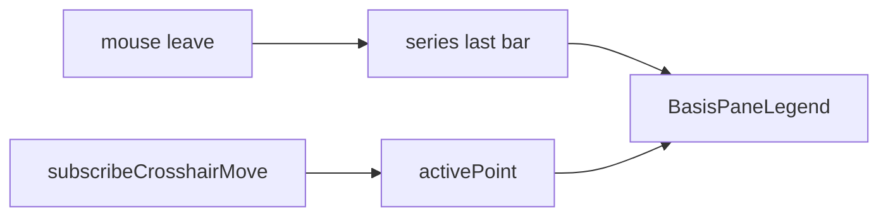

# Sprint5.2 基差图例开发计划

## 背景

Sprint5.2 主体已落地：`fut_daily` + `dashboard:query.basis` + 四张双窗格图。现图例只有居中「期指收盘 / 现货收盘」色条，缺基差、无数、不跟十字线。

产品口径见 [Sprint5.2需求文档 §5](docs/releases/v0.2/Sprint5/Sprint5.2需求文档.md)，迭代见 [Sprint5.2迭代文档](docs/releases/v0.2/Sprint5/Sprint5.2迭代文档.md) G6 / F06。主体数据计划见 [sprint5.2_股指期货基差.plan.md](./sprint5.2_股指期货基差.plan.md)。

## 目标

1. 每张基差图**主窗格**显示三项：期指价格、现货价格、基差（系列名 + 数值）
2. 默认最新一根；十字线跟随当日；移出图区回到最新一根
3. 基差数字按正负着色（`>= 0` `UP_COLOR`，否则 `DOWN_COLOR`），色块红绿并排

## 不做

- 两融 / 成交额 / 涨跌停等其它仪表盘图例
- 改契约、同步、`acceptance:v02s52`、四图布局
- 改 `StatLegend`（避免回归其它统计图）

## 实现要点

只改 [`BasisProductChart.tsx`](src/renderer/src/pages/dashboard/BasisProductChart.tsx)。



- `useState` 存 `activePoint`；展示 `activePoint ?? series[series.length - 1]`
- `chart.subscribeCrosshairMove`：`param.time` 有值则按 `yyyymmddToChartTime` 对齐 `series`；无 time / 找不到点则 `null`
- 清理时 `unsubscribeCrosshairMove`，与 `ResizeObserver` / `remove()` 一起拆
- overlay：`position: absolute; top: 4; left: 50%; transform: translateX(-50%)`；`pointerEvents: none`
- 期指：`STAT_VALUE_COLOR` 色线 + `fut_close` 两位小数
- 现货：`STAT_CLOSE_COLOR` 色线 + `spot_close` 两位小数
- 基差：红绿并排小色块 + `spot_close − fut_close`（现有 `basisOf`）；数字颜色与柱一致
- 基差文本复用 `formatBasisLabel`；空序列仍走 `ChartPlaceholder`

## 任务顺序

1. 需求 / 迭代 / 本 plan
2. `BasisPaneLegend` + 十字线
3. `typecheck` + 窗内点验

## 验收

```bash
npm run typecheck
npm run dev
```

窗内：仪表盘滚到基差四图 → 每张主窗格三项且默认最新日；十字线移动三项一起变；基差正红负绿；移出图区回到最新日；无期货数据的格仍为空。不必为图例改 `acceptance:v02s52`。

## 风险

| 风险 | 处理 |
|---|---|
| 图例挡十字线 | `pointerEvents: none` |
| 十字线在空隙触发多余 setState | 按日字符串去重后再 `setActivePoint` |
| 改公共 `StatLegend` 回归其它图 | 本图专用 overlay |
