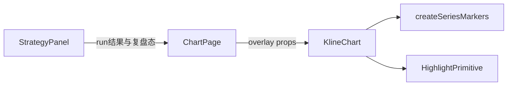

# Sprint8.1 图表复盘开发计划

需求来源：[Sprint8迭代文档.md](docs/releases/v0.2/Sprint8/Sprint8迭代文档.md) §6.1（从需求原稿 UI 图表交互迁入）。Sprint8 已完成策略 list/run 与平级面板列表；本轮只补图表闭环。

确认本计划后，**先写文档**（状态：进行中；任务/测试标待开始，不虚构 PASS）：

- [docs/releases/v0.2/Sprint8/Sprint8.1迭代文档.md](docs/releases/v0.2/Sprint8/Sprint8.1迭代文档.md)（六段骨架，与 Sprint6.1 同目录惯例）
- [docs/releases/v0.2/Sprint8/Sprint8.1需求文档.md](docs/releases/v0.2/Sprint8/Sprint8.1需求文档.md)（短稿：从 §6.1 + 原需求 3.1 复盘按钮 / 3.2 图表交互升格）
- 回链：[Sprint8迭代文档.md](docs/releases/v0.2/Sprint8/Sprint8迭代文档.md) 附录 A、[Sprint8需求文档.md](docs/releases/v0.2/Sprint8/Sprint8需求文档.md) 文首

本文件即开发计划。实现代码另等明确开工。

---

## 本轮目标

在图表页执行 `MingSystemVer1` 后：主图 K 线下方出现买红/卖绿标记；列表五按钮进入复盘后，当前行强调，主图对该根 K 线整列铺背景高亮（买浅红 / 卖浅绿 / 非买卖浅灰），且不压过蜡烛。

### 验收（G1–G3）

- **G1 列表复盘状态机**：五按钮可用/禁用符合位置；开始后当前行强调、可点选；切到可视区外时该行滚到列表底部；取消后回到纯列表
- **G2 主图买卖点图标**：执行成功后买点下方红色、卖点下方绿色；关面板或清空结果后标记消失
- **G3 复盘高亮**：开始复盘后选中 K 线整列铺背景；取消复盘或关面板时图表退出高亮

### 本轮不做

- 因子开关 / 调参、卖出算法、失败原因标签、指数/期指通用读数层
- 改 Python worker、IPC、`contracts/strategy.*`、`ChartInput` schema
- 新隔离验收脚本（本轮纯 Renderer 视觉；`acceptance:v02s8` 仍覆盖 list/run）
- 策略脚本化

---

## 数据流

策略计算仍走 Sprint8 的 `strategy:run`。本轮新增的是 **UI Controller 把 overlay 注入 Chart**，符合 [UI-Controller与Chart系统架构.md](docs/releases/v0.2/UI-Controller与Chart系统架构.md)：Chart 不 IPC、不改 `ChartInput`。

---

## 关键设计锁定

**Overlay 由 ChartPage 持有，经 props 进 KlineChart**（不进 `syncPrimitiveSeries` / `ChartInput.primitives`）。

拟定 overlay 形状：

- `markers`: `{ timeIso, side: 'buy' | 'sell' }[]`（来自全量 `result.series` 的信号行）
- `highlight`: `{ timeIso, kind: 'buy' | 'sell' | 'neutral' } | null`

**时间格式（最高风险）：** 策略 `series.time` 是 `YYYYMMDD`，K 线 `ChartInput.candle[].time` 是 `YYYY-MM-DD`。设 marker / highlight 前必须用已有 [`yyyymmddToIso`](src/shared/constants/market.ts)，禁止把 8 位日期直接 cast 给 LWC。图表页不要 import 仪表盘 [`format.ts`](src/renderer/src/pages/dashboard/format.ts)。

**复盘状态机在 StrategyPanel：**

- 五按钮（左→右）：上一根 / 刷新回第一条 / 开始↔取消 / 下一根；复用 [`ChartIconButton`](src/renderer/src/pages/chart/ChartIconButton.tsx)
- 索引绑定当前 `tabRows`（不是 raw series）
- 未开始、或 `tabRows.length === 0`、或已在第一/最后一根：对应按钮不可用
- 开始：选中第一条，进入复盘，上报 highlight
- 取消：退出复盘，列表回到纯列表，highlight 置 null；**markers 保留**
- 切 Tab：若仍在复盘且新列表非空，选中新列表第一行；空列表则去掉高亮并禁用导航
- 行点击仅在复盘中生效
- 按钮切到可视区外：列表容器 `scrollIntoView({ block: 'end' })`，保证该行在可视区底部
- 主图：选中时间若不在当前可见区，`timeScale` 滚到该根可见（否则 G3 无法点验）。不改缩放策略为「强行铺满」

**Markers（G2）：** 挂在 candle 的 `createSeriesMarkers`（参考 [`BasisProductChart.tsx`](src/renderer/src/pages/dashboard/BasisProductChart.tsx) 与遗留 `参考frontend/.../ChartComponent.tsx`）。`position: 'belowBar'`；买红 `#ef5350`、卖绿 `#26a69a`（与 KlineChart 涨跌色一致）。独立 `useEffect` `setMarkers`，不进 `primitiveSeriesRef`。

**Highlight（G3）：** 新文件例如 [`src/renderer/src/pages/chart/ReplayHighlightPrimitive.ts`](src/renderer/src/pages/chart/ReplayHighlightPrimitive.ts)，LWC 5 `ISeriesPrimitive` 挂在 candle `attachPrimitive`。竖条宽度 ≈ 一根 bar，铺满主图 pane 高度，`zOrder` 在蜡烛之下。颜色建议：买 `rgba(239,83,80,0.18)`、卖 `rgba(38,166,154,0.18)`、非买卖 `rgba(0,0,0,0.08)`。unmount / overlay null 时 `detachPrimitive`。

**清理矩阵（F06）：**

- 关面板 / 换策略（`key={selectedStrategy.id}` remount）：overlay = null → 清 markers + detach 高亮
- 取消复盘：只清 highlight
- 新一次 `handleRun`：重置复盘；按新 series 重算 markers
- **换标的 / 换复权**：必须清 result 与 overlay（现状面板 `key` 只跟策略 id，不换标的会把旧买卖点画到新图上）

---

## 改动文件（开工后）

- [`StrategyPanel.tsx`](src/renderer/src/pages/chart/StrategyPanel.tsx)：五按钮、行选中、滚动、`onOverlayChange`
- [`ChartPage.tsx`](src/renderer/src/pages/ChartPage.tsx)：持有 overlay，传给 `KlineChart`；关面板清空
- [`KlineChart.tsx`](src/renderer/src/pages/chart/KlineChart.tsx)：markers + highlight + 可选 `focusTimeIso`
- 新 `ReplayHighlightPrimitive.ts`
- 不改 [`syncPrimitiveSeries.ts`](src/renderer/src/pages/chart/syncPrimitiveSeries.ts) 的指标 diff

---

## 实现顺序（写入迭代文档 §4；代码待开工）

1. 文档：8.1 迭代文档 + 短需求文档 + 回链 Sprint8
2. overlay 类型与 `StrategyPanel` → `ChartPage` 回调
3. 五按钮状态机、行选中、列表滚到底
4. `KlineChart` markers（YYYYMMDD → ISO）
5. highlight primitive + 退出清理
6. 换标的/关面板/切策略清理
7. `npm run typecheck`；`npm run dev` 图表页手工清单（含卖点 Tab 空表、取消后标记仍在、关面板后全无）

---

## 文档写完后的迭代文档要点

- 状态：**进行中**
- US 从 Sprint8 的图表交互拆出（复盘 / 标记 / 高亮）
- 功能清单 F01–F06 与 §6.1 一致，状态待开始
- 测试节：typecheck / 手工待补跑；不编造 PASS
- §6 改进：中期接回因子调参与 MingSystem 止盈止损卖点
