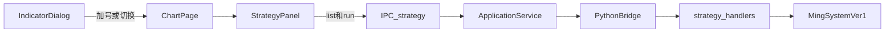

# Sprint8 开发计划

需求原稿：[Sprint8需求文档.md](docs/releases/v0.2/Sprint8/Sprint8需求文档.md)（整包愿景未改）。本轮收窄为**策略执行闭环**；图表交互与列表复盘按钮放到 **Sprint8.1**，细节写进迭代文档 §6.1，本轮不另建 8.1 目录。

确认本计划后，**先写** [docs/releases/v0.2/Sprint8/Sprint8迭代文档.md](docs/releases/v0.2/Sprint8/Sprint8迭代文档.md)（六段骨架、状态进行中、任务/测试待开始），文首链到本计划、需求文档、[Sprint7迭代文档.md](docs/releases/v0.2/Sprint7/Sprint7迭代文档.md) 与策略草稿 [MingSystemVer1.py](python/worker/strategies/MingSystemVer1.py)。实现代码另等明确开工，本轮文档不虚构 PASS。

---

## 本轮目标

图表页选中 `MingSystemVer1` → 右侧平级策略面板 → 选区间执行 → 面板展示 `buy_count` / `bar_count` 与买/卖/混合/自选列表。卖点 Tab 允许空表（策略尚无卖出算法）。

### 验收

- `strategy.list` 能列出 `ming_system_ver1`
- `strategy.run` 返回 `stats + series`（必有 `time/ohlcv/buy_signal/sell_signal`）
- 图表页面板能看到统计和买点序列
- `acceptance:v02s8` 隔离库覆盖 list/run；UI 手工

### 本轮不做

- 列表复盘五按钮、自动滚到可视区底部
- 主图买卖点图标、复盘高亮、退出高亮
- 因子开关 / 参数调参、卖出算法、失败原因标签、指数/期指通用读数层

---

## 数据流

策略注册表以 **Python 为唯一数据源**（id → 类 / 显示名）。Electron 只转发，不维护第二份类映射。

---

## 协议（拟定）

- Python：`strategy.list`、`strategy.run`
- IPC：`strategy:list`、`strategy:run`
- `run` 入参：`strategy_id`、`ts_code`、`start_date`、`end_date`、`adjust`
- 返回：`stats: { buy_count, bar_count }` + `series` 行数组；计算过程列可选
- 契约：`contracts/strategy.list.response.json`、`contracts/strategy.run.request.json`、`contracts/strategy.run.response.json`
- 类型：`src/shared/types/pythonProtocol.ts` 增 `PYTHON_METHODS` 与结果类型

`output_result` 改为结构化对象，CLI [main.py](python/worker/strategies/main.py) 仍可本地 print。读数先走现有 [query_ohlcv_arrow](python/worker/db/market_db.py)（股票日线+复权；仪表盘指数已有分支）。

---

## 实现顺序（文档写进 §4，代码待开工）

1. 契约与 TS/Python 类型
2. [Strategy.py](python/worker/strategies/Strategy.py) 标准化返回；[MingSystemVer1.py](python/worker/strategies/MingSystemVer1.py) 接 `stats + series`（`sell_signal` 恒 false）
3. 新 handler + [python/worker/main.py](python/worker/main.py) 注册
4. [applicationService.ts](src/main/services/applicationService.ts) / [registerHandlers.ts](src/main/ipc/registerHandlers.ts) / [preload/index.ts](src/preload/index.ts)
5. [IndicatorDialog.tsx](src/renderer/src/pages/chart/IndicatorDialog.tsx) 策略 Tab：加号 / 已选正确 / 切换
6. [ChartPage.tsx](src/renderer/src/pages/ChartPage.tsx) 右侧平级面板（可拖宽，最大不超过图表可视区一半，不含标的列表）；新 `StrategyPanel`：标题关闭、时间+执行、统计键值自适应、四 Tab、列选择、时间排序、自选过滤
7. `src/main/acceptance/runV02Sprint8.ts` + `acceptance:v02s8`

面板是与标的列表、图表**平级**的栏，不是 [ScriptEditorPanel](src/renderer/src/pages/chart/scriptEditor/ScriptEditorPanel.tsx) 那种 z-index 覆盖。

---

## Sprint8.1（写入迭代文档 §6.1，可直接升成下轮 G/F）

依赖本轮 `series.buy_signal` / `sell_signal` 与面板列表选中态。

**G1 列表复盘状态机**

- 五按钮：上一根 / 刷新回第一条 / 开始↔取消 / 下一根
- 未开始或已在两端时对应按钮不可用
- 开始后当前行背景强调，可点选；切到可视区外时滚到列表底部
- 取消后退出复盘，列表回到纯列表

**G2 主图买卖点图标**

- 执行成功后：买点 K 线下方红色图标，卖点下方绿色图标
- 落在 [KlineChart.tsx](src/renderer/src/pages/chart/KlineChart.tsx)，可参考仪表盘 [BasisProductChart.tsx](src/renderer/src/pages/dashboard/BasisProductChart.tsx) 的 `createSeriesMarkers`
- 关闭策略或清空结果时去掉标记

**G3 复盘高亮**

- 开始复盘后主图进入高亮：选中 K 线整列高度铺背景，不压过蜡烛
- 买点浅红、卖点浅绿、非买卖浅灰
- 取消复盘或关面板时图表一并退出高亮
- 需自定义 LWC primitive，并与现有 primitive series 生命周期对齐

8.1 仍不做：因子开关/调参、卖出算法、失败原因标签、指数/期指通用读数。

中期（§6.2）：因子开关与调参、MingSystem 止盈止损卖点。长期（§6.3）：策略脚本化，与指标脚本同一套。
