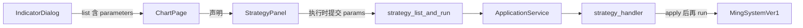

# Sprint9.2 策略调参开发计划

需求来源：[Sprint9.2需求文档.md](docs/releases/v0.2/Sprint9/Sprint9.2需求文档.md)。六段说明见 [Sprint9.2迭代文档.md](docs/releases/v0.2/Sprint9/Sprint9.2迭代文档.md)。

确认本计划后按下面顺序改代码。迭代文档里的任务和测试保持「待开始 / 待补跑」，跑完验收再改状态。

---

## 本轮目标

图表页策略面板的配置区展示该策略声明的参数。使用者改值后点现有执行按钮，统计、买卖点列表和主图标记按这组参数更新。不点执行则画面不变。

### 验收（G1–G4）

- **G1** `strategy.list` 的 `ming_system_ver1` 带六项参数，缺省为 `squeeze_period=20`、`wr_n=3`、`range_mode=co`、`k=0.6`、`vol_x=5`、`vol_y=1`
- **G2** 面板按声明画控件；非法值不发请求；执行中不可改；没有声明时不画表单
- **G3** 不传 `params` 与传入全部缺省的买点序列一致；`range_mode=cl` 时序列与缺省不同
- **G4** 改参数但不执行，列表和主图仍是上一次结果；`sell_signal` 仍恒为 false

### 本轮不做

- 参数方案持久化、自动重跑、网格扫描
- 止损 `z`、止盈 `w`、卖出算法、滤网公式
- 复盘 / 高亮 / 标记，以及 Sprint9.1 的面板样式
- 复用指标 `ManifestFieldsForm` 或 `input.bool`
- 把说明文档的 `wr_n=6`、`vol_y=1.5` 写成缺省

---

## 数据流



列表已经在选策略时加载。`ChartPage` 持有的 `StrategyInfo` 补上 `parameters` 后传给面板，面板不第二次拉列表。成功后的 `setResult` 与 `onOverlayChange` 保持 Sprint8 / 8.1 的路径。

---

## 关键设计锁定

**声明在策略类，不在面板。** 新增 `python/worker/strategies/params.py`，字段为 `name`、`title`、`widget`（`int` | `float` | `enum`）、`default`，以及可选 `min`、`max`、`options[{value,label}]`。`StrategyClass.parameters` 默认为空元组。`apply_parameters` 在 `run()` 之前 `setattr` 到实例。

**六项缺省只有一处。** `MingSystemVer1.parameters` 列出下表，类属性从这份声明取值，禁止类属性再手写另一套数。

| name | widget | title | default | min | options |
|---|---|---|---|---|---|
| `squeeze_period` | int | 标准差 / ATR 周期 | 20 | 2 | |
| `wr_n` | int | 过去 n 日波幅 | 3 | 1 | |
| `range_mode` | enum | 信号 K 波幅 | `co` | | `co` 收−开，`cl` 收−低 |
| `k` | float | 波幅系数 | 0.6 | 0 | |
| `vol_x` | int | 成交量均线天数 | 5 | 1 | |
| `vol_y` | float | 成交倍量 | 1 | 0 | |

不设上限。下限只拒绝窗口小于 1（挤压周期小于 2）和负系数。

**校验分两层，规则同一套。**

- 面板：空串、NaN、`int` 非整数、低于 `min`、高于 `max`（若有）、枚举不在选项内 → 现有 `Alert`，不调用 `strategy.run`。禁止把空串收成 `0`。
- Python：同样拒绝，并拒绝未知键。缺键填声明缺省。`params` 省略或 `{}` 等于全部缺省。`int` 拒绝布尔；`3.0` 可收成 3。错误沿用 `invalid_params`。

**请求扩展，响应不扩展。**

```json
"params": {
  "squeeze_period": 20,
  "wr_n": 3,
  "range_mode": "co",
  "k": 0.6,
  "vol_x": 5,
  "vol_y": 1
}
```

schema 里 `params` 的值允许数字或字符串，键名不写死为明氏六字段。`strategy.run` 响应仍是现在的 `stats` + `series`，不回显参数。

**Main 必须转发。** 今天 [`parseStrategyRunParams`](src/main/ipc/registerHandlers.ts) 和 [`runStrategy`](src/main/services/applicationService.ts) 重组对象时会丢掉未知字段。两处都要带上 `params`。

**面板状态。**

- 表单在配置块内、日期行之上。网格 `minmax(8.5rem, max-content) minmax(0, 1fr)`，标题可换行，控件左缘对齐
- 枚举显示中文，提交 `co` / `cl`
- 换策略靠现有 `key={selectedStrategy.id}` 重挂，从而回到新缺省
- 换标的、改日期不重挂，参数保留
- 改控件不清理 `result`，不调用 `onOverlayChange`
- `parameters` 为空则不渲染表单

---

## 改动文件

- 新 [`python/worker/strategies/params.py`](python/worker/strategies/params.py)
- [`Strategy.py`](python/worker/strategies/Strategy.py)、[`MingSystemVer1.py`](python/worker/strategies/MingSystemVer1.py)、[`__init__.py`](python/worker/strategies/__init__.py)
- [`python/worker/handlers/strategy.py`](python/worker/handlers/strategy.py)
- [`contracts/strategy.list.response.json`](contracts/strategy.list.response.json)、[`contracts/strategy.run.request.json`](contracts/strategy.run.request.json)
- [`pythonProtocol.ts`](src/shared/types/pythonProtocol.ts)、[`registerHandlers.ts`](src/main/ipc/registerHandlers.ts)、[`applicationService.ts`](src/main/services/applicationService.ts)
- [`StrategyPanel.tsx`](src/renderer/src/pages/chart/StrategyPanel.tsx)、[`ChartPage.tsx`](src/renderer/src/pages/ChartPage.tsx)
- 新 `src/main/acceptance/runV02Sprint92.ts`，`package.json` 增加 `acceptance:v02s92`

不改 `KlineChart.tsx`、`strategyOverlay.ts`、`strategy.run.response.json`。

---

## 实现顺序

1. 参数模型 + 明氏六项声明 + `apply_parameters`
2. list 带 `parameters`；run 校验并应用；更新两份 schema
3. TS 类型、IPC、`ApplicationService` 转发
4. 面板表单与 `ChartPage` 传参
5. `acceptance:v02s92`，再跑 `acceptance:v02s8`

验收断言：

- 列表六项缺省与上表一致，`range_mode` 的 label 为「收−开」「收−低」
- 未知键、`wr_n=0`、`range_mode=xx` 抛出 `invalid_params`，且不会当成缺省跑成功
- 同一夹具上，省略 `params` 与显式六项缺省的 `buy_signal` 序列相同
- 同一夹具上，仅 `range_mode=cl` 时，带 `impulse` 的序列与缺省不同（种子数据最低价低于开盘价）。不要求这三根 K 线的 `buy_count` 变化
- 手工：真实标的上改一个参数再执行，买点数量或日期变化；只改控件不执行，列表和主图不变

---

## 风险

- 三根 K 线的 Sprint8 夹具完成不了 20 周期挤压，两侧 `buy_count` 都可能是 0。自动验收用 `impulse` 证明参数进了算法，买点差异靠图表页手工点验。
- 若只改 Python、忘了 Main 重组请求，面板提交的 `params` 会被丢掉，现象是调参无效且没有报错。验收要走 `applicationService.runStrategy`，手工点验要走面板按钮，两条都过才算 G3。
