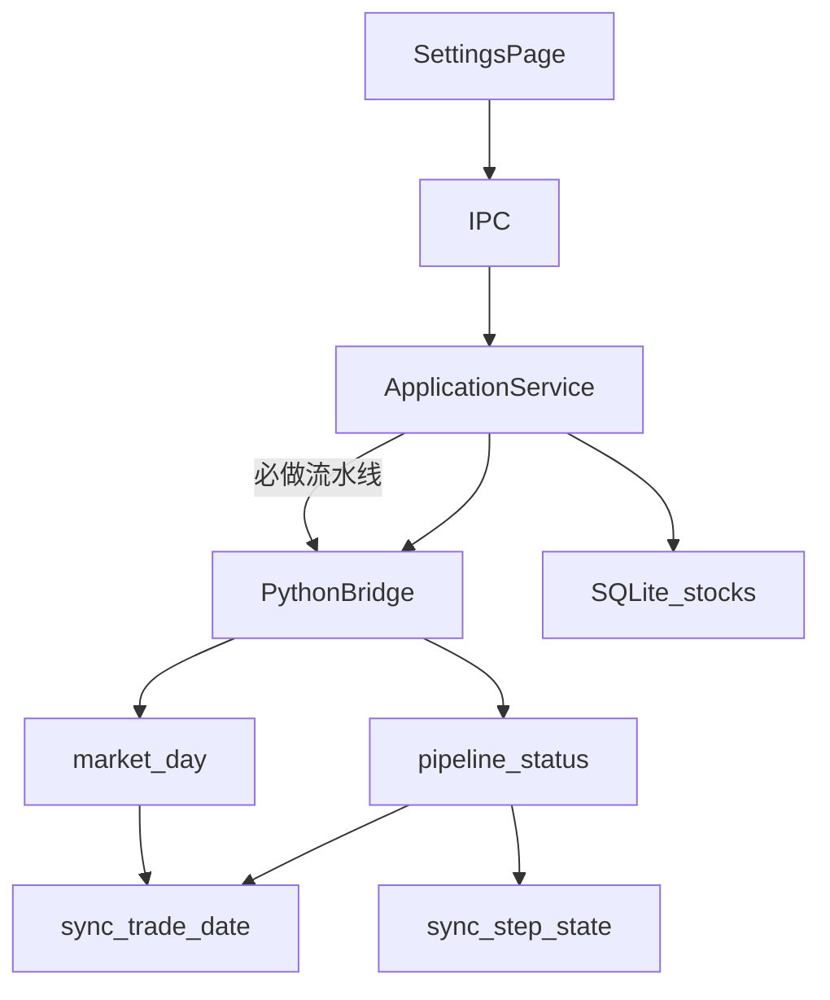

# Sprint9 开发计划

需求原稿：[Sprint9需求文档.md](docs/releases/v0.2/Sprint9/Sprint9需求文档.md)。架构走查：[Sprint9数据架构分析.md](docs/releases/v0.2/Sprint9/Sprint9数据架构分析.md)。退市实证：[Sprint9日线停牌与退市Review.md](docs/releases/v0.2/Sprint9/Sprint9日线停牌与退市Review.md)。

确认本计划后，主文档为 [Sprint9迭代文档.md](docs/releases/v0.2/Sprint9/Sprint9迭代文档.md)（六段骨架、状态进行中、任务 2 起待开始）。实现代码另等明确开工，本轮文档不虚构 PASS。

---

## 本轮目标

配置页变成可观测的数据流水线：无用户更新窗口；每步自己回答「是否已初始化 / 是否最新」；全局主按钮只看必做步骤；股票日线默认 `2024-01-01～最近已收盘`，用水位断点；可手动补 `4.1`；股票列表跟踪退市，图表多一个退市宇宙。

### 验收

- 配置页无起止日选择；主按钮三态文案正确；4.1 不把全局打成「初始」
- `sync_trade_date` 仍在；日线 fresh/续跑只认水位；拉全默认段后置闩锁，缺一天仍是待更新
- 打开页只自动刷新交易日历，失败不卡死整页状态
- `stocks` 有 `list_status` / `delist_date`；默认全市场只 L；图表可选退市
- `acceptance:v02s9` 隔离库；UI 手工

### 本轮不做

- 自定义管理数据（按钮禁用）
- 停牌占位 / `suspend_d` / 策略日历滚动
- 删除水位表或用截至日期法统一判定
- 日线下沿早于 `20060101`
- 同步后台化 / 可取消队列

---

## 数据流

日线：交易日历回答该有哪些天；`sync_trade_date` 回答哪些天已拉过。**这张水位表必须保留。**

---

## 协议（拟定）

- Python：`data.sync.trade_cal`、`data.meta.pipeline_status`、`data.sync.pipeline_step`
- IPC：`market:refreshCalendar`、`market:pipelineStatus`、`market:runPipeline`、`market:runStep`
- 主路径 IPC 不再要用户 `start_date` / `end_date`
- 沿用：`market_plan` + `market_day`（仅日线+复权+涨跌停）、`stock_list`、`index_weight`、`sw_industry`、`clear_market`
- 契约：`contracts/pipeline.status.response.json`、`pipeline.run.request.json`
- 类型：`pythonProtocol.ts`、`stock.ts`（`list_status`、`delist_date`）

固定区间：

| 步骤 | 区间 |
|---|---|
| 全量类 | `20000101`～最近已收盘，按上市日裁 |
| 日线默认段 | `20240101`～最近已收盘 |
| 4.1 | `[20210101, 20240101)` |

全局折叠：必做 = 1,2,3,4 默认段,5,6,7,8,9。存在未开始 → 初始；都已初始化且有 stale/failed → 待更新；都 fresh → 最新。

---

## 实现顺序（写入迭代文档 §4，代码待开工）

1. 契约与 TS / Python 类型
2. [`market_db.py`](python/worker/db/market_db.py)：`sync_step_state`；**禁止 DROP `sync_trade_date`**
3. 新 [`pipeline_status.py`](python/worker/handlers/pipeline_status.py)：每步两问；日线禁止 `MAX(trade_date)`
4. [`market_day.py`](python/worker/handlers/market_day.py) 去掉 `sync_dashboard_for_date` 里的指数/两融/期指；涨跌停留下。步骤 2/8/9 走 [`dashboard_sync.py`](python/worker/handlers/dashboard_sync.py) 已有区间拉取
5. [`applicationService.ts`](src/main/services/applicationService.ts) 编排 `runPipeline` / `runStep`；窗口常量取代用户输入；进度带 `step_id`
6. [`stock_list.py`](python/worker/handlers/stock_list.py) + [`sqlite.ts`](src/main/db/sqlite.ts) + [`stocksRepository.ts`](src/main/db/stocksRepository.ts)
7. [`SettingsPage.tsx`](src/renderer/src/pages/SettingsPage.tsx) 按 [更新数据卡片.png](docs/releases/v0.2/Sprint9/更新数据卡片.png) 改步骤表（文案用真实步骤名）
8. 图表 [`chartUniverse.ts`](src/shared/constants/chartUniverse.ts) / [`UniversePickerDialog.tsx`](src/renderer/src/pages/chart/UniversePickerDialog.tsx) / [`ChartPage.tsx`](src/renderer/src/pages/ChartPage.tsx)
9. `src/main/acceptance/runV02Sprint9.ts` + `acceptance:v02s9`

老库：若水位已覆盖默认段，首次 `pipeline_status` 补置 `daily_bar` 闩锁。

---

## 风险

- 拆开 `market_day` 旁路后，仪表盘指数/两融/基差要回归（可抽测 `acceptance:v02s52` / 手工看板）
- 已有 2016+ 日线的用户必须走闩锁回填，否则主按钮永远「初始化数据」
- 快照类（名单、行业）的 fresh 定义实现时写成：本次流水线成功则最新，跨过一个已收盘日未跑则待更新

中期（迭代文档 §6.2）：自定义管理、停牌语义、后台同步。本轮不进范围。
