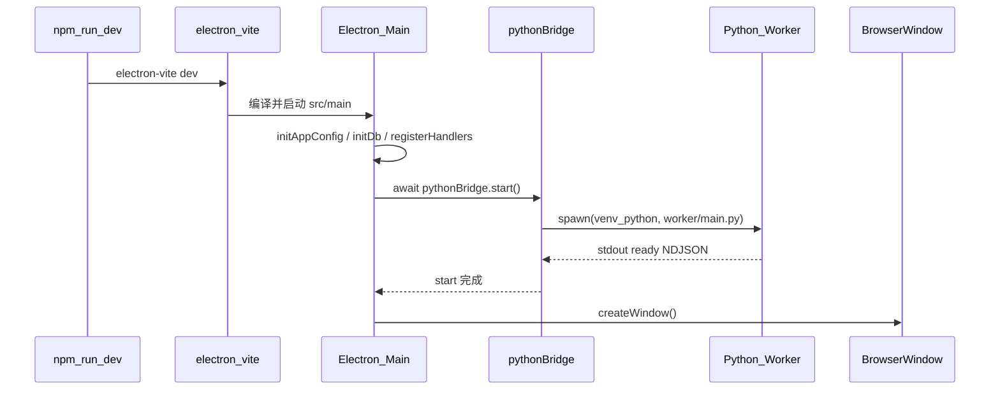

# Sprint1 技术文档

> 关联：[Sprint1迭代文档](./Sprint1迭代文档.md)、[架构文档](../trading-zone-electron架构文档.md)  
> 本文聚焦 **开发态启动链路** 与 **Main ↔ Python 子进程** 的实现细节。

---

## 1. 结论概览

`npm run dev` **不会**在 npm script 里单独启动 Python。  
流程是：`electron-vite` 启动 Electron → Main 进程 `app.whenReady()` → `pythonBridge.start()` 用 `child_process.spawn` 拉起 `python/.venv` 中的 worker → 等待 stdout 的 `ready` NDJSON → 再创建窗口。

Python 是 **长期驻留子进程**，经 **stdin/stdout 行协议（NDJSON）** 与 Main 通信；Renderer 不直连 Python。

---

## 2. 开发启动总览



| 步骤 | 入口 | 说明 |
|---|---|---|
| 1 | `package.json` → `"dev": "electron-vite dev"` | 只负责壳与热更新 |
| 2 | `src/main/index.ts` → `app.whenReady()` | 初始化配置、SQLite、IPC |
| 3 | `pythonBridge.start()` | 解析路径并 spawn Python |
| 4 | `python/worker/main.py` | import 冒烟 + 发 ready + 读 stdin 循环 |
| 5 | `createWindow()` | Python 就绪（或失败打日志）后再开 UI |

关键脚本：

| 命令 | 作用 |
|---|---|
| `npm run dev` | 开发窗口；会拉起 Python worker |
| `npm run acceptance` | `SPRINT1_ACCEPTANCE=1` 无头验收（同样走 `pythonBridge.start()`） |

---

## 3. Electron Main 生命周期

文件：`src/main/index.ts`

```text
app.whenReady()
  ├─ initAppConfig(userData)
  ├─ initDb(userData)
  ├─ registerHandlers()
  ├─ await pythonBridge.start()   // 失败仅 console.error，不阻断开窗
  ├─ [可选] SPRINT1_ACCEPTANCE → runSprint1Acceptance() → app.exit
  └─ createWindow()

app.before-quit
  ├─ pythonBridge.stop()
  └─ closeDb()
```

要点：

1. **先 Python、后窗口**：保证 UI 打开时 worker 已尽量就绪。
2. **Python 启动失败不杀进程**：只打 `[main] failed to start python worker`，窗口仍可打开（SQLite 本地列表仍可用，同步会失败）。
3. **退出时主动 stop**：结束 stdin、`kill` 子进程，避免僵尸 Python。

---

## 4. pythonBridge：路径解析与 spawn

文件：`src/main/bridge/pythonBridge.ts`

### 4.1 路径解析 `resolvePythonPaths()`

| 项 | 开发态（`!app.isPackaged`） | 打包态（预留） |
|---|---|---|
| Python 根目录 | `app.getAppPath()/python` | `process.resourcesPath/python` |
| Worker 脚本 | `{root}/worker/main.py` | 同左 |
| 解释器 | 见下表优先级 | 同左 |

**解释器优先级：**

1. 环境变量 `PYTHON_PATH`（路径存在则用）
2. Windows：`{root}/.venv/Scripts/python.exe`
3. Unix：`{root}/.venv/bin/python`
4. 均不存在 → 抛错，提示先创建 venv 并 `pip install -r requirements.txt`

开发态等价命令（cwd = `python/`）：

```text
python\.venv\Scripts\python.exe worker\main.py
```

### 4.2 spawn 参数

```ts
spawn(python, [script], {
  cwd,                                    // python/ 根目录
  stdio: ['pipe', 'pipe', 'pipe'],        // stdin / stdout / stderr 全管道
  env: { ...process.env, PYTHONUTF8: '1', PYTHONIOENCODING: 'utf-8' },
  windowsHide: true
})
```

| 字段 | 含义 |
|---|---|
| `stdio: pipe` | Main 接管三路流，走 NDJSON，不依赖端口 |
| `PYTHONUTF8` / `PYTHONIOENCODING` | 避免 Windows 控制台编码问题 |
| `windowsHide` | 不弹出额外 Python 控制台窗口 |

### 4.3 就绪等待

- `waitForReady()`：轮询 `this.ready`，超时 **30s** → `Python worker ready timeout`
- 仅当 stdout 解析到 `type === "ready"` 的 JSON 行时置位 `ready`
- `start()` / `call()` 均经 `ensureStarted()`：已有 `proc + ready` 则直接返回；并发共用同一个 `starting` Promise

---

## 5. Python Worker 启动行为

文件：`python/worker/main.py`

```text
main()
  ├─ smoke_imports()          # pandas / numpy / duckdb / tushare / pydantic
  ├─ emit(ReadyMessage)       # stdout 一行 NDJSON
  ├─ 若有库失败 → stderr + exit(1)
  └─ for line in sys.stdin:   # 长期循环
       handle_request(...)
```

### 5.1 Ready 消息（worker → Main）

```json
{
  "type": "ready",
  "imports": {
    "pandas": true,
    "numpy": true,
    "duckdb": true,
    "tushare": true,
    "pydantic": true
  },
  "python": "3.13.2"
}
```

Main 收到后打印 `[pythonBridge] ready: ...`；若任一 import 为 `false`，Main 打 error 日志（worker 侧已 exit 1）。

### 5.2 请求分发

| method | handler |
|---|---|
| `data.sync.stock_list` | `worker/handlers/stock_list.py` → `sync_stock_list` |

未注册 method → `error.code = unknown_method`。

---

## 6. Main ↔ Python 通信协议

控制面：**一行一个 JSON（NDJSON）**。stderr 仅日志，不参与协议。

| 方向 | 通道 | 载荷 |
|---|---|---|
| Main → Python | stdin | `{"id","method","params"}\n` |
| Python → Main | stdout | ready，或 `{"id","ok",result\|error}\n` |
| Python → Main | stderr | traceback / 调试信息（Main 前缀 `[pythonBridge:stderr]`） |

### 6.1 Request

```json
{
  "id": "uuid",
  "method": "data.sync.stock_list",
  "params": { "token": "...", "exchange": "", "list_status": "L" }
}
```

### 6.2 Response

成功：

```json
{
  "id": "uuid",
  "ok": true,
  "result": { "count": 5000, "stocks": [/* ... */] }
}
```

失败：`ok: false`，`error: { "code", "message" }`（如 `invalid_params` / `auth_error` / `handler_error`）。

### 6.3 超时与挂起

| 项 | 默认值 | 行为 |
|---|---|---|
| ready | 30s | 超时 reject，`start()` 失败 |
| `call()` | 120s | 超时 reject，并从 pending map 删除 |
| pending | 按 `id` 匹配 | 无匹配响应记为 orphan；进程退出时全部 reject |

跨语言契约：`contracts/`（JSON Schema）+ `src/shared/types/pythonProtocol.ts` + `python/worker/models.py`（Pydantic）。

---

## 7. 进程生命周期与重启

| 事件 | 行为 |
|---|---|
| 应用启动 | `pythonBridge.start()` 拉起 worker |
| 应用退出 | `pythonBridge.stop()`：`stopped=true`，reject 挂起调用，stdin.end + kill |
| worker 异常退出 | 若非主动 stop，且 `restartAttempts < 1`，自动 `ensureStarted()` 再起一次 |
| 再次 `call()` 且进程已死 | `ensureStarted()` 尝试重新 spawn |

设计意图：Sprint1 保证开发体验下 worker 偶发崩溃可自愈一次；不做无限重启，避免错误配置导致打爆 CPU。

---

## 8. 业务调用链（同步股票列表）

Python 就绪后的典型路径（与启动正交，依赖已 spawn 的 worker）：

```text
UI  window.api.stocks.sync()
  → Preload contextBridge
  → IPC stocks:sync
  → applicationService.syncStockList()
       ├─ getTushareToken()          // env TUSHARE_TOKEN > userData/config.json
       ├─ pythonBridge.call('data.sync.stock_list', { token })
       │    └─ Python tushare.pro.stock_basic
       └─ stocksRepository.upsertMany(...)
  → UI stocks.list() 刷新表格
```

文件：

- `src/main/services/applicationService.ts`
- `src/main/ipc/registerHandlers.ts`
- `src/preload/index.ts`
- `python/worker/handlers/stock_list.py`

---

## 9. 前置条件与排障

### 9.1 前置（开发机）

```bash
# Node ≥ 20.19（推荐 22 LTS）
npm install

# Python ≥ 3.11，在仓库内建 venv
cd python
python -m venv .venv
.venv\Scripts\activate          # Windows
pip install -r requirements.txt

# 可选：独立冒烟（不经 Electron）
python scripts\smoke_worker.py
```

### 9.2 常见现象

| 现象 | 可能原因 |
|---|---|
| `[pythonBridge] Python venv not found` | 未建 `python/.venv` 或路径不对 |
| `Python worker ready timeout` | worker 卡死 / 依赖安装失败未发 ready |
| `import smoke failed` | venv 缺包，检查 `pip install -r requirements.txt` |
| UI 能开但同步失败 | Token 未配，或 Python 启动被 catch 后未就绪 |
| 想换解释器 | 设置环境变量 `PYTHON_PATH` 指向可执行文件 |

### 9.3 日志关键字

| 日志前缀 | 含义 |
|---|---|
| `[pythonBridge] starting:` | 即将 spawn，含解释器与脚本路径 |
| `[pythonBridge] ready:` | 握手成功 |
| `[pythonBridge:stderr]` | Python stderr |
| `[pythonBridge] exited` / `restarting` | 子进程退出 / 自动重启 |
| `[main] failed to start python worker` | Main 启动阶段 spawn/ready 失败 |

---

## 10. 关键源码索引

| 职责 | 路径 |
|---|---|
| npm / electron-vite 入口 | `package.json` → `dev` |
| Main 生命周期 | `src/main/index.ts` |
| 子进程桥 | `src/main/bridge/pythonBridge.ts` |
| 同步编排 | `src/main/services/applicationService.ts` |
| Worker 入口 | `python/worker/main.py` |
| 协议类型（TS） | `src/shared/types/pythonProtocol.ts` |
| 协议模型（Py） | `python/worker/models.py` |
| JSON Schema | `contracts/` |
