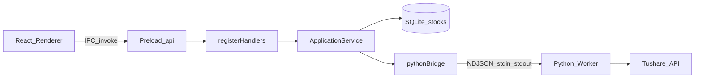

# Sprint1 迭代文档

> 状态：**已完成**  
> 关联：[`sprint1启动.md`](./sprint1启动.md)、[架构文档](../trading-zone-electron架构文档.md)、[开发计划](../../../.cursor/plans/sprint1_架构与计划_913c3d45.plan.md)

---

## 1. 当前迭代目标

本迭代目标是完成 **Hello World 级最小可运行厚客户端**：验证「UI 纯展示 + Main 业务/SQLite + Python 取数」三层能否打通，为后续行情与复盘能力奠基。

### 1.1 目标声明

| # | 目标 | 验收口径 |
|---|---|---|
| G1 | Electron + React UI，经 Main/SQLite 正常交互 | `npm run dev` 起窗；UI 可读写业务库 |
| G2 | Python worker 可加载数据运算依赖 | 启动日志 `ready`，`pandas/numpy/duckdb/tushare/pydantic` 均为 true |
| G3 | UI → Main → Python → SQLite → UI 全链路 | 同步 A 股列表后表有数据，重启仍可从 SQLite 加载 |

### 1.2 范围边界（本迭代不做）

- MessagePack / Arrow IPC / DuckDB 窗读行情
- `compute.indicator`、`sync.market`、lightweight-charts K 线
- 托盘、单实例、electron-builder 正式分发、python-build-standalone 嵌入
- Monaco、策略编辑器等远期依赖

### 1.3 技术选型（已落地）

| 层 | 选型 |
|---|---|
| 壳 / 构建 | Electron + electron-vite + electron-builder（仅脚手架） |
| UI | React 19 + TypeScript + MUI 7 |
| 业务 | Main 进程 TypeScript + better-sqlite3 |
| 数据 | Python 3.11+ venv：`tushare` / `pandas` / `numpy` / `duckdb` / `pydantic` |
| Renderer↔Main | `ipcMain.handle` + preload `contextBridge` |
| Main↔Python | 长期子进程 + **stdin/stdout NDJSON**（控制面 JSON） |

---

## 2. 功能需求

### 2.1 用户故事

1. 作为用户，我可以在桌面应用中配置 Tushare Token（或使用环境变量）。
2. 作为用户，我可以一键「同步股票列表」，从 Tushare 拉取完整 A 股列表。
3. 作为用户，我可以在表格中查看已落库的股票（代码 / 名称 / 行业 / 市场等），并搜索、分页。
4. 作为用户，同步失败（无 Token、网络/接口错误）时能看到明确错误信息。
5. 作为用户，关闭并重新打开应用后，股票列表仍从本地 SQLite 加载。

### 2.2 功能清单

| ID | 功能 | 优先级 | 状态 |
|---|---|---|---|
| F01 | 应用脚手架（main / preload / renderer） | P0 | 已完成 |
| F02 | SQLite `stocks` 表 + Repository（list / upsert / count） | P0 | 已完成 |
| F03 | Python NDJSON worker + `data.sync.stock_list` | P0 | 已完成 |
| F04 | 依赖 import 冒烟（pandas/numpy/duckdb/tushare） | P0 | 已完成 |
| F05 | ApplicationService 编排同步 | P0 | 已完成 |
| F06 | IPC：`stocks:list` / `stocks:sync` / Token 配置 | P0 | 已完成 |
| F07 | 股票列表 UI（工具栏、表格、loading/error） | P0 | 已完成 |
| F08 | Token 配置（环境变量 + userData） | P0 | 已完成 |
| F09 | 无头验收脚本 `npm run acceptance` | P1 | 已完成 |

### 2.3 非功能需求

- Renderer 不直连 Python / 不直接访问 SQLite。
- Preload 仅暴露白名单 API（`window.api`）。
- Python 进程随应用启停；异常退出时最多自动重启 1 次。
- 契约先行：`contracts/` JSON Schema + TS 类型 + Pydantic 模型对齐。

---

## 3. 详细设计说明

### 3.1 进程与数据流



同步路径：

1. UI 调用 `window.api.stocks.sync()`
2. Main `applicationService.syncStockList()` 读取 Token
3. `pythonBridge.call('data.sync.stock_list', { token })`
4. Python `tushare.pro.stock_basic` 返回股票行
5. `stocksRepository.upsertMany` 写入 SQLite
6. UI 再调 `stocks.list()` 刷新表格

### 3.2 目录结构（实现态）

```
trading-zone-electron/
  src/
    main/
      index.ts                      # 生命周期：initConfig/DB → start Python → 窗口
      acceptance/runSprint1.ts      # SPRINT1_ACCEPTANCE=1 无头验收
      bridge/pythonBridge.ts        # 子进程 + NDJSON + 超时/重启
      config/appConfig.ts           # Token：env 优先，否则 userData/config.json
      db/sqlite.ts                  # 库路径 userData/data/trading-zone.db
      db/stocksRepository.ts
      ipc/registerHandlers.ts
      services/applicationService.ts
    preload/index.ts                # contextBridge 暴露 window.api
    renderer/src/App.tsx            # 股票列表页
    shared/types/
      stock.ts
      pythonProtocol.ts
  python/
    requirements.txt
    worker/main.py
    worker/models.py
    worker/handlers/stock_list.py
    scripts/smoke_worker.py
  contracts/
    ndjson.protocol.json
    stock_list.request.json
    stock_list.response.json
```

### 3.3 SQLite 模型

库文件：`{userData}/data/trading-zone.db`

表 `stocks`：

| 列 | 类型 | 说明 |
|---|---|---|
| ts_code | TEXT PK | 如 `000001.SZ` |
| symbol | TEXT | 代码 |
| name | TEXT | 名称 |
| area | TEXT | 地域，可空 |
| industry | TEXT | 行业，可空 |
| market | TEXT | 市场，可空 |
| list_date | TEXT | 上市日期，可空 |
| synced_at | TEXT | ISO 时间，Main 写入时填充 |

Repository API：`listAll` / `upsertMany` / `count`。

### 3.4 Main ↔ Python 协议（NDJSON）

一行一个 JSON 对象。

**Ready（worker → Main）**

```json
{
  "type": "ready",
  "imports": { "pandas": true, "numpy": true, "duckdb": true, "tushare": true, "pydantic": true },
  "python": "3.13.2"
}
```

**Request（Main → worker）**

```json
{
  "id": "uuid",
  "method": "data.sync.stock_list",
  "params": { "token": "...", "exchange": "", "list_status": "L" }
}
```

**Response（worker → Main）**

```json
{
  "id": "uuid",
  "ok": true,
  "result": { "count": 5000, "stocks": [ { "ts_code": "...", "symbol": "...", "name": "..." } ] }
}
```

失败时：`ok: false`，`error: { code, message }`（如 `invalid_params` / `auth_error` / `handler_error`）。

默认调用超时 120s；ready 超时 30s。stderr 仅用于日志，不参与协议。

### 3.5 IPC 与 Preload API

| 通道 | Preload | 说明 |
|---|---|---|
| `stocks:list` | `api.stocks.list()` | 读库 |
| `stocks:count` | `api.stocks.count()` | 条数 |
| `stocks:sync` | `api.stocks.sync()` | 编排同步，返回 `{ count, fetched }` |
| `config:hasTushareToken` | `api.config.hasTushareToken()` | 是否已配置 |
| `config:getTushareTokenMasked` | `api.config.getTushareTokenMasked()` | 脱敏展示 |
| `config:setTushareToken` | `api.config.setTushareToken(token)` | 写入 userData |
| `python:ready` | `api.python.ready()` | worker ready 信息 |

Token 读取优先级：环境变量 `TUSHARE_TOKEN` > `{userData}/config/config.json`。

### 3.6 ApplicationService

`syncStockList()`：

1. `getTushareToken()`，缺失则抛错（UI 展示）
2. `pythonBridge.call('data.sync.stock_list', { token })`
3. `stocksRepository.upsertMany(result.stocks)`（自动补 `synced_at`）
4. 返回 `{ count: 写入条数, fetched: 拉取条数 }`

### 3.7 UI 设计（最小页）

单页（`App.tsx`）：

- AppBar：标题、Python 状态 Chip、Token 状态、股票数量、搜索框、刷新、同步按钮
- 可折叠 Token 配置区
- Alert：成功 / 错误
- MUI Table：`ts_code / name / industry / market / list_date`，客户端过滤 + 分页

### 3.8 契约对齐方式

| 层级 | 位置 |
|---|---|
| JSON Schema | `contracts/*.json` |
| TypeScript | `src/shared/types/pythonProtocol.ts`、`stock.ts` |
| Pydantic | `python/worker/models.py` |

---

## 4. 任务步骤

| 步骤 | 任务 | 产出 | 状态 |
|---|---|---|---|
| 1 | 初始化 electron-vite + 精简 MUI + `.gitignore` / README | 可 `npm run dev` 的壳 | 已完成 |
| 2 | Main 侧 better-sqlite3 + `stocks` 表 + `stocks:list` IPC | `db/` + `ipc/` | 已完成 |
| 3 | Python venv + NDJSON worker + tushare + contracts | `python/` + `contracts/` | 已完成 |
| 4 | pythonBridge + ApplicationService + `stocks:sync` | 全链路编排 | 已完成 |
| 5 | React 同步按钮 + 表格 + Token / loading / error | 列表页 | 已完成 |
| 6 | 验收自测（含 `npm run acceptance`） | 测试记录 | 已完成 |

### 4.1 本地开发步骤（复现）

```bash
# Node
npm install
npm run rebuild:native   # better-sqlite3 按 Electron ABI 编译

# Python
cd python
python -m venv .venv
.\.venv\Scripts\activate
pip install -r requirements.txt

# 启动 UI
cd ..
npm run dev

# 无头验收
npm run acceptance

# 真同步（可选）
set TUSHARE_TOKEN=你的token
npm run acceptance
# 或在 UI 中保存 Token 后点「同步股票列表」
```

---

## 5. 测试结果 / 总结反馈

### 5.1 验收清单与结果

| 检查项 | 方式 | 结果 | 说明 |
|---|---|---|---|
| `npm run dev` 起窗 | 手工 / 日志 | 通过 | electron-vite 正常拉起 |
| Python ready + 库 import | 主进程日志 / acceptance | 通过 | pandas/numpy/duckdb/tushare/pydantic 均为 true |
| SQLite 落库与 list 持久化 | acceptance fixture upsert | 通过 | `userData/data/trading-zone.db` |
| 无 Token 同步可见错误 | acceptance + UI | 通过 | 明确提示未配置 Token |
| 有 Token 真同步写库并 UI 展示 | 手工（需 Token） | 待补跑 | 无头脚本已预留；环境未配置 Token 时 skip |
| `npm run typecheck` / `npm run build` | CI 本地 | 通过 | — |
| Python smoke | `python/scripts/smoke_worker.py` | 通过 | ready 成功 |

### 5.2 `npm run acceptance` 记录（2026-08-01）

```
PASS | python ready + imports | python=3.13.2
PASS | sqlite file exists | .../trading-zone-electron/data/trading-zone.db
PASS | sqlite upsert + list persistence | found __ACCEPTANCE__.SZ
PASS | sync without token shows error | Tushare token 未配置...
PASS | sync with token writes sqlite | skipped (no TUSHARE_TOKEN)
ALL PASSED
```

### 5.3 总结反馈

**做得好的地方**

- 分层清晰：UI / ApplicationService / Repository / Python Worker 职责不串。
- 协议与契约落地：JSON Schema + TS + Pydantic 三份同构，后续换 MessagePack 有锚点。
- Sprint1 刻意简化控制面为 JSON，避免 Hello World 阶段被 Arrow/打包拖垮。
- 无头验收脚本降低回归成本。

**暴露的问题 / 摩擦**

- 本机 Node `v20.16.0` 低于 electron-vite 5 / Vite 7 要求的 `20.19+`，安装期大量 `EBADENGINE` 警告。
- Electron 二进制默认下载易失败，需国内镜像（`ELECTRON_MIRROR`）。
- `better-sqlite3` 需按 Electron ABI `rebuild`；Node ABI 与 Electron ABI 混用会挂。
- 有 Token 的端到端真同步依赖外部账号，自动化验收中暂为 skip。
- 全量 A 股列表进 IPC/内存一次返回，对控制面可接受，但不适合后续 OHLCV。

---

## 6. 改进目标

面向下一迭代（建议 Sprint2 起），按优先级排列：

### 6.1 短期（补齐 Sprint1 尾巴）

1. 配置有效 `TUSHARE_TOKEN` 后补跑「真同步 → UI 非空 → 重启仍在」完整验收，写入本节测试表。
2. ~~统一开发环境：Node ≥ 20.19（或 22 LTS），并在 README/`engines` 中强制说明。~~ **已完成**：`package.json` → `engines.node >=20.19.0` / `npm >=10`；README「环境要求」表强制说明并推荐 22 LTS。
3. ~~将架构文档补上三句话：进程拓扑、JSON→MessagePack/Arrow 演进、Token 存放位置（与本迭代实现对齐）。~~ **已完成**：见 [架构文档](../trading-zone-electron架构文档.md)「进程拓扑」「协议演进」「配置与密钥」。

### 6.2 中期（能力扩展）

1. **行情数据面**：`sync.market` / `query.ohlcv`；大表走 DuckDB + Arrow 窗读，避免 IPC 塞全量。
2. **协议升级**：控制面 JSON → MessagePack；错误码与 cancel/progress 语义规范化。
3. **图表**：接入 lightweight-charts，ApplicationService 编排「读配置 → 计算/窗读 → 图表」。
4. **配置与安全**：Token 加密存储或系统密钥环；配置页独立；同步进度条。

### 6.3 长期（分发与工程化）

1. 嵌入式 Python（python-build-standalone / PyInstaller），用户无感 venv。
2. electron-builder 正式分发；单实例 / 托盘等壳能力按需开启。
3. 契约校验自动化（CI 校验 JSON Schema ↔ TS ↔ Pydantic）。
4. Repository 迁移框架、日志与诊断面板。

---

## 附录

### A. 关键启动文档

原始目标摘要见 [`sprint1启动.md`](./sprint1启动.md)。

### B. 关键命令

| 命令 | 用途 |
|---|---|
| `npm run dev` | 开发起窗 |
| `npm run acceptance` | Sprint1 无头验收 |
| `npm run rebuild:native` | 重建 better-sqlite3 |
| `python python/scripts/smoke_worker.py` | Python worker 冒烟 |
