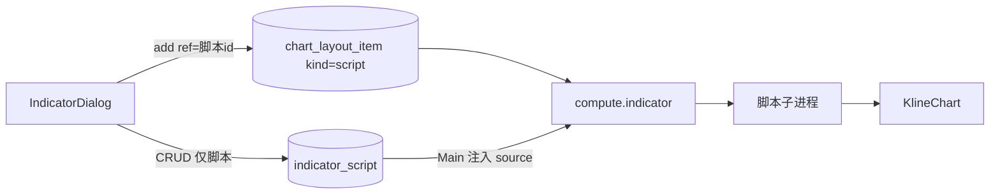

# Sprint10 迭代文档

> 状态：**进行中**（smoke / typecheck 已过；手工起窗待补跑）
> 关联：[启动摘要](./Sprint10启动文档.md)、[Sprint9.5 迭代文档](../Sprint9/Sprint9.5迭代文档.md)、[Sprint9 迭代文档](../Sprint9/Sprint9迭代文档.md)、[Sprint9 头脑风暴文档](../Sprint9/Sprint9头脑风暴文档.md)、[架构文档](../trading-zone-electron架构文档.md)、开发计划 Cursor plan `sprint10_脚本化指标_d8c06942`

---

## 1. 当前迭代目标

去掉 `kind=builtin` 与 TS/Python 双份 catalog；布局只挂用户脚本。用一份 5 线均线源码作为种子案例、新建骨架和 smoke 金样：周期可改，图例随周期变化。

### 1.1 目标声明

| # | 目标 | 验收口径 |
|---|---|---|
| G1 | 无内置 | 弹窗没有均线/MACD 目录项；compose / IPC 拒绝 builtin；旧库 builtin 行被删且能开机 |
| G2 | 全流程脚本 | 新建（5 线骨架）→ 保存抽 manifest → 添加到布局 → 出图 → 设置改 period3 → 图与图例变 → 重启仍在 |
| G3 | 5 线案例 | 种子「均线」默认 5/10/20/60/250 五条主图线；双挂前缀不撞；可删可改源码 |
| G4 | 回归 | `python/scripts/smoke_chart_input.py` 与 `npm run typecheck` 通过；脚本 MACD 副图 smoke 仍过 |

### 1.2 范围边界（本迭代不做）

- 多套命名布局、plot 新图元、LSP、Arrow
- `kind` 列删表、布尔/枚举 widget
- MACD 发版种子
- 改 `ChartInput` v1；把 Monaco 嵌进 K 线图
- 不把 MA 算法留在 `REGISTRY` 里「顺便兼容」

### 1.3 技术选型（本迭代）

| 层 | 选型 |
|---|---|
| 壳 / 构建 | Electron + electron-vite（沿用） |
| UI | 弹窗只列用户脚本；`ManifestFieldsForm` 仍按 `fields` 渲染 |
| 业务 | `chartLayout:add` 只认 `kind=script`；启动删 builtin 行并按需种子 `seed-ma` |
| 数据 / 计算 | compose 只跑脚本子进程；沙箱注入 `sma` / `ema` |
| 协议 | 去掉 `indicators:list`；新增 `indicatorScript:exampleSource` |

### 1.4 已拍板结论

| # | 议题 | 结论 |
|---|---|---|
| 1 | 产品目录 | 删除；弹窗只列用户脚本 |
| 2 | 布局 kind | 只允许 `script`；旧 builtin 行启动删除 |
| 3 | 5 线 MA | 发版种子脚本 `seed-ma`，不是 REGISTRY |
| 4 | 空默认布局 | 自动挂上种子，避免空图 |
| 5 | 图例 | `line(f"ma{period}")` + `localName.toUpperCase()` |
| 6 | 源码单一来源 | `python/worker/indicators/examples/ma.py`；Main / 骨架 / smoke 同读 |

---

## 2. 功能需求

### 2.1 用户故事

1. 作为图表用户，开机后图上是用户脚本均线，而不是写死的内置 MA / MACD。
2. 作为指标作者，我新建脚本时拿到可跑的 5 线均线骨架，改周期后能上图。
3. 作为图表用户，我可以改任一条均线的周期、颜色、线宽，图例显示 `MA{周期}`。
4. 作为维护者，旧库里的 builtin 布局行不会让应用启动失败。

### 2.2 功能清单

| ID | 功能 | 优先级 | 状态 |
|---|---|---|---|
| F01 | 删除内置 catalog / REGISTRY / MA·MACD 类 | P0 | 已完成 |
| F02 | 种子 `seed-ma` + 空布局自动挂上 + 迁移删 builtin | P0 | 已完成 |
| F03 | 弹窗只脚本；新建骨架与跑一次带 defaultParams | P0 | 已完成 |
| F04 | 图例通用化；smoke 以 examples/ma.py 为金样 | P0 | 已完成 |

### 2.3 非功能需求

- Renderer 不 exec Python，也不直连 SQLite。
- Python 不碰脚本表；`source` 由 Main 注入。
- 案例源码只有一份，禁止 TS 手抄。
- 不改 `ChartInput` 词汇。

---

## 3. 详细设计说明

### 3.1 进程与数据流



启动：删 `kind=builtin` 行 → 若无 `seed-ma` 则读 `examples/ma.py`、try 抽 manifest 后插入 → 若 default 布局为空则挂上该脚本。

### 3.2 目录 / 模块（本迭代涉及）

```
prompt/trading-zone-electron开发文档/Sprint10/Sprint10启动文档.md
prompt/trading-zone-electron开发文档/Sprint10/Sprint10迭代文档.md
python/worker/indicators/examples/ma.py
python/worker/indicators/sandbox.py
python/worker/indicators/compose.py
python/worker/handlers/compute_indicator.py
python/scripts/smoke_chart_input.py
src/shared/types/chartLayout.ts
src/shared/chart/indicatorScript.ts
src/shared/chart/legendLabel.ts
src/main/db/chartLayoutRepository.ts
src/main/db/indicatorScriptRepository.ts
src/main/services/applicationService.ts
src/main/ipc/registerHandlers.ts
src/preload/index.ts
src/preload/index.d.ts
src/renderer/src/pages/ChartPage.tsx
src/renderer/src/pages/chart/IndicatorDialog.tsx
```

删除：`python/worker/indicators/ma.py`、`macd.py`、`contracts/indicator_catalog.json`、TS `INDICATOR_CATALOG`。

### 3.3 数据模型 / 存储

- `indicator_script`：种子行 `id=seed-ma`，`title=均线`，`source` 来自 examples 文件。
- `chart_layout_item`：仅 `kind=script`；`ref` 指向脚本主键。
- 用户删除 `seed-ma` 后不自动再插入。

### 3.4 协议 / API / IPC

| 层 | 名称 | 形状 |
|---|---|---|
| Worker | `compute.indicator` | instances 仅 `kind=script` + 必填 `source` |
| IPC | `chartLayout:add` | `{ kind: 'script', ref }` |
| IPC | `indicatorScript:exampleSource` | 返回 `examples/ma.py` 文本 |
| 删除 | `indicators:list` | — |

### 3.5 核心编排

1. 启动迁移：删 builtin 行；按需种子；空布局挂上。
2. 新建：Dialog 取 `exampleSource` 作草稿。
3. 跑一次：先 load 拿 `defaultParams`，再带 query 试跑。
4. 出图：Main 注入 source → `run_script`。

### 3.6 UI

- 指标弹窗去掉内置「可添加」分区。
- 设置仍走 `ManifestFieldsForm`。
- 图例 overlay：`MA5` / `MA10` / …（随周期变）。

### 3.7 契约

| 层级 | 位置 |
|---|---|
| JSON Schema | 删除 `contracts/indicator_catalog.json` |
| TypeScript | 去掉 `BuiltinKey` / `MaParams` / `MacdParams` |
| Python | 案例 `examples/ma.py`；compose 仅 script |

---

## 4. 任务步骤

| 步骤 | 任务 | 产出 | 状态 |
|---|---|---|---|
| 1 | 启动摘要 + 迭代文档骨架 | 本文件与启动摘要 | 已完成 |
| 2 | 5 线案例 + 沙箱注入 sma/ema | examples/ma.py / sandbox | 已完成 |
| 3 | 删除 REGISTRY 与内置类 | compose / compute.indicator | 已完成 |
| 4 | 种子与迁移、去掉 catalog IPC | ApplicationService / repo | 已完成 |
| 5 | 弹窗 / 图例 / 跑一次 | Renderer + shared | 已完成 |
| 6 | smoke / typecheck | 第 5 节 | 已完成 |

### 4.1 本地复现命令

```bash
python\.venv\Scripts\python.exe python\scripts\smoke_chart_input.py
npm run typecheck
npm run dev
```

---

## 5. 测试结果 / 总结反馈

### 5.1 验收清单与结果

| 检查项 | 方式 | 结果 | 说明 |
|---|---|---|---|
| G1 无内置 | Python smoke | 通过 | compose 拒绝 `kind=builtin`（2026-08-26） |
| G2 全流程脚本 | 手工起窗 | 待补跑 | Dialog 已去掉 catalog；新建骨架走 `exampleSource`；跑一次先 load 再带 `defaultParams` |
| G3 5 线案例 | Python smoke | 通过 | 默认 5/10/20/60/250；双实例 `inst_a:ma8` / `inst_b:ma20`；改 period3 后 series 变为 `ma8` |
| G4 回归 | smoke / typecheck | 通过 | 脚本 MACD 副图仍过；node + web typecheck 通过（2026-08-26） |

### 5.2 关键命令记录

```
python\.venv\Scripts\python.exe python\scripts\smoke_chart_input.py
try_script load example MA manifest: ok
compose ma+macd scripts: times=40 ma5=36 ma10=31 ma20=21 ma60=0 ma250=0 dif=15 panes=['macd', 'main']
point counts for 5-line MA + script MACD: ok
to_chart_input matches compose MA: ok
compose empty: ok
validate rejects main histogram: ok
builtin kind rejected: ok
compose two MA scripts: ok
compose MA custom period3: ok
compose MA 250-day on long bars: ok
compute.indicator bars path: ok
run_script user MACD fragment: ok
compose two script MACD instances: ok
compose drops failed script: ok
try_script load skeleton: ok
try_script load user MACD manifest: ok
try_source example MA: ok

npm run typecheck
> tsc --noEmit -p tsconfig.node.json --composite false
> tsc --noEmit -p tsconfig.web.json --composite false
（2026-08-26 通过）
```

### 5.3 总结反馈

**做得好的地方**

- 5 线均线只有一份源码：`python/worker/indicators/examples/ma.py`，种子、新建骨架、smoke 同读。
- 拆掉 `REGISTRY` 与 TS catalog 后，compose / IPC 只认脚本；旧 builtin 行启动删除。
- 图例用 `ma{period}` 本地名，改周期后 series id 与 `MA8` 标签一起变，不必再按品种写死。

**暴露的问题 / 摩擦**

- 全流程起窗（改 period3、重启仍在）仍需手工补跑。
- 用户删除 `seed-ma` 后空图没有引导。
- 沙箱失败仍会在 worker stderr 打出完整 traceback（既有行为）。
- 已修：`ensureScriptLayoutDefaults` 曾缓存首次布局快照，导致后来「添加脚本」写进 SQLite，但 `chart:build` 仍按旧 items 构图，新均线不上图。现改为种子只跑一次，构图始终 `get()` 当前布局。

---

## 6. 改进目标

### 6.1 短期（下一迭代可做）

1. 手工补跑：改周期后图变且重启仍在。
2. 用户删除种子后的空图引导。

### 6.2 中期

1. 多套命名布局、按股票记忆。
2. plot API 补全；MACD 可作为用户脚本案例入库（非内置）。

### 6.3 长期

1. Arrow 数据面传输 `series`。
2. `compute.indicator` 句柄 / 批处理 / 取消与缓存键。

---

## 附录

### A. 相关文档

- [Sprint10 启动摘要](./Sprint10启动文档.md)
- [Sprint9.5 迭代文档](../Sprint9/Sprint9.5迭代文档.md)
- [Sprint9 头脑风暴文档](../Sprint9/Sprint9头脑风暴文档.md)
- [架构文档](../trading-zone-electron架构文档.md)

### B. 常用命令

| 命令 | 用途 |
|---|---|
| `npm run dev` | 开发起窗 |
| `npm run typecheck` | TS 检查 |
| `python\.venv\Scripts\python.exe python\scripts\smoke_chart_input.py` | Indicator / compose / 试跑 smoke |
