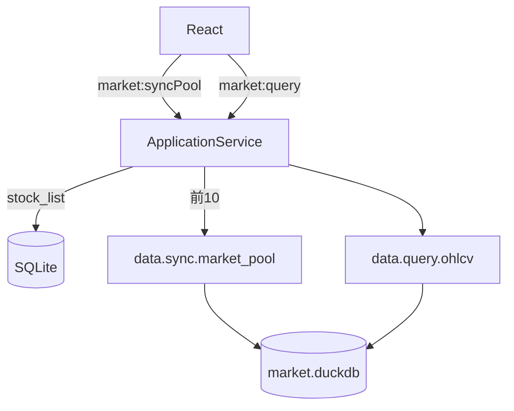

# Sprint2 迭代文档

> 状态：**已完成**  
> 关联：[`sprint2启动文档.md`](./sprint2启动文档.md)、[架构文档](../trading-zone-electron架构文档.md)、[开发计划](../../../.cursor/plans/sprint2_行情通路_3c8fee7f.plan.md)

---

## 1. 当前迭代目标

本迭代目标是打通 **股票池行情最小通路**：一键拉取 10 支股票的日线与复权因子到 DuckDB，并在前端以表格查看未复权 / 前复权 / 后复权日线。

### 1.1 目标声明

| # | 目标 | 验收口径 |
|---|---|---|
| G1 | 一键拉取股票池行情 | 同步列表 → 前 10 支 → 日线+因子写入 DuckDB |
| G2 | DuckDB 本地持久化 | `{userData}/data/market.duckdb` 存在；重启可查 |
| G3 | 前端单股日线 + 复权切换 | 表格展示；`none/qfq/hfq` 数值可区分 |

### 1.2 范围边界（本迭代不做）

- 2026 及以后增量同步、调度、细粒度进度条
- MessagePack / Arrow IPC / lightweight-charts
- 全市场批量、用户自选 10 支
- Token 加密、正式打包、嵌入式 Python

### 1.3 技术选型（本迭代）

| 层 | 选型 |
|---|---|
| 壳 / 构建 | Electron + electron-vite（沿用 Sprint1） |
| UI | React + MUI：空态 CTA + 股票池列表 + 日线表 |
| 业务 | Main ApplicationService + SQLite `market_pool` |
| 行情存储 | Python 侧 DuckDB：`daily_bar` / `adj_factor` |
| 协议 | 控制面 NDJSON；单股窗口 JSON 回传 |

---

## 2. 功能需求

### 2.1 用户故事

1. 作为用户，初次打开无数据时，我可以点击「开始拉取数据」。
2. 作为用户，系统会同步股票列表并取前 10 支作为股票池，拉取 2024–2025 日线与复权因子。
3. 作为用户，我可以在左侧选择股票，右侧查看日线表格。
4. 作为用户，我可以切换未复权 / 前复权 / 后复权。
5. 作为用户，无 Token 或接口失败时能看到明确错误；部分股票失败时仍保留成功部分与错误汇总。

### 2.2 功能清单

| ID | 功能 | 优先级 | 状态 |
|---|---|---|---|
| F01 | DuckDB schema + upsert/query | P0 | 已完成 |
| F02 | `data.sync.market_pool` 串行拉 daily/adj_factor | P0 | 已完成 |
| F03 | `data.query.ohlcv` 复权计算 | P0 | 已完成 |
| F04 | `data.meta.market_coverage` | P0 | 已完成 |
| F05 | SQLite `market_pool` + ApplicationService 编排 | P0 | 已完成 |
| F06 | IPC `market:*` + preload API | P0 | 已完成 |
| F07 | UI 空态 / 池列表 / 日线表 / 复权切换 | P0 | 已完成 |
| F08 | `npm run acceptance:s2` | P1 | 已完成 |

### 2.3 非功能需求

- Renderer 不直连 Python / DuckDB / SQLite。
- 行情大表不经控制面全量回传；同步仅回小结果摘要。
- 同步超时 180s；单股失败不阻断整池。
- 契约：JSON Schema + TS + Pydantic 对齐。

---

## 3. 详细设计说明

### 3.1 进程与数据流



同步：`syncStockList` → `listAll().slice(0,10)` → `data.sync.market_pool` → 写 `market_pool`。  
查询：选股 + adjust → `data.query.ohlcv` → join + 复权 → 表格。

### 3.2 目录 / 模块（本迭代）

```
src/main/
  bridge/pythonBridge.ts          # TRADING_ZONE_USER_DATA
  db/sqlite.ts                    # market_pool 表
  db/marketPoolRepository.ts
  services/applicationService.ts
  ipc/registerHandlers.ts
  acceptance/runSprint2.ts
src/shared/constants/market.ts
src/shared/types/market.ts
src/preload/index.ts
src/renderer/src/App.tsx
python/worker/db/market_db.py
python/worker/handlers/market_*.py
contracts/market_*.json
```

### 3.3 数据模型 / 存储

- DuckDB：`{userData}/data/market.duckdb`
  - `daily_bar(ts_code, trade_date, OHLC, vol, amount, synced_at)` PK `(ts_code, trade_date)`
  - `adj_factor(ts_code, trade_date, adj_factor, synced_at)` PK `(ts_code, trade_date)`
- SQLite：`market_pool(ts_code, rank, synced_at)`
- 常量：`MARKET_SYNC_START=20240101`，`MARKET_SYNC_END=20251231`，`MARKET_POOL_SIZE=10`

复权：

- none：原价
- qfq：`price * adj / latest_adj`
- hfq：`price * adj / earliest_adj`
- 缺因子：返回未复权价，`adj_factor=null`

### 3.4 协议 / IPC

| method / 通道 | 说明 |
|---|---|
| `data.sync.market_pool` | 批量日线+因子 |
| `data.query.ohlcv` | 单股查询+复权 |
| `data.meta.market_coverage` | 覆盖摘要 |
| `market:syncPool` / `pool` / `query` / `coverage` | Preload `api.market.*` |

### 3.5 ApplicationService

1. `syncMarketPool()`：Token → stock_list → 前 10 → Python sync → 写 pool
2. `queryOhlcv()` / `getMarketCoverage()` / `getMarketPool()`

### 3.6 UI

- AppBar：状态 Chip +「开始拉取 / 重新拉取」
- 空态中心 CTA
- 左：股票池列表；右：复权 Toggle + 日线表 + 分页
- Token 折叠配置区保留

### 3.7 契约

| 层级 | 位置 |
|---|---|
| JSON Schema | `contracts/market_*.json` |
| TypeScript | `src/shared/types/market.ts`、`pythonProtocol.ts` |
| Pydantic | `python/worker/models.py` |

---

## 4. 任务步骤

| 步骤 | 任务 | 产出 | 状态 |
|---|---|---|---|
| 1 | DuckDB 层 | `market_db.py` | 已完成 |
| 2 | Python handlers | sync/query/meta/seed | 已完成 |
| 3 | Bridge 注入 userData | `pythonBridge.ts` | 已完成 |
| 4 | 契约与共享类型 | contracts + shared | 已完成 |
| 5 | SQLite + ApplicationService | Main 编排 | 已完成 |
| 6 | IPC / preload | `market:*` | 已完成 |
| 7 | UI | `App.tsx` | 已完成 |
| 8 | 验收 + 文档 | `acceptance:s2` + 本文档 | 已完成 |

### 4.1 本地复现命令

```bash
npm install
npm run rebuild:native

cd python
.\.venv\Scripts\activate
pip install -r requirements.txt

cd ..
npm run dev

# 无头验收
npm run acceptance:s2

# 真同步（可选）
set TUSHARE_TOKEN=你的token
npm run acceptance:s2
```

---

## 5. 测试结果 / 总结反馈

### 5.1 验收清单与结果

| 检查项 | 方式 | 结果 | 说明 |
|---|---|---|---|
| Python ready + DuckDB seed | acceptance:s2 | 通过 | fixture 写入 2 行 bar + 2 行 factor |
| query none/qfq/hfq | acceptance fixture | 通过 | none=10.5, qfq≈9.545, hfq=10.5 |
| market coverage | acceptance | 通过 | total_bars≥2 |
| 无 Token syncPool 报错 | acceptance | skip | 本机已配置 Token |
| 有 Token 真同步 | acceptance:s2 | 通过 | pool=10, bars=4849, adj=4850, errors=0 |
| UI 空态与表格切换 | 手工 | 待补跑 | 代码已落地 |

### 5.2 关键命令记录

```
===== Sprint2 Acceptance ===== (2026-08-12)
PASS | python ready + imports | python=3.13.2
PASS | duckdb file exists after seed | .../market.duckdb; bars=2; adj=2
PASS | query ohlcv none/qfq/hfq | none=10.5, qfq=9.545..., hfq=10.5
PASS | market coverage reports bars | total_bars=2, stocks=1
PASS | syncPool without token shows error | skipped (token already configured)
PASS | syncPool with token writes duckdb | pool=10, bars=4849, adj=4850, errors=0
ALL PASSED
```

### 5.3 总结反馈

**做得好的地方**

- 行情与业务库分离（DuckDB vs SQLite），与架构目标一致。
- 只存未复权 + 因子，复权查询时计算，避免三套价冗余。

**暴露的问题 / 摩擦**

- 10 股 × 2 接口受 Tushare 频控影响，需 sleep 与较长超时。
- 验收真同步依赖外部 Token 与积分。

---

## 6. 改进目标

### 6.1 短期

1. 补跑有 Token 的端到端真同步与 UI 手工验收，回填 5.1。
2. 同步进度（按股票回调）与错误列表 UI 细化。

### 6.2 中期

1. 2026 起增量更新、coverage 驱动补洞。
2. lightweight-charts K 线；Arrow/窗读大数据。
3. 控制面 MessagePack。

### 6.3 长期

1. 嵌入式 Python 分发；契约 CI 校验。
2. 全市场同步调度与限频策略。

---

## 附录

### A. 相关文档

- [`sprint2启动文档.md`](./sprint2启动文档.md)
- [架构文档](../trading-zone-electron架构文档.md)
- [Sprint1 迭代文档](../Sprint1/Sprint1迭代文档.md)

### B. 常用命令

| 命令 | 用途 |
|---|---|
| `npm run dev` | 开发起窗 |
| `npm run acceptance:s2` | Sprint2 无头验收 |
| `npm run acceptance` | Sprint1 验收 |
| `npm run typecheck` | 类型检查 |
