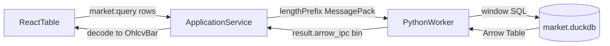

# Sprint3 迭代文档

> 状态：**已完成**  
> 关联：[`sprint3启动文档.md`](./sprint3启动文档.md)、[架构文档](../trading-zone-electron架构文档.md)、[Sprint2 迭代文档](../Sprint2/Sprint2迭代文档.md)

---

## 1. 当前迭代目标

本迭代把 **Main↔Python 控制面升级为 MessagePack**，并把 **OHLCV 查询改为 DuckDB 窗读 + Arrow IPC**；Main 解码后仍向表格 UI 提供行数组。

### 1.1 目标声明

| # | 目标 | 验收口径 |
|---|---|---|
| G1 | 控制面 MessagePack | ready / 请求 / 响应均为 `4 字节大端 length + msgpack body`；stderr 仍为文本日志 |
| G2 | 窗读 + Arrow | `data.query.ohlcv` 按 `start_date/end_date`（可选 `limit`）出列，回 `arrow_ipc` bytes，不再回 `bars[]` |
| G3 | 兼容展示 | `ApplicationService.queryOhlcv` 解码后仍返回 `bars`；fixture 复权：none=10.5，qfq≈9.545，hfq=10.5 |

### 1.2 范围边界（本迭代不做）

- lightweight-charts K 线
- Arrow bytes 传入 Renderer / Electron IPC Transfer
- Node 侧直连 DuckDB
- 全市场批量、2026 增量同步、调度
- Token 加密、正式打包、嵌入式 Python

### 1.3 技术选型（本迭代）

| 层 | 选型 |
|---|---|
| 壳 / 构建 | Electron + electron-vite（沿用） |
| UI | 现有表格不改；仍走 `market:query` 行数组 |
| 业务 | ApplicationService 解码 Arrow → `OhlcvBar[]` |
| 数据 / 计算 | DuckDB 窗口 SQL + `fetch_arrow_table`；pyarrow IPC stream |
| 协议 | 长度前缀 MessagePack（Python `msgpack`，Node `msgpackr`） |

---

## 2. 功能需求

### 2.1 用户故事

1. 作为开发者，Main 与 Python 用二进制帧通信，小 RPC（股票列表 / coverage / 同步摘要）不再依赖 NDJSON。
2. 作为开发者，单股日线查询以 Arrow 列式从 DuckDB 窗口读出，避免 `bars[]` 行对象走控制面。
3. 作为用户，前端表格与复权切换行为与 Sprint2 一致。
4. 作为开发者，我可以用 `limit` 截断查询窗口，为后续图表视口预埋。

### 2.2 功能清单

| ID | 功能 | 优先级 | 状态 |
|---|---|---|---|
| F01 | 长度前缀 MessagePack 成帧 | P0 | 已完成 |
| F02 | smoke_worker / ready 走 MessagePack | P0 | 已完成 |
| F03 | DuckDB 窗读 + 复权 SQL + Arrow IPC | P0 | 已完成 |
| F04 | `data.query.ohlcv` 回 `arrow_ipc` | P0 | 已完成 |
| F05 | Main `tableFromIPC` → `OhlcvBar[]` | P0 | 已完成 |
| F06 | 契约 JSON Schema + TS + Pydantic | P0 | 已完成 |
| F07 | `npm run acceptance:s3` | P0 | 已完成 |
| F08 | 修正 Sprint2 对 `.bars` 的桥层断言 | P1 | 已完成 |

### 2.3 非功能需求

- Renderer 不直连 Python / DuckDB；Electron IPC 仍为行数组。
- MessagePack 禁用 Node `useRecords`，与 Python 标准 map 互通。
- 帧长上限 64MiB，防止损坏长度字段导致巨额分配。
- stderr 仅日志；协议只走 stdout 二进制。

---

## 3. 详细设计说明

### 3.1 进程与数据流



同步、coverage、stock_list 仍走控制面小结果（MessagePack map/array），不走 Arrow。

### 3.2 目录 / 模块（本迭代涉及）

```
src/main/
  bridge/pythonBridge.ts          # 二进制成帧 + msgpackr
  market/arrowOhlcv.ts            # tableFromIPC → OhlcvBar[]
  services/applicationService.ts
  acceptance/runSprint3.ts
python/worker/
  codec.py                        # pack/unpack 帧
  main.py
  db/market_db.py
  handlers/market_query.py
  models.py
contracts/msgpack.protocol.json
contracts/market_query.*.json
python/scripts/smoke_worker.py
```

### 3.3 数据模型 / 存储

DuckDB 表结构不变（`daily_bar` / `adj_factor`）。

查询窗口：`ts_code` + `trade_date BETWEEN start AND end`，可选 `LIMIT`。

Arrow 列：`ts_code`, `trade_date`（`YYYYMMDD` 字符串）, `open/high/low/close/vol/amount/adj_factor`（nullable float64）。

复权在 SQL 内计算，规则与 Sprint2 相同。

### 3.4 协议 / API / IPC

成帧：`uint32be length` + MessagePack body。

信封不变：

- ready：`{type, imports, python}`
- request：`{id, method, params}`
- response：`{id, ok, result|error}`

`data.query.ohlcv` 结果：`{ts_code, adjust, count, arrow_ipc}`，其中 `arrow_ipc` 为 Arrow IPC stream 的 MessagePack `bin`。

Electron：`market:query` 仍返回 `MarketQueryResult.bars`。

### 3.5 核心编排（ApplicationService）

1. `queryOhlcv`：`pythonBridge.call` → 取 `arrow_ipc` → `decodeOhlcvArrow` → `{ts_code, adjust, count, bars}`
2. 其它方法只换传输编码，逻辑不变

### 3.6 UI（若有）

不改。空态 / 池列表 / 日线表 / 复权切换沿用 Sprint2。

### 3.7 契约

| 层级 | 位置 |
|---|---|
| JSON Schema | `contracts/msgpack.protocol.json`、`contracts/market_query.*.json` |
| TypeScript | `src/shared/types/pythonProtocol.ts`（桥层含 `arrow_ipc`）；`market.ts` 仍为 `bars` |
| Pydantic | `python/worker/models.py` |

---

## 4. 任务步骤

| 步骤 | 任务 | 产出 | 状态 |
|---|---|---|---|
| 1 | 迭代文档 + 架构/README | `Sprint3/` | 已完成 |
| 2 | MessagePack 成帧 | codec + pythonBridge + smoke | 已完成 |
| 3 | DuckDB 窗读 → Arrow | market_db + query handler | 已完成 |
| 4 | Main 解码兼容表格 | `arrowOhlcv.ts` + ApplicationService | 已完成 |
| 5 | 验收脚本 | `acceptance:s3`；修正 s2 | 已完成 |

### 4.1 本地复现命令

```bash
npm install

cd python
.\.venv\Scripts\activate
pip install -r requirements.txt

cd ..
npm run typecheck
npm run acceptance:s3

# 可选：冒烟
python python/scripts/smoke_worker.py
```

---

## 5. 测试结果 / 总结反馈

### 5.1 验收清单与结果

| 检查项 | 方式 | 结果 | 说明 |
|---|---|---|---|
| MessagePack ready + msgpack/pyarrow | acceptance:s3 | 通过 | python=3.13.2 |
| `pythonBridge.call` 回 `arrow_ipc` Buffer | acceptance:s3 | 通过 | count=2；ipcBytes=1272 |
| query none/qfq/hfq 经 ApplicationService | acceptance:s3 | 通过 | none=10.5，qfq≈9.545，hfq=10.5 |
| `limit=1` 只回 1 行 | acceptance:s3 | 通过 | date=20240102 |
| coverage / 控制面小消息 | acceptance:s3 | 通过 | total_bars=2 |
| smoke_worker ready | 手工 | 通过 | 无 Token，跳过 stock_list |

### 5.2 关键命令记录

```
===== Sprint3 Acceptance ===== (2026-08-14)
PASS | python ready + msgpack/pyarrow | python=3.13.2; msgpack=true; pyarrow=true
PASS | duckdb file exists after seed | .../market.duckdb; bars=2; adj=2
PASS | query returns arrow_ipc binary | count=2; ipcBytes=1272
PASS | query ohlcv none/qfq/hfq via ApplicationService | none=10.5, qfq=9.545..., hfq=10.5
PASS | query limit=1 returns one row | count=1; date=20240102
PASS | market coverage still works | total_bars=2, stocks=1
ALL PASSED
```

### 5.3 总结反馈

**做得好的地方**

- 控制面与数据面拆开：小 RPC 仍是 map；OHLCV 走 Arrow IPC bin。
- 复权下沉到 DuckDB SQL，查询路径保持列式，不再 `list[dict]`。
- 表格 UI / Electron IPC 未改，升级对用户透明。

**暴露的问题 / 摩擦**

- 二进制管道不能再 `readline` 调试，需要依赖验收脚本与 stderr 日志。
- Main 仍把 Arrow 转成行对象；真正零拷贝要等 Arrow 进 Renderer。
- 本机 Node 仍为 20.16.0，低于 `engines` 声明的 20.19+（安装期 EBADENGINE 警告，与本迭代无关）。

---

## 6. 改进目标

### 6.1 短期（下一迭代可做）

1. lightweight-charts 消费窗口；视口变化带 `start/end/limit`。
2. 将 Arrow bytes Transfer 到 Renderer，去掉 Main 行对象转换。

### 6.2 中期

1. 2026 起增量更新、coverage 驱动补洞。
2. 同步进度回调与错误列表 UI。
3. 控制面 progress/cancel 语义规范化。

### 6.3 长期

1. 嵌入式 Python 分发；契约 CI 校验。
2. 全市场同步调度与限频策略。

---

## 附录

### A. 相关文档

- [`sprint3启动文档.md`](./sprint3启动文档.md)
- [架构文档](../trading-zone-electron架构文档.md)
- [Sprint2 迭代文档](../Sprint2/Sprint2迭代文档.md)

### B. 常用命令

| 命令 | 用途 |
|---|---|
| `npm run dev` | 开发起窗 |
| `npm run acceptance:s3` | Sprint3 无头验收 |
| `npm run acceptance:s2` | Sprint2 验收（经 ApplicationService 查表） |
| `npm run acceptance` | Sprint1 验收 |
| `python python/scripts/smoke_worker.py` | MessagePack worker 冒烟 |
