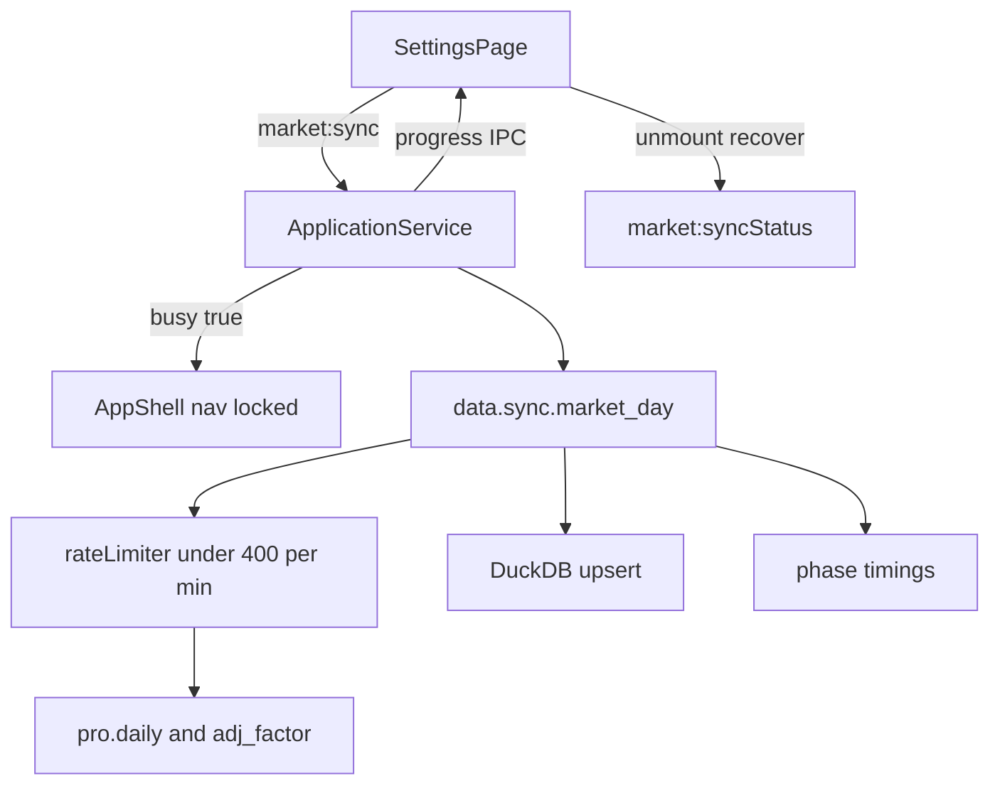
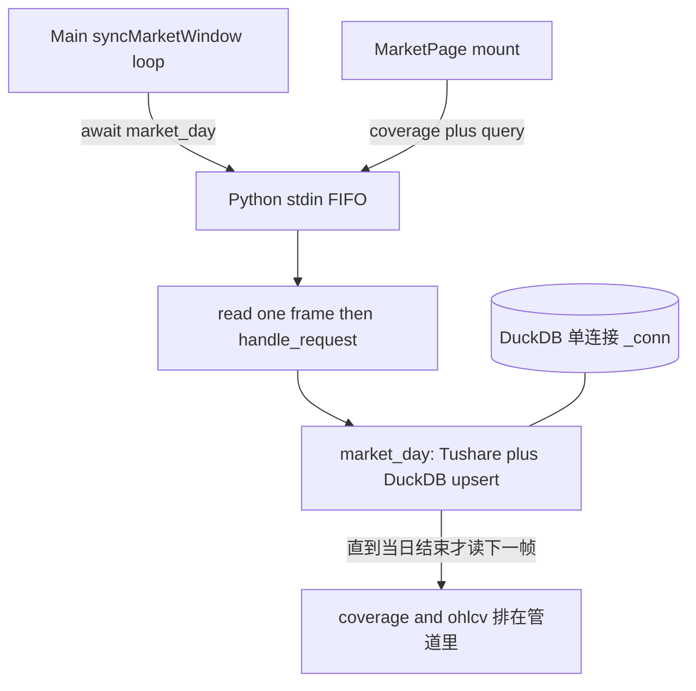

# Sprint4.1 迭代文档

> 状态：**进行中**  
> 关联：[启动摘要](./Sprint4.1迭代启动文档.md)、[Sprint4 迭代文档](./Sprint4迭代文档.md)、[架构文档](../trading-zone-electron架构文档.md)

---

## 1. 当前迭代目标

针对 Sprint4 全市场按日同步暴露的两类问题：**缩短拉取耗时**（先量化瓶颈，再收紧限频与入库），以及 **同步进行中切页后丢失进度 / 误点更新**（同步期间锁定导航与交互）。

### 1.1 目标声明

| # | 目标 | 验收口径 |
|---|---|---|
| G1 | 瓶颈可观测 | 单日同步能拆出 `sleep` / `pro.daily` / `adj_factor` / DuckDB upsert 耗时；结论写入本轮测试节 |
| G2 | 限频更紧、吞吐更高 | 去掉固定 `0.3s` sleep；按「每分钟 <400 次」滑动窗口限流（两次调用最短间隔约 150ms）；不超 Tushare 基础积分 500 次/分 |
| G3 | 入库不拖后腿 | 若 G1 显示 upsert 占比高，改为批量写入（Arrow / DataFrame 注册），单日入库明显短于现 `executemany` |
| G4 | 同步中锁定壳层 | 拉取期间禁止切到行情页、禁止改截止日 / 保存 Token / 再点更新或清除；进度条与阶段文案保持可见 |
| G5 | 切回配置页状态一致 | 即使因 HMR / 异常卸载重挂，配置页也能读到 Main 侧「正在同步」并恢复进度，而不是按钮变亮、进度条消失 |

### 1.2 范围边界（本迭代不做）

- 同步取消（Sprint4 改进项，本轮仍不做）
- 放开起始日、K 线、Arrow Transfer 到 Renderer
- 改 Sprint2 按股票 `data.sync.market_pool` 路径（仍可保留其 sleep，不作为本轮优化对象）
- 并行打 Tushare（单 worker 串行调用，只把空等压掉）
- **同步中可浏览行情**：worker 仍是单线程 stdin 循环，查询与 `market_day` 互斥；本轮用锁导航规避，不做请求并发 / DuckDB 读写分离
- 正式打包、嵌入式 Python

### 1.3 技术选型（本迭代）

| 层 | 选型 |
|---|---|
| 限流 | Python worker 进程内滑动窗口 / 最小间隔限流器，目标 **<400 次/分**（相对 500 次/分留余量） |
| 观测 | `market_day` 返回或日志带各阶段毫秒；进度文案可带最近一日耗时 |
| 入库 | DuckDB：`pa.table` + `conn.register` + `INSERT OR REPLACE … SELECT`，替换 `executemany` |
| UI | `syncing` / `progress` 提到 `App`；`AppShell` 导航 `disabled`；Main `market:syncStatus` 供重挂恢复 |
| 协议 | `data.sync.market_day` 增加 `timings_ms`；JSON Schema / TS / Pydantic 对齐 |

---

## 2. 功能需求

### 2.1 用户故事

1. 作为用户，全市场按日拉取应尽量贴近接口配额，而不是每两次请求固定空等 0.3 秒。
2. 作为用户，我希望知道慢在接口还是入库，而不是只感觉「很久」。
3. 作为用户，更新数据期间不能切到其他页面，也不能点更新 / 清除，直到本次拉取结束。
4. 作为用户，拉取过程中进度条和阶段文案始终可见，不会因为误操作切页而丢失。

### 2.2 功能清单

| ID | 功能 | 优先级 | 状态 |
|---|---|---|---|
| F01 | `market_day` 分阶段计时（API / wait / upsert） | P0 | 已完成 |
| F02 | 共享限流器替代固定 `SLEEP_SECONDS = 0.3`，上限 <400 次/分 | P0 | 已完成 |
| F03 | DuckDB Arrow 批量入库 | P0 | 已完成 |
| F04 | App 提升同步 busy；AppShell 禁用导航 | P0 | 已完成 |
| F05 | Main `market:syncStatus` + 进度可查询 / 重挂恢复 | P0 | 已完成 |
| F06 | 配置页：同步中禁用 Token / 日期 / 更新 / 清除 | P0 | 已完成 |
| F07 | 验收：限流不超标 + 切页锁定（手工 + s4 回归） | P1 | 部分完成 |

### 2.3 非功能需求

- 限流以 **Tushare HTTP 调用次数** 计（`daily` + `adj_factor` 各算 1），不是按交易日计。
- 目标上限 **400 次/分**；硬上限仍视为 500 次/分，禁止打满。
- Renderer 仍不直连 Python / DuckDB。
- 缩小截止日不删数据、complete 日跳过：行为与 Sprint4 一致。
- 同步互斥：Main `marketSyncing` 继续生效。

---

## 3. 详细设计说明

### 3.1 进程与数据流



**问题一（耗时）现状**

- `market_day` 每个交易日固定：`sleep(0.3)` → `pro.daily(trade_date=…)` → upsert → `sleep(0.3)` → `adj_factor` → upsert。
- 按日接口一次最多约 6000 条，等价于一天全市场；配额瓶颈是 **调用次数** 不是股票只数。
- 固定 0.3s × 2 意味着即便接口瞬时返回，一天也至少空等 0.6s。窗口约 600 个交易日时，仅 sleep 就约 6 分钟，且实际频率远低于 400 次/分。
- 入库走 Python `executemany` 逐行 `INSERT OR REPLACE`，全日约 5000 行时可能接近或超过接口耗时，需先测再改。

**问题二（切页）现状**

- `App` 用三元切换页面：离开配置页会 **卸载** `SettingsPage`。
- `syncing` / `progress` 只在配置页 `useState`；重挂后 `syncing=false`，按钮恢复、进度条条件 `loading \|\| syncing \|\| clearing` 为假。
- Main 已有 `marketSyncing` 互斥，二次点击会报「行情同步正在进行中」，但 UI 已丢失进度。

**问题二补充：切到行情页也会「卡住」（数据面排队，不是窗口冻死）**

Electron 窗口本身一般仍能点导航；卡住的是行情页在等 Python。链路如下：



1. **Worker 单线程、一次只处理一帧。** `main.py` 是 `read_message(stdin)` → `handle_request()` 再读下一帧。`market_day` 里的 `pro.daily`、`sleep`、`executemany` 都是同步阻塞；期间 stdin 里即使已有 `coverage` / `ohlcv` 也不会被读。
2. **Main 事件循环没有被同步卡住。** `pythonBridge.call` 是 Promise + stdout 回调；`market:pool` 走 SQLite，可以马上返回。卡住的是所有也要进 Python 的 IPC。
3. **行情页挂载会打两条 Python RPC。** `coverage()` 走 `data.meta.market_coverage`；选中股票后 `query()` 走 `data.query.ohlcv`。二者都排在当前 `market_day` 后面，最短也要等完「当天」的拉数+入库。
4. **`Promise.all(pool, coverage)` 把快路径绑死在慢路径上。** 池子在 SQLite，本可立刻渲染列表，但要等 `coverage` 一起 `setState`，所以界面会一直 `加载中…`。
5. **DuckDB 全局单连接。** 即便以后把 handler 改成多线程，同一 `_conn` 上写（upsert）和读（query）仍会互相等。真正的「边拉边看」需要 worker 队列优先级 + 读写连接策略，超出本轮范围。
6. **首次全量时池子更空。** `ensureMarketPool` 在整个窗口同步 **全部结束后** 才写前 10 支；第一次拉取中切行情，左侧池也可能是空的。

因此：不是「React 把 UI 线程冻住」，而是 **读路径和写路径共用一个同步 Python worker**。本轮继续 **锁导航**，避免用户切到一个必然排队的行情页；不在 4.1 做后台可看。

**本轮对策（已落地）**

1. 限流：`python/worker/rate_limit.py` 滑动窗口 400 次/分 + 最小间隔 150ms；`market_day` 每次 Tushare 调用前 `wait_for_tushare_slot()`。
2. 入库：`upsert_daily_bars` / `upsert_adj_factors` 走 Arrow 注册表 + `INSERT OR REPLACE SELECT`。
3. 锁定：`syncing` / `progress` 在 `App`；`AppShell` 导航 `disabled`，Tooltip「数据更新中」。
4. 恢复：Main `lastSyncProgress` + `market:syncStatus`；App 挂载拉取并订 `market:syncProgress`。
5. 进度文案在每个交易日完成后附带 `daily=` / `upsert=` / `wait=` 毫秒。

### 3.2 目录 / 模块（本迭代涉及）

```
src/renderer/src/App.tsx
src/renderer/src/layout/AppShell.tsx
src/renderer/src/pages/SettingsPage.tsx
src/main/services/applicationService.ts
src/main/ipc/registerHandlers.ts
src/preload/index.ts
src/preload/index.d.ts
src/shared/types/market.ts
src/shared/types/pythonProtocol.ts
python/worker/handlers/market_day.py
python/worker/db/market_db.py
python/worker/rate_limit.py
python/worker/models.py
contracts/market_sync.day.response.json
```

### 3.3 数据模型 / 存储

表结构不改。`sync_trade_date` / `daily_bar` / `adj_factor` 语义与 Sprint4 相同。

进程内（Main，不落库）：

- `marketSyncing: boolean`
- `lastSyncProgress: MarketSyncProgress | null`

### 3.4 协议 / API / IPC

新增：

- `market:syncStatus` → `{ syncing: boolean, progress: MarketSyncProgress | null }`
- `market:syncProgress` 推送保持不变

`data.sync.market_day` 增加必填 `timings_ms: { wait, daily, upsert_daily, adj, upsert_adj }`（毫秒整数）。

### 3.5 核心编排

1. 点击更新 → 配置页 `onSyncingChange(true)` → Main `marketSyncing=true`，进度 `stock_list`。
2. Python 每次 Tushare 调用走同一限流器。
3. 每个交易日：先推进度「正在补齐」，完成后再次推进度并附 `timings_ms`。
4. App 订 `market:syncProgress`；`stage !== done` 时锁导航。
5. `finally`：`marketSyncing=false`，推 `stage=done`，配置页 `onSyncingChange(false)`。
6. App 挂载：`market:syncStatus()` 恢复 `syncing` / `progress`。

### 3.6 UI

- 同步中：左侧配置 / 行情图标不可点；Tooltip 可提示「数据更新中」。
- 配置页进度条在 `busy` 期间始终显示；阶段文案不依赖「必须从未离开过本页」。
- 不采用「允许看行情、后台拉数」：启动文档要求拉取完毕前禁止切页。

### 3.7 契约

| 层级 | 位置 |
|---|---|
| JSON Schema | `contracts/market_sync.day.response.json` |
| TypeScript | `src/shared/types/market.ts`、`pythonProtocol.ts` |
| Pydantic | `python/worker/models.py`（`MarketSyncDayTimings`） |

---

## 4. 任务步骤

| 步骤 | 任务 | 产出 | 状态 |
|---|---|---|---|
| 1 | 迭代文档骨架 + 启动文档互链 | `Sprint4.1迭代文档.md` | 已完成 |
| 2 | `market_day` 分阶段计时 | `timings_ms` | 已完成 |
| 3 | 限流器 <400 次/分，替换固定 sleep | `rate_limit.py` + `market_day.py` | 已完成 |
| 4 | Arrow 批量写入 | `market_db.py` | 已完成 |
| 5 | Main syncStatus + 最近进度 | applicationService / IPC / preload | 已完成 |
| 6 | App busy + AppShell 锁导航 + 配置页恢复 | renderer | 已完成 |
| 7 | 手工 / 验收脚本 | 测试节 | 部分完成 |

### 4.1 本地复现命令

```bash
npm run typecheck
npm run dev
```

限流与耗时需有 Token 的短窗口实拉；切页锁定用开发窗手工验收。

---

## 5. 测试结果 / 总结反馈

### 5.1 验收清单与结果

| 检查项 | 方式 | 结果 | 说明 |
|---|---|---|---|
| typecheck | `npm run typecheck` | 通过 | node + web |
| G1 瓶颈拆分 | 实拉进度文案 | 待补跑 | 代码已下发 `timings_ms`；需重启 `npm run dev` 后看进度 |
| G2 最小间隔 150ms | 本地 limiter 冒烟 | 通过 | wait0=0.0000s；wait1=0.1501s |
| G3 Arrow upsert | 临时 DuckDB | 通过 | 2 行写入、主键覆盖 close=12.5；seed/plan/query 隔离回归通过 |
| G4 同步中导航不可点 | 手工 | 待补跑 | 需重启开发窗（当前 `npm run dev` 未加载本轮代码） |
| G5 重挂恢复进度 | 手工 | 待补跑 | App 订 `syncStatus` + `onSyncProgress` |
| 二次更新仍互斥 | 代码 + 手工 | 待补跑 | Main `marketSyncing` 仍抛「正在进行中」；按钮 `busy` 禁用 |
| `acceptance:s4` | electron-vite | 未完整通过 | DuckDB 被现有 Python worker PID 28844 占用（与 Sprint4 已知摩擦相同） |

### 5.2 关键命令记录

```
npm run typecheck
  typecheck:node + typecheck:web  通过

limiter wait0=0.0000s wait1=0.1501s
upsert bars=2 adj=2 replace=1 count=2 close=12.5
arrow upsert ok

isolated s4 duckdb path ALL PASSED
bars=2 query=2 pending_narrow=['20240104', '20240105']

===== Sprint4 Acceptance ===== (2026-08-15，与 npm run dev 并行)
PASS | python ready | python=3.13.2
PASS | sync without token shows error | skipped (token already configured)
FAIL | plan / clear / query path | market.duckdb locked by python.exe PID 28844
PASS | board stats from market+exchange
PASS | empty pool backfilled from stock list | pool=10
PASS | live short window sync | skipped (set SPRINT4_LIVE=1 to enable)
FAILED: 1
```

### 5.3 总结反馈

**做得好的地方**

- 按日路径限流与 Sprint2 按股票 `market_sync.py` 脱钩，不再固定空等 0.3s。
- 入库改为 Arrow 一次注册，主键覆盖行为在隔离库上可复现。
- 同步态提升到 App + Main，锁导航同时避免查询插入 worker 队列。

**暴露的问题 / 摩擦**

- Sprint4 配置页把同步态只放在页面本地；`App` 卸载页面导致进度丢失（本轮已上提）。
- `SLEEP_SECONDS = 0.3` 从按股票拉取沿用到按日拉取，对 `pro.daily(trade_date=)` 过保守（本轮已替换）。
- 同步中切行情页会卡住：Python worker 单线程 FIFO（本轮用锁导航规避，未做并发）。
- `acceptance:s4` 与正在运行的 `npm run dev` 共用 `market.duckdb`，会文件占用；需先停开发窗再补跑。
- 有 Token 的全窗口实拉耗时对比、锁导航目视仍待重启后手工确认。

---

## 6. 改进目标

### 6.1 短期（下一迭代可做）

1. 同步可取消 + 进度/cancel 语义下沉到 Python。
2. 限流参数可配置（积分档位不同则 500/800 不同）。

### 6.2 中期

1. 放开起始日回补更早历史。
2. 控制面 progress 规范化。
3. 若要「边拉边看行情」：worker 请求队列（同步低优先级 / 查询插队）+ DuckDB 读写连接分离；行情页 pool 与 coverage 解耦，同步中可先渲染 SQLite 池子。

### 6.3 长期

1. 全市场同步调度与多档限频。
2. Token 加密；嵌入式 Python。

---

## 附录

### A. 相关文档

- [`Sprint4.1迭代启动文档.md`](./Sprint4.1迭代启动文档.md)
- [`Sprint4迭代文档.md`](./Sprint4迭代文档.md)
- [架构文档](../trading-zone-electron架构文档.md)

### B. 常用命令

| 命令 | 用途 |
|---|---|
| `npm run dev` | 开发起窗，手工验锁定与进度 |
| `npm run typecheck` | 类型检查 |
| `npm run acceptance:s4` | Sprint4 回归（本轮结束后应仍通过） |
