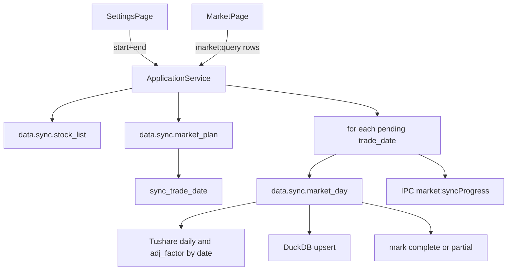

# Sprint4 迭代文档

> 状态：**进行中**  
> 关联：[启动摘要](./Sprint4启动文档.md)、[架构文档](../trading-zone-electron架构文档.md)、[Sprint3 迭代文档](../Sprint3/Sprint3迭代文档.md)

---

## 1. 当前迭代目标

本迭代落地 **两列壳层 UI**（图标导航 + 页面内滚动），并把首次全量 / 日常增量合成一次 **按 `[start_date, end_date]` 补齐交易日** 的全市场日线同步；行情页迁入壳内，表格交互与 Sprint2 一致。

### 1.1 目标声明

| # | 目标 | 验收口径 |
|---|---|---|
| G1 | 两列壳 | 左图标导航、右页面；窗口高度锁死，滚动只发生在右侧页面内部 |
| G2 | 配置页 | Token 迁入本页；空态；请求窗口 + 库内 min/max；条数；板块只数 |
| G3 | 窗口补齐同步 | 先股票列表，再按交易日拉取日线+复权；已 complete 日跳过；缩小截止日不删数据 |
| G4 | 进度 | 阶段 + 已完成/总待补交易日；禁止并发第二次同步 |
| G5 | 清除 | 清空 DuckDB 行情与覆盖表，Token / SQLite 股票列表保留 |
| G6 | 行情页 | 迁入壳内；池 + 日线表 + 复权与 Sprint2 一致 |

### 1.2 范围边界（本迭代不做）

- lightweight-charts K 线
- Arrow bytes 传入 Renderer / Electron IPC Transfer
- Token 加密、任务取消
- 放开起始日（本迭代锁死 `20240101`，但仍作为入参下发）
- 按股票代码前缀分板块
- 删除 `data.sync.market_pool`（Sprint2 验收仍用）
- 正式打包、嵌入式 Python

### 1.3 技术选型（本迭代）

| 层 | 选型 |
|---|---|
| 壳 / 构建 | Electron + electron-vite（沿用）；窗口约 1100×720 |
| UI | React + MUI：AppShell 图标导航；配置页 / 行情页；原生 `type=date` |
| 业务 | ApplicationService 按日编排；SQLite 股票列表 + 板块统计 + 股票池 |
| 数据 / 计算 | DuckDB `sync_trade_date` 覆盖表；按 `trade_date` 拉全市场 daily / adj_factor |
| 协议 | 长度前缀 MessagePack；新增 plan / day / clear；coverage 无 ts_codes 时摘要 |

---

## 2. 功能需求

### 2.1 用户故事

1. 作为用户，我可以通过左侧图标在「配置」与「行情」之间切换，右侧页面独立滚动。
2. 作为用户，我可以在配置页保存 Tushare Token，并看到是否已配置。
3. 作为用户，无行情时能看到空态；有数据时能看到起止日、条数、板块只数。
4. 作为用户，我可以用锁定的起始日 + 可改的截止日更新数据；已下载的交易日会被跳过。
5. 作为用户，更新过程中能看到阶段与交易日进度；不能同时发起第二次更新。
6. 作为用户，我可以清除本地行情（需确认），Token 与股票列表仍保留。
7. 作为用户，行情页仍可从股票池点选查看未/前/后复权日线表。

### 2.2 功能清单

| ID | 功能 | 优先级 | 状态 |
|---|---|---|---|
| F01 | 两列 AppShell + 图标导航 | P0 | 已完成 |
| F02 | 配置页 Token / 窗口 / 摘要 / 板块 | P0 | 已完成 |
| F03 | `data.sync.market_plan` 交易日补齐计划 | P0 | 已完成 |
| F04 | `data.sync.market_day` 按日全市场拉取 | P0 | 已完成 |
| F05 | `data.admin.clear_market` | P0 | 已完成 |
| F06 | coverage 全市场摘要（无全量 stocks[]） | P0 | 已完成 |
| F07 | ApplicationService 编排 + 互斥 + IPC 进度 | P0 | 已完成 |
| F08 | 行情页迁入壳；空池回填前 10 支 | P0 | 已完成 |
| F09 | `npm run acceptance:s4` | P0 | 已完成 |

### 2.3 非功能需求

- Renderer 不直连 Python / DuckDB / SQLite。
- 缩小截止日只少请求，不 DELETE 已有行情。
- 全市场 coverage 禁止把每只股票明细打回 UI。
- 同步互斥；单日 RPC 超时约 60s。
- 契约：JSON Schema + TS + Pydantic 对齐。

---

## 3. 详细设计说明

### 3.1 进程与数据流



### 3.2 目录 / 模块（本迭代涉及）

```
src/renderer/src/
  App.tsx
  layout/AppShell.tsx
  pages/SettingsPage.tsx
  pages/MarketPage.tsx
src/main/
  services/applicationService.ts
  ipc/registerHandlers.ts
  db/stocksRepository.ts
  acceptance/runSprint4.ts
python/worker/
  db/market_db.py
  handlers/market_plan.py
  handlers/market_day.py
  handlers/market_clear.py
  models.py
contracts/market_sync.plan.*.json
contracts/market_sync.day.*.json
contracts/market_clear.response.json
```

### 3.3 数据模型 / 存储

DuckDB 新增覆盖表：

```sql
CREATE TABLE IF NOT EXISTS sync_trade_date (
  trade_date VARCHAR PRIMARY KEY,
  bar_count INTEGER NOT NULL,
  adj_count INTEGER NOT NULL,
  status VARCHAR NOT NULL,
  synced_at TIMESTAMP NOT NULL
);
```

交易日历缓存 `trade_cal(trade_date, is_open)`，供无 Token 验收注入，以及有 Token 时写入 Tushare `trade_cal`。

仅 `status = complete` 的交易日在窗口内被跳过。缩小截止日不删行。

### 3.4 协议 / API / IPC

新增 Python 方法：

- `data.sync.market_plan`：`{start_date, end_date, token?}` → 窗口交易日 / complete / pending
- `data.sync.market_day`：`{token, trade_date}` → 当日全市场写入并更新覆盖表
- `data.admin.clear_market`：清空 `daily_bar` / `adj_factor` / `sync_trade_date` / `trade_cal`

Electron：

- `market:sync` `{start_date, end_date}`
- `market:clear`
- `market:onSyncProgress`
- `stocks:boardStats`

`data.meta.market_coverage`：`ts_codes` 有值时仍返回分股明细；为 null 时只回摘要（`min_date` / `max_date` / `complete_days`，`stocks` 为空数组）。

### 3.5 核心编排（ApplicationService）

1. Token 校验；进程内互斥。
2. 同步股票列表。
3. `market_plan` 得到 pending。
4. 逐日 `market_day`，每日本通过 `event.sender.send('market:syncProgress')`。
5. 若股票池为空，用股票列表前 10 支写入池（不按股拉行情）。
6. 返回摘要：补了几天、跳过几天、bars/adj、errors。

### 3.6 UI

- 左栏图标：设置、行情。
- 配置页：Token、起始只读 `20240101`、截止可改（缺省今天）、更新 / 清除、覆盖摘要、板块只数、进度条。
- 行情页：股票池列表 + 日线表 + 复权切换；无顶栏 Token / 全页拉取按钮。

### 3.7 契约

| 层级 | 位置 |
|---|---|
| JSON Schema | `contracts/market_sync.plan.*.json`、`market_sync.day.*.json`、`market_clear.response.json`、`market_coverage.response.json` |
| TypeScript | `src/shared/types/pythonProtocol.ts`、`src/shared/types/market.ts` |
| Pydantic | `python/worker/models.py` |

---

## 4. 任务步骤

| 步骤 | 任务 | 产出 | 状态 |
|---|---|---|---|
| 1 | 迭代文档 + 架构 / 启动互链 | `Sprint4/` | 已完成 |
| 2 | 契约 + TS + Pydantic | contracts / types / models | 已完成 |
| 3 | DuckDB 覆盖表 + plan / day / clear | python worker | 已完成 |
| 4 | ApplicationService 编排 + IPC | main / preload | 已完成 |
| 5 | AppShell + 配置页 + 行情页 | renderer | 已完成 |
| 6 | `acceptance:s4` | runSprint4.ts | 已完成 |

### 4.1 本地复现命令

```bash
npm install

cd python
.\.venv\Scripts\activate
pip install -r requirements.txt

cd ..
npm run typecheck
npm run acceptance:s4
```

---

## 5. 测试结果 / 总结反馈

### 5.1 验收清单与结果

| 检查项 | 方式 | 结果 | 说明 |
|---|---|---|---|
| G1 两列壳 | 手工 | 待补跑 | 开发窗口目视 |
| G3 plan 跳过 complete 日 | acceptance:s4 | 通过 | pending=20240104,20240105 |
| G3 扩展 end_date 增量 | acceptance:s4 | 通过 | pending 仅新区间 5 日 |
| G5 clear 后 coverage 为 0 | acceptance:s4 | 通过 | bars=0; complete_days=0 |
| 摘要 coverage 不回 stocks[] | acceptance:s4 | 通过 | summaryStocks=0; bars=2 |
| 无 Token 同步报错 | acceptance:s4 | 跳过 | 本机已配置 Token |
| 有 Token 短窗口实拉 | acceptance:s4 | 跳过 | 需 `SPRINT4_LIVE=1` |
| s3 Arrow 查询仍可用 | acceptance:s3 / s4 | 通过 | none=10.5, qfq≈9.545 |
| 板块统计 + 空池回填 | acceptance:s4 | 通过 | 五板块均有计数；pool=10 |

### 5.2 关键命令记录

```
===== Sprint4 Acceptance ===== (2026-08-14)
PASS | python ready | python=3.13.2
PASS | sync without token shows error | skipped (token already configured)
PASS | plan skips complete days in window | pending=20240104,20240105; complete=20240102,20240103
PASS | expanding end_date only adds new pending days | pending=20240104,20240105,20240108,20240109,20240110; complete=2
PASS | clear_market empties coverage summary | bars=0; stocks=0; complete_days=0
PASS | summary coverage omits per-stock dump | summaryStocks=0; bars=2
PASS | arrow query still works after clear+seed | queryCount=2; detailedStocks=1
PASS | board stats from market+exchange | sse_main=1699, szse_main=1494, chinext=1402, star=613, bse=335
PASS | empty pool backfilled from stock list | pool=10
PASS | live short window sync | skipped (set SPRINT4_LIVE=1 to enable)
ALL PASSED

===== Sprint3 Acceptance ===== (回归)
ALL PASSED
```

### 5.3 总结反馈

**做得好的地方**

- 首次全量与日常增量合成 `market_plan` + 逐日 `market_day`，接口始终带 `start_date` / `end_date`。
- 全市场 coverage 改为摘要，避免数千只股票明细打进 UI。
- 壳层拆分后行情页仍走原表格路径；s3 复权验收未回归失败。

**暴露的问题 / 摩擦**

- 本机若残留 Python worker，会锁住 `market.duckdb`，`clear` / 同步会报文件占用。
- `acceptance:s4` 会 `clear_market`，清空当前 userData 行情（与 s2/s3 共用同一 DuckDB）。
- 两列壳与配置页交互尚未做无头目视验收。

---

## 6. 改进目标

### 6.1 短期（下一迭代可做）

1. lightweight-charts 消费窗口；视口变化带 `start/end/limit`。
2. 将 Arrow bytes Transfer 到 Renderer，去掉 Main 行对象转换。
3. 同步可取消。

### 6.2 中期

1. 放开起始日，支持向更早历史回补。
2. 控制面 progress/cancel 语义规范化（Python 推送进度帧）。
3. 行情页虚拟列表 / 搜索（若列表变成全市场）。

### 6.3 长期

1. 嵌入式 Python 分发；契约 CI 校验。
2. Token 加密或系统密钥环。
3. 全市场同步调度与限频策略。

---

## 附录

### A. 相关文档

- [`Sprint4启动文档.md`](./Sprint4启动文档.md)
- [架构文档](../trading-zone-electron架构文档.md)
- [Sprint3 迭代文档](../Sprint3/Sprint3迭代文档.md)

### B. 常用命令

| 命令 | 用途 |
|---|---|
| `npm run dev` | 开发起窗 |
| `npm run acceptance:s4` | Sprint4 无头验收 |
| `npm run acceptance:s3` | Sprint3 验收 |
| `npm run acceptance:s2` | Sprint2 验收 |
| `npm run typecheck` | 类型检查 |
