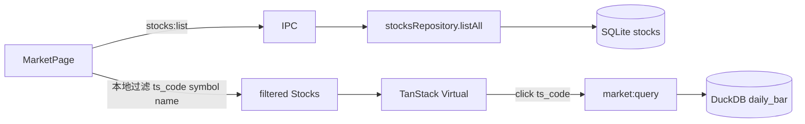

# Sprint5.1 迭代文档

> 状态：**进行中**  
> 关联：[启动摘要](./Sprint5.1迭代启动文档.md)、[Sprint5 迭代文档](./Sprint5迭代文档.md)、[架构文档](../trading-zone-electron架构文档.md)

---

## 1. 当前迭代目标

行情页左侧改为展示 SQLite `stocks` 全量（约 5000 只），用虚拟列表保证滚动可用，并用代码/名称即时过滤定位个股。`market_pool` 与 Sprint2 池子同步协议保留，不为全量列表删除。

### 1.1 目标声明

| # | 目标 | 验收口径 |
|---|---|---|
| G1 | 左侧全量选股 | 列表数据源为 `stocks:list`，不再只显示 `market_pool` 前 10 支 |
| G2 | 虚拟列表 | 约 5000 只时只渲染视口附近行，滚动流畅，不卡顿选中切换 |
| G3 | 代码/名称过滤 | 对 `ts_code` / `symbol` / `name` 包含匹配、忽略大小写；本地即时过滤，不打 IPC |
| G4 | 选中不跟过滤跑 | 过滤隐藏当前选中时，右侧日线不换股、不自动跳到第一只匹配 |
| G5 | 池子协议保留 | `market_pool`、`ensureMarketPool`、`data.sync.market_pool`、`market:pool` 仍在；`acceptance:s2` 不因本轮失败 |

### 1.2 范围边界（本迭代不做）

- 拼音首字母、板块筛选、服务端 `LIKE`、左侧分页
- 改日线表（列、排序、分页属 Sprint5）
- 同步取消、限流可配（Sprint4.1 遗留）
- 删除或改形态 `market_pool` / `data.sync.market_pool`
- Arrow Transfer 到 Renderer、正式打包、嵌入式 Python

### 1.3 技术选型（本迭代）

| 层 | 选型 |
|---|---|
| 壳 / 构建 | Electron + electron-vite（沿用） |
| UI | React + MUI `ListItemButton`；`@tanstack/react-virtual` 虚拟滚动；`TextField` 本地过滤 |
| 业务 | 已有 `stocks:list` IPC；行情页不再读 `market:pool` |
| 数据 | SQLite `stocks`（`ORDER BY ts_code`）；过滤在 Renderer |
| 协议 | 不新增 JSON Schema / Python 方法 |

### 1.4 已拍板结论

| # | 议题 | 结论 |
|---|---|---|
| 1 | 为何虚拟列表 | 5000 条 JSON 很小；5000 个 MUI 行 DOM 会卡。虚拟列表解决 DOM，不是 IPC/SQL |
| 2 | 过滤不能替代虚拟列表 | 输入 `600` 仍可能几百条 |
| 3 | 过滤字段 | `ts_code`、`symbol`、`name`；包含、忽略大小写；不做拼音 |
| 4 | 选中策略 | 进入页默认第一只；关键字变化不改 `selectedCode` |
| 5 | 池子 | 保留给 Sprint2 验收与同步收尾；行情页不依赖 |

---

## 2. 功能需求

### 2.1 用户故事

1. 作为用户，行情页左侧能看到已同步的全部股票，而不只是前 10 支。
2. 作为用户，在约 5000 只列表上滚动和点选应流畅。
3. 作为用户，输入代码或名称片段即可收窄列表（如 `000001`、`平安`、`600`）。
4. 作为用户，边打字边过滤时，右侧正在看的日线不会被自动换成别的股票。
5. 作为用户，尚未同步股票列表时，空态会引导我去配置页，而不是提示「前 10 支股票池」。

### 2.2 功能清单

| ID | 功能 | 优先级 | 状态 |
|---|---|---|---|
| F01 | 左侧改读 `stocks:list` | P0 | 已完成 |
| F02 | `@tanstack/react-virtual` 虚拟列表 | P0 | 已完成 |
| F03 | 代码/名称即时过滤 + 匹配数/总数 | P0 | 已完成 |
| F04 | 选中不随过滤跳股；无匹配时空列表、右侧保持日线 | P0 | 已完成 |
| F05 | 空态与顶栏 Chip 文案（股票总数，不再写池/前 10 支） | P0 | 已完成 |
| F06 | 保留 `market_pool` 与 s2 验收路径 | P0 | 已完成 |

### 2.3 非功能需求

- Renderer 不直连 SQLite / Python / DuckDB。
- 5000 条一次性 IPC 拉取后内存过滤，不按键打 `stocks:list`。
- 虚拟列表只挂视口附近行（`overscan` 约 8）。
- 不过滤时标题为 `股票（总数 / 总数）`；有关键字为 `股票（匹配数 / 总数）`。

---

## 3. 详细设计说明

### 3.1 进程与数据流



`market:pool` / `ensureMarketPool()` 继续给 Sprint2 验收和配置页同步收尾用，行情页不再调用。

### 3.2 目录 / 模块（本迭代涉及）

```
src/renderer/src/pages/MarketPage.tsx
src/renderer/src/pages/StockPicker.tsx
package.json
prompt/trading-zone-electron开发文档/Sprint5/Sprint5.1迭代文档.md
```

不改 Python、DuckDB、JSON Schema、`stocksRepository.listAll`、`ensureMarketPool`。

### 3.3 数据模型 / 存储

沿用 SQLite `stocks`：`ts_code`、`symbol`、`name` 等。列表展示主标题 `name`、副标题 `ts_code`，去掉池子 `rank`。

### 3.4 协议 / API / IPC

- 新增使用：已有 `stocks:list` → `stocksRepository.listAll()`（`ORDER BY ts_code`）。
- 日线仍走 `market:query`。
- `market:pool` IPC 保留，本页不再调用。

### 3.5 核心编排

1. 进入行情页：`Promise.all([stocks.list(), market.coverage()])`。
2. 默认选中全量第一只（若刷新后原选中仍在表中则保留）。
3. 输入关键字：`trim` + 小写后对 `ts_code` / `symbol` / `name` `includes`。
4. 点列表行才改 `selectedCode` 并触发 `market:query`。

### 3.6 UI

- 左侧：标题 `股票（匹配数 / 总数）` + 搜索框 + 虚拟列表。
- 顶栏 Chip：`行情 N 行 / 股票 M`（不再写「池」）。
- 空态（`stocks.length === 0`）：「尚未同步股票列表」，引导去配置页更新数据。
- 无匹配：列表区「无匹配股票」，右侧日线不变。

### 3.7 契约

本轮无新契约。控制面仍是既有 `stocks:list` 与 `market:query`。

---

## 4. 任务步骤

| 步骤 | 任务 | 产出 | 状态 |
|---|---|---|---|
| 1 | 迭代文档 + 启动/Sprint5 互链 | `Sprint5/` | 已完成 |
| 2 | 添加 `@tanstack/react-virtual` | `package.json` | 已完成 |
| 3 | `StockPicker` + `MarketPage` 全量列表 / 过滤 / 文案 | Renderer | 已完成 |
| 4 | `typecheck` + `acceptance:s2` + 手工 | 验收 | 部分完成 |

### 4.1 本地复现命令

```bash
npm run typecheck
npm run acceptance:s2
npm run dev
```

手工：起窗 → 左侧约 5000 可流畅滚 → 输入 `000001` / `平安` / `600` → 点选查日线 → 滤掉当前选中时右侧不跳股 → 无股票列表时空态文案正确。

---

## 5. 测试结果 / 总结反馈

### 5.1 验收清单与结果

| 检查项 | 方式 | 结果 | 说明 |
|---|---|---|---|
| G1 全量列表 | 代码 | 通过 | `MarketPage` 改读 `stocks:list`；`StockPicker` 展示 `name` / `ts_code` |
| G2 虚拟滚动 | 代码 | 通过 | `@tanstack/react-virtual`，`overscan` 8，行高 60 |
| G3 过滤 | 代码 | 通过 | 本地 `ts_code` / `symbol` / `name` 包含匹配 |
| G4 选中不跑 | 代码 | 通过 | 关键字只滤列表，不改 `selectedCode` |
| G5 池子保留 | `acceptance:s2` | 通过 | ALL PASSED；`syncPool` 仍写 10 支池 |
| typecheck | 脚本 | 通过 | `typecheck:node` + `typecheck:web` |
| 滚动 / 过滤 / 不跳股目视 | 手工 | 待补跑 | 实现已落地；`npm run dev` 已重启，需切行情页目视 |

### 5.2 关键命令记录

```
npm run typecheck
# typecheck:node + typecheck:web 通过

===== Sprint2 Acceptance =====
PASS | python ready + imports | python=3.13.2
PASS | duckdb file exists after seed | bars=2; adj=2
PASS | query ohlcv none/qfq/hfq | none=10.5, qfq=9.545454545454545, hfq=10.5
PASS | market coverage reports bars | total_bars=2, stocks=1
PASS | syncPool without token shows error | skipped (token already configured)
PASS | syncPool with token writes duckdb | pool=10, bars=4849, adj=4850, errors=0
ALL PASSED
```

### 5.3 总结反馈

**做得好的地方**

- 复用已有 `stocks:list`，未新开 IPC / Python 方法。
- 过滤与虚拟列表拆在 `StockPicker`，日线表逻辑未动。
- 池子协议原样保留，s2 仍 ALL PASSED。

**暴露的问题 / 摩擦**

- 清过滤后当前选中不一定在视口内（短期改进项：滚入视口）。
- 滚动流畅度、过滤与选中不跑仍需起窗目视。

---

## 6. 改进目标

### 6.1 短期（下一迭代可做）

1. 同步可取消 + 进度/cancel 语义下沉（Sprint4.1 遗留）。
2. 选中行滚入视口（清过滤后定位当前股）。

### 6.2 中期

1. 拼音首字母 / 板块筛选。
2. 放开起始日回补更早历史。
3. 限流参数按积分档位可配。

### 6.3 长期

1. Arrow Transfer 到 Renderer；图表视口直接消费列式窗口。
2. Token 加密；嵌入式 Python。

---

## 附录

### A. 相关文档

- [`Sprint5.1迭代启动文档.md`](./Sprint5.1迭代启动文档.md)
- [`Sprint5迭代文档.md`](./Sprint5迭代文档.md)
- [`Sprint5启动文档.md`](./Sprint5启动文档.md)
- [架构文档](../trading-zone-electron架构文档.md)

### B. 常用命令

| 命令 | 用途 |
|---|---|
| `npm run dev` | 开发起窗 |
| `npm run typecheck` | 类型检查 |
| `npm run acceptance:s2` | 股票池协议回归 |
