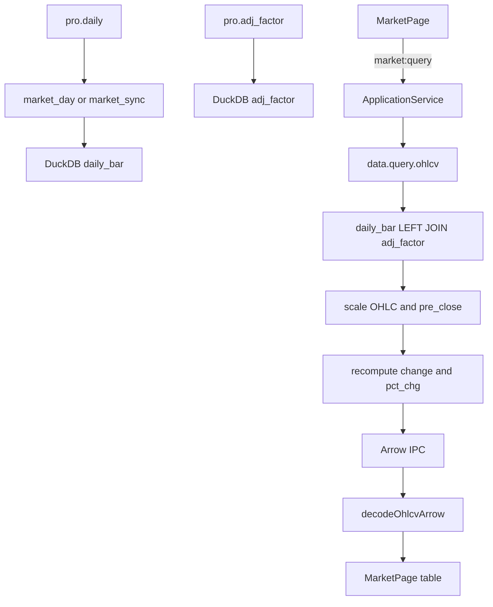

# Sprint5 迭代文档

> 状态：**进行中**  
> 关联：[启动摘要](./Sprint5启动文档.md)、[架构文档](../trading-zone-electron架构文档.md)、[Sprint4.1 迭代文档](../Sprint4/Sprint4.1迭代文档.md)、[Sprint5.1 迭代文档](./Sprint5.1迭代文档.md)、[Sprint5.1 启动（全量列表）](./Sprint5.1迭代启动文档.md)

---

## 1. 当前迭代目标

把日线行情字段与 Tushare `pro.daily` 输出对齐（缺的补、不一致的改），并在行情页日线表上补全列、可选列、单列排序与分页。左侧股票池仍为 10 支，全量列表放到 Sprint5.1。

### 1.1 目标声明

| # | 目标 | 验收口径 |
|---|---|---|
| G1 | 日线字段对齐 `pro.daily` | DuckDB / Python 拉取入库查询 / TS `OhlcvBar` / 前端表列：名称与类型一致；补 `pre_close`、`change`、`pct_chg`、`ah_vol`、`ah_amount` |
| G2 | `adj_factor` 仍可用 | 继续存在 `adj_factor` 表并 JOIN；UI 作为可选列，不写入 `daily_bar` |
| G3 | 复权涨跌重算 | `qfq` / `hfq` 下 OHLC 与 `pre_close` 按因子缩放；`change`、`pct_chg` 用缩放后的收/昨收重算，不用接口原值 |
| G4 | 日线表交互 | 必选 7 列锁定；其余可开关；单列排序；分页基于排序后的全集 |
| G5 | 存量数据策略 | 本轮不作废 `complete`、不自动重拉；用户在配置页手动清除后再更新 |

### 1.2 范围边界（本迭代不做）

- **全量股票列表**（启动文档「只显示 10 支 → 全量」）：记入 Sprint5.1，本轮左侧仍读 `market_pool`
- `lightweight-charts` 与 `pro.daily` 字段映射
- 同步取消、限流可配（Sprint4.1 遗留）
- 自动作废已 complete 交易日 / 后台补拉新字段
- 改 Sprint2 `data.sync.market_pool` 协议形态（字段映射仍要与按日路径一致，避免两套行）
- Arrow bytes 直传 Renderer、服务端 `ORDER BY` + `LIMIT` 分页
- 正式打包、嵌入式 Python

### 1.3 技术选型（本迭代）

| 层 | 选型 |
|---|---|
| 壳 / 构建 | Electron + electron-vite（沿用） |
| UI | React + MUI：`Table` + `TablePagination` + `TableSortLabel`；列显隐用 `localStorage` |
| 业务 | ApplicationService / IPC 不变；`OhlcvBar` 与 Arrow 解码补列 |
| 数据 / 计算 | DuckDB `daily_bar` 加列 + `ALTER TABLE` 兼容已有库；查询 SQL 内复权缩放并重算涨跌 |
| 协议 | `data.query.ohlcv` 仍回 Arrow IPC；列集合扩大，JSON Schema 控制面形状不变 |

### 1.4 已拍板结论

| # | 议题 | 结论 |
|---|---|---|
| 1 | `adj_factor` | 保留为可选列；存在独立表，查询 JOIN |
| 2 | 旧数据 | 用户手动清除并手动拉取；本轮不改 `sync_trade_date` 跳过逻辑 |
| 3 | 复权涨跌 | 必须按缩放后的 `close` / `pre_close` 重算 |
| 4 | 全量列表 | 不做；见 [Sprint5.1](./Sprint5.1迭代启动文档.md) |

---

## 2. 功能需求

### 2.1 用户故事

1. 作为用户，日线表能看到与 Tushare `pro.daily` 一致的字段（含昨收、涨跌额、涨跌幅、盘后量额）。
2. 作为用户，日期 / 开 / 收 / 高 / 低 / 量 / 额始终可见；昨收、涨跌、盘后、复权因子可以开关。
3. 作为用户，我可以按某一列升序或降序，翻页后顺序仍基于该排序。
4. 作为用户，切换未/前/后复权时，价格按因子缩放，涨跌额与涨跌幅与缩放后的价格一致。
5. 作为用户，升级后旧库缺新字段时，我通过配置页「清除」再「更新」补齐，而不是程序偷偷重拉。

### 2.2 功能清单

| ID | 功能 | 优先级 | 状态 |
|---|---|---|---|
| F01 | `daily_bar` 补 `pre_close` / `change` / `pct_chg` / `ah_vol` / `ah_amount`，已有库 `ALTER TABLE` | P0 | 已完成 |
| F02 | `market_day` / `market_sync` 的 `DAILY_FIELDS` 与行映射对齐 | P0 | 已完成 |
| F03 | `query_ohlcv` Arrow 带齐字段；复权缩放 OHLC+`pre_close` 并重算涨跌 | P0 | 已完成 |
| F04 | TS `OhlcvBar` + Main `decodeOhlcvArrow` 对齐 | P0 | 已完成 |
| F05 | 行情页补列 + 可选列（必选 7 列锁定） | P0 | 已完成 |
| F06 | 单列排序 + 分页基于排序结果 | P0 | 已完成 |
| F07 | seed / acceptance 跟上新列与复权涨跌 | P1 | 已完成 |
| F08 | 全量股票列表 | P0 | **移出 → Sprint5.1** |

### 2.3 非功能需求

- Renderer 不直连 Python / DuckDB / SQLite。
- 字段名与 `pro.daily` 一致（`snake_case`），不做中英别名入库。
- `vol` / `amount` / `ah_vol` / `ah_amount` 复权时不缩放。
- 已 complete 日仍跳过；缩小截止日仍不删行。
- 列显隐默认：必选开；可选列默认关；`adj_factor` 默认开（与现网一致），可关。偏好写入 `localStorage`。
- 契约：JSON Schema 控制面 + TS + Pydantic 对齐；Arrow 列集在查询实现与解码器中对齐。

---

## 3. 详细设计说明

### 3.1 进程与数据流



存量补齐路径（人工）：配置页清除 → DuckDB 四表清空 → 用户再点更新 → 按日重拉（新字段随 `pro.daily` 写入）。

### 3.2 目录 / 模块（本迭代涉及）

```
src/shared/types/market.ts
src/main/market/arrowOhlcv.ts
src/renderer/src/pages/MarketPage.tsx
python/worker/db/market_db.py
python/worker/handlers/market_day.py
python/worker/handlers/market_sync.py
python/worker/handlers/market_seed.py
src/main/acceptance/runSprint3.ts
```

控制面 IPC / preload 形状不变（仍是 `bars: OhlcvBar[]`）。

### 3.3 数据模型 / 存储

`daily_bar` 目标列（主键不变）：

| 列 | 类型 | 来源 |
|---|---|---|
| `ts_code` | VARCHAR | `pro.daily` |
| `trade_date` | VARCHAR | `pro.daily` |
| `open` / `high` / `low` / `close` | DOUBLE | `pro.daily` |
| `pre_close` | DOUBLE | `pro.daily`（除权昨收） |
| `change` | DOUBLE | `pro.daily`（未复权原值入库） |
| `pct_chg` | DOUBLE | `pro.daily`（未复权原值入库） |
| `vol` / `amount` | DOUBLE | `pro.daily` |
| `ah_vol` / `ah_amount` | DOUBLE | `pro.daily`（可能长期为空） |
| `synced_at` | TIMESTAMP | 本地 |

`adj_factor` 表不改。查询时 JOIN，不把因子写入 `daily_bar`。

已有库：`CREATE TABLE IF NOT EXISTS` 不会加列，启动/初始化时对缺失列执行 `ALTER TABLE daily_bar ADD COLUMN … DOUBLE`。旧行新列为 `NULL`，直到用户清除并重拉。

### 3.4 复权计算

未复权（`adjust = none`）：库内原值，含接口给出的 `change` / `pct_chg`。

前/后复权：沿用现有 `scale`（`qfq`：`adj_factor / latest`；`hfq`：`adj_factor / earliest`）。

| 字段 | 复权行为 |
|---|---|
| `open` / `high` / `low` / `close` / `pre_close` | `value * scale` |
| `change` | `close_scaled - pre_close_scaled` |
| `pct_chg` | `(close_scaled - pre_close_scaled) / pre_close_scaled * 100`；`pre_close_scaled` 为 0 或空则 `NULL` |
| `vol` / `amount` / `ah_vol` / `ah_amount` / `adj_factor` | 不缩放 |

与 Tushare 文档口径一致：涨跌幅 =（今收 − 除权昨收）/ 除权昨收；复权后用缩放后的收与昨收。

### 3.5 协议 / API / IPC

- `data.query.ohlcv` 请求不变；Arrow 表增加上述列。
- `data.sync.market_day` / `data.sync.market_pool` 拉取 `fields` 扩到：

```
ts_code,trade_date,open,high,low,close,pre_close,change,pct_chg,vol,amount,ah_vol,ah_amount
```

- Electron：`market:query` 仍返回 `MarketQueryResult`；`OhlcvBar` 增可选数值字段（`number | null`）。

### 3.6 UI

行情页右侧日线表：

| 列 | 字段 | 显隐 |
|---|---|---|
| 日期 | `trade_date` | 必选 |
| 开盘 | `open` | 必选 |
| 收盘 | `close` | 必选 |
| 最高价 | `high` | 必选 |
| 最低价 | `low` | 必选 |
| 成交量 | `vol` | 必选 |
| 成交额 | `amount` | 必选 |
| 昨收 | `pre_close` | 可选 |
| 涨跌额 | `change` | 可选 |
| 涨跌幅 | `pct_chg` | 可选 |
| 盘后量 | `ah_vol` | 可选 |
| 盘后额 | `ah_amount` | 可选 |
| 因子 | `adj_factor` | 可选 |

- 列开关：表头工具区（菜单或 checkbox 组）；必选列禁用关闭。
- 排序：`TableSortLabel`，同时只一列；点同一列切换升/降；换股或换复权时重置为按 `trade_date` 升序（与现查询一致）。
- 分页：对排序后的数组 `slice`；改排序回到第 0 页。
- 左侧股票池、空态「前 10 支」文案：本轮不改产品行为（5.1 再改）。

### 3.7 契约

| 层级 | 位置 |
|---|---|
| JSON Schema | 控制面 `market_query.response.json` 仍为 `arrow_ipc`；列集以实现与解码器为准 |
| TypeScript | `src/shared/types/market.ts` `OhlcvBar` |
| Python | `python/worker/db/market_db.py` 查询投影；handlers 行映射 |

---

## 4. 任务步骤

| 步骤 | 任务 | 产出 | 状态 |
|---|---|---|---|
| 1 | 迭代文档 + 启动互链 + 5.1 备忘 | `Sprint5/` | 已完成 |
| 2 | `OhlcvBar` + Arrow 解码补列 | `market.ts` / `arrowOhlcv.ts` | 已完成 |
| 3 | DuckDB schema / ALTER / upsert / query 复权重算 | `market_db.py` | 已完成 |
| 4 | `market_day` / `market_sync` 字段与行映射 | handlers | 已完成 |
| 5 | seed 与 acceptance 对齐 | seed / `runSprint3` 等 | 已完成 |
| 6 | MarketPage 列、显隐、排序、分页 | `MarketPage.tsx` | 已完成 |

### 4.1 本地复现命令

```bash
npm run typecheck
npm run acceptance:s3
npm run acceptance:s4
npm run dev
```

手工：配置页清除 → 更新（短窗口即可）→ 行情页验新列、可选列、排序分页、三种复权下涨跌与价格一致。

---

## 5. 测试结果 / 总结反馈

### 5.1 验收清单与结果

| 检查项 | 方式 | 结果 | 说明 |
|---|---|---|---|
| G1 字段对齐 | 代码 + s3 | 通过 | `OhlcvBar` / Arrow / `daily_bar` / 拉取字段与 `pro.daily` 对齐 |
| G3 复权涨跌重算 | `acceptance:s3` | 通过 | 未复权 `change=0.5` `pct=5`；qfq `change≈0.4545` `pct=5` |
| G4 表交互 | 手工 | 待补跑 | 实现已落地；需起窗目视列开关 / 排序分页 |
| G5 不自动重拉 | 代码审 | 通过 | `sync_trade_date` 跳过逻辑未改 |
| s3 / s4 回归 | 脚本 | 通过 | 先停 `dev` 后补跑，均 ALL PASSED |
| 有 Token 短窗口重拉新字段 | 手工 | 待补跑 | 需清除后再更新，旧行新列可为 NULL |

### 5.2 关键命令记录

```
npm run typecheck
# typecheck:node + typecheck:web 通过

===== Sprint3 Acceptance =====
PASS | qfq recomputes change/pct_chg from scaled close and pre_close | none change=0.5 pct=5; qfq change=0.45454545454545503 pct=5.000000000000006
ALL PASSED

===== Sprint4 Acceptance =====
ALL PASSED
# live short window sync skipped (SPRINT4_LIVE 未开)
```

### 5.3 总结反馈

**做得好的地方**

- 复权涨跌在 SQL 内用缩放后的收/昨收重算，未复权仍用库内原值。
- 已有 DuckDB 用 `ADD COLUMN IF NOT EXISTS`，不必重建库。
- 按日与按股票两条拉取路径共用同一套 `DAILY_FIELDS`。

**暴露的问题 / 摩擦**

- 旧 `complete` 日新列为 NULL，直到用户手动清除再拉。
- 行情页列开关 / 排序分页仍待起窗目视。
- 全量股票列表仍在 Sprint5.1。

---

## 6. 改进目标

### 6.1 短期（下一迭代 = Sprint5.1）

1. **行情页全量股票列表**：左侧不再只显示 `market_pool` 前 10 支，改为展示 SQLite `stocks` 全量；需虚拟列表 + 代码/名称过滤（约 5000 只，普通 `List` 会卡）。详见 [Sprint5.1迭代文档](./Sprint5.1迭代文档.md)。
2. 同步可取消 + 进度/cancel 语义下沉（Sprint4.1 遗留）。

### 6.2 中期

1. 放开起始日回补更早历史。
2. 限流参数按积分档位可配。
3. `lightweight-charts`：图表字段与 `pro.daily` 不一致时单独做映射。

### 6.3 长期

1. Arrow Transfer 到 Renderer；图表视口直接消费列式窗口。
2. Token 加密；嵌入式 Python。

---

## 附录

### A. 相关文档

- [`Sprint5启动文档.md`](./Sprint5启动文档.md)
- [`Sprint5.1迭代文档.md`](./Sprint5.1迭代文档.md)
- [`Sprint5.1迭代启动文档.md`](./Sprint5.1迭代启动文档.md)
- [`Sprint4.1迭代文档.md`](../Sprint4/Sprint4.1迭代文档.md)
- [架构文档](../trading-zone-electron架构文档.md)

### B. 常用命令

| 命令 | 用途 |
|---|---|
| `npm run dev` | 开发起窗 |
| `npm run typecheck` | 类型检查 |
| `npm run acceptance:s3` | 查询 / 复权回归 |
| `npm run acceptance:s4` | 按日同步回归 |
