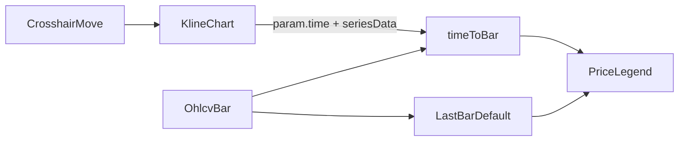

# Sprint6.1 迭代文档

> 状态：**进行中**  
> 关联：[启动摘要](./Sprint6.1启动文档.md)、[Sprint6 迭代文档](./Sprint6迭代文档.md)、[架构文档](../trading-zone-electron架构文档.md)、[开发计划](../../../.cursor/plans/sprint6.1_价格图例_f934e625.plan.md)

---

## 1. 当前迭代目标

在 Sprint6 已落地的日线主图上叠加十字光标价格图例：指向某根 K 线时显示该 bar 的日期、OHLC、涨跌、成交量与成交额；移出后回退到最新一根 K 线。

### 1.1 目标声明

| # | 目标 | 验收口径 |
|---|---|---|
| G1 | 光标指向有数据的 K 线 | 图例显示该 bar：日期、O/H/L/C、涨跌额与涨跌幅、VOL、AMT |
| G2 | 离开或落在无 bar 区域 | 图例回退到最新一根有效 K 线（`chosen \|\| default`） |
| G3 | 换股 / 换复权与手势 | 图例跟随新数据；不挡住缩放、平移、十字光标 |
| G4 | 数字与英文字体 | 图例 / 坐标轴数字与英文使用 lightweight-charts 默认字体栈；中文仍走系统黑体 |
| G5 | 复权选择器对齐行情页 | 从图表工具栏中部 Select 移除；右侧内容顶栏用与行情页相同的 `ToggleButtonGroup`（未/前/后复权） |

### 1.2 范围边界（本迭代不做）

- 指标叠加行、副图 pane、指标配置弹窗
- 股票分组、「加入分组」真逻辑
- 框选统计、画线、买卖点 / markers
- 改 IPC / Python / DuckDB / 行情日线表
- 搬整份参考项目 `ChartComponent` 或 `createPortal` 进内部 pane
- 新的 acceptance 脚本

### 1.3 技术选型（本迭代）

| 层 | 选型 |
|---|---|
| 壳 / 构建 | Electron + electron-vite（沿用） |
| UI | React；`lightweight-charts` v5 `subscribeCrosshairMove`；图例叠在 `KlineChart` 容器左上角 |
| 业务 | 已有 `market:query` 的 `OhlcvBar[]`；不新增 IPC |
| 数据 / 计算 | Renderer 内 `time → OhlcvBar` 查找；涨跌按收-开 |
| 协议 | 不新增 JSON Schema / Python 方法 |

### 1.4 已拍板结论

| # | 议题 | 结论 |
|---|---|---|
| 1 | 叠加方式 | 单 pane，不 portal 进库内部 DOM；包装层 `position: relative` + 图例 `absolute` |
| 2 | 默认 bar | 光标离开 / 无数据时展示映射后最后一根有效 K 线 |
| 3 | 涨跌口径 | 与参考项目主图第一行一致：`close - open`，不是昨收 `pct_chg` |
| 4 | 成交额 | Tushare `amount` 为千元；`amount / 100000` 后标「亿」 |
| 5 | 主题 | 适配当前浅色主图，不抄参考项目黑底 |
| 7 | 字体 | 数字与英文用库默认栈 `-apple-system, BlinkMacSystemFont, 'Trebuchet MS', Roboto, Ubuntu`（对齐参考项目 `--lwc-font-stack`）；中文回退 `Microsoft YaHei` / `PingFang SC`，不整站改成西文无衬线 |
| 8 | 复权控件 | 对齐行情页：名称 `flexGrow`，右侧 `ToggleButtonGroup`；加入分组 / 指标仍占位，不再夹在名称与复权之间 |

---

## 2. 功能需求

### 2.1 用户故事

1. 作为用户，移动十字光标时能看到当前 K 线的开高低收、涨跌、量和额，而不必对照坐标轴。
2. 作为用户，鼠标离开图表后，图例仍显示最新一根 K 线，方便看最近收盘。
3. 作为用户，换股或切换复权后，图例跟着新数据走。
4. 作为用户，图例不挡住拖拽缩放与十字光标。
5. 作为用户，图例与坐标轴上的数字、英文与 K 线轴标签是同一套字体，中文界面仍是黑体。
6. 作为用户，图表页切换复权的方式和位置与行情页一致，不会夹在股票名和占位按钮中间。

### 2.2 功能清单

| ID | 功能 | 优先级 | 状态 |
|---|---|---|---|
| F01 | `PriceLegend`：日期 / OHLC / 涨跌 / VOL / AMT，浅色叠加 | P0 | 已完成 |
| F02 | `subscribeCrosshairMove` 查 bar；无指向时回退最新一根 | P0 | 已完成 |
| F03 | 换股 / 换复权清空 hover，避免闪旧股数据 | P0 | 已完成 |
| F04 | `pointer-events: none`；卸载 `unsubscribeCrosshairMove` | P0 | 已完成 |
| F05 | 数字/英文字体对齐 lightweight-charts（中文保留系统黑体） | P0 | 已完成 |
| F06 | 复权改为行情页同款 `ToggleButtonGroup`，从工具栏中部移到右侧 | P0 | 已完成 |

### 2.3 非功能需求

- Renderer 不直连 DuckDB / SQLite / Python；不新增通道。
- 图例字段映射只在 Renderer。
- 十字光标高频移动时，同一根 K 线不重复 `setState`。
- 不抽行情/图表公共布局；不改 `ChartPage` 数据加载。

---

## 3. 详细设计说明

### 3.1 进程与数据流

本轮不改进程边界。日线仍由 `ChartPage` 经 `market.query` 取得 `OhlcvBar[]`，传入 `KlineChart`。



### 3.2 目录 / 模块（本迭代涉及）

```
src/renderer/src/theme/lwcFont.ts             # LWC / App 字体栈常量
src/renderer/src/main.tsx                     # MUI typography 用 APP_FONT_STACK
src/renderer/src/pages/chart/KlineChart.tsx   # 订阅十字光标、查 bar、包装层、layout.fontFamily
src/renderer/src/pages/chart/PriceLegend.tsx  # 新建：价格图例
src/renderer/src/pages/ChartPage.tsx          # 复权控件对齐行情页；不改数据加载
```

不改 `python/`、`contracts/`、`src/main/`、`src/shared/`。

### 3.3 数据模型 / 存储

无新表。图例消费已有 `OhlcvBar`：

| 图例 | 来源 / 规则 |
|---|---|
| 日期 | `yyyymmddToIso(trade_date)`，`YYYY-MM-DD` |
| O/H/L/C | `open` / `high` / `low` / `close`；OHLC 任一为空的 bar 不进图、不进图例 |
| 涨跌色 | `close - open` ≥ 0 用 `#ef5350`，否则 `#26a69a` |
| 涨跌额 / 幅 | `close - open`；`(close - open) / open`（open 为 0 则幅为 0） |
| VOL | `vol`，整数千分位 |
| AMT | `(amount ?? 0) / 100000`，两位小数 + `亿` |

`lightweight-charts` 的 Histogram 只有量，成交额必须回查原始 `OhlcvBar`。

### 3.4 协议 / API / IPC

不新增通道。沿用 `window.api.market.query` → `OhlcvBar[]`。

### 3.5 核心编排

1. `barsToChartData` 同一套过滤下维护 `time → OhlcvBar` 的 `Map`；默认 bar 为最后一根有效 K 线。
2. `createChart` 后 `chart.subscribeCrosshairMove`：有 `param.time` 且 `seriesData.get(candle)` 含 OHLC 则设 hover；否则清空 hover，由默认 bar 顶上。
3. `bars` 变化时清空 hover，避免换股闪旧数据。
4. 卸载：`unsubscribeCrosshairMove`，再 `chart.remove()`。

### 3.6 UI

```
KlineChart
  包装层 position:relative（100% 高）
    图表容器 createChart
    PriceLegend absolute 左上角 z-index 高、pointer-events:none
      日期 | O H L C | ±额 (±幅%) | VOL | AMT
```

- 浅色：半透明白底、约 12–14px；标签色偏灰，数值随涨跌着色。
- 数字与英文：`LWC_FONT_STACK`（与库坐标轴一致）；图例与 MUI 使用 `APP_FONT_STACK`，CJK 回退微软雅黑 / 苹方。
- 无有效 bar 时不渲染图例。
- 不包含参考项目第二行指标。
- 右侧内容顶栏对齐行情页：`名称 flexGrow` | 加入分组（占位） | 指标（占位） | `ToggleButtonGroup` 未/前/后复权。不再使用工具栏中部 `Select`。

### 3.7 契约

| 层级 | 位置 | 本轮 |
|---|---|---|
| JSON Schema | `contracts/` | 不改 |
| TypeScript | `src/shared/types/market.ts` | 不改 |
| Python | `python/worker/` | 不改 |

---

## 4. 任务步骤

| 步骤 | 任务 | 产出 | 状态 |
|---|---|---|---|
| 1 | 写启动摘要互链 + 迭代文档骨架 | `Sprint6.1/` | 已完成 |
| 2 | 新建 `PriceLegend` | `chart/PriceLegend.tsx` | 已完成 |
| 3 | `KlineChart` 订阅十字光标、查 bar、卸载取消 | `chart/KlineChart.tsx` | 已完成 |
| 4 | `typecheck` + 手工起窗验收 | 命令输出 / 目视 | 已完成 / 手工待补跑 |
| 5 | 数字/英文字体对齐 lightweight-charts | `theme/lwcFont.ts`、图例、坐标轴、MUI | 已完成 |
| 6 | 复权选择器对齐行情页 | `ChartPage.tsx` | 已完成 |
| 7 | 回填本文第 5 节（仅记真实结果） | 本节测试 | 已完成 |

### 4.1 本地复现命令

```bash
npm run typecheck
npm run dev
```

手工：图表页有日线时，移动十字光标看图例变化 → 移出回退最新一根 → 换股 / 换复权 → 确认不挡手势 → 对照坐标轴，数字/英文应为同一套字体，中文标题仍为黑体 → 对照行情页，复权为右侧三段按钮而非工具栏中部下拉。无新 `acceptance:s6.1`。

---

## 5. 测试结果 / 总结反馈

### 5.1 验收清单与结果

| 检查项 | 方式 | 结果 | 说明 |
|---|---|---|---|
| G1 光标指向 K 线 | 手工 | 待补跑 | `PriceLegend` + `subscribeCrosshairMove` 已落地；需起窗移动十字光标 |
| G2 离开回退最新一根 | 手工 | 待补跑 | 无 `param.time` / 无蜡烛数据时清空 hover，展示最后一根有效 K 线 |
| G3 换股 / 复权 / 不挡手势 | 手工 | 待补跑 | `bars` 引用变化时同步清空 hover；图例 `pointer-events: none` |
| G4 数字与英文字体 | 手工 | 待补跑 | 图例/轴为 Trebuchet 栈；中文标题等仍为黑体；需起窗对照坐标轴 |
| G5 复权对齐行情页 | 手工 | 待补跑 | 右侧顶栏 `ToggleButtonGroup`；切复权仍重拉日线；需起窗对照行情页 |
| `npm run typecheck` | 脚本 | 通过 | `typecheck:node` + `typecheck:web` 均通过 |

### 5.2 关键命令记录

```
npm run typecheck
# typecheck:node + typecheck:web 通过
```

### 5.3 总结反馈

**做得好的地方**

- 图例收在 `KlineChart` 内，未改 `ChartPage` 查询与 IPC。
- 用 `seriesData.get(candle)` 取 OHLC，成交额回查原始 bar，没有搬参考项目整份状态栏与 portal。
- 浅色叠加 + `pointer-events: none`，与当前白底主图一致。
- 数字/英文对齐库默认字体栈（参考 `--lwc-font-stack`），中文回退系统黑体，没有把整站改成西文无衬线。

**暴露的问题 / 摩擦**

- G1–G5 仍待起窗目视（光标跟踪、移出回退、换股/复权、手势、图例与坐标轴字体、复权控件是否与行情页一致）。
- 涨跌按收-开，与 Tushare `pct_chg`（相对昨收）可能不一致，见 6.1。
- 同一日期换股时若未先清空，理论上可能短暂串数据；本轮用 `bars` 引用变化在 render 期清 hover 规避。

---

## 6. 改进目标

### 6.1 短期（下一迭代可做）

1. 指标最小接入：先做 1～2 个主图叠加（如 MA），图例第二行显示当前值。
2. 图例涨跌可选「相对昨收」（`change` / `pct_chg`），与现有收-开并存或可切换。

### 6.2 中期

1. 股票分组与「加入分组」真逻辑。
2. 副图 pane（MACD / KDJ 等）与指标配置弹窗；副图用独立状态栏。
3. 抽行情/图表共用的两列壳与分隔条。

### 6.3 长期

1. Arrow Transfer 到 Renderer；图表视口直接消费列式窗口。
2. 画线、区间统计、策略买卖点。

---

## 附录

### A. 相关文档

- [`Sprint6.1启动文档.md`](./Sprint6.1启动文档.md)
- [`Sprint6迭代文档.md`](./Sprint6迭代文档.md)
- [架构文档](../trading-zone-electron架构文档.md)
- [开发计划](../../../.cursor/plans/sprint6.1_价格图例_f934e625.plan.md)
- 参考：`参考frontend/src/components/ChartComponent/StatusBar/mainChartStatusBar.tsx`

### B. 常用命令

| 命令 | 用途 |
|---|---|
| `npm run dev` | 开发起窗 |
| `npm run typecheck` | 类型检查 |
