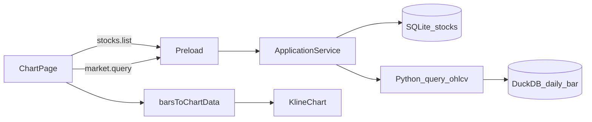

# Sprint6 迭代文档

> 状态：**进行中**  
> 关联：[启动摘要](./Sprint6启动文档.md)、[架构文档](../trading-zone-electron架构文档.md)、[Sprint5.1 迭代文档](../Sprint5/Sprint5.1迭代文档.md)、[开发计划](../../../.cursor/plans/sprint6_图表实现_95da7315.plan.md)

---

## 1. 当前迭代目标

侧栏进入新「图表」页，布局与行情页同构（左 `StockPicker` + 分隔条），右侧为工具栏占位 + 主图日线 K 线与成交量。数据层与 IPC 不改，复用 `stocks:list` 与 `market:query`。

### 1.1 目标声明

| # | 目标 | 验收口径 |
|---|---|---|
| G1 | 新入口与两列布局 | 侧栏增加「图表」；左列表 + 可拖拽分隔条 + 右内容；行情日线表不被替换 |
| G2 | 左列全量选股换图 | 数据源仍为 `stocks:list`；点选后右侧展示该股日线，不过滤跳股 |
| G3 | 工具栏 | 可见名称/code、复权、加入分组、指标；复权切换会重拉并重绘；后两项无对话框、无业务 |
| G4 | 主图 K 线 + 成交量 | 同 pane 蜡烛与成交量柱；未选/无数据有空态；窗口缩放图表跟着变 |

### 1.2 范围边界（本迭代不做）

- 指标计算、指标弹窗、副图 pane
- 股票分组、加入分组对话框
- 十字光标状态栏、框选统计、画线、买卖点 / markers
- 改行情页日线表（列、排序、分页属 Sprint5）
- 改同步协议、DuckDB schema、Python handler
- Arrow bytes 直传 Renderer、视口窗读
- 新的 acceptance 脚本、正式打包、嵌入式 Python

### 1.3 技术选型（本迭代）

| 层 | 选型 |
|---|---|
| 壳 / 构建 | Electron + electron-vite（沿用） |
| UI | React + MUI；`lightweight-charts` v5（`^5.1.0`，对齐参考项目）；复用 `StockPicker` |
| 业务 | 已有 `stocks:list`、`market:query`；不新增 ApplicationService 方法 |
| 数据 / 计算 | 不改 DuckDB / SQLite；OHLC 映射只在 Renderer |
| 协议 | 不新增 JSON Schema / Python 方法 |

### 1.4 已拍板结论

| # | 议题 | 结论 |
|---|---|---|
| 1 | 新页还是替换行情表 | 新页面 `chart`，行情页不动 |
| 2 | 复权 | 本轮接通 `none` / `qfq` / `hfq`，与行情页同一套 `market:query` |
| 3 | 加入分组 / 指标 | 仅占位（`disabled` 或空点击），无弹窗 |
| 4 | 成交量 | 与 K 线同一 pane；独立 `priceScaleId: 'volume'`；`scaleMargins` 把量压在底部 |
| 5 | 布局复用 | 先复制行情页分隔条，不抽公共 hook |
| 6 | 参考项目 | 不搬 `ChartComponent.tsx`（1600+ 行）；只取创建图 + `setData` |
| 7 | 图表手势 | 库默认缩放 / 平移 / 十字光标保留；工具栏后两项无业务 |

---

## 2. 功能需求

### 2.1 用户故事

1. 作为用户，我可以从侧栏进入图表页，而不是挤在行情日线表里。
2. 作为用户，左侧能用与行情页相同的全量列表选股，右侧看到该股日线。
3. 作为用户，图表上方能看到股票名称与代码，并能切换未/前/后复权。
4. 作为用户，能看到「加入分组」「指标」入口占位，知道后续会有这些能力。
5. 作为用户，主图能同时看到 K 线与成交量；尚未同步或无日线时有明确空态。
6. 作为用户，拉大或缩小窗口后，图表仍铺满右侧区域。

### 2.2 功能清单

| ID | 功能 | 优先级 | 状态 |
|---|---|---|---|
| F01 | 安装 `lightweight-charts`；`AppPage` 增加 `chart`；侧栏入口 | P0 | 已完成 |
| F02 | `ChartPage` 两列壳：复用 `StockPicker`、复制分隔条与空股票引导 | P0 | 已完成 |
| F03 | 工具栏：名称/code、复权 Select、加入分组、指标（后两项占位） | P0 | 已完成 |
| F04 | `KlineChart`：v5 `createChart` + 蜡烛 + 同 pane 成交量；ResizeObserver；卸载 `remove` | P0 | 已完成 |
| F05 | 接 `market.query`；换股 / 换复权 `setData`；日期与空 bar 映射 | P0 | 已完成 |
| F06 | 未选股票 / 无日线 / 加载中空态 | P0 | 已完成 |

### 2.3 非功能需求

- Renderer 不直连 DuckDB / SQLite / Python。
- 仍走现有 `bars[]` JSON；窗口从 `MARKET_SYNC_START` 起，日线量级可接受。
- 字段映射只在 Renderer：`pro.daily` 列名不改入库，图表要 `time` 时单独转换。
- v5 API：`chart.addSeries(CandlestickSeries, …)`，不用旧 `addCandlestickSeries`。
- 不抽 Market / Chart 公共布局组件。

---

## 3. 详细设计说明

### 3.1 进程与数据流



选股与覆盖摘要与行情页相同：`stocks.list` + 可选 `market.coverage`。日线经已有 `market:query` → Main 解码 Arrow → `OhlcvBar[]`。图表不新增协议。

### 3.2 目录 / 模块（本迭代涉及）

```
package.json
src/renderer/src/layout/AppShell.tsx
src/renderer/src/App.tsx
src/renderer/src/pages/ChartPage.tsx          # 新建
src/renderer/src/pages/chart/KlineChart.tsx   # 新建
src/renderer/src/pages/StockPicker.tsx        # 复用，不改 API
src/shared/constants/market.ts                # 复用 yyyymmddToIso / MARKET_SYNC_START
src/shared/types/market.ts                    # 复用 OhlcvBar / AdjustType
```

不改 `python/`、`contracts/`、`src/main/`。

### 3.3 数据模型 / 存储

无新表。消费已有：

- SQLite `stocks`：左侧列表
- DuckDB `daily_bar` + `adj_factor`：经 `data.query.ohlcv` 复权后的 `OhlcvBar`

Renderer 映射（过滤 OHLC 任一为空的 bar；`vol` 为空则成交量 `value` 为 0 或跳过该量柱，实现时取一种并保持 time 对齐）：

| 来源 | 图表 |
|---|---|
| `trade_date`（`YYYYMMDD`） | `time`（`YYYY-MM-DD`，`yyyymmddToIso`） |
| `open` / `high` / `low` / `close` | 蜡烛 |
| `vol` + 相对前收涨跌色 | `Histogram`（`priceScaleId: 'volume'`） |

### 3.4 协议 / API / IPC

不新增通道。沿用：

- `window.api.stocks.list()` → `Stock[]`
- `window.api.market.query({ ts_code, adjust, start_date, end_date })` → `MarketQueryResult`

`adjust` 取值与行情页一致：`none` | `qfq` | `hfq`（参考项目的 `standard` 对应本仓库 `none`）。

### 3.5 核心编排（ApplicationService 等）

本轮不改 ApplicationService。页面内编排：

1. 进入页：`stocks.list`（及 coverage 取 `max_date` 作查询截止日）。
2. 默认选中列表第一只（与行情页一致）。
3. `selectedCode` 或 `adjust` 变化：`market.query`，再 `barsToChartData` → `KlineChart` `setData`。
4. 关键字过滤不改 `selectedCode`。

### 3.6 UI

```
AppShell 侧栏: 配置 | 行情 | 图表
ChartPage
  顶栏: 「图表」+ 可选覆盖 Chip
  空股票: 引导去配置页
  有股票:
    左 StockPicker
    分隔条（复制 MarketPage，宽度 localStorage 可另 key）
    右 Paper
      工具栏: 名称/code | 复权 Select | 加入分组 | 指标
      主体: KlineChart | 未选/无数据/加载文案
```

工具栏顺序对齐参考项目 `frontend/src/views/Chart/index.tsx`。加入分组、指标：`disabled` 或空 `onClick`。

`KlineChart`：

- `createChart(container)`；`addSeries(CandlestickSeries)`；`addSeries(HistogramSeries, { priceScaleId: 'volume' })`
- K 线 `scaleMargins.bottom: 0.35`；成交量 `scaleMargins.top: 0.75`
- `ResizeObserver` 调 `chart.applyOptions({ width, height })` 或 `chart.resize`
- 卸载 `chart.remove()`
- 换股/换复权只 `setData`，不重建图（容器尺寸不变时）

空态：无股票 → 配置引导；未选 → 「请从左侧选择股票」；查询中可降低透明度或文案「加载中…」；有股无 bar → 「暂无日线数据」。

### 3.7 契约

| 层级 | 位置 | 本轮 |
|---|---|---|
| JSON Schema | `contracts/` | 不改 |
| TypeScript | `src/shared/types/market.ts` | 不改 |
| Python | `python/worker/` | 不改 |

图表字段与 `pro.daily` 不一致处只在 Renderer 做映射（Sprint5 已预留）。

---

## 4. 任务步骤

| 步骤 | 任务 | 产出 | 状态 |
|---|---|---|---|
| 1 | 写启动摘要 + 迭代文档并互链 | `Sprint6/` | 已完成 |
| 2 | 安装 `lightweight-charts`（`^5.1.0`） | `package.json` / lock | 已完成 |
| 3 | `AppPage` / 侧栏 / `App.tsx` 接入图表页 | `AppShell.tsx` / `App.tsx` | 已完成 |
| 4 | `ChartPage`：复制列表加载、分隔条、空态 | `ChartPage.tsx` | 已完成 |
| 5 | 工具栏占位；复权接通 | 工具栏 UI | 已完成 |
| 6 | `KlineChart`：创建/销毁、ResizeObserver、映射、`setData` | `chart/KlineChart.tsx` | 已完成 |
| 7 | `typecheck` + 手工起窗验收 | 命令输出 / 目视 | 已完成 / 手工待补跑 |
| 8 | 回填本文第 5 节（仅记真实结果） | 本节测试 | 已完成 |

### 4.1 本地复现命令

```bash
npm install
npm run typecheck
npm run dev
```

手工：配置页已有股票与日线时，侧栏进图表页 → 左列选股 → 看 K 线与成交量 → 切复权 → 拉窗口。无新 `acceptance:s6`。

---

## 5. 测试结果 / 总结反馈

### 5.1 验收清单与结果

| 检查项 | 方式 | 结果 | 说明 |
|---|---|---|---|
| G1 入口与两列布局 | 手工 | 待补跑 | 代码已落地：侧栏「图表」、`ChartPage` 两列 + 分隔条；需起窗目视 |
| G2 选股换图 | 手工 | 待补跑 | 复用 `StockPicker` + `market.query`；需起窗点选 |
| G3 工具栏与复权 | 手工 | 待补跑 | 名称/code、复权 Select 接通；加入分组 / 指标 `disabled` |
| G4 K 线 + 成交量 + resize | 手工 | 待补跑 | `KlineChart` 同 pane 蜡烛与成交量、`ResizeObserver`；需起窗拉窗口 |
| `npm run typecheck` | 脚本 | 通过 | `typecheck:node` + `typecheck:web` 均通过 |

### 5.2 关键命令记录

```
npm run typecheck
# typecheck:node + typecheck:web 通过
```

### 5.3 总结反馈

**做得好的地方**

- 新页接入，行情表未动；选股与查询复用现成 IPC。
- 图表只做 v5 主图 K 线 + 成交量，没有搬参考项目整份 `ChartComponent`。
- 工具栏后两项明确 `disabled`，复权本轮就接通。

**暴露的问题 / 摩擦**

- G1–G4 仍待起窗目视（选股、切复权、窗口缩放）。
- 行情页与图表页分隔条逻辑重复，未抽公共 hook（本轮有意为之）。
- 自定义 `priceScaleId: 'volume'` 在部分窗口尺寸下轴标签是否拥挤，需手工确认。

---

## 6. 改进目标

### 6.1 短期（下一迭代可做）

1. 十字光标状态栏（OHLC / 涨跌 / 量额，对齐参考项目 `mainChartStatusBar`）。
2. 指标最小接入：先做 1～2 个主图叠加（如 MA），再考虑副图。

### 6.2 中期

1. 股票分组与「加入分组」真逻辑。
2. 副图 pane（MACD / KDJ 等）与指标配置弹窗。
3. 抽行情/图表共用的两列壳与分隔条。

### 6.3 长期

1. Arrow Transfer 到 Renderer；图表视口直接消费列式窗口。
2. 画线、区间统计、策略买卖点。

---

## 附录

### A. 相关文档

- [`Sprint6启动文档.md`](./Sprint6启动文档.md)
- [架构文档](../trading-zone-electron架构文档.md)
- [`Sprint5.1迭代文档.md`](../Sprint5/Sprint5.1迭代文档.md)
- [开发计划](../../../.cursor/plans/sprint6_图表实现_95da7315.plan.md)
- 参考：`E:\Trading\back-trade-app-main\frontend\src\views\Chart\index.tsx`（工具栏）
- 参考：`E:\Trading\back-trade-app-main\frontend\src\components\ChartComponent\ChartComponent.tsx`（仅 `createBaseChart` / `applyKlineVolumeData`）

### B. 常用命令

| 命令 | 用途 |
|---|---|
| `npm run dev` | 开发起窗 |
| `npm run typecheck` | 类型检查 |
| `npm run acceptance:s3` | 查询 / 复权回归（本轮不改，作对照） |
