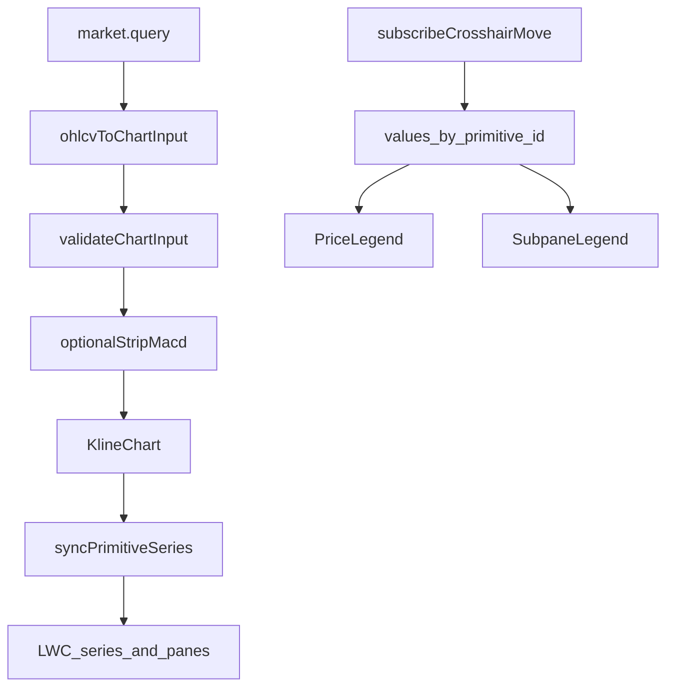

# Sprint7.1 迭代文档

> 状态：**进行中**
> 关联：[启动摘要](./Sprint7.1启动文档.md)、[Sprint7 迭代文档](./Sprint7迭代文档.md)、[Sprint7.2](./Sprint7.2迭代文档.md)、[架构文档](../trading-zone-electron架构文档.md)

---

## 1. 当前迭代目标

打通绘图通道按 `primitive.id` 增删 series 的 diff，以及十字光标读出全部图元数值并接上主图叠加行 / 副图读数条。不接 Python plot API，不接指标 CRUD。

### 1.1 目标声明

| # | 目标 | 验收口径 |
|---|---|---|
| G1 | 按 primitive id 增删 series | 关 MACD → 副图与 dif/dea/macd 消失；再开 → 恢复；换股仍不整表重建为空白 |
| G2 | 光标读出全部 `primitives[].id` | 指向某日可见主图第二行 MA20；副图条可见 DIF / DEA / MACD；离开回退最新有效值 |

### 1.2 范围边界（本迭代不做）

- Python `line` / `histogram` / `subplot` / `output`（→ Sprint7.2）
- 指标弹窗、布局实例 CRUD、脚本编辑器、`compute.indicator`
- 设置 / 删除 / 上下移按钮、`findTargetPaneTd` / `createPortal`
- Arrow 直传 Renderer、增量窗读、新的 acceptance 套件

### 1.3 技术选型（本迭代）

| 层 | 选型 |
|---|---|
| 壳 / 构建 | Electron + electron-vite（沿用） |
| UI | React；`lightweight-charts` v5 `addSeries` / `removeSeries` / `removePane` / `panes()[i].getHeight()` |
| 业务 | 已有 `market.query`；ChartPage「MACD」开关仅为通道验收夹具 |
| 数据 / 计算 | 仍用 Renderer 门外 `ohlcvToChartInput`；本轮不迁 Python |
| 协议 | 沿用 Sprint7 `ChartInput`；不改 Schema |

### 1.4 已拍板结论

| # | 议题 | 结论 |
|---|---|---|
| 1 | 图例视觉 | 沿用现有浅色 `PriceLegend`（半透明、左上、`pointer-events: none`、字体栈、OHLC 格式） |
| 2 | 信息结构 | 主图两行（OHLC + 主图 overlays）；每个副图一条读数；无工具按钮 |
| 3 | 挂载 | 叠在 `KlineChart` 外层容器；用 pane 高度累计 `top`；禁止 portal |
| 4 | 验收夹具 | ChartPage「MACD」显隐，滤掉 `pane === "macd"`；不做持久化 |
| 5 | 读数标签 | `id.toUpperCase()` / `pane.toUpperCase()`，通道不出现算法名 |

---

## 2. 功能需求

### 2.1 用户故事

1. 作为用户，关掉 MACD 后副图消失；再打开后副图与三根序列恢复。
2. 作为用户，换股或切复权后均线与 MACD 跟着变，图不会整表拆掉重建为空白。
3. 作为用户，十字光标移到某日时，主图第二行能看到 MA20，副图条能看到 DIF / DEA / MACD。
4. 作为用户，鼠标离开图表后，图例回退到各序列最新有效值。

### 2.2 功能清单

| ID | 功能 | 优先级 | 状态 |
|---|---|---|---|
| F01 | 按 primitive id 的 series diff + 空副 pane 清理 | P0 | 已完成 |
| F02 | ChartPage MACD 显隐验收开关 | P0 | 已完成 |
| F03 | 光标读出全部 `primitives[].id` | P0 | 已完成 |
| F04 | 主图例第二行 overlays | P0 | 已完成 |
| F05 | 副图例按 pane 定位（无 portal） | P0 | 已完成 |

### 2.3 非功能需求

- Renderer 不直连 DuckDB / SQLite / Python；不新增 IPC。
- `KlineChart` 仍只吃 `ChartInput`，不出现 `OhlcvBar` 或算法名。
- 图例不挡住缩放、平移、十字光标。
- 同一根 K 线不重复 `setState`。

---

## 3. 详细设计说明

### 3.1 进程与数据流

行情查询路径不变。本轮增量在 Renderer：门外仍编 `ChartInput`；页面可滤掉 MACD 副图后再交给通道；通道按 id diff series，光标吐出全 id 读数给图例。



### 3.2 目录 / 模块（本迭代涉及）

```
src/renderer/src/pages/chart/KlineChart.tsx
src/renderer/src/pages/chart/syncPrimitiveSeries.ts
src/renderer/src/pages/chart/PriceLegend.tsx
src/renderer/src/pages/chart/SubpaneLegend.tsx
src/renderer/src/pages/ChartPage.tsx
prompt/.../Sprint7/Sprint7.1启动文档.md
prompt/.../Sprint7/Sprint7.1迭代文档.md
```

### 3.3 数据模型 / 存储

无新表。验收开关不持久化。

### 3.4 协议 / API / IPC

不新增 Python 方法、不新增 Electron IPC。`ChartInput` 契约不改。

### 3.5 核心编排

1. `ChartPage`：选股 / 切复权 → `market.query` → `ohlcvToChartInput` → `validateChartInput`。
2. 关 MACD 时滤掉 `pane === "macd"` 的 primitives 与对应 `series` key。
3. `KlineChart` 对 `primitiveSeriesRef` 做 id diff：增 `addSeries`、删 `removeSeries`、共有 `setData`；空副 pane `removePane`。
4. 光标对每个 primitive series 读值；图例按 pane 分组展示。

### 3.6 UI

- 主图例：第 1 行日期 / OHLC / 涨跌 / VOL / AMT；第 2 行主图 overlays（如 `MA20`）。
- 副图例：每个 subplot 一条，标题为 pane 键大写，字段为各 `id` 大写着色读数。
- 工具栏「指标」仍占位；旁侧「MACD」Chip 为验收夹具。

### 3.7 契约

沿用 Sprint7：`contracts/chart_input.json`、`src/shared/types/chart.ts`。本轮不改 Schema。

---

## 4. 任务步骤

| 步骤 | 任务 | 产出 | 状态 |
|---|---|---|---|
| 1 | 启动摘要 + 迭代文档骨架 | `Sprint7.1启动文档.md`、`Sprint7.1迭代文档.md` | 已完成 |
| 2 | primitive series diff + 空 pane 清理 | `syncPrimitiveSeries.ts`、`KlineChart.tsx` | 已完成 |
| 3 | MACD 显隐夹具 | `ChartPage.tsx` | 已完成 |
| 4 | 光标全 id + 主/副图例 | `PriceLegend.tsx`、`SubpaneLegend.tsx` | 已完成 |
| 5 | typecheck + 手工验收 | 见第 5 节 | 进行中 |

### 4.1 本地复现命令

```bash
npm run typecheck
npm run dev
```

图表页选有日线的股票：主图第二行应有 MA20，下方 MACD 副图条可读。关掉 MACD 后副图消失，再开恢复。

---

## 5. 测试结果 / 总结反馈

### 5.1 验收清单与结果

| 检查项 | 方式 | 结果 | 说明 |
|---|---|---|---|
| G1 series diff | 手工 | 待补跑 | 需 `npm run dev` 开关 MACD Chip |
| G2 光标 / 图例 | 手工 | 待补跑 | 需起窗：主图第二行 MA20 + 副图 DIF/DEA/MACD |
| typecheck | `npm run typecheck` | 通过 | 2026-08-18 node + web 均通过 |

### 5.2 关键命令记录

```
npm run typecheck
> tsc --noEmit -p tsconfig.node.json --composite false
> tsc --noEmit -p tsconfig.web.json --composite false
（2026-08-18 通过）
```

### 5.3 总结反馈

**做得好的地方**

- 通道按 `primitive.id` 做 series lifecycle（增删 + 空副 pane 清理），为后续 CRUD 铺路。
- ChartPage「MACD」Chip 仅作验收夹具，不污染指标 CRUD 产品路径。
- 主图例两行 + 副图例按 `getHeight()` 定位，未 portal 进 LWC 内部 DOM。

**暴露的问题 / 摩擦**

- 图上可见性依赖手工起窗，本次未做 Electron 窗口验收。
- 副图例 `top` 依赖 resize / sync 后的 rAF 刷新，极端布局下可能需再对齐。
- MA / MACD 仍是 Renderer 临时计算，Python plot API 留给 Sprint7.2。

---

## 6. 改进目标

### 6.1 短期（下一迭代可做）

1. Python worker 提供 `line` / `histogram` / `subplot` / `output`，内置 MA / MACD 函数返回同一 `ChartInput`；去掉 Renderer 临时计算。→ **Sprint7.2 承接**

### 6.2 中期

1. 布局实例第一档 CRUD：工具栏指标 = 增删读内置 MA / MACD；验收夹具开关换成真 CRUD。
2. SQLite 持久化布局；改参数（周期 / 颜色）。

### 6.3 长期

1. 自定义脚本存储 + Renderer 编辑器（只编辑）+ 独立脚本子进程。
2. Arrow 数据面传输 `series`；窗读进 Renderer。

---

## 附录

### A. 相关文档

- [Sprint7.1 启动摘要](./Sprint7.1启动文档.md)
- [Sprint7 迭代文档](./Sprint7迭代文档.md)
- [Sprint7.2 迭代文档](./Sprint7.2迭代文档.md)
- [Sprint7 头脑风暴](./Sprint7头脑风暴文档.md)
- [架构文档](../trading-zone-electron架构文档.md)
- [Sprint6.1 迭代文档](../Sprint6/Sprint6.1迭代文档.md)

### B. 常用命令

| 命令 | 用途 |
|---|---|
| `npm run dev` | 开发起窗 |
| `npm run typecheck` | TS 检查 |
