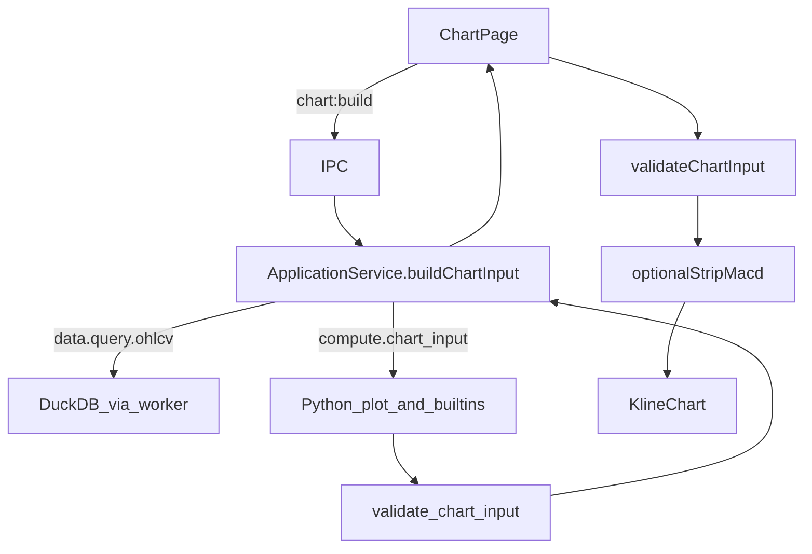

# Sprint7.2 迭代文档

> 状态：**进行中**
> 关联：[启动摘要](./Sprint7.2启动文档.md)、[Sprint7 迭代文档](./Sprint7迭代文档.md)、[Sprint7.1](./Sprint7.1迭代文档.md)、[架构文档](../trading-zone-electron架构文档.md)、[头脑风暴](./Sprint7头脑风暴文档.md)

---

## 1. 当前迭代目标

Python worker 提供 `line` / `histogram` / `subplot` / `output`，内置 MA / MACD 返回同一 `ChartInput`；ChartPage 经 Main 取数，去掉 Renderer 临时计算。

### 1.1 目标声明

| # | 目标 | 验收口径 |
|---|---|---|
| G1 | Python plot 方言 | `line` / `histogram` / `subplot` / `output` 能组装合法 `ChartInput`；语义校验挡主图 histogram |
| G2 | 内置 MA / MACD | 产出与原 `ohlcvToChartInput` 同 id / pane / 参数（20；12,26,9）/ 颜色；选股可见 |
| G3 | 去掉 Renderer 临时计算 | 删除 `ohlcvToChartInput.ts`；ChartPage 走 `chart:build` |

### 1.2 范围边界（本迭代不做）

- 布局实例 CRUD、工具栏真指标增删、指标弹窗
- `compute.indicator` 句柄 / 批处理 / 取消
- 自定义脚本 `exec`、编辑器、独立脚本子进程
- 改 `ChartInput` Schema 词汇；Arrow 传 `series`

### 1.3 技术选型（本迭代）

| 层 | 选型 |
|---|---|
| 壳 / 构建 | Electron + electron-vite（沿用） |
| UI | React；`KlineChart` 通道不改 |
| 业务 | `ApplicationService.buildChartInput` = `queryOhlcv` + `compute.chart_input`；IPC `chart:build` |
| 数据 / 计算 | Python plot 方言 + 内置 MA / MACD；MessagePack JSON 形状返回 `ChartInput` |
| 协议 | 沿用 `ChartInput` v1；新增 worker 方法 `compute.chart_input` |

### 1.4 已拍板结论

| # | 议题 | 结论 |
|---|---|---|
| 1 | Worker 方法 | `compute.chart_input`（薄同步）；不做架构里的 `compute.indicator` 句柄 |
| 2 | Main 编排 | 先 `queryOhlcv`，再把 `bars` 交给 worker |
| 3 | 内置产出 | candle + volume + `ma20` + macd 三根，对齐原 TS 临时生产者 |
| 4 | 校验 | Python 语义校验 + Renderer 防御性 `validateChartInput` |
| 5 | MACD 夹具 | ChartPage Chip + `stripMacdPane` 保留 |

---

## 2. 功能需求

### 2.1 用户故事

1. 作为用户，选中有日线的股票后，主图仍能看到 MA20，下方仍有 MACD 副图（计算已在 Python）。
2. 作为用户，关掉 MACD Chip 后副图消失，再开恢复（夹具行为不变）。
3. 作为开发者，内置指标与将来自定义脚本共用同一 plot API，出口都是 `ChartInput`。

### 2.2 功能清单

| ID | 功能 | 优先级 | 状态 |
|---|---|---|---|
| F01 | Python `line` / `histogram` / `subplot` / `output` + Pydantic / validate | P0 | 已完成 |
| F02 | 内置 MA / MACD / `default_chart` | P0 | 已完成 |
| F03 | Worker `compute.chart_input` + `PYTHON_METHODS` | P0 | 已完成 |
| F04 | `buildChartInput` + IPC `chart:build` + preload | P0 | 已完成 |
| F05 | ChartPage 换源；删除 `ohlcvToChartInput` | P0 | 已完成 |

### 2.3 非功能需求

- Renderer 不直连 DuckDB / Python；不在 `KlineChart` 内算指标。
- `KlineChart` 仍只吃 `ChartInput`，不出现算法名。
- 缺口省略点，禁止 NaN 进入 series。
- 本轮 `series` 走 MessagePack JSON，不做 Arrow 数据面。

---

## 3. 详细设计说明

### 3.1 进程与数据流



### 3.2 目录 / 模块（本迭代涉及）

```
python/worker/plot/                    # plot 方言 + 模型 + 校验
python/worker/indicators/              # ma / macd / default_chart
python/worker/handlers/compute_chart_input.py
python/scripts/smoke_chart_input.py
src/main/services/applicationService.ts
src/main/ipc/registerHandlers.ts
src/preload/index.ts / index.d.ts
src/shared/types/pythonProtocol.ts
src/renderer/src/pages/ChartPage.tsx
# 已删除 src/shared/chart/ohlcvToChartInput.ts
```

### 3.3 数据模型 / 存储

无新表。`ChartInput` 仍为内存契约形状。

### 3.4 协议 / API / IPC

| 层 | 名称 | 形状 |
|---|---|---|
| Worker | `compute.chart_input` | params: `{ bars: OhlcvBar[] }` → result: `ChartInput` |
| IPC | `chart:build` | 同 `MarketQueryParams` → `ChartInput \| null`（无 bar 时 null） |
| Preload | `api.chart.build` | 同上 |

### 3.5 核心编排

1. ChartPage：选股 / 切复权 → `chart.build({ ts_code, adjust, start_date, end_date })`。
2. Main：`queryOhlcv` → `pythonBridge.call('compute.chart_input', { bars })`。
3. Worker：`default_chart(bars)` → validate → 返回 dict。
4. ChartPage：`validateChartInput` → 可选剥 MACD → `KlineChart`。

### 3.6 UI

图表页壳不变。「MACD」Chip 仍为验收夹具。

### 3.7 契约

| 层级 | 位置 |
|---|---|
| JSON Schema | `contracts/chart_input.json`（可由 worker 产出） |
| TypeScript | `src/shared/types/chart.ts`、`validateChartInput.ts` |
| Python | `python/worker/plot/models.py`、`validate.py` |

---

## 4. 任务步骤

| 步骤 | 任务 | 产出 | 状态 |
|---|---|---|---|
| 1 | 启动摘要 + 迭代文档骨架 | `Sprint7.2启动文档.md`、`Sprint7.2迭代文档.md` | 已完成 |
| 2 | Python plot + models + validate | `python/worker/plot/` | 已完成 |
| 3 | 内置 MA / MACD / default_chart | `python/worker/indicators/` | 已完成 |
| 4 | `compute.chart_input` + PYTHON_METHODS | handler + `pythonProtocol.ts` | 已完成 |
| 5 | ApplicationService + IPC + preload | `chart:build` | 已完成 |
| 6 | ChartPage 换源；删除临时生产者 | `ChartPage.tsx`；删 `ohlcvToChartInput.ts` | 已完成 |
| 7 | smoke + typecheck + 手工验收 | 见第 5 节 | 进行中 |

### 4.1 本地复现命令

```bash
cd python && .venv\Scripts\python.exe scripts\smoke_chart_input.py
npm run typecheck
npm run dev
```

图表页选有日线的股票：主图 MA20 + 副图 MACD；关 Chip 副图消失。

---

## 5. 测试结果 / 总结反馈

### 5.1 验收清单与结果

| 检查项 | 方式 | 结果 | 说明 |
|---|---|---|---|
| G1 plot + validate | Python smoke | 通过 | 主图 histogram 被拒 |
| G2 内置对齐 | smoke 点数 / 结构 | 通过 | `times=40, ma=21, dif=15, dea=7, macd=7` |
| G3 无 Renderer 临时计算 | 代码 + typecheck | 通过 | 已删 `ohlcvToChartInput.ts`；`npm run typecheck` 通过 |
| 手工起窗 | `npm run dev` | 待补跑 | 需起窗选有日线的股票 |

### 5.2 关键命令记录

```
python\.venv\Scripts\python.exe python\scripts\smoke_chart_input.py
default_chart: times=40 ma=21 dif=15 dea=7 macd=7 panes=['macd', 'main']
validate rejects main histogram: ok
point counts aligned with Sprint7 TS fixture: ok

npm run typecheck
> tsc --noEmit -p tsconfig.node.json --composite false
> tsc --noEmit -p tsconfig.web.json --composite false
（2026-08-18 通过）
```

### 5.3 总结反馈

**做得好的地方**

- plot 方言与内置 MA / MACD 出口统一为 `ChartInput`，通道与算法彻底分离。
- 点数与 Sprint7 TS fixture 对齐，迁移可核对。
- 薄 `compute.chart_input` + `chart:build`，未提前做布局 CRUD / 句柄 API。

**暴露的问题 / 摩擦**

- 图上可见性仍依赖手工起窗。
- Chart 页每次选股会 `queryOhlcv` + `compute.chart_input` 两跳 worker；后续可合并或缓存。
- 系统 Python 无 pydantic 时 smoke 需用 `.venv` 解释器。

---

## 6. 改进目标

### 6.1 短期（下一迭代可做）

1. 布局实例第一档 CRUD：工具栏指标 = 增删读内置 MA / MACD；夹具开关换成真 CRUD。
2. ApplicationService 读布局 → 演进为 `compute.indicator`（可多指标合并）。

### 6.2 中期

1. SQLite 持久化布局；改参数（周期 / 颜色）。
2. 自定义脚本存储 + Renderer 编辑器（只编辑）+ 独立脚本子进程。

### 6.3 长期

1. Arrow 数据面传输 `series`；窗读进 Renderer。
2. `compute.indicator` 句柄 / 批处理 / 取消与缓存键。

---

## 附录

### A. 相关文档

- [Sprint7.2 启动摘要](./Sprint7.2启动文档.md)
- [Sprint7 迭代文档](./Sprint7迭代文档.md)
- [Sprint7.1 迭代文档](./Sprint7.1迭代文档.md)
- [Sprint7 头脑风暴](./Sprint7头脑风暴文档.md)
- [架构文档](../trading-zone-electron架构文档.md)

### B. 常用命令

| 命令 | 用途 |
|---|---|
| `npm run dev` | 开发起窗 |
| `npm run typecheck` | TS 检查 |
| `python\.venv\Scripts\python.exe python\scripts\smoke_chart_input.py` | ChartInput / plot smoke |
