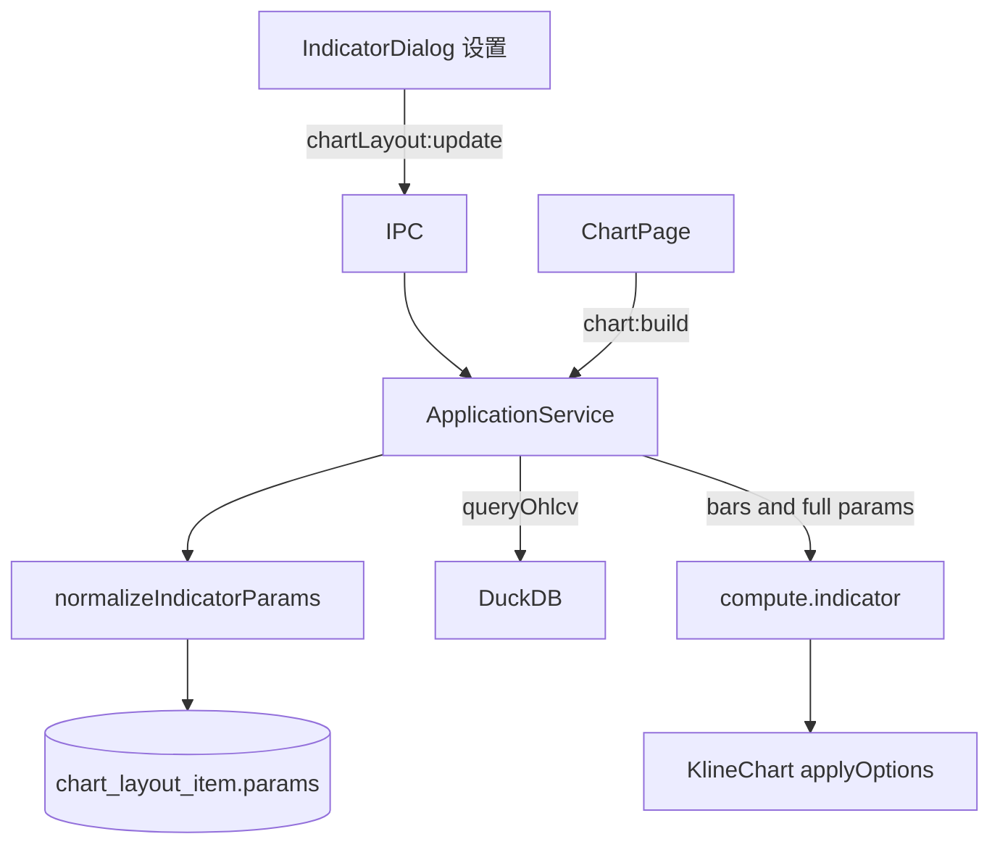

# Sprint8.1 迭代文档

> 状态：**进行中**
> 关联：[启动摘要](./Sprint8.1启动文档.md)、[Sprint8 迭代文档](./Sprint8迭代文档.md)、[Sprint8.2 迭代文档](./Sprint8.2迭代文档.md)、[架构文档](../trading-zone-electron架构文档.md)、开发计划 Cursor plan `sprint8.1_布局参数_f1ee2728`

---

## 1. 当前迭代目标

已挂的 MA / MACD 可改周期、颜色、线宽并写入布局；图画与图例跟着变，关掉再开仍是用户留下的参数。

### 1.1 目标声明

| # | 目标 | 验收口径 |
|---|---|---|
| G1 | 改算法参数并落库 | 已挂 MA/MACD 可改周期类参数；重启仍在；MA 周期变化后 primitive id 为 `ma{n}` |
| G2 | 颜色与线宽进 params | 经 `compute.indicator` 进 `ChartInput.style` / 柱逐根色；同 id 改色宽图上立刻变 |
| G3 | 弹窗「设置」 | 当前实例可打开表单保存；已挂项仍不能再加 |

### 1.2 范围边界（本迭代不做）

- 选股两跳 worker 合并或缓存
- 同种指标多条、多套布局、按股票记忆
- 目录表用户 CRUD、自定义脚本 `exec`、编辑器、独立脚本子进程
- `compute.indicator` 句柄 / 批处理 / 取消 / 缓存键
- 改 `ChartInput` Schema 词汇；Arrow 传 `series`

### 1.3 技术选型（本迭代）

| 层 | 选型 |
|---|---|
| 壳 / 构建 | Electron + electron-vite（沿用） |
| UI | React + MUI Dialog；MA / MACD 两套写死表单 |
| 业务 | SQLite `params` JSON 原地更新；读出时用目录默认补齐缺字段 |
| 数据 / 计算 | `compute.indicator` 消费完整 params；内置把色/宽交给 plot 方言 |
| 协议 | 沿用 `ChartInput` v1；IPC 新增 `chartLayout:update` |

### 1.4 已拍板结论

| # | 议题 | 结论 |
|---|---|---|
| 1 | 算法 vs 样式 | 混存在 `params` JSON，不另开 `style` 列 |
| 2 | MACD 样式范围 | 宽：DIF/DEA 色+宽，柱涨跌两色 |
| 3 | 旧数据 | 读出补目录默认；不强制 SQL 迁移 |
| 4 | 表单 | 按 builtin 写死；不做通用 schema 生成器 |
| 5 | 两跳 worker | 本轮不做 |

---

## 2. 功能需求

### 2.1 用户故事

1. 作为用户，我可以把均线从 20 改成 60，图上变成 MA60，重启后仍是 60。
2. 作为用户，我可以改均线颜色和线宽，同 id 时图与图例立刻变，不必删了重加。
3. 作为用户，我可以改 MACD 的快慢信号、DIF/DEA 色宽、柱涨跌两色。
4. 作为用户，已添加的指标仍然不能加第二次。

### 2.2 功能清单

| ID | 功能 | 优先级 | 状态 |
|---|---|---|---|
| F01 | 目录默认 params 含色/宽；TS 类型 + normalize/assert | P0 | 已完成 |
| F02 | repository `update`；读出补齐；IPC `chartLayout:update` | P0 | 已完成 |
| F03 | Python compose / ma / macd 消费样式字段 | P0 | 已完成 |
| F04 | 通道已有 line series `applyOptions` | P0 | 已完成 |
| F05 | IndicatorDialog「设置」表单；ChartPage 重载图 | P0 | 已完成 |

### 2.3 非功能需求

- Renderer 不直连 SQLite / Python；不传 instances；`chart:build` 仍由 Main 读库。
- 写入必须满字段，禁止存 `{}` 或部分对象。
- 旧库行只有算法字段时读出补齐，不改表结构。

---

## 3. 详细设计说明

### 3.1 进程与数据流



### 3.2 目录 / 模块（本迭代涉及）

```
contracts/indicator_catalog.json
src/shared/chart/indicatorCatalog.ts
src/shared/types/chartLayout.ts
src/main/db/chartLayoutRepository.ts
src/main/services/applicationService.ts
src/main/ipc/registerHandlers.ts
src/preload/index.ts
src/preload/index.d.ts
python/worker/indicators/compose.py
python/worker/indicators/ma.py
python/worker/indicators/macd.py
python/scripts/smoke_chart_input.py
src/renderer/src/pages/chart/syncPrimitiveSeries.ts
src/renderer/src/pages/chart/IndicatorDialog.tsx
src/renderer/src/pages/ChartPage.tsx
```

### 3.3 数据模型 / 存储

- 表结构不变：`chart_layout_item.params` 仍为 JSON 文本。
- MA：`{ period, color, lineWidth }`，默认 `20` / `#2962FF` / `2`。
- MACD：`{ fast, slow, signal, difColor, deaColor, difLineWidth, deaLineWidth, histUpColor, histDownColor }`，默认 `12/26/9`，DIF `#f5a623` 宽 1，DEA `#4a90d9` 宽 1，柱涨 `#ef5350`、跌 `#26a69a`。
- 校验：周期类 `>=1` 整数；`lineWidth` 为 1–4；颜色非空字符串。

### 3.4 协议 / API / IPC

| 层 | 名称 | 形状 |
|---|---|---|
| 布局 | `chartLayout:update` | `{ id, params }` → `ChartLayout` |
| 布局 | `chartLayout:get` / `add` / `remove` | 返回的 item.params 已补齐 |
| Worker | `compute.indicator` | `{ bars, instances: [{ builtin, params }] }`；params 含样式字段（缺则 Python 用默认） |

### 3.5 核心编排

1. 读布局：parse JSON → `normalizeIndicatorParams`（目录默认补缺）→ 返回完整 params。
2. 设置：校验满字段 → `UPDATE params` → 返回布局。
3. 选股：`queryOhlcv` → 读 item（已 normalize）→ `compute.indicator`。
4. 通道：已有 line series 在 `setData` 前 `applyOptions({ color, lineWidth })`；MA 改周期靠 primitive id diff 卸旧加新。

### 3.6 UI

图表工具栏「指标」弹窗：当前实例除删除外增加「设置」。按 builtin 打开 MA 或 MACD 表单。可添加列表行为不变（已挂禁用）。

### 3.7 契约

| 层级 | 位置 |
|---|---|
| JSON | `contracts/indicator_catalog.json`（默认 params 扩字段）；`contracts/chart_input.json` 不变 |
| TypeScript | `indicatorCatalog.ts`、`chartLayout.ts` |
| Python | `compose.py`、`ma.py`、`macd.py` |

---

## 4. 任务步骤

| 步骤 | 任务 | 产出 | 状态 |
|---|---|---|---|
| 1 | 启动摘要 + 迭代文档骨架 | `Sprint8.1启动文档.md`、`Sprint8.1迭代文档.md` | 已完成 |
| 2 | 目录默认 + TS 类型 + normalize/assert | catalog / `chartLayout.ts` | 已完成 |
| 3 | repository update + IPC + ApplicationService | `chartLayout:update` | 已完成 |
| 4 | Python 消费样式；smoke 自定义色宽 | compose / ma / macd / smoke | 已完成 |
| 5 | 通道已有 line `applyOptions` | `syncPrimitiveSeries.ts` | 已完成 |
| 6 | 弹窗设置表单；ChartPage 接 update | `IndicatorDialog.tsx` | 已完成 |
| 7 | smoke + typecheck + 手工验收 | 见第 5 节 | 进行中 |

### 4.1 本地复现命令

```bash
python\.venv\Scripts\python.exe python\scripts\smoke_chart_input.py
npm run typecheck
npm run dev
```

图表页：改 MA 周期/色/宽后图与图例变，重启仍在；改 MACD 五色两宽后 DIF/DEA/柱跟着变。

---

## 5. 测试结果 / 总结反馈

### 5.1 验收清单与结果

| 检查项 | 方式 | 结果 | 说明 |
|---|---|---|---|
| G2 compose 自定义色宽 + 非法 lineWidth | Python smoke | 通过 | MA `#112233`/宽 3/`ma10`；MACD DIF/DEA 色宽与柱色；lineWidth=5 拒绝 |
| G1 点数对齐仍保持 | smoke n=40 | 通过 | 默认 params：ma=21, dif=15, dea=7, macd=7 |
| typecheck | `npm run typecheck` | 通过 | node + web（2026-08-19） |
| G1/G2/G3 手工起窗 | `npm run dev` | 待补跑 | 改 MA 周期/色/宽；改 MACD 五色两宽；重启仍在 |

### 5.2 关键命令记录

```
python\.venv\Scripts\python.exe python\scripts\smoke_chart_input.py
compose ma+macd: times=40 ma=21 dif=15 dea=7 macd=7 panes=['macd', 'main']
point counts aligned with Sprint7 TS fixture: ok
compose ma only: ok
compose macd only: ok
compose empty: ok
indicator_ma fragment: ok
validate rejects main histogram: ok
unknown builtin: ok (unknown builtin rsi)
duplicate builtin: ok (duplicate builtin ma)
missing ma params: ok (period Field required)
ma lineWidth: ok (lineWidth Input should be less than or equal to 4)
compose ma custom style: ok
compose macd custom style: ok

npm run typecheck
> tsc --noEmit -p tsconfig.node.json --composite false
> tsc --noEmit -p tsconfig.web.json --composite false
（2026-08-19 通过）
```

### 5.3 总结反馈

**做得好的地方**

- 样式进现有 `params` JSON，表结构不用迁；旧行读出时用目录默认补齐。
- Python 样式字段带默认，旧 smoke `{period:20}` 仍过；通道对已有 line 补 `applyOptions`，同 id 改色宽不必卸线。
- 弹窗按 builtin 写死两套表单，MACD 宽样式（DIF/DEA 色宽 + 柱涨跌两色）一次做完。

**暴露的问题 / 摩擦**

- 图上可见性仍依赖手工起窗（改周期后 id `ma{n}`、同 id 改色宽、重启持久化）。
- 选股仍是 `queryOhlcv` + `compute.indicator` 两跳 worker。
- 数字输入框可被清空成 `NaN`，保存时由 Main assert 拒绝，表单侧无即时校验提示。

---

## 6. 改进目标

### 6.1 短期（下一迭代可做）

1. 选股两跳 worker 合并或缓存——已承接 [Sprint8.2](./Sprint8.2迭代文档.md)（拍板：合并图表路径，本轮不做缓存）。

### 6.2 中期

1. 允许多条同种指标（实例 id 与 catalog key 分离；primitive id 带实例前缀）。
2. 自定义脚本存储 + Renderer 编辑器（只编辑）+ 独立脚本子进程。

### 6.3 长期

1. Arrow 数据面传输 `series`；窗读进 Renderer。
2. `compute.indicator` 句柄 / 批处理 / 取消与缓存键。

---

## 附录

### A. 相关文档

- [Sprint8.1 启动摘要](./Sprint8.1启动文档.md)
- [Sprint8.2 迭代文档](./Sprint8.2迭代文档.md)
- [Sprint8 迭代文档](./Sprint8迭代文档.md)
- [架构文档](../trading-zone-electron架构文档.md)

### B. 常用命令

| 命令 | 用途 |
|---|---|
| `npm run dev` | 开发起窗 |
| `npm run typecheck` | TS 检查 |
| `python\.venv\Scripts\python.exe python\scripts\smoke_chart_input.py` | compose / ChartInput smoke |
