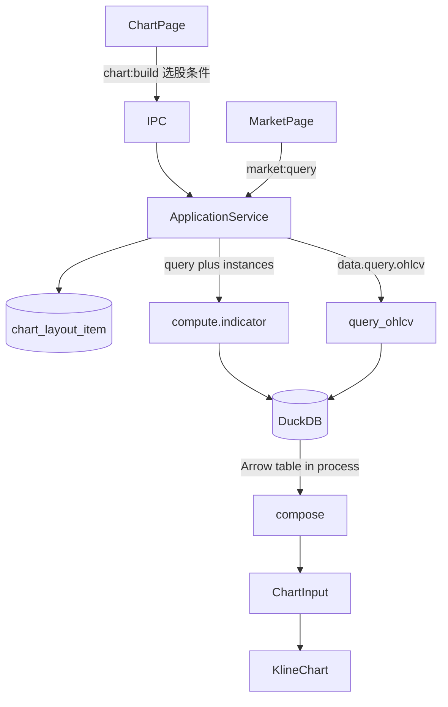

# Sprint8.2 迭代文档

> 状态：**进行中**
> 关联：[启动摘要](./Sprint8.2启动文档.md)、[Sprint8.1 迭代文档](./Sprint8.1迭代文档.md)、[Sprint8 迭代文档](./Sprint8迭代文档.md)、[Sprint8.3 迭代文档](./Sprint8.3迭代文档.md)、[架构文档](../trading-zone-electron架构文档.md)

---

## 1. 当前迭代目标

选股建图只打一枪 Python：Main 读布局后把查询条件交给 `compute.indicator`，worker 内查 DuckDB 再 compose；OHLCV 行不再往返 Main。

### 1.1 目标声明

| # | 目标 | 验收口径 |
|---|---|---|
| G1 | 选股一跳 | `buildChartInput` 只一次 `pythonBridge.call`；请求体无 `bars[]` |
| G2 | 行情表不动 | `market:query` 仍 `data.query.ohlcv`；Sprint3/4 验收语义不变 |
| G3 | 出口与空窗不变 | 无 bar → `null`；有 bar → 与 8.1 同布局同 `ChartInput`；instances 仍 Main 读库 |

### 1.2 范围边界（本迭代不做）

- Main / Python 缓存 bars 或 `ChartInput`；缓存键与失效
- `compute.indicator` 句柄 / 批处理 / 取消
- 同种指标多条、多套布局、按股票记忆
- 自定义脚本、编辑器、改 `ChartInput` Schema、Arrow 传 `series`

### 1.3 技术选型（本迭代）

| 层 | 选型 |
|---|---|
| 壳 / 构建 | Electron + electron-vite（沿用） |
| UI | 不改 ChartPage / 行情表 |
| 业务 | `buildChartInput` 读 SQLite 布局后单次调用 worker |
| 数据 / 计算 | `compute.indicator` 内调 `query_ohlcv_arrow`，表转行后 `compose` |
| 协议 | 生产入参 `query + instances`；兼容 `bars + instances`（smoke） |

### 1.4 已拍板结论

| # | 议题 | 结论 |
|---|---|---|
| 1 | 合并 vs 缓存 | **合并图表路径**。选股必 miss 缓存；浪费在 Arrow↔JSON 过桥 |
| 2 | 是否删 `query.ohlcv` | **不删**。行情表与验收仍用 |
| 3 | 谁读布局 | **仍 Main**。Python 不碰 SQLite 布局 |
| 4 | 入参形状 | XOR：`query` 或 `bars`，必具其一；`instances` 必有 |
| 5 | 布局变更是否再查库 | 本轮允许。DuckDB 窗读便宜；过桥才贵 |

### 1.5 方案对比（合并 vs 缓存）

现状每次 `chart:build`：

```text
DuckDB 窗读 → Arrow IPC 出 Python → Main 解码 bars[] → MessagePack JSON bars 回 Python → compose
```

DuckDB 与 MA/MACD 都便宜。贵的是同一份窗口编码两次过桥。Worker 单进程 stdin 串行，两跳还有两次帧开销。

**选股**（换代码 / 复权 / 日期）是热路径，窗口每次都新，bars 缓存必 miss。**改布局**（增删改参数）较少，且必须重算指标。

| | 合并（本轮） | 缓存 bars / ChartInput |
|---|---|---|
| 换股 | 一跳；bars 不出 Python | miss，两跳和过桥都在 |
| 改布局同股 | 一跳（可再查 DuckDB） | 可省查询跳，仍要把 bars JSON 送给 compute |
| 行情表 | 不改 `query.ohlcv` | 可与图表共享 Main 缓存，但图表热路径无收益 |
| 复杂度 | handler XOR 入参 | 键、失效、与 `market:query` 交错 |
| 与长期句柄 | 不抢缓存键设计 | 容易做成以后要拆的临时缓存 |
| 分层 | Data / Compute 方法仍分开；图表编排少一跳 | 方法边界好看，过桥浪费还在 |

不选缓存的原因：架构文档里的缓存键挂在句柄 / batch / cancel 上，8.1 已划到长期。本轮若先做 Main 内存缓存，换股无收益，还把 JSON OHLCV 留在 Main，和「勿经 IPC 塞全量 OHLCV JSON」相反。

合并后图表路径不再把 `bars[]` 塞进控制面；`query.ohlcv` 仍给行情表。这是局部合并编排，不是把 Data 接口删掉。

---

## 2. 功能需求

### 2.1 用户故事

1. 作为用户，我换股票或复权时图表仍一次出 K 线与指标，观感与 8.1 相同，只是少一次 worker 往返。
2. 作为用户，行情表查 OHLCV 行为不变。
3. 作为用户，改均线周期后图仍按新 params 重画（允许再查一次行情窗口）。

### 2.2 功能清单

| ID | 功能 | 优先级 | 状态 |
|---|---|---|---|
| F01 | `compute.indicator` 接受 `query` 或 `bars` | P0 | 已完成 |
| F02 | worker 内 Arrow 表转行后 `compose` | P0 | 已完成 |
| F03 | `buildChartInput` 单次 call，不传 `bars` | P0 | 已完成 |
| F04 | `data.query.ohlcv` / `market:query` 保持 | P0 | 已完成 |
| F05 | smoke：bars 入参仍过；XOR 拒绝都无/都有 | P0 | 已完成 |

### 2.3 非功能需求

- Renderer 不直连 SQLite / Python；不传 instances。
- 生产路径请求体禁止带 `bars[]`。
- 无行时 Main 仍返回 `null`，不把空窗交给 compose（compose 要求 `min_length=1`）。

---

## 3. 详细设计说明

### 3.1 进程与数据流



选股：Main 只传查询条件 + 布局实例。bars 留在 worker。  
行情表：仍 Arrow IPC 回 Main 解码，与本迭代无关。

### 3.2 目录 / 模块（本迭代涉及）

```
python/worker/handlers/compute_indicator.py
src/main/services/applicationService.ts
src/shared/types/pythonProtocol.ts
python/scripts/smoke_chart_input.py
```

复用 `market_db.query_ohlcv_arrow` + `table.to_pylist()`，未加新辅助函数。

不改：`ChartPage`、`IndicatorDialog`、`contracts/chart_input.json`、布局表、目录 JSON。

### 3.3 数据模型 / 存储

无新表。DuckDB / SQLite 布局语义不变。

### 3.4 协议 / API / IPC

| 层 | 名称 | 形状 |
|---|---|---|
| IPC | `chart:build` | 仍 `MarketQueryParams` → `ChartInput \| null` |
| IPC | `market:query` | 不变 |
| Worker | `compute.indicator` | `{ instances, query? , bars? }`；`query` 与 `bars` 二选一 |
| Worker | `data.query.ohlcv` | 不变 |

`query` 字段与 `MarketQueryParams` 对齐：`ts_code`、`start_date`、`end_date`、`adjust`、可选 `limit`。

### 3.5 核心编排

1. `buildChartInput`：组 query payload（与 `queryOhlcv` 相同的日期/复权默认）；校验 `ts_code`。
2. `chartLayoutRepository.get()` → `instances`（已 normalize 的 params）。
3. 一次 `compute.indicator({ query, instances })`，请求体无 `bars[]`。
4. worker：窗读；`num_rows == 0` 则 `ok: true`、`result: null`；Main 原样返回 `null`。
5. 有行：`table.to_pylist()` → 现有 `compose` → `ChartInput`。

空窗约定：**worker 回 `null`（非异常、非 `{ empty: true }`）**。不在 Main 先查行数。

### 3.6 UI

无。换股 / 改布局仍走现有 `chart:build`。

### 3.7 契约

| 层级 | 位置 |
|---|---|
| JSON | `contracts/chart_input.json` 不变 |
| TypeScript | `pythonProtocol.ts` 的 `ComputeIndicatorParams`；`applicationService.ts` |
| Python | `ComputeIndicatorParams` XOR；`compose.py` 不改算法 |

---

## 4. 任务步骤

| 步骤 | 任务 | 产出 | 状态 |
|---|---|---|---|
| 1 | 启动摘要 + 迭代文档骨架 | 本文件与启动摘要 | 已完成 |
| 2 | `compute.indicator` XOR 入参 + 表转行 | `compute_indicator.py` | 已完成 |
| 3 | `buildChartInput` 单次 call | `applicationService.ts` | 已完成 |
| 4 | smoke / typecheck；空窗约定 | 脚本 + 第 5 节 | 已完成 |
| 5 | 手工：换股一跳观感；行情表仍可查 | `npm run dev` | 待补跑 |

### 4.1 本地复现命令

```bash
python\.venv\Scripts\python.exe python\scripts\smoke_chart_input.py
npm run typecheck
npm run dev
```

图表页换股仍出 MA/MACD；行情表查询仍有行。

---

## 5. 测试结果 / 总结反馈

### 5.1 验收清单与结果

| 检查项 | 方式 | 结果 | 说明 |
|---|---|---|---|
| G1 单次 call、无 bars 过桥 | 代码审 | 通过 | `buildChartInput` 只 `compute.indicator({ query, instances })` |
| G2 market:query 仍 query.ohlcv | 代码审 | 通过 | `queryOhlcv` 未改 |
| G3 handler bars 路径 + XOR | Python smoke | 通过 | bars 合成 ma+macd；都无/都有拒绝 |
| G3 空窗 null | 代码审 | 通过 | `num_rows == 0` → `return None` |
| typecheck | `npm run typecheck` | 通过 | node + web（2026-08-19） |
| G1/G2 手工起窗 | `npm run dev` | 待补跑 | 换股仍出 MA/MACD；行情表仍可查 |

### 5.2 关键命令记录

```
python\.venv\Scripts\python.exe python\scripts\smoke_chart_input.py
compose ma+macd: times=40 ma=21 dif=15 dea=7 macd=7 panes=['macd', 'main']
point counts aligned with Sprint7 TS fixture: ok
compose ma only: ok
compose macd only: ok
compose empty: ok
indicator_ma fragment: ok
validate rejects main histogram: ok
unknown builtin: ok (unknown builtin rsi)
duplicate builtin: ok (duplicate builtin ma)
missing ma params: ok (period Field required)
ma lineWidth: ok (lineWidth Input should be less than or equal to 4)
compose ma custom style: ok
compose macd custom style: ok
compute.indicator bars path: ok
neither bars nor query: ok (exactly one of bars or query is required)
both bars and query: ok (exactly one of bars or query is required)

npm run typecheck
> tsc --noEmit -p tsconfig.node.json --composite false
> tsc --noEmit -p tsconfig.web.json --composite false
（2026-08-19 通过）
```

### 5.3 总结反馈

**做得好的地方**

- 图表热路径 bars 不再过桥；行情表仍走 Arrow IPC，Data / Compute 方法没有捏成一个。
- XOR 入参让 smoke 继续喂合成 bars，不必为 handler 起 DuckDB。
- 空窗用 `ok: true, result: null`，复用 pythonBridge 已有语义，ChartPage 仍吃 `null`。

**暴露的问题 / 摩擦**

- query 空窗与「换股后图仍对」依赖手工起窗，smoke 未接 DuckDB fixture。
- 改布局仍会再查一次 DuckDB（本轮允许）。

---

## 6. 改进目标

### 6.1 短期（下一迭代可做）

1. 同种指标多条（实例 id 与 catalog key 分离；primitive id 带实例前缀）→ [Sprint8.3](./Sprint8.3迭代文档.md)。

### 6.2 中期

1. 自定义脚本存储 + Renderer 编辑器（只编辑）+ 独立脚本子进程。
2. 改布局时 Python 侧按 query 键复用最近窗口（真缓存，挂在 worker 内，不回 Main）。

### 6.3 长期

1. Arrow 数据面传输 `series`；窗读进 Renderer。
2. `compute.indicator` 句柄 / 批处理 / 取消与缓存键。

---

## 附录

### A. 相关文档

- [Sprint8.2 启动摘要](./Sprint8.2启动文档.md)
- [Sprint8.1 迭代文档](./Sprint8.1迭代文档.md)
- [Sprint8 迭代文档](./Sprint8迭代文档.md)
- [Sprint8.3 迭代文档](./Sprint8.3迭代文档.md)
- [中期架构梳理草稿](./中期架构梳理草稿.md)
- [架构文档](../trading-zone-electron架构文档.md)

### B. 常用命令

| 命令 | 用途 |
|---|---|
| `npm run dev` | 开发起窗 |
| `npm run typecheck` | TS 检查 |
| `python\.venv\Scripts\python.exe python\scripts\smoke_chart_input.py` | compose / ChartInput smoke |
