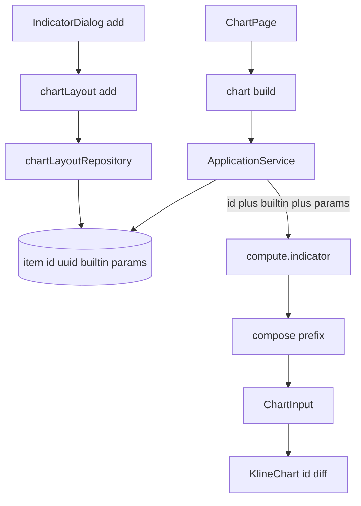

# Sprint8.3 迭代文档

> 状态：**进行中**
> 关联：[启动摘要](./Sprint8.3启动文档.md)、[Sprint8.2 迭代文档](./Sprint8.2迭代文档.md)、[架构文档](../trading-zone-electron架构文档.md)

---

## 1. 当前迭代目标

同一张图可挂多条同种内置指标：布局实例 id 与 catalog key 分离，compose 给 primitive / 副图 pane 加实例前缀。

### 1.1 目标声明


| #   | 目标     | 验收口径                                                  |
| --- | ------ | ----------------------------------------------------- |
| G1  | 同种可多条  | 弹窗可连续加两条 MA / 两条 MACD；库无 `UNIQUE(layout_id, builtin)` |
| G2  | 图元不撞   | 两条 MACD 分属两个 pane；id 为 `{id}:dif` 等；删一条只带走该前缀         |
| G3  | 旧布局仍能画 | 已有 `id=ma|macd` 的行照常 compose（前缀后为 `ma:ma`、`macd:dif`） |


### 1.2 范围边界（本迭代不做）

- 多套命名布局、按股票记忆
- 图例改显示 localName / 参数（仍 `primitive.id.toUpperCase()`）
- 自定义脚本、编辑器、改 `ChartInput` Schema、Arrow 传 `series`
- `compute.indicator` 句柄 / 批处理 / 取消 / 缓存键


### 1.3 技术选型（本迭代）


| 层       | 选型                                                        |
| ------- | --------------------------------------------------------- |
| 壳 / 构建  | Electron + electron-vite（沿用）                              |
| UI      | IndicatorDialog 取消「已添加」禁用；通道按 id diff 不改词汇                |
| 业务      | `add` 生成去横线 uuid；`buildChartInput` 过桥带 `id`               |
| 数据 / 计算 | compose 统一加前缀；内置仍吐短名                                      |
| 协议      | `instances: [{ id, builtin, params }]`；`ChartInput` v1 不变 |


### 1.4 已拍板结论2


| #   | 议题               | 结论                                                    |
| --- | ---------------- | ----------------------------------------------------- |
| 1   | 实例 id            | 新加 `randomUUID()` 去横线；种子 `ma` / `macd` 不改写            |
| 2   | 去重键              | compose / 库都按实例 id；`builtin` 允许重复                     |
| 3   | primitive / pane | `{instanceId}:{localName}`；副图 pane = 实例 id；主图仍 `main` |
| 4   | MA 短名            | 固定 `ma`，周期不进 id                                       |
| 5   | 图例               | 本轮不美化                                                 |


---


## 2. 功能需求


### 2.1 用户故事

1. 作为用户，我可以在同一张图上加 MA5 和 MA20 两条均线。
2. 作为用户，我可以加两套不同参数的 MACD，分别画在两个副图上。
3. 作为用户，我删除其中一条时，另一条的线 / 副图仍在。
4. 作为用户，升级前已经挂着的 MA / MACD 仍能画出（图元 id 变为带前缀）。


### 2.2 功能清单


| ID  | 功能                                     | 优先级 | 状态  |
| --- | -------------------------------------- | --- | --- |
| F01 | 去掉 `UNIQUE(layout_id, builtin)`（含旧库重建） | P0  | 已完成 |
| F02 | `add` 生成 uuid；过桥带 `id`                 | P0  | 已完成 |
| F03 | compose 按实例 id 去重并加前缀；MA 短名 `ma`       | P0  | 已完成 |
| F04 | 弹窗允许重复添加同种指标                           | P0  | 已完成 |
| F05 | smoke：双 MA / 双 MACD；duplicate id 失败    | P0  | 已完成 |


### 2.3 非功能需求

- Renderer 不直连 SQLite / Python；不传 instances；`chart:build` 仍由 Main 读库。
- `ChartInput` Schema 词汇不变；通道仍只认 `primitive.id`。
- 旧库启动时迁移，不要求用户清库。

---


## 3. 详细设计说明


### 3.1 进程与数据流




选股路径仍是 8.2 的一跳 `query + instances`；本轮只给 instances 补 `id`，并改 compose 出口的 primitive / pane。

### 3.2 目录 / 模块（本迭代涉及）

```
src/main/db/sqlite.ts
src/main/db/chartLayoutRepository.ts
src/main/services/applicationService.ts
src/shared/types/chartLayout.ts
src/shared/types/pythonProtocol.ts
src/renderer/src/pages/chart/IndicatorDialog.tsx
python/worker/handlers/compute_indicator.py
python/worker/indicators/compose.py
python/worker/indicators/ma.py
python/scripts/smoke_chart_input.py
```

不改：`contracts/chart_input.json`、`KlineChart` / `syncPrimitiveSeries` 词汇、行情表路径。

### 3.3 数据模型 / 存储

`chart_layout_item`：去掉 `UNIQUE(layout_id, builtin)`；`id` 仍 PRIMARY KEY。

- 新库：建表时即无该 UNIQUE。
- 旧库：`CREATE TABLE IF NOT EXISTS` 不会改结构；启动检测 `sqlite_master` SQL 含该 UNIQUE 则重建表拷数据。

种子仍 `id = ma | macd`。新加行 `id = randomUUID().replaceAll('-', '')`。

### 3.4 协议 / API / IPC


| 层      | 名称                  | 形状                                                         |
| ------ | ------------------- | ---------------------------------------------------------- |
| IPC    | `chartLayout:add`   | `{ builtin }` → `ChartLayout`（可重复 builtin）                 |
| IPC    | `chart:build`       | 仍 `MarketQueryParams` → `ChartInput | null`                |
| Worker | `compute.indicator` | `{ instances: [{ id, builtin, params }], query? , bars? }` |


### 3.5 核心编排

1. `add`：不再拒绝已有同 builtin；插入 uuid 行 + 目录默认 params。
2. `buildChartInput`：`instances` 映射 `{ id, builtin, params }`。
3. compose：校验 id 非空且不重复；允许相同 builtin；内置吐短名后统一 `{id}:{localName}`；非 `main` pane 改为实例 id。
4. 通道按新 primitive id diff；删布局项后下次 `chart:build` 不再包含该前缀。


### 3.6 UI

可添加列表始终可点「添加」（全局 disabled 除外）。当前布局按 `item.id` 列出设/删；标题仍用 catalog title，摘要用 params（两条均线标题可相同）。

### 3.7 契约


| 层级         | 位置                                 |
| ---------- | ---------------------------------- |
| JSON       | `contracts/chart_input.json` 不变    |
| TypeScript | `ComputeIndicatorInstance` 增加 `id` |
| Python     | `IndicatorInstance.id`；compose 前缀  |


---


## 4. 任务步骤


| 步骤  | 任务                          | 产出                                     | 状态  |
| --- | --------------------------- | -------------------------------------- | --- |
| 1   | 启动摘要 + 迭代文档骨架               | 本文件与启动摘要                               | 已完成 |
| 2   | 去 UNIQUE + uuid add         | `sqlite.ts`、`chartLayoutRepository.ts` | 已完成 |
| 3   | instances 带 id + compose 前缀 | Python / TS 协议                         | 已完成 |
| 4   | 弹窗 + smoke / typecheck      | UI + 脚本 + 第 5 节                        | 已完成 |


### 4.1 本地复现命令

```bash
python\.venv\Scripts\python.exe python\scripts\smoke_chart_input.py
npm run typecheck
npm run dev
```

弹窗连续加两条均线、两条 MACD；删一条后另一条仍在。

---


## 5. 测试结果 / 总结反馈


### 5.1 验收清单与结果


| 检查项          | 方式                  | 结果  | 说明                                             |
| ------------ | ------------------- | --- | ---------------------------------------------- |
| G1 同种可多条     | Python smoke        | 通过  | `compose two ma` / `compose two macd`          |
| G1 库无 UNIQUE | 代码审                 | 通过  | 新表无该约束；旧库 `dropLayoutItemBuiltinUnique`        |
| G2 图元不撞      | Python smoke        | 通过  | 两条 MACD pane=`macd1`/`macd2`；`duplicate id` 失败 |
| G3 旧 id 前缀   | Python smoke        | 通过  | `ma:ma`、`macd:dif`；pane `macd` 仍为种子 id         |
| typecheck    | `npm run typecheck` | 通过  | node + web（2026-08-19）                         |
| 手工起窗         | `npm run dev`       | 待补跑 | 加两条 MA/MACD；删一条另一条仍在                           |


### 5.2 关键命令记录

```
python\.venv\Scripts\python.exe python\scripts\smoke_chart_input.py
compose ma+macd: times=40 ma=21 dif=15 dea=7 macd=7 panes=['macd', 'main']
point counts aligned with Sprint7 TS fixture: ok
compose ma only: ok
compose macd only: ok
compose empty: ok
indicator_ma fragment: ok
validate rejects main histogram: ok
unknown builtin: ok (unknown builtin rsi)
duplicate id: ok (duplicate id ma)
missing id: ok (instances[0].id must be a non-empty string)
missing ma params: ok (period Field required)
ma lineWidth: ok (lineWidth Input should be less than or equal to 4)
compose two ma: ok
compose two macd: ok
compose ma custom style: ok
compose macd custom style: ok
compute.indicator bars path: ok
neither bars nor query: ok (exactly one of bars or query is required)
both bars and query: ok (exactly one of bars or query is required)

npm run typecheck
> tsc --noEmit -p tsconfig.node.json --composite false
> tsc --noEmit -p tsconfig.web.json --composite false
（2026-08-19 通过）
```


### 5.3 总结反馈

**做得好的地方**

- 内置仍吐短名，前缀只在 compose 做一次，MA / MACD 算法文件不感知实例。
- 种子 `ma` / `macd` 不用迁移数据；前缀后仍能画，且单条 MACD 的 pane 仍叫 `macd`。
- 去 UNIQUE 用重建表，兼容已有用户库。

**暴露的问题 / 摩擦**

- 图例仍 `primitive.id.toUpperCase()`，新加实例会显示一长串 uuid 前缀。
- 双实例与删一条的观感依赖手工起窗，smoke 未覆盖 SQLite 迁移。


### 5.2 关键命令记录

（实现后粘贴）

### 5.3 总结反馈

（实现后填写）

---


## 6. 改进目标


### 6.1 短期（下一迭代可做）

1. 图例显示 localName / 参数（不要把 uuid 直接展示给用户）。
2. 改布局时 Python 侧按 query 键复用最近窗口（真缓存，挂在 worker 内）。


### 6.2 中期

1. 自定义脚本存储 + Renderer 编辑器（只编辑）+ 独立脚本子进程。讨论已收成 [Sprint9 头脑风暴文档](../Sprint9/Sprint9头脑风暴文档.md)。
2. 多套命名布局、按股票记忆。


### 6.3 长期

1. Arrow 数据面传输 `series`；窗读进 Renderer。
2. `compute.indicator` 句柄 / 批处理 / 取消与缓存键。

---


## 附录


### A. 相关文档

- [Sprint8.3 启动摘要](./Sprint8.3启动文档.md)
- [Sprint8.2 迭代文档](./Sprint8.2迭代文档.md)
- [中期架构梳理草稿](./中期架构梳理草稿.md)
- [架构文档](../trading-zone-electron架构文档.md)


### B. 常用命令


| 命令                                                                    | 用途                         |
| --------------------------------------------------------------------- | -------------------------- |
| `npm run dev`                                                         | 开发起窗                       |
| `npm run typecheck`                                                   | TS 检查                      |
| `python\.venv\Scripts\python.exe python\scripts\smoke_chart_input.py` | compose / ChartInput smoke |


