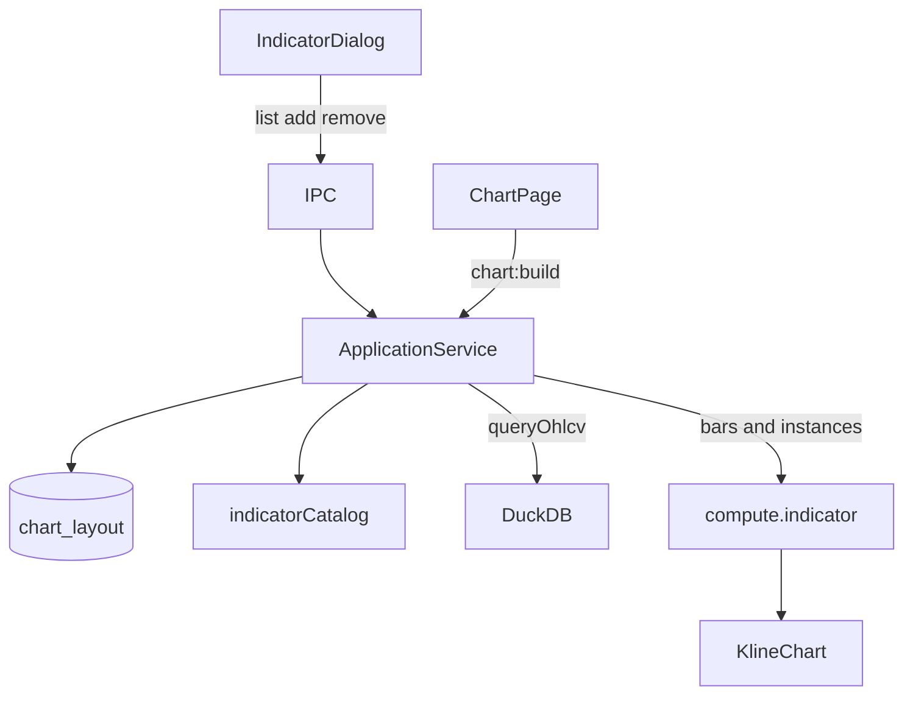

# Sprint8 迭代文档

> 状态：**进行中**
> 关联：[启动摘要](./Sprint8启动文档.md)、[Sprint7.2 迭代文档](../Sprint7/Sprint7.2迭代文档.md)、[架构文档](../trading-zone-electron架构文档.md)、[头脑风暴](../Sprint7/Sprint7头脑风暴文档.md)、开发计划 Cursor plan `sprint8_指标crud_0ed8feb1`

---

## 1. 当前迭代目标

工具栏「指标」可对内置 MA / MACD 做增删读；布局写入 SQLite，关闭再开仍是用户留下的组合；图画由 Application 读布局 → `compute.indicator` 合成，不再用 MACD Chip 剥 pane。

### 1.1 目标声明

| # | 目标 | 验收口径 |
|---|---|---|
| G1 | 布局落库 | `chart_layout` + `chart_layout_item`；首次种子 MA(20)+MACD(12,26,9)；头行在而 item 为 0 时不重新种子 |
| G2 | 同步合成 | `compute.indicator({ bars, instances })` 按实例合并一份 `ChartInput`；空数组只出 candle+volume；未知/重复 builtin、缺 params 失败 |
| G3 | 工具栏真 CRUD | 「指标」最小弹窗增删读；已挂项不能再加；去掉 MACD Chip / `stripMacdPane`；只留 MA 后重启仍只有 MA |

### 1.2 范围边界（本迭代不做）

- 改周期 / 颜色 / 线宽（U）
- 多套命名布局、按股票记忆
- 目录表用户 CRUD、自定义脚本 `exec`、编辑器、独立脚本子进程
- `compute.indicator` 句柄 / 批处理 / 取消 / 缓存键
- 改 `ChartInput` Schema 词汇；Arrow 传 `series`

### 1.3 技术选型（本迭代）

| 层 | 选型 |
|---|---|
| 壳 / 构建 | Electron + electron-vite（沿用） |
| UI | React + MUI Dialog；`KlineChart` 通道不改 |
| 业务 | SQLite 布局 CRUD；`buildChartInput` = `queryOhlcv` + 读布局 + `compute.indicator` |
| 数据 / 计算 | 内置改吐 `PlotFragment`；worker 内 compose；MessagePack JSON 回 `ChartInput` |
| 协议 | 沿用 `ChartInput` v1；目录契约 `indicator_catalog.json`；worker 方法 `compute.indicator` |

### 1.4 已拍板结论

| # | 议题 | 结论 |
|---|---|---|
| 1 | 目录 vs 布局 | 目录只读（契约）；用户 CRUD 只打实例表 |
| 2 | 存储 | 头表 1 行 `default` + 实例表；空布局 ≠ 未初始化 |
| 3 | 同种指标 | `UNIQUE(layout_id, builtin)`；实例 `id` = 目录 `key` |
| 4 | 默认 | 首次插入头行时种子 MA+MACD；worker 无默认布局 |
| 5 | Worker | 同步 `compute.indicator` 替换 `compute.chart_input`；不做 handle |
| 6 | UI | 最小弹窗；删除 MACD Chip |

---

## 2. 功能需求

### 2.1 用户故事

1. 作为用户，第一次打开图表仍能看到 MA20 与 MACD 副图。
2. 作为用户，我可以去掉 MACD、只留均线；关掉应用再开，仍然只有均线。
3. 作为用户，我可以把已删的 MACD 再加回来；已添加的项不能加第二次。
4. 作为用户，我可以删光指标，只看 K 线与成交量；重启后不会自动长回默认双指标。

### 2.2 功能清单

| ID | 功能 | 优先级 | 状态 |
|---|---|---|---|
| F01 | 目录契约 + TS catalog | P0 | 已完成 |
| F02 | SQLite 两表 + repository + 首次种子 | P0 | 已完成 |
| F03 | IPC `indicators:list` / `chartLayout:*` | P0 | 已完成 |
| F04 | Python compose + `compute.indicator` | P0 | 已完成 |
| F05 | `buildChartInput` 读布局 | P0 | 已完成 |
| F06 | ChartPage 指标弹窗；删除 Chip 夹具 | P0 | 已完成 |

### 2.3 非功能需求

- Renderer 不直连 SQLite / Python；不传 instances；不在 `KlineChart` 内解释 builtin。
- 算法参数写入时从目录填满，禁止存 `{}`。
- 空 `instances` 为合法 `ChartInput`（`primitives: []`）。

---

## 3. 详细设计说明

### 3.1 进程与数据流



### 3.2 目录 / 模块（本迭代涉及）

```
contracts/indicator_catalog.json
src/shared/chart/indicatorCatalog.ts
src/shared/types/chartLayout.ts
src/main/db/sqlite.ts
src/main/db/chartLayoutRepository.ts
src/main/services/applicationService.ts
src/main/ipc/registerHandlers.ts
src/preload/index.ts
python/worker/indicators/compose.py
python/worker/handlers/compute_indicator.py
src/renderer/src/pages/chart/IndicatorDialog.tsx
src/renderer/src/pages/ChartPage.tsx
```

### 3.3 数据模型 / 存储

- `chart_layout(id, updated_at)`：第一档恒 `'default'`。
- `chart_layout_item(id, layout_id, builtin, params, sort_order)`：`UNIQUE(layout_id, builtin)`；`id` = `builtin`。
- 目录不进库。

### 3.4 协议 / API / IPC

| 层 | 名称 | 形状 |
|---|---|---|
| 目录 | `indicators:list` | `IndicatorCatalogEntry[]` |
| 布局 | `chartLayout:get` / `add` / `remove` | 返回 `ChartLayout` |
| Worker | `compute.indicator` | `{ bars, instances: [{ builtin, params }] }` → `ChartInput` |
| 图表 | `chart:build` | 同 `MarketQueryParams` → `ChartInput \| null`（内部读库） |

### 3.5 核心编排

1. 无头行 → 插入头行 + 种子 MA / MACD。
2. 选股 → `queryOhlcv` → 读 item → `compute.indicator`。
3. 弹窗 add：校验目录与 UNIQUE，拷贝默认 params，`sort_order = max+1`。
4. 弹窗 remove：删 item，保留头行。

### 3.6 UI

图表工具栏「指标」打开 Dialog：可添加列表（已挂禁用）+ 当前实例可删。无 MACD Chip。

### 3.7 契约

| 层级 | 位置 |
|---|---|
| JSON | `contracts/indicator_catalog.json`；`contracts/chart_input.json`（形状不变） |
| TypeScript | `indicatorCatalog.ts`、`chartLayout.ts`、`validateChartInput.ts` |
| Python | `compose.py`、`compute_indicator.py`、plot 方言 |

---

## 4. 任务步骤

| 步骤 | 任务 | 产出 | 状态 |
|---|---|---|---|
| 1 | 启动摘要 + 迭代文档骨架 | `Sprint8启动文档.md`、`Sprint8迭代文档.md` | 已完成 |
| 2 | 目录契约 + SQLite + repository | catalog / 两表 / 种子 | 已完成 |
| 3 | Application CRUD + IPC + preload | `indicators:list`、`chartLayout:*` | 已完成 |
| 4 | Python fragment + compose + `compute.indicator` | handler；删 `default_chart` / `compute.chart_input` | 已完成 |
| 5 | `buildChartInput` 改读布局 | `applicationService.ts` | 已完成 |
| 6 | ChartPage 弹窗；删 Chip | `IndicatorDialog.tsx` | 已完成 |
| 7 | smoke + typecheck + 手工验收 | 见第 5 节 | 进行中 |

### 4.1 本地复现命令

```bash
python\.venv\Scripts\python.exe python\scripts\smoke_chart_input.py
npm run typecheck
npm run dev
```

图表页：默认 MA+MACD；去掉 MACD 后重启仍无副图。

---

## 5. 测试结果 / 总结反馈

### 5.1 验收清单与结果

| 检查项 | 方式 | 结果 | 说明 |
|---|---|---|---|
| G2 compose 四档 + 错误案 | Python smoke | 通过 | ma+macd / ma / macd / 空；未知、重复、缺参 |
| G2 点数对齐 Sprint7 fixture | smoke n=40 | 通过 | ma=21, dif=15, dea=7, macd=7 |
| G3 无 Chip / 无剥 pane | 代码 + typecheck | 通过 | 已删 `stripMacdPane`；`npm run typecheck` 通过 |
| G1/G3 手工起窗与重启持久化 | `npm run dev` | 待补跑 | 需起窗：默认 MA+MACD；删 MACD 后重启仍无副图 |

### 5.2 关键命令记录

```
python\.venv\Scripts\python.exe python\scripts\smoke_chart_input.py
compose ma+macd: times=40 ma=21 dif=15 dea=7 macd=7 panes=['macd', 'main']
point counts aligned with Sprint7 TS fixture: ok
compose ma only: ok
compose macd only: ok
compose empty: ok
indicator_ma fragment: ok
validate rejects main histogram: ok
unknown builtin: ok (unknown builtin rsi)
duplicate builtin: ok (duplicate builtin ma)
missing ma params: ok (invalid ma params: ... period Field required)

npm run typecheck
> tsc --noEmit -p tsconfig.node.json --composite false
> tsc --noEmit -p tsconfig.web.json --composite false
（2026-08-18 通过）
```

### 5.3 总结反馈

**做得好的地方**

- 目录只读、布局 CRUD 分清；空布局靠头行存在来区分未初始化。
- 内置改吐 fragment 后，合成只在 worker；`chart:build` 仍以内核 SQLite 为准，Renderer 不传 instances。
- 夹具 Chip 从产品路径拿掉，增删真正改变 `compute.indicator` 的 instances。

**暴露的问题 / 摩擦**

- 图上可见性与「只留 MA 后重启」仍依赖手工起窗。
- 选股仍是 `queryOhlcv` + `compute.indicator` 两跳 worker。
- 第一档实例 `id` = `builtin`，全局主键；多套布局时会撞 id，中期要拆开。

---

## 6. 改进目标

### 6.1 短期（下一迭代可做）

1. 改参数（周期 / 颜色 / 线宽）——已承接 [Sprint8.1](./Sprint8.1迭代文档.md)。
2. 选股两跳 worker 合并或缓存——已承接 [Sprint8.2](./Sprint8.2迭代文档.md)（拍板：合并）。

### 6.2 中期

1. 允许多条同种指标（实例 id 与 catalog key 分离；primitive id 带实例前缀）。
2. 自定义脚本存储 + Renderer 编辑器（只编辑）+ 独立脚本子进程。

### 6.3 长期

1. Arrow 数据面传输 `series`；窗读进 Renderer。
2. `compute.indicator` 句柄 / 批处理 / 取消与缓存键。

---

## 附录

### A. 相关文档

- [Sprint8 启动摘要](./Sprint8启动文档.md)
- [Sprint8.1 迭代文档](./Sprint8.1迭代文档.md)
- [Sprint8.2 迭代文档](./Sprint8.2迭代文档.md)
- [Sprint7.2 迭代文档](../Sprint7/Sprint7.2迭代文档.md)
- [Sprint7 头脑风暴](../Sprint7/Sprint7头脑风暴文档.md)
- [架构文档](../trading-zone-electron架构文档.md)

### B. 常用命令

| 命令 | 用途 |
|---|---|
| `npm run dev` | 开发起窗 |
| `npm run typecheck` | TS 检查 |
| `python\.venv\Scripts\python.exe python\scripts\smoke_chart_input.py` | compose / ChartInput smoke |
