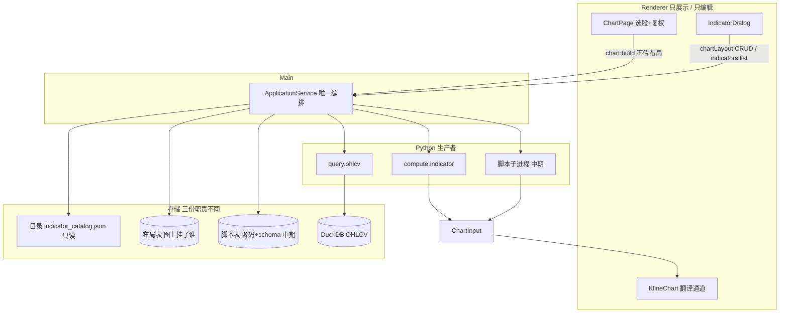
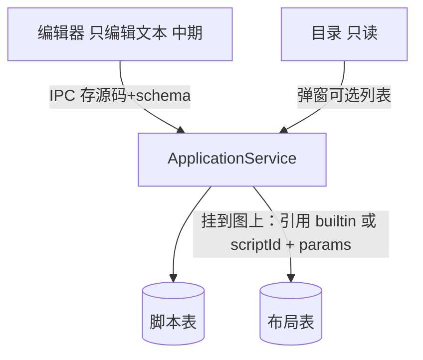
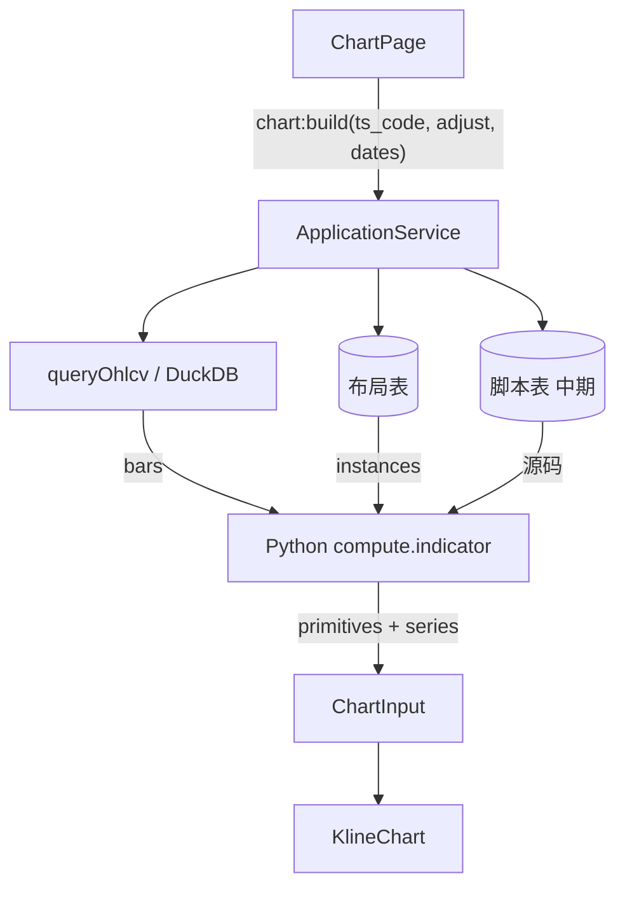

# 图表中期架构梳理

> 梳理的是整体愿景骨架。Sprint8 已落地布局 CRUD 与内置 `compute.indicator`；自定义脚本 / 编辑器尚未做。

## 分层



Renderer 不直连 SQLite / Python。通道不解释 Python，也不解释「MA / MACD」。

## 三份存储

| | 目录 Catalog | 布局 Layout | 脚本 Script |
|---|---|---|---|
| 存什么 | 可添加的内置及默认参数 | 这张图挂了哪些实例 | 自定义源码、名称、参数 schema |
| 位置 | `contracts/indicator_catalog.json` | SQLite `chart_layout` + `chart_layout_item` | SQLite（尚未建） |
| 谁改 | 产品发版 | 用户增删 | 用户编辑保存 |
| 算图角色 | add 时拷默认 params | Main 读出 instances | Main 取出源码再交给子进程 |
| 状态 | 已落地 | 已落地 | 中期 |

不要把这三样写成一张「指标元数据表」。

## 交互链路

### 1. 创建指标 / 加到图上

保存脚本不跑 Python，也不生成 `ChartInput`。



**Sprint8 现状：** 没有编辑器和脚本表。加指标 = 从目录挑 `ma` / `macd`，拷默认 params，写入布局实例。

### 2. 获取布局（给弹窗，不算图）

```text
UI → ApplicationService → 布局表
```

只供 IndicatorDialog 增删读。**不是** `chart:build` 的入参。

### 3. 获取图表数据

UI 只传选股 + 复权 + 日期；布局由 Main 读库。



Python **入口**：`bars` + `instances`（中期可带脚本源码）。  
Python **出口**：`ChartInput` = 声明（`primitives`）+ 数据（`candle` / `volume` / `series`）。  
图表吃的是这份契约，不是「纯数据」，也不是源码。

## 通道口：ChartInput

头脑风暴里的 PlotSpec，落地类型名是 `ChartInput`（Sprint7 已拍板，代码里不用 PlotSpec 当入口名）。

```text
ChartInput
  timeDomain
  candle / volume
  primitives[]    ← 声明：id / pane / kind / style
  series          ← 对齐到 timeDomain 的值
```

内置 `ma.py` / `macd.py` 与未来用户脚本必须交出同一出口。通道不区分来源。

## 与现状的差

| 环节 | Sprint8 现状 | 中期愿景 |
|---|---|---|
| 可添加的指标 | JSON 目录：ma / macd | 目录 + 用户脚本表 |
| 加到图上 | 实例 id 与 catalog key 分离；primitive 带实例前缀 | 多套布局、按股票记忆 |
| Python 入口 | `query` 或 `bars` + `instances[{ id, builtin, params }]` | 内置走 registry；用户脚本走独立子进程 |
| Python 出口 | 已是 ChartInput | 仍是同一 ChartInput，通道不改 |
| 编辑器 | 没有 | Renderer 只编辑；报错回标编辑器 |
