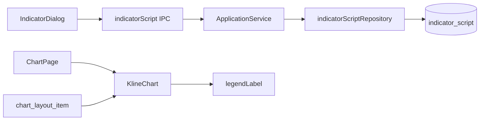

# Sprint9.1 迭代文档

> 状态：**已完成**
> 关联：[启动摘要](./Sprint9.1启动文档.md)、[Sprint9.2 迭代文档](./Sprint9.2迭代文档.md)、[Sprint9 迭代文档](./Sprint9迭代文档.md)、[Sprint9 头脑风暴文档](./Sprint9头脑风暴文档.md)、[架构文档](../trading-zone-electron架构文档.md)、开发计划 Cursor plan `sprint9.1_脚本表_f9565f3c`

---

## 1. 当前迭代目标

落地头脑风暴档 B：用户脚本作为独立资产可 CRUD 并在弹窗列出（还不能算、不能挂图）；内置图例显示 localName 与参数，不再露出 uuid。

### 1.1 目标声明

| # | 目标 | 验收口径 |
|---|---|---|
| G1 | 脚本表 + IPC CRUD | 新建 / 改 title+source / 删后重启仍在；不调 Python |
| G2 | 弹窗列出用户脚本 | 「用户脚本」分区可列出；有新建/编辑/删除；不能添加到当前布局 |
| G3 | 图例 localName/参数 | 主图 `MA20`/`MA5`/`MA250`；副图标题 `MACD 12/26/9`；不出现 uuid |

### 1.2 范围边界（本迭代不做）

- 独立脚本子进程、同进程 `exec`、Renderer Pyodide、保存时 load 类抽 manifest
- 布局拆 `kind + ref`、`chart:build` 带 source、脚本挂到当前布局
- Monaco、按 `manifest.fields` 渲染设置表单
- 改 `ChartInput` Schema、改 compose / `compute.indicator`

### 1.3 技术选型（本迭代）

| 层 | 选型 |
|---|---|
| 壳 / 构建 | Electron + electron-vite（沿用） |
| UI | IndicatorDialog 加脚本分区；源码用多行 TextField，不是 Monaco |
| 业务 | IPC `indicatorScript:*` → ApplicationService → SQLite |
| 数据 / 计算 | 脚本只落库；出图仍只跑内置 compose |
| 协议 | `ChartInput` v1 不变；布局仍 `{ id, builtin, params }` |

### 1.4 已拍板结论

| # | 议题 | 结论 |
|---|---|---|
| 1 | 脚本与出图隔离 | CRUD 不调 worker；`chart:build` 本轮不读脚本表 |
| 2 | manifest 列 | 本轮写空壳占位，避免档 C/E 再迁表 |
| 3 | 删除 | 布局尚未 `kind=script`，一律允许；档 D 再加引用保护 |
| 4 | 编辑器 | 档 B 用 TextField；Monaco 留给档 E |
| 5 | 图例 | 用布局 params 生成显示名，不改 `ChartInput` |

---

## 2. 功能需求

### 2.1 用户故事

1. 作为用户，我可以新建一条脚本（标题 + 源码），关掉再开仍在。
2. 作为用户，我可以改脚本标题和源码，也可以删掉它。
3. 作为用户，我在指标弹窗能看到用户脚本列表，但不能把它加到当前布局。
4. 作为看图用户，均线图例显示 `MA20` / `MA5` / `MA250`，MACD 副图标题显示 `12/26/9`，看不到 uuid。

### 2.2 功能清单

| ID | 功能 | 优先级 | 状态 |
|---|---|---|---|
| F01 | `indicator_script` 表 + repository + IPC CRUD | P0 | 已完成 |
| F02 | IndicatorDialog「用户脚本」分区 | P0 | 已完成 |
| F03 | 图例 localName + 布局参数 | P0 | 已完成 |

### 2.3 非功能需求

- Renderer 不直连 SQLite / Python；脚本 CRUD 不触发 `chart:build`。
- Python 不碰脚本表；本轮 worker 零改动。
- 写入 title 去空白后非空；source 允许空字符串。
- 图例找不到布局项时回退 `localName.toUpperCase()`，绝不把 uuid 当标签。

---

## 3. 详细设计说明

### 3.1 进程与数据流



脚本路径与出图路径隔离。选股仍走 8.2 / 8.3 的 `chart:build` → `compute.indicator`（只含内置 instances）。

### 3.2 目录 / 模块（本迭代涉及）

```
src/shared/types/indicatorScript.ts
src/shared/chart/indicatorScript.ts      # 空壳 manifest + 新建模板
src/shared/chart/legendLabel.ts
src/main/db/sqlite.ts
src/main/db/indicatorScriptRepository.ts
src/main/services/applicationService.ts
src/main/ipc/registerHandlers.ts
src/preload/index.ts
src/preload/index.d.ts
src/renderer/src/pages/chart/IndicatorDialog.tsx
src/renderer/src/pages/chart/KlineChart.tsx
src/renderer/src/pages/ChartPage.tsx
```

不改：`python/`、`contracts/chart_input.json`、`chart_layout_item`、`compose.py`。

### 3.3 数据模型 / 存储

```sql
CREATE TABLE IF NOT EXISTS indicator_script (
  id         TEXT PRIMARY KEY NOT NULL,
  title      TEXT NOT NULL,
  source     TEXT NOT NULL,
  manifest   TEXT NOT NULL,
  updated_at TEXT NOT NULL
);
```

- `id`：uuid 去横线。
- `manifest`：空壳 `{ key:"", title, fields:[], defaultParams:{} }`。
- 列表按 `updated_at DESC`。

### 3.4 协议 / API / IPC

| 通道 | 入参 | 返回 |
|---|---|---|
| `indicatorScript:list` | — | `IndicatorScript[]` |
| `indicatorScript:create` | `{ title, source }` | 全表 list |
| `indicatorScript:update` | `{ id, title?, source? }` | 全表 list |
| `indicatorScript:remove` | `{ id }` | 全表 list |

`chartLayout:*` / `chart:build` 形状不变。

### 3.5 核心编排

1. 弹窗打开 → `indicatorScript:list`。
2. 新建 / 编辑 / 删除 → 对应 IPC → 刷新脚本列表，不重载图。
3. `chart:build` 仍只读 `chart_layout_item`。
4. KlineChart 用 `layout.items` 把 `{instanceId}:{localName}` 映射成图例文案。

### 3.6 UI

- 「可添加」：内置 MA / MACD，行为不变。
- 「用户脚本」：title 为主、updatedAt 为次；新建 / 编辑 / 删除；无「添加」。
- 「当前布局」：不变。
- 编辑子窗：title + 多行 TextField；新建默认 title「未命名」，source 为 `Indicator` 骨架模板。

### 3.7 契约

| 层级 | 位置 |
|---|---|
| JSON Schema | `contracts/chart_input.json` 不变 |
| TypeScript | `IndicatorScript` / `IndicatorManifest`；图例 `legendLabel` |
| Python | 本轮不改 |

图例规则：

- `ma` → `MA{period}`；`ma5` → `MA{period5}`；`ma250` → `MA{period250}`
- 副图标题 `MACD {fast}/{slow}/{signal}`；系列仍 `DIF` / `DEA` / `MACD`

---

## 4. 任务步骤

| 步骤 | 任务 | 产出 | 状态 |
|---|---|---|---|
| 1 | 启动摘要 + 迭代文档骨架 | 本文件与启动摘要 | 已完成 |
| 2 | 脚本表 + IPC CRUD | repository / IPC / preload | 已完成 |
| 3 | 弹窗用户脚本分区 | IndicatorDialog / ChartPage | 已完成 |
| 4 | 图例 localName + 参数 | legendLabel.ts / KlineChart | 已完成 |
| 5 | typecheck / smoke | 第 5 节 | 已完成 |

### 4.1 本地复现命令

```bash
python\.venv\Scripts\python.exe python\scripts\smoke_chart_input.py
npm run typecheck
npm run dev
```

---

## 5. 测试结果 / 总结反馈

### 5.1 验收清单与结果

| 检查项 | 方式 | 结果 | 说明 |
|---|---|---|---|
| G1 脚本 CRUD 持久化 | 手工起窗 | 待补跑 | 新建 / 改 / 删后重启仍在 |
| G2 弹窗列出且不能上图 | 手工起窗 | 待补跑 | 脚本区无「添加」；图仍只有布局内置 |
| G3 图例参数 | 手工起窗 | 待补跑 | `MA{n}`；`MACD 12/26/9`；无 uuid |
| 内置 compose 回归 | Python smoke | 通过 | 本轮不改 Python；8.3 / 9 断言仍过（2026-08-22） |
| typecheck | `npm run typecheck` | 通过 | node + web（2026-08-22） |

### 5.2 关键命令记录

```
npm run typecheck
> tsc --noEmit -p tsconfig.node.json --composite false
> tsc --noEmit -p tsconfig.web.json --composite false
（2026-08-22 通过）

python\.venv\Scripts\python.exe python\scripts\smoke_chart_input.py
MA.manifest locks catalog: ok
MACD.manifest locks catalog: ok
compose ma+macd: times=40 ma=21 ma5=36 ma250=0 dif=15 dea=7 macd=7 panes=['macd', 'main']
to_chart_input matches compose: ok
compose two ma: ok
compose two macd: ok
compute.indicator bars path: ok
```

### 5.3 总结反馈

**做得好的地方**

- 脚本资产与出图路径隔离：CRUD 只写 SQLite，不调 worker，也不改布局。
- `manifest` 空壳占位，档 C/E 不必再迁表。
- 图例用布局 params 投影，不改 `ChartInput`；uuid 前缀不再作为显示名。

**暴露的问题 / 摩擦**

- 源码编辑仍是 TextField，没有高亮 / 跑一次 / traceback（档 E）。
- 脚本还不能挂图、不能算（档 C/D）。
- 手工起窗 CRUD 与图例尚未补跑。

---

## 6. 改进目标

### 6.1 短期（下一迭代可做）

1. 档 C：见 [Sprint9.2 迭代文档](./Sprint9.2迭代文档.md)（独立子进程跑一份源码 → `PlotFragment`；compose 能合并）。

### 6.2 中期

1. 档 D：见 [Sprint9.3 迭代文档](./Sprint9.3迭代文档.md)（布局项 `kind + ref`；`chart:build` 由 Main 注入 `source`；仍被引用的脚本禁止删除）。
2. 档 E：Renderer 编辑器（只编辑）；保存 / 跑一次 / traceback 回标。
3. 档 F：按 `manifest.fields` 渲染设置表单（内置也可去掉写死表单）。
4. 多套命名布局、按股票记忆。

### 6.3 长期

1. Arrow 数据面传输 `series`；窗读进 Renderer。
2. `compute.indicator` 句柄 / 批处理 / 取消与缓存键。
3. 内置 catalog 改为启动时从类 `manifest()` 下发，去掉 TS 手写拷贝。

---

## 附录

### A. 相关文档

- [Sprint9.1 启动摘要](./Sprint9.1启动文档.md)
- [Sprint9.2 迭代文档](./Sprint9.2迭代文档.md)
- [Sprint9 迭代文档](./Sprint9迭代文档.md)
- [Sprint9 头脑风暴文档](./Sprint9头脑风暴文档.md)
- [Sprint8.3 迭代文档](../Sprint8/Sprint8.3迭代文档.md)
- [架构文档](../trading-zone-electron架构文档.md)

### B. 常用命令

| 命令 | 用途 |
|---|---|
| `npm run dev` | 开发起窗 |
| `npm run typecheck` | TS 检查 |
| `python\.venv\Scripts\python.exe python\scripts\smoke_chart_input.py` | Indicator / compose / ChartInput smoke |
