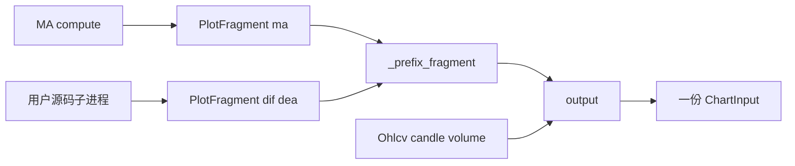
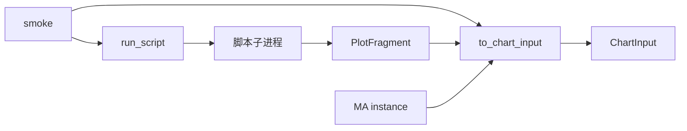

# Sprint9.2 迭代文档

> 状态：**已完成**
> 关联：[启动摘要](./Sprint9.2启动文档.md)、[Sprint9.1 迭代文档](./Sprint9.1迭代文档.md)、[Sprint9 迭代文档](./Sprint9迭代文档.md)、[Sprint9 头脑风暴文档](./Sprint9头脑风暴文档.md)、[架构文档](../trading-zone-electron架构文档.md)

---

## 1. 当前迭代目标

落地头脑风暴档 C：独立子进程跑一份用户源码得到 `PlotFragment`；compose / `to_chart_input` 能把它与内置 fragment 合成同一份 `ChartInput`。本轮不出图、不改布局。

### 1.1 目标声明

| # | 目标 | 验收口径 |
|---|---|---|
| G1 | 子进程跑一份源码 | `run_script(source, ohlcv, params)` 返回局部短名 fragment（如 MACD 的 `dif` / `dea` / `macd`） |
| G2 | compose 能合并 | 内置 `MA()` + 脚本 MACD fragment 的 `to_chart_input` dump，与满字段 `compose([ma, macd])` 一致 |
| G3 | 沙箱边界 | 源码 `import os` 或 `import worker` 失败；语法错误不让主 worker 崩溃 |

### 1.2 范围边界（本迭代不做）

- 布局拆 `kind + ref`、`chart:build` 注入 `source`、脚本挂到当前布局
- 保存时 load 类抽 manifest、Monaco、「跑一次」按钮
- 改 `ChartInput` Schema、改 `compute.indicator` 入参
- 同进程 `exec`、Renderer Pyodide
- 多脚本并行、超时后只丢掉该实例（本轮一份源码；失败则整次失败）

### 1.3 技术选型（本迭代）

| 层 | 选型 |
|---|---|
| 壳 / 构建 | Electron + electron-vite（沿用，本轮不改 UI / IPC） |
| UI | 不变；脚本仍不能添加到布局 |
| 业务 | 不出图；脚本 CRUD 路径不变 |
| 数据 / 计算 | 主 worker `subprocess` 拉起脚本进程；stdin/stdout 传 Ohlcv + params / PlotFragment |
| 协议 | `ChartInput` v1 不变；`compute.indicator` 形状不变 |

### 1.4 已拍板结论

| # | 议题 | 结论 |
|---|---|---|
| 1 | 执行隔离 | 独立子进程；否决同进程 `exec`、Pyodide |
| 2 | 注入什么 | `Indicator` / `Ohlcv` / plot 方言 / `Field`；允许 `numpy`；禁止 `os` / `socket` / `worker.*` |
| 3 | 子进程出口 | 只返回 `PlotFragment`，禁止完整 `ChartInput` |
| 4 | 合并点 | 主 worker `_prefix_fragment` + `output(*fragments, candle, volume)` |
| 5 | `to_chart_input` | items 可混 `Indicator` 与已算好的 `PlotFragment` |
| 6 | 挂图 | 留给档 D；本轮 smoke 只在 Python |

---

## 2. 功能需求

### 2.1 用户故事

1. 作为指标作者，我写一份 `Indicator` 子类源码，主 worker 能在隔离进程里跑出局部 `PlotFragment`。
2. 作为维护者，我可以把这份 fragment 和内置 `MA()` 一起交给 `to_chart_input`，得到与内置 compose 相同的 `ChartInput`。
3. 作为现有图表用户，本轮图上行为不变：仍只跑布局里的内置指标。

### 2.2 功能清单

| ID | 功能 | 优先级 | 状态 |
|---|---|---|---|
| F01 | 脚本子进程：注入 API、跑 `compute`、回传 fragment | P0 | 已完成 |
| F02 | `to_chart_input` 合并 `Indicator` 与脚本 `PlotFragment` | P0 | 已完成 |
| F03 | smoke：用户 MACD 源码与内置 MACD 同出口；沙箱拒绝 `os` / `worker` | P0 | 已完成 |

### 2.3 非功能需求

- Renderer 不 exec Python；本轮也不改 IPC。
- Python 仍不碰 SQLite；源码由调用方传入字符串。
- 子进程看不到 DuckDB / Token / 业务库路径。
- 不改 `ChartInput` 词汇；通道仍只认合并后的 primitive id。

---

## 3. 详细设计说明

### 3.1 「compose 能合并」是什么

一张图只有一份 `ChartInput`：一个 `timeDomain`、一组 `candle` / `volume`、再加上若干 `primitives` + `series`。

每条指标（无论内置类还是用户源码）**不算完整图**，只算一块 **`PlotFragment`**：局部短名（`ma` / `dif`），不含 K 线。主 worker 做两件事：

1. `_prefix_fragment`：primitive / series 加上 `{instanceId}:`；副图 pane 改成实例 id。
2. `output(*fragments, candle, volume)`：把多块 fragment 拼进同一份 `ChartInput`。

「能合并」= 子进程吐出的那块 fragment **走同一套前缀 + `output()`**，可以和 `MA().compute()` 的块出现在同一份 spec 里。不是把两份源码拼成一个文件，也不是把两份 `ChartInput` 叠在一起。



验收对照：同一组 bars、同一组 params，左边是内置 `compose([ma, macd])`，右边是 `to_chart_input([("ma", MA()), ("macd", run_script(macd_source, …))])`，dump 一致。

### 3.2 进程与数据流

本轮 **不接** `chart:build`。调用方是 Python smoke / 将来的档 D worker。



档 D 才会变成：Main 读布局 + 脚本表 → `compute.indicator` 带 `source` → 主 worker 对脚本实例调 `run_script`。

### 3.3 目录 / 模块（本迭代涉及）

```
python/worker/indicators/sandbox.py     # 子进程入口 + 注入 + 序列化
python/worker/indicators/compose.py     # to_chart_input 接受 PlotFragment
python/worker/indicators/__init__.py    # 导出 run_script
python/scripts/smoke_chart_input.py     # G1–G3
src/shared/chart/indicatorScript.ts     # 新建模板改为注入式（不再 import worker）
```

不改：`contracts/chart_input.json`、IPC、SQLite、`compute.indicator` 入参、`IndicatorDialog` 挂图行为。

### 3.4 数据模型 / 存储

脚本表本轮只当源码来源的**未来**位置；smoke 直接传字符串。布局行仍 `{ id, builtin, params }`。

子进程 stdin（示意）：

```json
{
  "ohlcv": { "time": ["2024-01-01"], "open": [1], "high": [1], "low": [1], "close": [1], "volume": [1] },
  "params": { "fast": 12, "slow": 26, "signal": 9 }
}
```

子进程 stdout：`PlotFragment` 可 JSON 化的 `primitives` + `series`（局部短名）。`candle` 不出现。

### 3.5 协议 / API / IPC

| 层 | 名称 | 形状 |
|---|---|---|
| IPC | `chart:build` / `indicatorScript:*` | 不变 |
| Worker 公开 | `compute.indicator` | 不变，本轮仍只 compose 内置 |
| Python | `run_script(source, ohlcv, params) -> PlotFragment` | 新 |
| Python | `to_chart_input(bars, [(id, Indicator \| PlotFragment), ...])` | 扩展 |

### 3.6 核心编排

1. 主进程 `subprocess.run` 拉起 `sandbox.py`；stdin 一整份 JSON（`source` + `params` + `ohlcv`），超时 10s。
2. 子进程：受限 `__import__`；`exec` 源码；取 `indicator` 导出；`cls.model_validate(params).compute(ohlcv)`；stdout `{ok, fragment}`。
3. 主进程反序列化成 `PlotFragment`；非法出口（非 `PlotFragment`、无 `indicator`）报错。
4. `to_chart_input`：`Indicator` 则本进程 `compute`；`PlotFragment` 则直接前缀；最后 `output()`。

超时本轮取固定上限（启动摘要：子进程 hang 则主进程杀掉，整次 `run_script` 失败）。多实例只丢一条留给档 D。

### 3.7 UI

本轮不改挂图行为。新建脚本模板改为注入式骨架（`Indicator` / `Ohlcv` / `PlotFragment` / `Field` / `ClassVar`），不再 `from worker… import`。弹窗仍无「添加」。

### 3.8 契约

| 层级 | 位置 |
|---|---|
| JSON Schema | `contracts/chart_input.json` 不变 |
| TypeScript | 仅模板字符串；类型不变 |
| Python | `run_script` + `to_chart_input` 混入 fragment |

脚本作者约定（与内置同类）：

```python
class MyMACD(Indicator):
    key: ClassVar[str] = "macd"
    title: ClassVar[str] = "MACD"
    fast: int = Field(default=12, ge=1, json_schema_extra={"widget": "int", "title": "快线"})
    # ...
    def compute(self, ohlcv: Ohlcv) -> PlotFragment:
        return subplot("macd", line("dif", ...), ...)

indicator = MyMACD
```

`key` 不保证全局唯一；本轮无布局 `ref`，smoke 自己指定 instance id。

---

## 4. 任务步骤

| 步骤 | 任务 | 产出 | 状态 |
|---|---|---|---|
| 1 | 启动摘要 + 迭代文档骨架 | 本文件与启动摘要 | 已完成 |
| 2 | 脚本子进程 runner | `sandbox.py` / `run_script` | 已完成 |
| 3 | `to_chart_input` 混入 fragment | `compose.py` | 已完成 |
| 4 | 新建模板改为注入式 | `indicatorScript.ts` | 已完成 |
| 5 | smoke G1–G3 | `smoke_chart_input.py` | 已完成 |

### 4.1 本地复现命令

```bash
python\.venv\Scripts\python.exe python\scripts\smoke_chart_input.py
npm run typecheck
```

---

## 5. 测试结果 / 总结反馈

### 5.1 验收清单与结果

| 检查项 | 方式 | 结果 | 说明 |
|---|---|---|---|
| G1 子进程 → fragment | Python smoke | 通过 | 局部短名 `dif` / `dea` / `macd`，pane=`macd`（2026-08-22） |
| G2 与内置 compose dump 一致 | Python smoke | 通过 | `MA()` + 脚本 MACD fragment 与满字段 compose dump 一致 |
| G3 `import os` / `import worker` / 语法错误 | Python smoke | 通过 | 均失败；随后内置 compose 仍可用 |
| 内置 compose 回归 | Python smoke | 通过 | 8.3 / 9 断言仍过 |
| typecheck | `npm run typecheck` | 通过 | node + web（2026-08-22） |

### 5.2 关键命令记录

```
python\.venv\Scripts\python.exe python\scripts\smoke_chart_input.py
MA.manifest locks catalog: ok
MACD.manifest locks catalog: ok
compose ma+macd: times=40 ma=21 ma5=36 ma250=0 dif=15 dea=7 macd=7 panes=['macd', 'main']
to_chart_input matches compose: ok
run_script user MACD fragment: ok
to_chart_input merges script fragment: ok
script import os: ok (import 'os' is not allowed)
script import worker: ok (import 'worker' is not allowed)
script syntax: ok ('(' was never closed)
sandbox failures leave builtin compose usable: ok

npm run typecheck
> tsc --noEmit -p tsconfig.node.json --composite false
> tsc --noEmit -p tsconfig.web.json --composite false
（2026-08-22 通过）
```

### 5.3 总结反馈

**做得好的地方**

- 脚本计算停在 `PlotFragment`；前缀和 `output()` 仍只在主进程做一次，G2 dump 与内置 compose 对齐。
- 子进程用 JSON stdin/stdout，不碰 Main↔worker 的 msgpack 帧；`import os` / `import worker` 在用户 `exec` 里被拒绝。
- 新建模板改为注入名，作者不再 `import worker.*`。

**暴露的问题 / 摩擦**

- 本轮未接 `chart:build`：图上仍只能跑内置布局。
- 失败是整次 `run_script` 失败；一张图多脚本、只丢掉该实例留给档 D。
- 保存时还不抽 `manifest()`；编辑器仍是 TextField。

---

## 6. 改进目标

### 6.1 短期（下一迭代可做）

1. 档 D：见 [Sprint9.3 迭代文档](./Sprint9.3迭代文档.md)（布局项 `kind + ref`；`chart:build` 由 Main 注入 `source`；仍被引用的脚本禁止删除）。

### 6.2 中期

1. 档 E：Renderer 编辑器（只编辑）；保存 / 跑一次 / traceback 回标。
2. 档 F：按 `manifest.fields` 渲染设置表单。
3. 保存时 load 类抽 manifest；一张图多个脚本、单实例失败只丢掉该条。
4. 多套命名布局、按股票记忆。

### 6.3 长期

1. Arrow 数据面传输 `series`；窗读进 Renderer。
2. `compute.indicator` 句柄 / 批处理 / 取消与缓存键。
3. 内置 catalog 改为启动时从类 `manifest()` 下发。

---

## 附录

### A. 相关文档

- [Sprint9.2 启动摘要](./Sprint9.2启动文档.md)
- [Sprint9.1 迭代文档](./Sprint9.1迭代文档.md)
- [Sprint9 迭代文档](./Sprint9迭代文档.md)
- [Sprint9 头脑风暴文档](./Sprint9头脑风暴文档.md)
- [架构文档](../trading-zone-electron架构文档.md)

### B. 常用命令

| 命令 | 用途 |
|---|---|
| `npm run dev` | 开发起窗 |
| `npm run typecheck` | TS 检查 |
| `python\.venv\Scripts\python.exe python\scripts\smoke_chart_input.py` | Indicator / compose / 脚本子进程 smoke |
