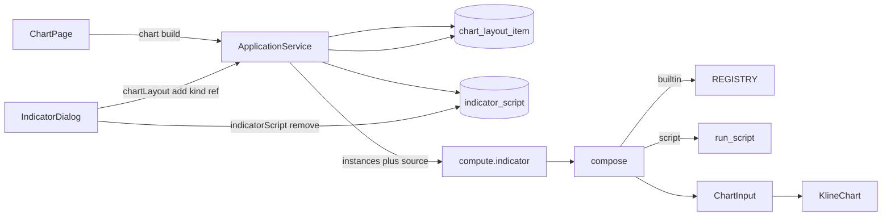

# Sprint9.3 迭代文档

> 状态：**已完成**
> 关联：[启动摘要](./Sprint9.3启动文档.md)、[Sprint9.2 迭代文档](./Sprint9.2迭代文档.md)、[Sprint9.1 迭代文档](./Sprint9.1迭代文档.md)、[Sprint9 迭代文档](./Sprint9迭代文档.md)、[Sprint9 头脑风暴文档](./Sprint9头脑风暴文档.md)、[架构文档](../trading-zone-electron架构文档.md)、开发计划 Cursor plan `sprint9.3_档d上图_73e326ef`

---

## 1. 当前迭代目标

落地头脑风暴档 D：布局项改为 `kind + ref`；`chart:build` 由 Main 注入脚本 `source`；仍被布局引用的脚本禁止删除。用户脚本可以挂到当前图并出图。

### 1.1 目标声明

| # | 目标 | 验收口径 |
|---|---|---|
| G1 | 布局项 kind + ref | 旧行迁移为 `kind=builtin, ref=原 builtin`；种子 `ma` / `macd` 的 id 不改写；`chartLayout:add` 为 `{ kind, ref }` |
| G2 | 脚本上图 | 弹窗可添加；`chart:build` 后见图；删一条只少该实例；同一脚本加两次前缀不撞 |
| G3 | 引用保护 | 布局仍引用时 `indicatorScript:remove` 拒绝；弹窗删除按钮禁用 |

### 1.2 范围边界（本迭代不做）

- Monaco、「跑一次」、保存时 load 类抽 manifest、按 `manifest.fields` 渲染设置表单（档 E / F）
- 改 `ChartInput` Schema、Arrow 传 series、多套命名布局
- 改默认新建骨架（仍是 `NotImplementedError`）；验收用可跑源码
- 脚本实例本轮无参数设置窗（manifest 仍是空壳）

### 1.3 技术选型（本迭代）

| 层 | 选型 |
|---|---|
| 壳 / 构建 | Electron + electron-vite（沿用） |
| UI | IndicatorDialog 脚本分区加「添加」；脚本行无「设置」 |
| 业务 | `chartLayout:add` 改为 `{ kind, ref }`；Main 读脚本表注入 `source` |
| 数据 / 计算 | 布局表 `kind + ref`；脚本走 `run_script`；单实例失败丢掉 |
| 协议 | `ChartInput` v1 不变；`compute.indicator` instances 改为 `kind + ref` + 可选 `source` |

### 1.4 已拍板结论

| # | 议题 | 结论 |
|---|---|---|
| 1 | 源码存在哪 | 布局不存 `source`；Main 过桥时注入 |
| 2 | 脚本身份 | 脚本表主键，不是 `class.key` |
| 3 | add 形状 | `{ kind, ref }`，不保留 `builtin` 别名 |
| 4 | 单脚本失败 | 只丢掉该实例，内置与其它脚本仍出图 |
| 5 | 脚本 params | 拷 `manifest.defaultParams`（当前 `{}`）；Field 默认在子进程生效 |

---

## 2. 功能需求

### 2.1 用户故事

1. 作为用户，我可以把一条用户脚本添加到当前布局，选股后图上出现它的线或柱。
2. 作为用户，我可以挂两条同一脚本，它们的 primitive 前缀不撞；删一条只少该实例。
3. 作为用户，只要布局还引用某脚本，我就删不掉它。
4. 作为现有图表用户，内置 MA / MACD 在迁移后仍按原种子 id 出图。

### 2.2 功能清单

| ID | 功能 | 优先级 | 状态 |
|---|---|---|---|
| F01 | 布局项 `kind + ref` + 旧行迁移 | P0 | 已完成 |
| F02 | `chart:build` 注入 `source`；compose 跑脚本 | P0 | 已完成 |
| F03 | 被引用脚本禁止删除 | P0 | 已完成 |

### 2.3 非功能需求

- Renderer 不 exec Python，也不直连 SQLite。
- Python 不碰脚本表；`source` 由 Main 注入。
- 不改 `ChartInput` 词汇；通道仍只认合并后的 primitive id。
- 默认骨架挂上后不得把内置 MA / MACD 整图弄没。

---

## 3. 详细设计说明

### 3.1 进程与数据流



Main `buildChartInput`：读布局 → 对 `kind=script` 用脚本表取 `source` → 传 worker。缺脚本行则该条不进 instances。`kind=builtin` 禁止带 `source`。

### 3.2 目录 / 模块（本迭代涉及）

```
src/shared/types/chartLayout.ts
src/shared/types/pythonProtocol.ts
src/shared/chart/legendLabel.ts
src/main/db/sqlite.ts
src/main/db/chartLayoutRepository.ts
src/main/db/indicatorScriptRepository.ts
src/main/services/applicationService.ts
src/main/ipc/registerHandlers.ts
src/preload/index.ts
src/preload/index.d.ts
src/renderer/src/pages/chart/IndicatorDialog.tsx
src/renderer/src/pages/ChartPage.tsx
python/worker/indicators/compose.py
python/worker/handlers/compute_indicator.py
python/scripts/smoke_chart_input.py
```

不改：`contracts/chart_input.json`、脚本表结构、默认新建骨架、写死的 MA / MACD 设置表单。

### 3.3 数据模型 / 存储

`chart_layout_item` 去掉 `builtin`，改为：

| 字段 | 类型 | 说明 |
|---|---|---|
| `id` | TEXT PK | 实例 uuid（种子 `ma` / `macd` 不改写） |
| `layout_id` | TEXT | 现 `default` |
| `kind` | `builtin` \| `script` | |
| `ref` | TEXT | 内置 = catalog key；脚本 = 脚本表主键 |
| `params` | TEXT JSON | 内置满字段；脚本拷 `defaultParams` |
| `sort_order` | INTEGER | 已有 |

旧行迁移：`kind = builtin`，`ref = 原 builtin`。不建 `(layout_id, ref)` 唯一约束。

### 3.4 协议 / API / IPC

| 层 | 名称 | 形状 |
|---|---|---|
| IPC | `chartLayout:add` | `{ kind, ref }` |
| IPC | `indicatorScript:remove` | 仍被引用则拒绝 |
| Worker | `compute.indicator` instances | `{ id, kind, ref, params, source? }` |
| Python | `compose` | `kind=builtin` 走 REGISTRY；`kind=script` 走 `run_script` |

### 3.5 核心编排

1. 添加：内置拷 catalog 默认 params；脚本校验存在后拷 `manifest.defaultParams`。
2. `chart:build`：Main 读布局，脚本实例附上 `source`。
3. compose：内置满字段校验；脚本 `run_script` 失败则跳过该条。
4. 删除脚本：先查布局是否仍有 `kind=script AND ref=id`。

### 3.6 UI

- 「可添加」：内置行为不变，改为传 `{ kind:'builtin', ref }`。
- 「用户脚本」：加「添加」；已被引用时禁用「删除」。
- 「当前布局」：脚本显示脚本 title，无「设置」。
- 图例：内置仍 `MA{n}` / `MACD 12/26/9`；脚本回退 `localName.toUpperCase()`。

### 3.7 契约

| 层级 | 位置 |
|---|---|
| JSON Schema | `contracts/chart_input.json` 不变 |
| TypeScript | `ChartLayoutItem.kind` / `ref`；过桥 `source?` |
| Python | `IndicatorInstance` 同步；`compose` 认 `kind` |

---

## 4. 任务步骤

| 步骤 | 任务 | 产出 | 状态 |
|---|---|---|---|
| 1 | 启动摘要 + 迭代文档骨架 | 本文件与启动摘要 | 已完成 |
| 2 | 类型 + SQLite 迁移 + repository | `kind + ref` | 已完成 |
| 3 | Main 注入 source；引用保护 | ApplicationService / IPC | 已完成 |
| 4 | compose / compute.indicator | Python 过桥 | 已完成 |
| 5 | 弹窗添加 / 禁用删 / 图例 | IndicatorDialog / legend | 已完成 |
| 6 | smoke / typecheck | 第 5 节 | 已完成 |

### 4.1 本地复现命令

```bash
python\.venv\Scripts\python.exe python\scripts\smoke_chart_input.py
npm run typecheck
npm run dev
```

---

## 5. 测试结果 / 总结反馈

### 5.1 验收清单与结果

| 检查项 | 方式 | 结果 | 说明 |
|---|---|---|---|
| G1 布局 kind + ref / 迁移 | typecheck | 通过 | add / 类型已改为 `{ kind, ref }`（2026-08-22） |
| G2 脚本上图 / 双实例 | Python smoke | 通过 | 内置 MA + 脚本 MACD dump 对齐；双脚本前缀不撞 |
| G2 挂图 / 删一条 | 手工起窗 | 待补跑 | 验收用用户 MACD 源码 |
| G3 引用保护 | 手工起窗 | 待补跑 | IPC 拒绝「脚本仍被布局引用，无法删除」 |
| 坏脚本不拖垮内置 | Python smoke | 通过 | 语法错误只丢掉该条，MA 仍在 |
| 内置 compose 回归 | Python smoke | 通过 | 8.3 / 9 / 9.2 断言仍过 |
| typecheck | `npm run typecheck` | 通过 | node + web（2026-08-22） |

### 5.2 关键命令记录

```
python\.venv\Scripts\python.exe python\scripts\smoke_chart_input.py
MA.manifest locks catalog: ok
MACD.manifest locks catalog: ok
compose ma+macd: times=40 ma=21 ma5=36 ma250=0 dif=15 dea=7 macd=7 panes=['macd', 'main']
to_chart_input matches compose: ok
compose two ma: ok
compose two macd: ok
run_script user MACD fragment: ok
to_chart_input merges script fragment: ok
compose builtin MA + script MACD: ok
compose two script instances: ok
compose drops failed script: ok
compute.indicator script path: ok

npm run typecheck
> tsc --noEmit -p tsconfig.node.json --composite false
> tsc --noEmit -p tsconfig.web.json --composite false
（2026-08-22 通过）
```

### 5.3 总结反馈

**做得好的地方**

- 布局行不再用 `builtin`；脚本用主键 `ref`，源码只在 Main 过桥时注入。
- 单条脚本失败只丢掉该实例，默认骨架挂上不会把内置 MA / MACD 整图弄没。
- smoke 把「内置 MA + 脚本 MACD」锁到与满字段 compose 同一份 dump。

**暴露的问题 / 摩擦**

- 脚本仍无参数设置窗；改周期要改源码里的 Field 默认值（档 F）。
- 手工起窗：挂图、删一条、引用保护尚未补跑。
- 编辑器仍是 TextField，没有「跑一次」/ traceback（档 E）。

---

## 6. 改进目标

### 6.1 短期（下一迭代可做）

1. 档 E：Renderer 编辑器（只编辑）；保存 / 跑一次 / traceback 回标。

### 6.2 中期

1. 档 F：按 `manifest.fields` 渲染设置表单（内置也可去掉写死表单）。
2. 保存时 load 类抽 manifest。
3. 多套命名布局、按股票记忆。

### 6.3 长期

1. Arrow 数据面传输 `series`；窗读进 Renderer。
2. `compute.indicator` 句柄 / 批处理 / 取消与缓存键。
3. 内置 catalog 改为启动时从类 `manifest()` 下发。

---

## 附录

### A. 相关文档

- [Sprint9.3 启动摘要](./Sprint9.3启动文档.md)
- [Sprint9.2 迭代文档](./Sprint9.2迭代文档.md)
- [Sprint9.1 迭代文档](./Sprint9.1迭代文档.md)
- [Sprint9 迭代文档](./Sprint9迭代文档.md)
- [Sprint9 头脑风暴文档](./Sprint9头脑风暴文档.md)
- [架构文档](../trading-zone-electron架构文档.md)

### B. 常用命令

| 命令 | 用途 |
|---|---|
| `npm run dev` | 开发起窗 |
| `npm run typecheck` | TS 检查 |
| `python\.venv\Scripts\python.exe python\scripts\smoke_chart_input.py` | Indicator / compose / 脚本上图 smoke |
