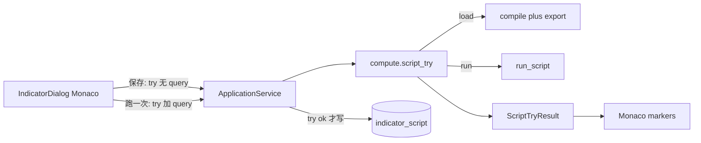

# Sprint9.4 迭代文档

> 状态：**已完成**
> 关联：[启动摘要](./Sprint9.4启动文档.md)、[Sprint9.3 迭代文档](./Sprint9.3迭代文档.md)、[Sprint9.2 迭代文档](./Sprint9.2迭代文档.md)、[Sprint9 迭代文档](./Sprint9迭代文档.md)、[Sprint9 头脑风暴文档](./Sprint9头脑风暴文档.md)、[架构文档](../trading-zone-electron架构文档.md)、开发计划 Cursor plan `sprint9.4_档e编辑器_b134c03e`

---

## 1. 当前迭代目标

落地头脑风暴档 E：Renderer 编辑器只编辑文本；保存时 load 类；跑一次走独立试跑通道；traceback 标回源码行。语法错误标到行；图不画半截。

### 1.1 目标声明

| # | 目标 | 验收口径 |
|---|---|---|
| G1 | Monaco 源码编辑 | 脚本 Dialog 用 Monaco 替换源码 TextField；Python 高亮；与图表仍是两个 UI |
| G2 | 保存先 load | load 失败不入库，traceback 标到行；成功则现有 `indicatorScript:create/update` |
| G3 | 跑一次 | 当前窗口试跑；通过只提示；失败标到行；不写布局、不替换当前 `ChartInput` |

### 1.2 范围边界（本迭代不做）

- 保存时 load 类抽 `manifest()`、按 `manifest.fields` 渲染设置表单（档 F）
- plot API 补全、完整 LSP、调试器、AI 补全
- 改默认新建骨架（仍是 `NotImplementedError`）
- 改 `chart:build` 丢实例策略、改 `ChartInput` Schema
- 把 Monaco 嵌进 `KlineChart`

### 1.3 技术选型（本迭代）

| 层 | 选型 |
|---|---|
| 壳 / 构建 | Electron + electron-vite（沿用）；Monaco 本地打包，禁止 CDN |
| UI | 脚本 Dialog：Monaco + 取消 / 跑一次 / 保存；失败 marker + 底部 Alert |
| 业务 | 保存前 `indicatorScript:try`（无 query）；跑一次带当前选股 `query` |
| 数据 / 计算 | `compute.script_try`：无 query 只 load；有 query 则查 OHLCV 再 `run_script` |
| 协议 | `ChartInput` v1 不变；试跑结果 `{ ok, error?, traceback?, line?, column? }` |

### 1.4 已拍板结论

| # | 议题 | 结论 |
|---|---|---|
| 1 | 编辑器职责 | 只编辑文本；执行在 Python 子进程；禁止 Pyodide |
| 2 | 试跑通道 | 新方法 `compute.script_try`；禁止复用 `compute.indicator`（compose 会吞错误） |
| 3 | 保存 | 先 load（compile + 导出子类），失败不入库；不 `compute()`、不抽 manifest |
| 4 | 默认骨架 | `NotImplementedError` 可以保存；跑一次才在该行失败 |
| 5 | 跑一次 | 当前草稿，不必先保存；`params={}`；不写布局、不 `setChartRaw` |
| 6 | 无选股 / 空窗口 | 控制面错误，无行号 |
| 7 | traceback | Python 解析 `<user_indicator>`；Monaco `setModelMarkers` |
| 8 | 信封 | worker 信封 `ok: true`；用户脚本对错放在 result，避免变成 `handler_error` 丢掉行号 |
| 9 | Monaco | `monaco-editor` + `@monaco-editor/react` + `loader.config({ monaco })` |

---

## 2. 功能需求

### 2.1 用户故事

1. 作为指标作者，我可以在高亮编辑器里改 Python 源码，而不是纯文本框。
2. 作为指标作者，语法错误或未导出 `indicator` 时，保存会失败，错误标到行，库里不会出现这条坏记录。
3. 作为指标作者，我可以对当前草稿点「跑一次」，用当前选股窗口验证能否算出 fragment，不必先保存、也不必挂到布局。
4. 作为图表用户，试跑失败时当前 K 线与已上图指标保持原样，不会画出半截脚本。

### 2.2 功能清单

| ID | 功能 | 优先级 | 状态 |
|---|---|---|---|
| F01 | Monaco 替换脚本源码 TextField | P0 | 已完成 |
| F02 | `compute.script_try` + traceback 行号 | P0 | 已完成 |
| F03 | 保存前 load；失败不入库 | P0 | 已完成 |
| F04 | 跑一次：当前窗口试跑，图不画半截 | P0 | 已完成 |

### 2.3 非功能需求

- Renderer 不 exec Python，也不直连 SQLite。
- Python 不碰脚本表；试跑的 `source` 来自草稿，不是布局。
- 不改 `ChartInput` 词汇；`chart:build` 失败脚本仍只丢掉该实例。
- 试跑用户脚本错误不得变成 worker `handler_error`，以免丢掉 `line`。

---

## 3. 详细设计说明

### 3.1 进程与数据流



`chart:build` 路径不变：失败脚本仍只丢掉该实例，编辑器侧另走试跑通道才能看见 traceback。

### 3.2 目录 / 模块（本迭代涉及）

```
prompt/trading-zone-electron开发文档/Sprint9/Sprint9.4启动文档.md
prompt/trading-zone-electron开发文档/Sprint9/Sprint9.4迭代文档.md
python/worker/indicators/sandbox.py
python/worker/handlers/try_script.py
python/worker/main.py
python/worker/indicators/__init__.py
python/scripts/smoke_chart_input.py
src/shared/types/pythonProtocol.ts
src/shared/types/indicatorScript.ts
src/main/services/applicationService.ts
src/main/ipc/registerHandlers.ts
src/preload/index.ts
src/preload/index.d.ts
src/renderer/src/pages/chart/IndicatorDialog.tsx
src/renderer/src/pages/chart/scriptEditor/monacoSetup.ts
src/renderer/src/pages/chart/scriptEditor/ScriptSourceEditor.tsx
src/renderer/src/pages/ChartPage.tsx
electron.vite.config.ts
```

不改：`contracts/chart_input.json`、布局表、脚本表结构、`compose` 丢实例策略、写死的 MA / MACD 设置表单。

### 3.3 数据模型 / 存储

脚本表本轮不改字段。`manifest` 保存时仍走 `emptyScriptManifest`（档 F 再抽类字段）。

试跑不写库、不写布局。

### 3.4 协议 / API / IPC

| 层 | 名称 | 形状 |
|---|---|---|
| Worker | `compute.script_try` | 入参 `{ source, params?, query? }`；出参 `ScriptTryResult` |
| IPC | `indicatorScript:try` | 同 worker 入参 / 出参 |
| IPC | `indicatorScript:create/update` | 返回值不变；Dialog 保存前先 try |

`ScriptTryResult`：

- 通过：`{ ok: true }`
- 失败：`{ ok: false, error, traceback, line, column }`（`line` / `column` 可为 null）

无 `query` = 只 load；有 `query` = 查 OHLCV 再 `run_script`。空窗口：`ok: false`，错误「当前窗口没有K线」，无行号。

### 3.5 核心编排

1. 保存：Dialog `try({ source })` → 失败则 marker、不关闭、不调用 create/update → 成功再 create/update。
2. 跑一次：无选股则禁用或提示「请先选股」；有选股则 `try({ source, params: {}, query })`；成功清 marker 并提示「通过」；失败标到行。两者都不 `chart:build`。
3. Python：`load_indicator_class(source)` 做 compile + 导出检查；`user_script_diagnostic(exc)` 解析 `<user_indicator>`；有 query 时复用 `run_script`。
4. `chart:build` / compose 行为不变。

### 3.6 UI

- 脚本 Dialog 源码区改为 Monaco（`language: python`），容器给明确高度。
- 按钮：取消 / 跑一次 / 保存。无选股时禁用跑一次。
- 失败：`setModelMarkers` + 底部 `Alert`；成功跑一次清 marker 并提示「通过」。
- Monaco 不嵌进 `KlineChart`。

### 3.7 契约

| 层级 | 位置 |
|---|---|
| JSON Schema | `contracts/chart_input.json` 不变 |
| TypeScript | `ScriptTryResult`；`PYTHON_METHODS.computeScriptTry` |
| Python | `compute.script_try` handler；`load_indicator_class` / `user_script_diagnostic` |

---

## 4. 任务步骤

| 步骤 | 任务 | 产出 | 状态 |
|---|---|---|---|
| 1 | 启动摘要 + 迭代文档骨架 | 本文件与启动摘要 | 已完成 |
| 2 | sandbox 拆 load / diagnostic；`compute.script_try` | Python handler + smoke | 已完成 |
| 3 | IPC / preload / ApplicationService | `indicatorScript:try` | 已完成 |
| 4 | Monaco + Dialog 保存 / 跑一次 / marker | IndicatorDialog / ChartPage | 已完成 |
| 5 | smoke / typecheck | 第 5 节 | 已完成 |

### 4.1 本地复现命令

```bash
python\.venv\Scripts\python.exe python\scripts\smoke_chart_input.py
npm run typecheck
npm run dev
```

---

## 5. 测试结果 / 总结反馈

### 5.1 验收清单与结果

| 检查项 | 方式 | 结果 | 说明 |
|---|---|---|---|
| G1 Monaco 替换 TextField | 手工起窗 | 待补跑 | 脚本 Dialog 已接本地 Monaco；不嵌进图表 |
| G2 保存 load 失败不入库 | Python smoke | 通过 | `try_script` 语法错误 `line=1`；缺导出失败（2026-08-22） |
| G2 保存失败不入库 | 手工起窗 | 待补跑 | Dialog 保存前 `indicatorScript:try`，失败不调用 create/update |
| G3 跑一次 / 行号 | Python smoke | 通过 | 骨架 load 通过；`NotImplementedError` `line=6`；用户 MACD 试跑通过 |
| G3 图不画半截 | 手工起窗 | 待补跑 | 跑一次不 `chart:build` / 不 `setChartRaw` |
| 既有 compose / 上图 | Python smoke | 通过 | 8.3 / 9–9.3 断言仍过 |
| typecheck | `npm run typecheck` | 通过 | node + web（2026-08-22） |

### 5.2 关键命令记录

```
python\.venv\Scripts\python.exe python\scripts\smoke_chart_input.py
…（8.3 / 9–9.3 既有断言仍过）
compute.indicator script path: ok
try_script load skeleton: ok
try_script syntax line: ok
try_script missing export: ok
try_source NotImplementedError line: ok
try_source user MACD: ok

npm run typecheck
> tsc --noEmit -p tsconfig.node.json --composite false
> tsc --noEmit -p tsconfig.web.json --composite false
（2026-08-22 通过）
```

### 5.3 总结反馈

**做得好的地方**

- 试跑走独立 `compute.script_try`，用户脚本错误留在 result 里，不会变成 `handler_error` 丢掉行号。
- 保存只 load、跑一次才 `compute`；默认骨架可入库，报错标在 `raise NotImplementedError` 那一行。
- smoke 把语法错误 `line=1`、骨架运行时 `line=6`、用户 MACD 试跑通过锁死。

**暴露的问题 / 摩擦**

- Monaco / 保存不入库 / 跑一次不改图仍需手工起窗补跑。
- 保存仍写 `emptyScriptManifest`，设置表单还读不到脚本 Field（档 F）。
- 失败 Alert 会带上完整 traceback，偏长。

---

## 6. 改进目标

### 6.1 短期（下一迭代可做）

1. 档 F：按 `manifest.fields` 渲染设置表单（内置也可去掉写死表单）。
2. 保存时 load 类抽 `manifest()`。

### 6.2 中期

1. 多套命名布局、按股票记忆。
2. plot API 补全（`line` / `subplot` / 字段名）。

### 6.3 长期

1. Arrow 数据面传输 `series`；窗读进 Renderer。
2. `compute.indicator` 句柄 / 批处理 / 取消与缓存键。
3. 内置 catalog 改为启动时从类 `manifest()` 下发。

---

## 附录

### A. 相关文档

- [Sprint9.4 启动摘要](./Sprint9.4启动文档.md)
- [Sprint9.3 迭代文档](./Sprint9.3迭代文档.md)
- [Sprint9.2 迭代文档](./Sprint9.2迭代文档.md)
- [Sprint9.1 迭代文档](./Sprint9.1迭代文档.md)
- [Sprint9 迭代文档](./Sprint9迭代文档.md)
- [Sprint9 头脑风暴文档](./Sprint9头脑风暴文档.md)
- [架构文档](../trading-zone-electron架构文档.md)

### B. 常用命令

| 命令 | 用途 |
|---|---|
| `npm run dev` | 开发起窗 |
| `npm run typecheck` | TS 检查 |
| `python\.venv\Scripts\python.exe python\scripts\smoke_chart_input.py` | Indicator / compose / 试跑 smoke |
