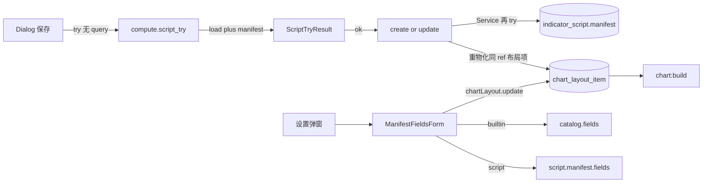

# Sprint9.5 迭代文档

> 状态：**已完成**
> 关联：[启动摘要](./Sprint9.5启动文档.md)、[Sprint9.4 迭代文档](./Sprint9.4迭代文档.md)、[Sprint9 迭代文档](./Sprint9迭代文档.md)、[Sprint10 迭代文档](../Sprint10/Sprint10迭代文档.md)、[Sprint9 头脑风暴文档](./Sprint9头脑风暴文档.md)、[架构文档](../trading-zone-electron架构文档.md)、开发计划 Cursor plan `sprint9.5_档f_c33863d9`

---

## 1. 当前迭代目标

落地头脑风暴档 F：保存时从已 load 的类抽出 `manifest()` 入库；设置弹窗按 `manifest.fields` 通用渲染。内置去掉写死表单，脚本也能改参数。

### 1.1 目标声明

| # | 目标 | 验收口径 |
|---|---|---|
| G1 | 保存抽 manifest | load 成功后脚本表写入类 `manifest()`；坏 Field 不入库；骨架 `fields=[]` 仍可保存 |
| G2 | 通用设置表单 | 内置去掉 MaForm/MacdForm；按 `fields` 画控件；改周期后图变，重启仍在 |
| G3 | 脚本可调参 | 脚本布局项可开设置；改 Field 后已上图实例重物化；改值后上图 |

### 1.2 范围边界（本迭代不做）

- 启动时从 Python `manifest()` 下发内置 catalog
- 自由字符串 / 布尔 / 枚举 / 嵌套对象
- 改 `ChartInput`、compose 丢实例策略、默认新建骨架
- plot API / LSP；跑一次不读设置表单
- 改图例里 MA / MACD 的硬编码文案

### 1.3 技术选型（本迭代）

| 层 | 选型 |
|---|---|
| 壳 / 构建 | Electron + electron-vite（沿用） |
| UI | `ManifestFieldsForm` 按 `widget` 渲染；内置与脚本共用 |
| 业务 | 保存：Service 再 `try({ source })` 后入库；更新脚本后重物化同 ref 布局项 |
| 数据 / 计算 | `compute.script_try` 无 query 时附带 `manifest`；不新开 worker 方法 |
| 协议 | `ScriptTryResult` 增加可选 `manifest`；`chartLayout:update` 吃 `LayoutItemParams` |

### 1.4 已拍板结论

| # | 议题 | 结论 |
|---|---|---|
| 1 | 抽 manifest 通道 | 挂在现有 `compute.script_try`；load 后 `cls.manifest()`；失败不入库 |
| 2 | 谁写入 schema | Main 再抽一次，不信任 Renderer 传入的 fields |
| 3 | 显示名 | `script.title` 用户可改；`manifest.key` / `title` 来自 ClassVar |
| 4 | 内置 fields | 写进 TS catalog，与 Python smoke 锁死 |
| 5 | 已上图脚本 | 改字段后 normalize：保留旧键、补默认、丢未知键 |

---

## 2. 功能需求

### 2.1 用户故事

1. 作为指标作者，我保存脚本后，设置表单能看到类上声明的周期、颜色等字段。
2. 作为图表用户，我改内置均线周期后图会变，重启后参数仍在。
3. 作为图表用户，我可以把用户脚本挂上图并改它的参数，不必删了重加。
4. 作为指标作者，Field 缺 `widget` / `title` 时保存失败，库里不会出现半份 schema。

### 2.2 功能清单

| ID | 功能 | 优先级 | 状态 |
|---|---|---|---|
| F01 | load 成功返回并入库 `manifest` | P0 | 已完成 |
| F02 | 按 `fields` 渲染通用设置表单 | P0 | 已完成 |
| F03 | 脚本布局项可设置；更新脚本重物化 params | P0 | 已完成 |

### 2.3 非功能需求

- Renderer 不 exec Python，也不直连 SQLite。
- Python 不碰脚本表；`manifest` 由 Main 从 try 结果写入。
- `params` 键集合必须等于 `manifest.fields[].name`；写入满字段。
- 不改 `ChartInput` 词汇。

---

## 3. 详细设计说明

### 3.1 进程与数据流



Dialog 的 try 只负责 Monaco marker；入库以 Service 第二次 try 为准。

### 3.2 目录 / 模块（本迭代涉及）

```
prompt/trading-zone-electron开发文档/Sprint9/Sprint9.5启动文档.md
prompt/trading-zone-electron开发文档/Sprint9/Sprint9.5迭代文档.md
python/worker/indicators/sandbox.py
python/scripts/smoke_chart_input.py
contracts/indicator_catalog.json
src/shared/types/indicatorScript.ts
src/shared/types/chartLayout.ts
src/shared/chart/indicatorCatalog.ts
src/shared/chart/indicatorScript.ts
src/main/db/indicatorScriptRepository.ts
src/main/services/applicationService.ts
src/main/ipc/registerHandlers.ts
src/preload/index.ts
src/preload/index.d.ts
src/renderer/src/pages/chart/ManifestFieldsForm.tsx
src/renderer/src/pages/chart/IndicatorDialog.tsx
src/renderer/src/pages/ChartPage.tsx
```

不改：`contracts/chart_input.json`、compose 丢实例策略、默认新建骨架、Monaco、图例硬编码。

### 3.3 数据模型 / 存储

脚本表字段不改。`manifest` 从空壳改为类 `manifest()` 的 JSON：`key` / `title` / `fields` / `defaultParams`。

布局 `params`：添加脚本时拷 `defaultParams`；改源码后按新 fields normalize。

旧行空壳 manifest：用户再保存一次才有 fields。

### 3.4 协议 / API / IPC

| 层 | 名称 | 形状 |
|---|---|---|
| Worker | `compute.script_try` | 无 query 成功：`{ ok: true, manifest }`；失败仍 `{ ok: false, error, traceback, line, column }` |
| IPC | `indicatorScript:create/update` | 入参仍 `{ title, source }`；Service 内部 try 后写 manifest |
| IPC | `chartLayout:update` | `{ id, params }`；`params` 为 `LayoutItemParams`；builtin 与 script 均可 |

### 3.5 核心编排

1. 保存：Dialog `try({ source })` → marker；成功再 create/update → Service 再 try → 写入 `manifest`。
2. 更新脚本：入库后对 `kind=script && ref===id` 的布局项 normalize 并写回。
3. 设置：按 catalog / 脚本 `fields` 画表单；保存走 `chartLayout:update`（满字段校验）。
4. 跑一次：仍 `params={}`，不读设置表单。

### 3.6 UI

- 设置弹窗：`ManifestFieldsForm`；`fields.length === 0` 时提示「没有可调参数」。
- 当前布局：builtin 与 script 都显示「设置」。
- 摘要：用 int/float 字段的 `title + 值` 拼接。

### 3.7 契约

| 层级 | 位置 |
|---|---|
| JSON Schema | `contracts/indicator_catalog.json` 增加 `fields` |
| TypeScript | `ScriptTryResult.manifest?`；`IndicatorCatalogEntry.fields`；通用 `assertParams` / `normalizeParams` |
| Python | `try_source` load 成功带 `manifest` |

---

## 4. 任务步骤

| 步骤 | 任务 | 产出 | 状态 |
|---|---|---|---|
| 1 | 启动摘要 + 迭代文档骨架 | 本文件与启动摘要 | 已完成 |
| 2 | `try_source` load 返回 manifest + smoke | sandbox / smoke | 已完成 |
| 3 | Service 入库 + 重物化 + update 放开 script | ApplicationService / repo / IPC | 已完成 |
| 4 | catalog fields + 通用 normalize | indicatorCatalog.ts | 已完成 |
| 5 | ManifestFieldsForm 替换写死表单 | IndicatorDialog / ChartPage | 已完成 |
| 6 | smoke / typecheck | 第 5 节 | 已完成 |

### 4.1 本地复现命令

```bash
python\.venv\Scripts\python.exe python\scripts\smoke_chart_input.py
npm run typecheck
npm run dev
```

---

## 5. 测试结果 / 总结反馈

### 5.1 验收清单与结果

| 检查项 | 方式 | 结果 | 说明 |
|---|---|---|---|
| G1 保存抽 manifest | Python smoke | 通过 | 骨架 `fields=[]`；用户 MACD fields/defaultParams 对齐；缺 widget 的 Field `ok: false`（2026-08-23） |
| G2 通用表单 / 改周期 | 手工起窗 | 待补跑 | Dialog 已接 `ManifestFieldsForm`；MaForm/MacdForm 已删 |
| G3 脚本设置与重物化 | 手工起窗 | 待补跑 | 脚本也可开设置；update 后 normalize 同 ref 布局项并重载图 |
| 既有 compose / 上图 | Python smoke | 通过 | 8.3 / 9–9.4 断言仍过 |
| typecheck | `npm run typecheck` | 通过 | node + web（2026-08-23） |

### 5.2 关键命令记录

```
python\.venv\Scripts\python.exe python\scripts\smoke_chart_input.py
…（8.3 / 9–9.4 既有断言仍过）
try_script load skeleton: ok
try_script load user MACD manifest: ok
try_script missing widget field: ok
try_script syntax line: ok
try_script missing export: ok
try_source NotImplementedError line: ok
try_source user MACD: ok

npm run typecheck
> tsc --noEmit -p tsconfig.node.json --composite false
> tsc --noEmit -p tsconfig.web.json --composite false
（2026-08-23 通过）
```

### 5.3 总结反馈

**做得好的地方**

- 抽 manifest 挂在现有 `compute.script_try` 上，不新开 worker 方法；`manifest()` 失败与语法错误同一套 result，不会入库半份 schema。
- 内置与脚本共用 `assertParams` / `normalizeParams` / `ManifestFieldsForm`，catalog 与 Python `manifest()` 的 fields 对齐。
- 脚本改字段后重物化已上图实例，避免旧行 `params={}` 打开设置是空框。

**暴露的问题 / 摩擦**

- 通用表单、改周期重启仍在、脚本设置上图仍需手工起窗补跑。
- 旧库空壳 manifest 必须再保存一次才有 fields。
- 跑一次仍 `params={}`，不带设置表单当前值。
- Dialog 保存先 try 一次、Service 再 try 一次，多一次 load。

---

## 6. 改进目标

### 6.1 短期（下一迭代可做）

1. 手工补跑：改内置周期后图变且重启仍在；脚本加 Field 后设置可改并上图。
2. 跑一次带上当前草稿的 `defaultParams` 或设置表单值，而不是 `{}`。
3. 旧脚本打开编辑器时自动再抽一次 manifest，免去「必须再保存」。

### 6.2 中期

1. 多套命名布局、按股票记忆。
2. plot API 补全（`line` / `subplot` / 字段名）。

### 6.3 长期

1. Arrow 数据面传输 `series`；窗读进 Renderer。
2. `compute.indicator` 句柄 / 批处理 / 取消与缓存键。
3. 内置 catalog 改为启动时从类 `manifest()` 下发。

---

## 附录

### A. 相关文档

- [Sprint9.5 启动摘要](./Sprint9.5启动文档.md)
- [Sprint9.4 迭代文档](./Sprint9.4迭代文档.md)
- [Sprint9.3 迭代文档](./Sprint9.3迭代文档.md)
- [Sprint9 迭代文档](./Sprint9迭代文档.md)
- [Sprint9 头脑风暴文档](./Sprint9头脑风暴文档.md)
- [架构文档](../trading-zone-electron架构文档.md)

### B. 常用命令

| 命令 | 用途 |
|---|---|
| `npm run dev` | 开发起窗 |
| `npm run typecheck` | TS 检查 |
| `python\.venv\Scripts\python.exe python\scripts\smoke_chart_input.py` | Indicator / compose / 试跑 smoke |
