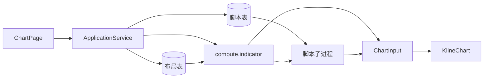

# Sprint9 头脑风暴文档

> 状态：头脑风暴（非正式迭代文档）
> 来源：Sprint8.3 中期改进「自定义脚本存储 + Renderer 编辑器 + 独立脚本子进程」；本轮讨论先钉脚本数据模型
> 关联：[Sprint9 启动摘要](./Sprint9启动文档.md)、[Sprint9 迭代文档](./Sprint9迭代文档.md)、[Sprint8.3 迭代文档](../Sprint8/Sprint8.3迭代文档.md)、[中期架构梳理草稿](../Sprint8/中期架构梳理草稿.md)、[Sprint7 头脑风暴文档](../Sprint7/Sprint7头脑风暴文档.md)、[架构文档](../trading-zone-electron架构文档.md)

本文只沉淀讨论结论，不代替 Sprint9 启动摘要与迭代文档。Sprint7 已拍「先契约后编辑器、内置与脚本同一出口」；Sprint8 已把契约、plot 方言、布局实例铺完。本轮补的是：**用什么 Python 模型创建指标并上图**。

---

# 第一部分　功能全貌

## 1. 讨论从哪来

Sprint8.3 已做到：同一张图可挂多条同种内置指标；布局实例 `id` 与 catalog key 分离；compose 给 primitive / 副图 pane 加实例前缀。范围边界写明不做自定义脚本。

中期目标仍是那三件套：脚本存储、Renderer 编辑器（只编辑）、独立脚本子进程。本轮没有开迭代，先把全貌和数据模型讲清楚，避免一上来做 Monaco。

结论先说：

**自定义脚本不是新图表能力，而是 `ChartInput` 的又一个生产者。** 产品体验可以像通达信 / Pine（写脚本 → 保存 → 图上出现线/柱）；实现必须继续走已有轨道：Python 计算、plot 方言、通道只吃 `ChartInput`。

## 2. 用户眼里是三件事

这三件事数据面、进程和失败语义都不同，不能揉成「做一个指标编辑器」。

| # | 动作 | 改什么 | 跑不跑 Python | 出不出 ChartInput |
|---|---|---|---|---|
| 1 | 创建 / 编辑脚本（资产） | 脚本表：源码 + 物化 manifest | 保存时只为抽 manifest / 试跑 | 保存本身不出图 |
| 2 | 挂到图上（布局） | 布局实例：uuid + kind + ref + params | 否 | 否 |
| 3 | 出图（计算） | 不写库；Main 读布局（脚本再取源码） | 是 | 是 |

- 编辑器和图表是两个 UI，共用脚本记录；Monaco 不嵌进 `KlineChart`。
- 保存失败只影响编辑器。计算失败（语法、超时、校验）作为控制面结果回编辑器，图表不画半截。
- 「跑一次」用当前选股窗口，**不写布局**，保存与上图解耦。

## 3. 已落地的轨道

Sprint7–8.3 实际是在为脚本铺路，不是只堆内置品种。

| 已落地 | 对脚本意味着什么 |
|---|---|
| `ChartInput`：`primitives` + `series` | 脚本的唯一合法出口 |
| plot 方言：`line` / `histogram` / `subplot` / `output` | 用户要学的就是这一小份 API |
| `ma.py` / `macd.py` 吐 `PlotFragment` | 内置已经是脚本样板 |
| `compose` 按实例 id 加前缀 `{id}:{localName}` | 双实例、删一条，脚本同样走这套 |
| `compute.indicator(query + instances)` | 入口可扩展，不必再开一条建图 IPC |
| 目录 JSON 只读、布局 SQLite 可写 | 脚本必须是**第三份存储** |

作者心智模型（Sprint7 已写，本轮不改）：算和画写在同一函数里，出进程后只剩数据和声明。

```python
def compute(ohlcv, params):
    dif, dea, hist = macd(ohlcv.close, **params)
    return output(
        subplot("macd",
            line("dif", dif, color="#f5a623"),
            line("dea", dea, color="#4a90d9"),
            histogram("macd", hist, color_by_sign=("#ef5350", "#26a69a")),
        )
    )
```

本轮把它收成 **Pydantic 类**：`params` 是实例字段，`compute(self, ohlcv)` 仍返回 `PlotFragment`。见第三部分。

## 4. 三份存储，不要合成一张元数据表

沿用 [中期架构梳理草稿](../Sprint8/中期架构梳理草稿.md)。

| | 目录 Catalog | 布局 Layout | 脚本 Script |
|---|---|---|---|
| 存什么 | 可添加的内置及默认参数 | 这张图挂了哪些**实例** | 源码、显示名、物化 manifest |
| 位置 | `indicator_catalog.json`（或改为类 `manifest()`） | `chart_layout` + `chart_layout_item` | SQLite（尚未建） |
| 谁改 | 产品发版 | 用户增删改参数 | 用户编辑保存 |
| 算图角色 | add 时拷默认 params | Main 读出 instances | Main 取源码交给子进程 |
| 状态 | 已落地 ma / macd | 已落地，id ≠ builtin | 未做 |

当前布局行是 `id + builtin + params`。`builtin` 只能是内置 key，**装不下脚本引用**。上图前必须拆成 `kind + ref`，见第五部分。

## 5. 运行时：内置走 registry，脚本走子进程

今天：

```text
ChartPage → chart:build → ApplicationService 读布局
  → compute.indicator(query, instances) → compose(REGISTRY) → ChartInput → KlineChart
```

中期在 compose 旁加支路：脚本实例不进 `REGISTRY`，进**独立子进程**。子进程只注入 `Ohlcv` 与 plot API，不注入 `worker.*`、DuckDB、Token、文件系统；算完退出。主 worker 仍负责：查行情、跑内置、给所有 fragment 加实例前缀、`output()` 成一份 `ChartInput`、校验。



沙箱三条路里，**否掉**「同进程 `exec` + 白名单 import」作为默认。也不要在 Renderer 用 Pyodide。

## 6. 硬约束（本轮重申，不再议）

- Renderer 不 exec Python；编辑器不是运行时。
- 内置与脚本通道看到的必须一样：若干 primitives + 对齐 series。
- 不改 `ChartInput` v1 词汇，不为脚本开平行绘图协议。
- 脚本只能叠加或副图，不能重定义 `timeDomain` / `candle`。
- 错位点在 plot API 丢掉，通道不重算。
- 错误回编辑器；图表只接受通过校验的 spec。
- 图例美化、多套布局、按股票记忆、Arrow 传 `series` 都不是本功能前置。

---

# 第二部分　为什么先钉数据模型

讨论中明确：脚本的数据模型比编辑器更重要。目标是 **用这个模型可以直接创建一条指标，并显示到图表 UI**。

不是先做 Monaco。契约（`ChartInput` + plot 方言）已完成；缺的是「定义 / 实例 / 上图」的单一来源。现在同一份均线拆在四处，彼此要对齐：

| 现在分散在 | 收进模型之后 |
|---|---|
| `indicator_catalog.json` 默认 params | `MA().model_dump()` / `manifest()` |
| TS `MaParams` + Python `MaParams` | 一类字段；TS 只留 Manifest / Instance |
| `compose.REGISTRY[builtin](times, closes, params)` | `cls(**params).compute(ohlcv)` |
| `IndicatorDialog` 按 builtin 写死表单 | 按 `manifest.fields` 的 `widget` 渲染 |

纯函数算得出图、给不出 UI schema；纯 JSON 给得出 schema、算不出数列。因此作者单元是 **Python 类**，不是函数，也不是另一份元数据表。

落地证明（建议作为 Sprint9 第一档，仍可不做编辑器）：

```python
to_chart_input(bars, [("ma", MA()), ("macd", MACD())])
```

与当前 `compose` 出口一致。这条过了，用户脚本只是「从源码 load 出同一个基类」。

---

# 第三部分　Indicator 类怎么设计

## 1. 一句话

**构造这个对象就是创建指标，调用 `compute` 就能上图。** 表单和数据库只保存它的实例快照。通道、弹窗、布局都是投影。

```text
作者写的类  ──构造──►  内存里的指标实例
                 │
                 ├── model_dump() ──► 布局 params / 表单
                 ├── manifest()   ──► 弹窗「有哪些框」
                 └── compute()    ──► PlotFragment ──► ChartInput ──► 图
```

## 2. 基类四块

```python
class Indicator(BaseModel):
    model_config = ConfigDict(extra="forbid")

    key: ClassVar[str]
    title: ClassVar[str]

    def compute(self, ohlcv: Ohlcv) -> PlotFragment:
        raise NotImplementedError

    @classmethod
    def manifest(cls) -> IndicatorManifest:
        ...
```

| 成员 | 层 | 含义 |
|---|---|---|
| `key` / `title` | `ClassVar` | 品种身份与清单显示名。表单不出现这两项 |
| 子类字段 | 实例 | **就是 params**。基类本身没有实例字段 |
| `compute(ohlcv)` | 方法 | 局部短名；禁止返回完整 `ChartInput` |
| `manifest()` | classmethod | 从 `Field` 抽出，禁止手写第二份 schema |

`key` / `title` 属于**这种指标**，不属于**图上这一条**。同一张图两条均线，`key` 都是 `ma`，靠布局实例 `id`（uuid）区分。

脚本的 `key` 只是作者自称，**不保证全局唯一**。脚本的全局身份是脚本表主键；布局 `ref` 指向该主键。

## 3. 实例字段就是 params，不是写死常量

```python
class MA(Indicator):
    key = "ma"
    title = "均线"
    period: int = Field(default=20, ge=1, json_schema_extra={"widget": "int", "title": "周期"})
    color: str = Field(default="#2962FF", json_schema_extra={"widget": "color", "title": "颜色"})
    lineWidth: int = Field(default=2, ge=1, le=4, json_schema_extra={"widget": "lineWidth", "title": "线宽"})

    def compute(self, ohlcv: Ohlcv) -> PlotFragment:
        values = sma(list(ohlcv.close), self.period)
        return line(
            "ma",
            values,
            times=ohlcv.time,
            color=self.color,
            line_width=self.lineWidth,
        )
```

每个 `Field` 同时干四件事：字段名（库键 / 表单绑定 / `self.period`）、默认值、校验、`widget`（控件类型）。

`extra="forbid"`：多键拒绝。写入必须满字段，禁止 `{}` 或部分对象（沿用 Sprint8.1）。算法参数与样式仍混在同一组字段，不另开 `style` 列。

`MA()` 才是周期 20；`MA(period=5)` 才是图上那条 MA5。类上出现 `period` 是**声明 schema**，不是把参数从设置表单挪走。

## 4. 类字段与表单没有差距

讨论中曾问：参数放在类里，是否和「参数放在表单」矛盾。结论：**没有差距，是同一份 params 的三个面。**

| 层 | 放什么 | 现在在哪 | 模型里对应什么 |
|---|---|---|---|
| 声明 | 有周期、默认 20、必须 ≥1 整数 | 目录 JSON + TS `MaParams` + Python `MaParams` | `class MA` 上的 `period: int = Field(...)` |
| 编辑 | 用户把这条均线改成 5 | `IndicatorDialog` 的 `MaForm` | 仍是这个表单，按 `manifest().fields` 画 |
| 落库 / 上图 | `{ period: 5, color, lineWidth }` | `chart_layout_item.params` | `MA(**params)` 再 `compute` |

路径：

```text
用户在表单输入 5
  → 布局 params = { period: 5, color, lineWidth }
  → worker: MA(period=5, color=..., lineWidth=...)
  → compute() → ChartInput → 图上变成 MA5
```

Renderer 不能 `import MA`。点「添加」= 拷 `defaultParams` 写成布局 Instance；下次 `chart:build` 再灌回类上调用 `compute`。

## 5. `Ohlcv`：脚本看到的行情

```python
@dataclass(frozen=True)
class Ohlcv:
    time: tuple[str, ...]
    open: tuple[float, ...]
    high: tuple[float, ...]
    low: tuple[float, ...]
    close: tuple[float, ...]
    volume: tuple[float, ...]
```

只读、等长。`time` 为 `YYYY-MM-DD`，与主图对齐。不含 `candle` / `timeDomain`，脚本改不了主序列。空窗口不进入 `compute`（无 bar 仍直接 `null` ChartInput）。`None` / NaN 由 plot 方言丢掉。

今天内置只拿 `times + closes`；此结构是超集。

## 6. `compute` 只返回 `PlotFragment`

类**不**返回完整 `ChartInput`。否则脚本能改 `timeDomain` / `candle`，打破「一个时间域、一个光标」。

局部图元 id 仍用短名（`ma` / `dif` / `dea`）。实例前缀继续由现有 compose 规则加：`{instanceId}:{localName}`；非 `main` 的 pane 改为实例 id。作者不感知 uuid。

上图函数在类外面，因为它要合并多条并准备 K 线：

```python
def to_chart_input(bars, items: list[tuple[str, Indicator]]) -> ChartInput:
    ohlcv = Ohlcv.from_bars(bars)
    fragments = [
        prefix_fragment(indicator.compute(ohlcv), instance_id)
        for instance_id, indicator in items
    ]
    return output(*fragments, candle=ohlcv.candle, volume=ohlcv.volume)
```

## 7. 用户脚本与内置同一基类

模块约定显式导出，避免扫描一堆子类：

```python
class RSI(Indicator):
    key = "rsi"
    title = "RSI"
    period: int = Field(default=14, ge=1, json_schema_extra={"widget": "int", "title": "周期"})

    def compute(self, ohlcv: Ohlcv) -> PlotFragment:
        return subplot("rsi", line("rsi", rsi(ohlcv.close, self.period), times=ohlcv.time))

indicator = RSI
```

worker 统一：

```text
cls = REGISTRY[ref]          if kind == "builtin"
cls = load_indicator(source) if kind == "script"
cls.model_validate(params).compute(ohlcv)
```

保存脚本时 worker load 出类、抽出 `manifest()`，和源码一起入库；之后 UI 只读 manifest，不读 `.py`。load 失败则保存失败，不入库。

---

# 第四部分　正式字段清单

四份契约，彼此投影，不重复发明。`ChartInput` v1 不在本清单扩字段。

## 1. `Indicator` 基类

| 字段 / 成员 | 层 | 类型 | 必填 | 说明 |
|---|---|---|---|---|
| `key` | ClassVar | 非空 string | 是 | 内置 = catalog key（`ma` / `macd`）。脚本不保证全局唯一 |
| `title` | ClassVar | 非空 string | 是 | 清单默认显示名 |
| 子类字段 | 实例 | 见 §3 | 可以没有 | 就是 params |
| `compute(ohlcv)` | 方法 | → `PlotFragment` | 是 | 局部短名 |
| `manifest()` | classmethod | → `IndicatorManifest` | 是 | 从 Field 生成 |

## 2. Field 元数据（`json_schema_extra`）

| 键 | 类型 | 必填 | 说明 |
|---|---|---|---|
| `widget` | `int` \| `float` \| `color` \| `lineWidth` | 是 | 决定弹窗控件 |
| `title` | 非空 string | 是 | 表单标签，中文（「周期」不是 `period`） |

| widget | 存库 / TS 值 | 约束 | 控件 |
|---|---|---|---|
| `int` | 整数 number | `Field(ge/le)` | 数字框，step=1 |
| `float` | number | 同上 | 数字框 |
| `color` | 非空 string | `min_length=1` | 色板 + 文本 |
| `lineWidth` | `1 \| 2 \| 3 \| 4` | `ge=1, le=4` | 下拉 |

第一档不做自由字符串、布尔、枚举、嵌套对象。`params` 键集合必须等于 `manifest.fields[].name`。

## 3. 第一批内置字段（锁死为现状，不改产品语义）

**MA**（`key=ma`，`title=均线`）

| name | widget | title | default | 约束 |
|---|---|---|---|---|
| `period` | int | 周期 | 20 | ≥1 |
| `color` | color | 颜色 | `#2962FF` | 非空 |
| `lineWidth` | lineWidth | 线宽 | 2 | 1–4 |

**MACD**（`key=macd`，`title=MACD`）

| name | widget | title | default | 约束 |
|---|---|---|---|---|
| `fast` | int | 快线 | 12 | ≥1 |
| `slow` | int | 慢线 | 26 | ≥1 |
| `signal` | int | 信号 | 9 | ≥1 |
| `difColor` | color | DIF 颜色 | `#f5a623` | 非空 |
| `deaColor` | color | DEA 颜色 | `#4a90d9` | 非空 |
| `difLineWidth` | lineWidth | DIF 线宽 | 1 | 1–4 |
| `deaLineWidth` | lineWidth | DEA 线宽 | 1 | 1–4 |
| `histUpColor` | color | 柱涨颜色 | `#ef5350` | 非空 |
| `histDownColor` | color | 柱跌颜色 | `#26a69a` | 非空 |

`compute` 局部 id 不改：MA 仍是 `ma`；MACD 仍是 `subplot("macd")` + `dif` / `dea` / `macd`。

## 4. `IndicatorManifest`（UI 只读这份）

```ts
type ParamWidget = 'int' | 'float' | 'color' | 'lineWidth'

interface ParamField {
  name: string
  widget: ParamWidget
  title: string
  default: number | string
  min?: number
  max?: number
}

interface IndicatorManifest {
  key: string
  title: string
  fields: ParamField[]
  defaultParams: Record<string, number | string>
}
```

- `fields` 顺序 = 表单从上到下。
- `defaultParams` 键必须与 `fields[].name` 恰好一致。
- `min` / `max`：int / float / lineWidth 从 Field 带来；color 不带。
- 内置：启动时从类 `manifest()` 得到（或 JSON 与它 smoke 锁死）。
- 脚本：保存时物化进脚本表。

## 5. 布局 Instance（SQLite / IPC）

今天 `builtin` 列语义拆成 `kind + ref`。

| 字段 | 类型 | 内置 | 脚本 |
|---|---|---|---|
| `id` | string PK | 新加 uuid 去横线；种子 `ma` / `macd` 不改写 | uuid 去横线 |
| `layoutId` | string | 现 `default` | 同 |
| `kind` | `builtin` \| `script` | `builtin` | `script` |
| `ref` | 非空 string | `ma` / `macd`（= 类 key） | **脚本表主键**（≠ 类 key） |
| `params` | object 满字段 | `MA` / `MACD` 的 `model_dump()` | 该类 `model_dump()` |
| `sortOrder` | int | 已有 | 已有 |

旧行迁移：`kind = builtin`，`ref = 原 builtin`。**布局行不存 `source`。**

IPC：`chartLayout:add` 将来是 `{ kind, ref }`，不再只传 `builtin`。

## 6. 脚本表（资产，尚未建）

| 字段 | 类型 | 说明 |
|---|---|---|
| `id` | 主键 | 布局 `kind=script` 的 `ref` |
| `title` | 非空 string | 可改显示名；首次保存用 `class.title` |
| `source` | string | 完整 Python 源码 |
| `manifest` | `IndicatorManifest` JSON | 保存时 load 类后物化 |
| `updatedAt` | ISO 时间 | — |

仍被布局引用的脚本，第一档禁止删除。

## 7. 过桥 Instance（`compute.indicator`）

与布局几乎同一形状，脚本多一个由 Main 注入的字段：

| 字段 | 内置 | 脚本 |
|---|---|---|
| `id` | 布局 id，作 primitive 前缀 | 同 |
| `kind` / `ref` / `params` | 与布局相同 | 同 |
| `source` | 禁止出现 | Main 从脚本表读出后附上 |

Python 仍不碰 SQLite（沿用 Sprint8.2）。

## 8. `Ohlcv`

| 字段 | 类型 |
|---|---|
| `time` | `tuple[str, …]`，`YYYY-MM-DD` |
| `open` / `high` / `low` / `close` / `volume` | 等长 `tuple[float, …]` |

## 9. 刻意不进本清单

- `ChartInput` 词汇（v1 不动）
- 图例显示名、多套布局、按股票记忆
- 脚本超时 / 内存上限（执行策略，不是指标字段）
- 编辑器光标、未保存草稿

TS 迁移对照：

```text
BuiltinKey + MaParams / MacdParams  → 两类 Indicator 的实例字段
IndicatorCatalogEntry               → IndicatorManifest
ChartLayoutItem.builtin             → kind + ref
ComputeIndicatorInstance            → 同上，脚本多 source
```

---

# 第五部分　落地顺序与未决项

## 1. 建议切片（先契约类，后编辑器）

头脑风暴已写：先契约后编辑器。契约已完成，下一步不是先做 Monaco。

| 档 | 做什么 | 验收 |
|---|---|---|
| A 模型 | `Indicator` / `Ohlcv` / `manifest`；MA / MACD 收成子类；`to_chart_input` 对上现 compose | smoke 与 8.3 出口一致 |
| B 存储 | 脚本表 + IPC CRUD；弹窗能列出用户脚本（还不能算） | 保存 / 改名 / 删；布局暂不引用 |
| C 执行 | 子进程跑一份源码 → `PlotFragment`；compose 能合并 | smoke：用户 MACD 与内置同出口 |
| D 上图 | 布局项 `kind + ref`；`chart:build` 带源码 | 挂上、删一条、双实例前缀不撞 |
| E 编辑器 | 高亮、保存、跑一次、traceback 回标 | 语法错误标到行；图不画半截 |
| F 参数 | schema → 设置表单（内置也可改掉写死表单） | 改周期后图变，重启仍在 |

A 可以单独开成 Sprint9 第一档，不必等编辑器。

## 2. 本轮已拍板

1. 作者单元是 Pydantic `Indicator` 类，不是函数，也不是纯 JSON。
2. 类返回 `PlotFragment`，`to_chart_input` 在类外合并。
3. 类字段 = params 声明；表单 = 实例取值编辑器；布局 = 快照。
4. `widget` 第一档仅四类：`int` / `float` / `color` / `lineWidth`。
5. 布局拆 `kind + ref`；脚本 `ref` = 脚本表主键；布局不存源码。
6. 源码由 Main 注入过桥；Python 不读 SQLite。
7. 脚本子进程为默认执行隔离；同进程 `exec`、Renderer Pyodide 否决。
8. 不改 `ChartInput` Schema。

## 3. 开迭代时还要写进启动摘要的

这些已有倾向，但未写成 Sprint 任务：

1. 子进程允许的 import（倾向：numpy + plot API；禁止 `os` / `socket` / `worker.*`）。
2. 超时谁杀、一张图里一个脚本崩了是否只丢掉该实例。
3. 脚本表 `title` 与 `class.title` 谁覆盖谁（倾向：表可改显示名，manifest.title 作首次默认）。
4. 内置 catalog JSON 是删除、改由 `manifest()` 生成，还是保留并用 smoke 锁死同步。
5. 图例仍 `primitive.id.toUpperCase()`（8.3 已暴露 uuid 前缀问题）；与脚本第一档可拆开。

---

# 附录　一句话对照

| 问题 | 结论 |
|---|---|
| 自定义脚本是什么 | `ChartInput` 的又一个生产者，不是新通道 |
| 用户三件事 | 存脚本 ≠ 挂布局 ≠ 出图 |
| 三份存储 | 目录 / 布局 / 脚本，不要合成一张表 |
| 作者写什么 | `Indicator` 子类 + plot 方言，不是自研 DSL |
| 参数在哪 | 类上声明，表单编辑，布局存储，是同一份 |
| 怎样创建并上图 | `MA(period=5)` 创建；`to_chart_input` 出 `ChartInput` |
| UI 怎么创建 | 读 `manifest().defaultParams`，不 import Python 类 |
| 脚本全局 id | 脚本表主键，不是 `class.key` |
| 执行在哪 | 独立子进程；编辑器只编辑 |
| 先做什么 | 先把 MA / MACD 收成类并对上 compose，再做编辑器 |
