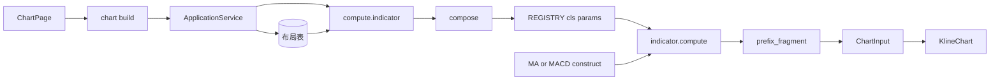

# Sprint9 迭代文档

> 状态：**已完成**
> 关联：[启动摘要](./Sprint9启动文档.md)、[Sprint9 头脑风暴文档](./Sprint9头脑风暴文档.md)、[Sprint9.1 迭代文档](./Sprint9.1迭代文档.md)、[Sprint9.2 迭代文档](./Sprint9.2迭代文档.md)、[Sprint9.3 迭代文档](./Sprint9.3迭代文档.md)、[Sprint8.3 迭代文档](../Sprint8/Sprint8.3迭代文档.md)、[架构文档](../trading-zone-electron架构文档.md)、开发计划 Cursor plan `sprint9_指标模型_56cd4152`

---

## 1. 当前迭代目标

把 MA / MACD 收成 Pydantic `Indicator` 子类：构造即创建，`compute` + `to_chart_input` 出图，出口与 Sprint8.3 compose 一致。

### 1.1 目标声明

| # | 目标 | 验收口径 |
|---|---|---|
| G1 | 作者单元是类 | `to_chart_input(bars, [("ma", MA()), ("macd", MACD())])` 与满字段 `compose` 的 primitive id / pane / 点个数一致 |
| G2 | 内置仍走现入口 | `compute.indicator` 与 `compose({ id, builtin, params })` 双 MA / 双 MACD 前缀、未知 builtin、缺 id / 重复 id 与 8.3 一致 |
| G3 | schema 单一来源 | `manifest()` 从 Field 抽出；`key` / `title` / `defaultParams` 与 TS `INDICATOR_CATALOG` 对齐 |

### 1.2 范围边界（本迭代不做）

- 脚本表 / IPC CRUD、布局拆 `kind + ref`、`chart:build` 带源码
- 独立脚本子进程、同进程 `exec`、Renderer Pyodide、Monaco
- 改 `ChartInput` Schema、改 IndicatorDialog 写死表单、图例美化
- 删掉 TS 目录或让 Main 启动时向 worker 要 catalog
- 子进程 import 白名单、超时、脚本 `title` 覆盖（留给后续档）

### 1.3 技术选型（本迭代）

| 层 | 选型 |
|---|---|
| 壳 / 构建 | Electron + electron-vite（沿用，本轮不改 UI） |
| UI | IndicatorDialog 仍按 builtin 写死表单 |
| 业务 | IPC / 布局仍 `{ id, builtin, params }` |
| 数据 / 计算 | `Indicator` 子类 + `Ohlcv`；`REGISTRY` 改为类；`to_chart_input` 合并 |
| 协议 | `ChartInput` v1 不变；`compute.indicator` 形状不变 |

### 1.4 已拍板结论

| # | 议题 | 结论 |
|---|---|---|
| 1 | 作者单元 | Pydantic `Indicator` 类，不是函数，也不是纯 JSON |
| 2 | 出口 | 类返回 `PlotFragment`；`to_chart_input` 在类外加前缀并 `output()` |
| 3 | catalog | 双份暂时保留；smoke 锁死 `manifest()` 与 TS 目录默认 |
| 4 | compose params | 键集合必须等于 `manifest.fields[].name`；`extra="forbid"` |
| 5 | 构造默认值 | `MA()` / `MACD()` 可用 Field 默认；布局 / IPC 写入仍满字段 |

---

## 2. 功能需求

### 2.1 用户故事

1. 作为指标作者，我可以用一个 Pydantic 类声明参数，调用 `compute` 得到局部 `PlotFragment`。
2. 作为指标作者，我可以用 `to_chart_input` 把多条指标实例合成一份 `ChartInput`。
3. 作为现有图表用户，我仍然通过「指标」弹窗增删改内置 MA / MACD，图画与 8.3 相同。
4. 作为维护者，我改类上的 Field 默认值后，`manifest().defaultParams` 就是目录应对齐的那一份。

### 2.2 功能清单

| ID | 功能 | 优先级 | 状态 |
|---|---|---|---|
| F01 | `Indicator` / `Ohlcv` / `manifest()` | P0 | 已完成 |
| F02 | `MA` / `MACD` 收成子类；删除函数式入口 | P0 | 已完成 |
| F03 | `to_chart_input` + compose 走类 registry；满字段校验 | P0 | 已完成 |
| F04 | smoke：类 API 对上 compose；manifest 锁目录；8.3 断言仍过 | P0 | 已完成 |

### 2.3 非功能需求

- Renderer 不 exec Python，也不 `import MA`。
- Python 不碰 SQLite；Main 过桥形状本轮不变。
- 不改 `ChartInput` 词汇；通道仍只认 `primitive.id`。
- 脚本可见 `Ohlcv` 行情字段，不能改 `timeDomain` / `candle`。

---

## 3. 详细设计说明

### 3.1 进程与数据流



选股路径仍是 8.2 / 8.3 的一跳 `query + instances`。本轮只把 compose 内部从函数 registry 换成类。

### 3.2 目录 / 模块（本迭代涉及）

```
python/worker/indicators/model.py          # Indicator / Ohlcv / Manifest
python/worker/indicators/ma.py
python/worker/indicators/macd.py
python/worker/indicators/compose.py
python/worker/indicators/__init__.py
python/worker/indicators/base.py           # sma / ema / prepare_ohlcv（收编进 Ohlcv.from_bars）
python/scripts/smoke_chart_input.py
```

不改：`contracts/chart_input.json`、IPC、SQLite、`IndicatorDialog`、`KlineChart`。

### 3.3 数据模型 / 存储

布局表本轮不动。Python 侧：

- `Indicator.key` / `title`：`ClassVar`，品种身份。
- 子类 Field：params；`json_schema_extra.widget` 为 `int` \| `float` \| `color` \| `lineWidth`。
- `Ohlcv`：只读等长 `time/open/high/low/close/volume`；`candle` / `volume_points` 只给 `to_chart_input`。
- 存储仍是 SQLite `chart_layout_item.params` 满字段快照。

### 3.4 协议 / API / IPC

| 层 | 名称 | 形状 |
|---|---|---|
| IPC | `chart:build` / `chartLayout:*` | 不变 |
| Worker | `compute.indicator` | `{ instances: [{ id, builtin, params }], query? , bars? }` |
| Python 作者 API | `to_chart_input(bars, [(id, Indicator), ...])` | → `ChartInput` |

### 3.5 核心编排

1. `compose`：校验 id / builtin / 满字段 params → `REGISTRY[builtin].model_validate(params)` → `to_chart_input`。
2. `to_chart_input`：`Ohlcv.from_bars` → 各实例 `compute` → `{id}:{localName}` 前缀 → `output(candle, volume)`。
3. 副图 pane 仍改为实例 id；主图叠加仍 `main`。

### 3.6 UI

本轮不改。弹窗仍按 builtin 写死 MA / MACD 表单。

### 3.7 契约

| 层级 | 位置 |
|---|---|
| JSON | `contracts/chart_input.json` 不变 |
| TypeScript | `INDICATOR_CATALOG` 仍为 UI 拷贝；本轮不改为 `IndicatorManifest` |
| Python | `MA.manifest()` / `MACD.manifest()` 为 schema 单一来源 |

---

## 4. 任务步骤

| 步骤 | 任务 | 产出 | 状态 |
|---|---|---|---|
| 1 | 启动摘要 + 迭代文档骨架 | 本文件与启动摘要 | 已完成 |
| 2 | Indicator / Ohlcv / manifest | `model.py` | 已完成 |
| 3 | MA / MACD 子类 | `ma.py` / `macd.py` | 已完成 |
| 4 | to_chart_input + compose | `compose.py` | 已完成 |
| 5 | smoke / typecheck | 脚本 + 第 5 节 | 已完成 |

### 4.1 本地复现命令

```bash
python\.venv\Scripts\python.exe python\scripts\smoke_chart_input.py
npm run typecheck
npm run dev
```

---

## 5. 测试结果 / 总结反馈

### 5.1 验收清单与结果

| 检查项 | 方式 | 结果 | 说明 |
|---|---|---|---|
| G1 类 API 对上 compose | Python smoke | 通过 | `to_chart_input` dump 与满字段 compose 一致 |
| G2 8.3 出口 / 前缀 | Python smoke | 通过 | 双 MA / 双 MACD、未知 builtin、缺 id / 重复 id |
| G3 manifest 锁目录 | Python smoke | 通过 | `key` / `title` / `defaultParams` 对齐 TS 目录 |
| typecheck | `npm run typecheck` | 通过 | node + web（2026-08-22）；本轮无 TS 改动 |
| 手工起窗 | `npm run dev` | 待补跑 | 回归：图仍能画 MA / MACD |

### 5.2 关键命令记录

```
python\.venv\Scripts\python.exe python\scripts\smoke_chart_input.py
MA.manifest locks catalog: ok
MACD.manifest locks catalog: ok
compose ma+macd: times=40 ma=21 dif=15 dea=7 macd=7 panes=['macd', 'main']
point counts aligned with Sprint7 TS fixture: ok
to_chart_input matches compose: ok
compose ma only: ok
compose macd only: ok
compose empty: ok
MA.compute fragment: ok
validate rejects main histogram: ok
unknown builtin: ok (unknown builtin rsi)
duplicate id: ok (duplicate id ma)
missing id: ok (instances[0].id must be a non-empty string)
missing ma params: ok (instances[0].params keys must equal ['color', 'lineWidth', 'period'], got [])
partial ma params: ok (instances[0].params keys must equal ['color', 'lineWidth', 'period'], got ['period'])
ma lineWidth: ok (lineWidth Input should be less than or equal to 4)
compose two ma: ok
compose two macd: ok
compose ma custom style: ok
compose macd custom style: ok
compute.indicator bars path: ok
neither bars nor query: ok
both bars and query: ok

npm run typecheck
> tsc --noEmit -p tsconfig.node.json --composite false
> tsc --noEmit -p tsconfig.web.json --composite false
（2026-08-22 通过）
```

### 5.3 总结反馈

**做得好的地方**

- 作者单元收成 `Indicator` 类；`compute` 仍吐局部短名，前缀只在 `to_chart_input` 做一次。
- `manifest()` 从 Field 抽出，smoke 锁死与 TS `INDICATOR_CATALOG` 的 title / 默认 params。
- IPC 仍是 `{ id, builtin, params }`，8.3 点个数与双实例前缀无需迁移布局。

**暴露的问题 / 摩擦**

- catalog 仍是 Python 类 + TS 手写两份；本轮用 smoke 锁，未改成启动下发。
- compose 改为满字段后，部分 params（仅 `{ period: 20 }`）不再合法；Main 过桥本就满字段。
- 图例仍 `primitive.id.toUpperCase()`，uuid 前缀问题未处理。

---

## 6. 改进目标

### 6.1 短期（下一迭代可做）

1. 档 B + 图例：见 [Sprint9.1 迭代文档](./Sprint9.1迭代文档.md)（脚本表 / IPC CRUD / 弹窗列出用户脚本 / 图例 localName+参数）。

### 6.2 中期

1. 档 C：见 [Sprint9.2 迭代文档](./Sprint9.2迭代文档.md)（独立子进程跑一份源码 → `PlotFragment`；compose 能合并）。
2. 档 D：见 [Sprint9.3 迭代文档](./Sprint9.3迭代文档.md)（布局项 `kind + ref`；`chart:build` 由 Main 注入 `source`）。
3. 档 E：Renderer 编辑器（只编辑）；保存 / 跑一次 / traceback 回标。
4. 档 F：按 `manifest.fields` 渲染设置表单（内置也可去掉写死表单）。
5. 多套命名布局、按股票记忆。

### 6.3 长期

1. Arrow 数据面传输 `series`；窗读进 Renderer。
2. `compute.indicator` 句柄 / 批处理 / 取消与缓存键。
3. 内置 catalog 改为启动时从类 `manifest()` 下发，去掉 TS 手写拷贝。

---

## 附录

### A. 相关文档

- [Sprint9 启动摘要](./Sprint9启动文档.md)
- [Sprint9.1 迭代文档](./Sprint9.1迭代文档.md)
- [Sprint9 头脑风暴文档](./Sprint9头脑风暴文档.md)
- [Sprint8.3 迭代文档](../Sprint8/Sprint8.3迭代文档.md)
- [中期架构梳理草稿](../Sprint8/中期架构梳理草稿.md)
- [架构文档](../trading-zone-electron架构文档.md)

### B. 常用命令

| 命令 | 用途 |
|---|---|
| `npm run dev` | 开发起窗 |
| `npm run typecheck` | TS 检查 |
| `python\.venv\Scripts\python.exe python\scripts\smoke_chart_input.py` | Indicator / compose / ChartInput smoke |
