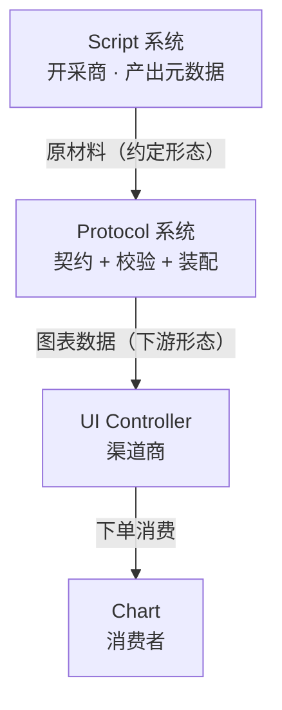
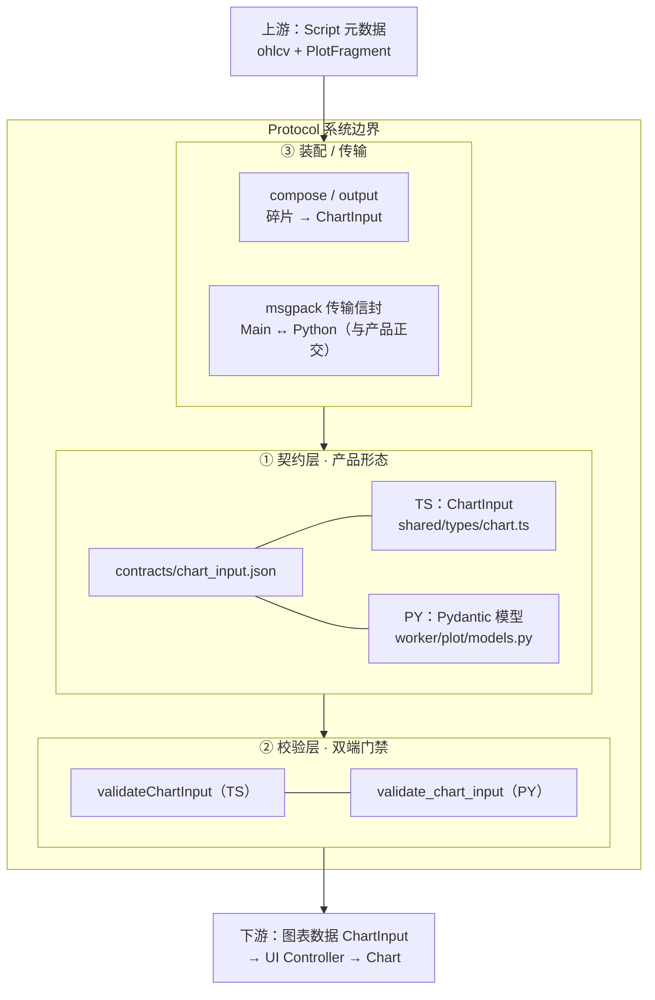
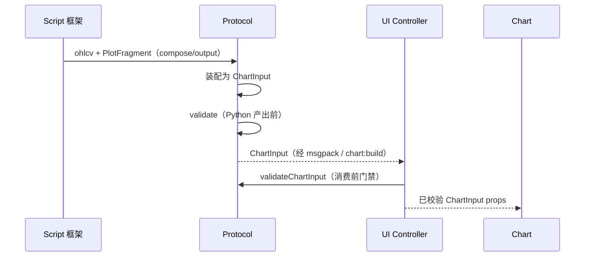

# Protocol 系统架构

> 基于 v0.2 产品模型「商流链」——Protocol 是货场 / 加工供应链。  
> **边界提醒：Protocol ≠ 独立后台服务**；它是上下游真正耦合的契约与加工面——约定「原材料长什么样」、产出「图表通道需要什么」。

---

## 1. 商流链中的位置

| 相邻系统 | 关系 |
|----------|------|
| ← Script | 上游交付约定：以何种形状交付原材料（元数据） |
| → UI Controller / Chart | 下游需求约定：渠道商要的就是终端消费者要的形态 |
| 角色 | **上下游真正耦合点**；Script 接口侧消费者与生产解耦，耦合落在这里 |

---

## 2. 系统内部结构（三层）

Protocol 边界内分三块：

1. **契约层** — 上下游共同遵守的数据形状  
2. **校验层** — 双端语义门禁（加工合格证）  
3. **装配 / 传输层** — 把开采碎片合成产品；跨进程信封与产品正交  

### 设计要点（产品文档原文）

- 接收上游原材料：与 Script **达成协议**——以什么样子交付  
- 生产下游需要的产品：与渠道商 / 消费者需求 **达成协议**  
- Script 框架边界扩大 → 下游需求随之扩大 → Protocol **必须进化**加工环节  
- Script 侧定制/取数通过接口解耦；**Protocol 是真正耦合处**（既知上游输出，也知下游形态）  

### 现实对照

- 当前 **无独立 Protocol 包**；耦合面落在契约 + 双端校验 +（在 Script 框架内的）`compose`/`output`  
- **`ChartInput` 双重身份**：既是 Script 交付的「元数据形态」，也已是面向 Chart 通道的「图表数据」——现实是一层契约贯通，尚无「原始 DTO → 中间产物 → Chart DTO」三级管道  
- msgpack / `pythonProtocol` 是进程通信信封，**不是**产品协议本身  

---

## 3. 主加工流

上游开采结果进入 Protocol，校验后成为下游可消费的图表数据。

### ChartInput 产品形态（下游约定）

| 字段 | 含义 |
|------|------|
| `schemaVersion` | 契约版本；扩展时 Protocol 进化点 |
| `timeDomain` | 时间轴（全员时间序列） |
| `candle` / `volume` | K 线 / 成交量（一等公民） |
| `primitives` | 主图 overlay / 副图 subplot 声明 |
| `series` | 与 primitive 对应的数值序列 |

---

## 4. 产品概念 ↔ 落点

| 产品概念 | 落点 | 说明 |
|----------|------|------|
| 上游交付约定 | `ChartInput` + `compute.indicator` 出参 | 与 Script 交接口径 |
| 下游需求形态 | 同一 `ChartInput`（按 LWC 通道设计） | 渠道商 = 消费者需求 |
| 加工 / 装配 | `indicators/compose.py` + `plot/builders.output` | 与 Script 框架层有重叠 |
| 加工合格证 | `plot/validate.py` + `validateChartInput.ts` | 双端 |
| 契约源 | `contracts/chart_input.json` | schemaVersion 进化点 |
| 传输信封 | `msgpack.protocol.json` + `pythonBridge` | 与产品正交 |
| 进化触发 | 框架能力扩大 → 扩展 primitives/series 语义 | 文档畅想的「供应链进化」 |

---

## 5. 接口一览（边界对外）

**产品协议（图表通道）**

- 入：Script 装配后的 `ChartInput`（或装配前的 fragment，在框架内完成）  
- 出：通过校验的 `ChartInput` → UI Controller  

**进程协议（非产品本体）**

- Main ↔ Python：length-prefixed MessagePack  
- `compute.indicator` 的 `result`：`ChartInput | null`  

**后续畅想（产品文档）**

- Script 是否有必要 / 是否可以自行掌握 Protocol？  
- 当前现实更接近「契约独立、装配仍嵌在 Script 框架出口」  
