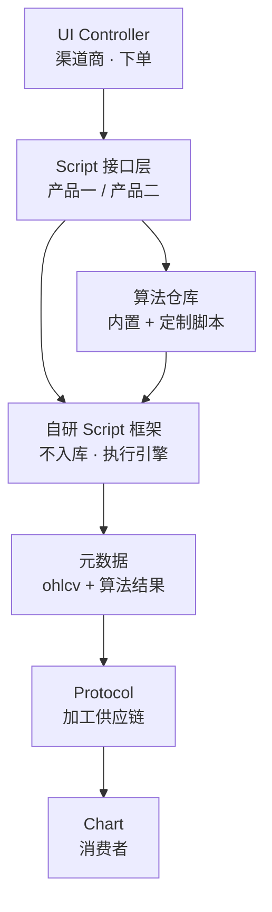
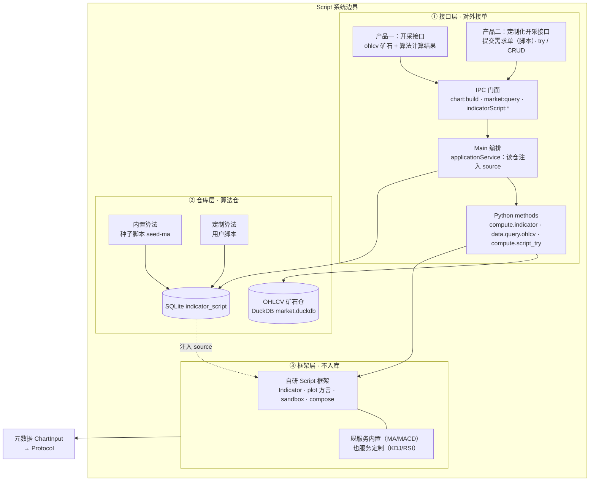
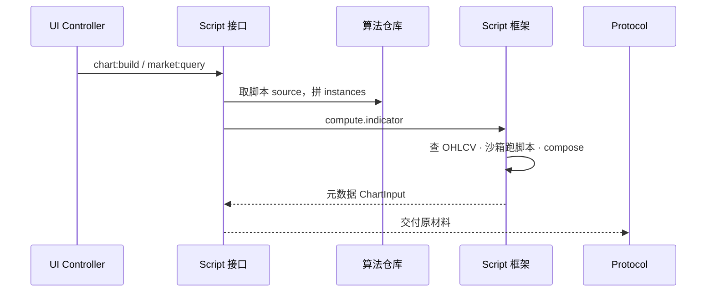
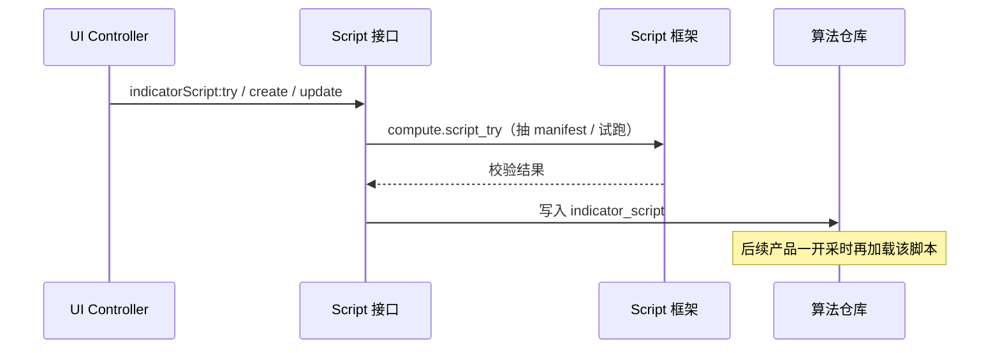

# Script 系统架构

> 基于 v0.2 产品模型「商流链」——Script 是货源 / 原材料开采商。  
> **边界提醒：Script 系统 ≠ 仅 Python Worker**，还包括接口、存储、框架与对外交付。

---

## 1. 商流链中的位置

| 相邻系统 | 关系 |
|----------|------|
| ← UI Controller | 唯一下单入口（开采 + 定制）；不关心中间传输 |
| → Protocol | 以约定形态交付原材料（`ChartInput`）；上下游真正耦合点在 Protocol |
| ↛ Chart | Chart 只向 UI Controller 下单，不直接碰 Script |

---

## 2. 系统内部结构（三层）

Script 系统边界内分三块：

1. **接口层** — 对外接单  
2. **仓库层** — 存算法（框架本身不入库）  
3. **框架层** — 执行开采，产出元数据  

### 设计要点（产品文档原文）

- 自研 Script 框架在系统**内部**，**不需要**仓库存储  
- 内置算法、定制算法**需要**仓库存储  
- 开采出来的数据，可以直接交给 Protocol 加工  
- 定制与获取数据都是 Script 接口；消费者与生产环节解耦  
- 真正上下游耦合发生在 Protocol  

---

## 3. 两条产品流

### 产品一：开采元数据（ohlcv + 算法）

消费者下单要求提供 ohlcv 数据和算法计算后的指标数据。

能力递进（均基于同一框架）：

| 层级 | 内容 |
|------|------|
| 矿石 | ohlcv — 最基础 |
| 内置算法 | 如 MA / MACD — 进阶 |
| 定制算法 | 如 KDJ / RSI — 定制 |

### 产品二：定制化开采（创建指标）

消费者按框架指南创建需求单（脚本），交给 Script 系统。

---

## 4. 产品概念 ↔ 落点

| 产品概念 | 落点 | 是否入库 |
|----------|------|----------|
| 自研 Script 框架 | `indicators/*` + `plot/*` + sandbox | 否 |
| 内置算法 | `indicator_script` 种子（`seed-ma`） | 是 |
| 定制算法 | `indicator_script` 用户行 | 是 |
| 开采接口 | `chart:build` → `compute.indicator` | — |
| 定制化开采接口 | `indicatorScript:try \| create \| update` | — |
| OHLCV 矿石 | DuckDB + `data.query.ohlcv` | 是（数据仓） |
| 元数据交付 | `ChartInput` → Protocol | — |

---

## 5. 接口一览（边界对外）

**IPC（经 UI Controller）**

- 开采：`chart:build`，`market:query`
- 定制：`indicatorScript:list | exampleSource | try | create | update | remove`

**Main ↔ Python**

- `data.query.ohlcv`
- `compute.indicator`
- `compute.script_try`
