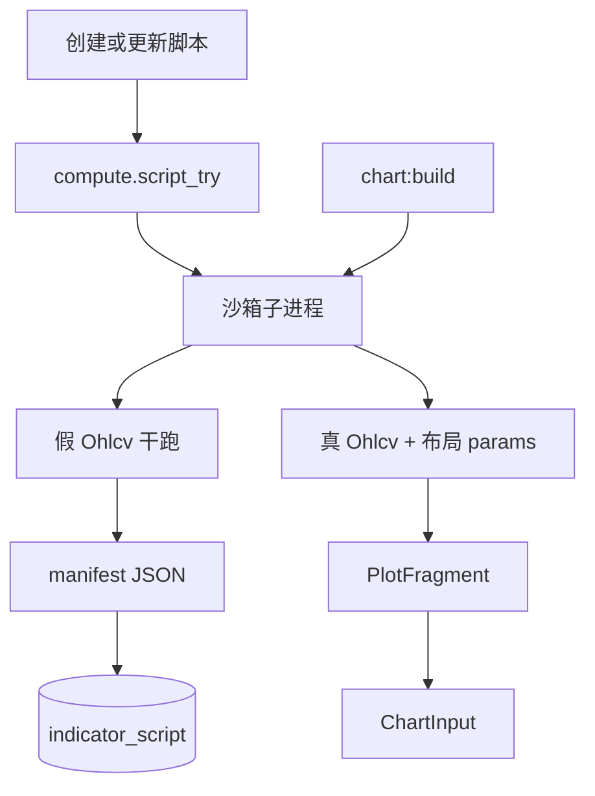

# Sprint1 迭代文档

> 状态：**进行中**（实现已合入本工作区；Electron 挂图仍待本地点 `npm run dev` 过一眼）
> 关联：[需求分析](./v0.2.1需求分析.md)、[v0.2 release 文档](../release文档.md)、[Script 系统架构](../Script系统架构.md)、[Protocol 系统架构](../Protocol系统架构.md)

---

## 1. 当前迭代目标

把自研指标脚本的作者面改成接近 Pine 的 `input.*` + `plot()`：算法参数与视觉样式分离，旧语法不兼容。

### 1.1 目标声明

| # | 目标 | 验收口径 |
|---|---|---|
| G1 | 参数用 `inputs()` + `input.int/float/bool` 声明 | 保存脚本得到的 manifest.fields 只有算法入参；无 color / lineWidth widget |
| G2 | `plot()` 副作用登记；必须有输出；样式干跑进 manifest.plots | 无 `plot()` 的脚本 try/create 失败；MA 的颜色/线宽出现在 plots 而非 fields |
| G3 | 设置表单与布局 params 分层 | 改周期走 `params.inputs`；改颜色/线宽走 `params.styles`；图上可见 |
| G4 | 旧脚本清空 | 检测到旧方言种子后清空 `indicator_script` 与布局项，只重建新 MA |

### 1.2 范围边界（本迭代不做）

- Pine `input.source` / group / inline、area / columns、`hline`
- 旧 `Field` + `overlay(line())` 兼容层
- 改 `ChartInput` Schema、拆独立 Protocol 包
- 按 bar 变色（histogram 涨跌色仅作为 plot 可配项）

### 1.3 技术选型（本迭代）

| 层 | 选型 |
|---|---|
| 壳 / 构建 | Electron + electron-vite（沿用） |
| UI | 设置表单分栏：inputs / plots 样式 |
| 业务 | 布局 params 改为 `{ inputs, styles }`；表结构不变 |
| 数据 / 计算 | 沙箱子进程：`inputs()` + `plot()` 登记；无行情时用假 OHLCV 干跑抽 manifest |
| 协议 | `ChartInput` v1 不变；primitive.style 仍由内部 `line`/`histogram` 写出 |

### 1.4 已拍板结论

| # | 议题 | 结论 |
|---|---|---|
| 1 | compute 如何交出输出 | 方案 A：`plot()` 往本次执行清单登记，不 return |
| 2 | 无输出 | 非法：清单为空则失败 |
| 3 | 样式从哪来 | 干跑 `compute()` 收获，写入 `manifest.plots` |
| 4 | 已存脚本 | 不兼容，直接删除 |

---

## 2. 功能需求

### 2.1 用户故事

1. **US1** 作为脚本作者，我用 `input.int/float/bool` 声明算法参数，从而不再把参数写成 Pydantic `Field`。
2. **US2** 作为脚本作者，我在 `compute` 里调用 `plot(...)` 即可输出，颜色和线宽写在 `plot` 上并自动成为设置项。
3. **US3** 作为使用者，我在设置里分别调节周期与线的颜色/线宽，图上同步变化。
4. **US4** 作为开发者，我用新语法的 MA / MACD smoke 验收本迭代，旧脚本不会残留干扰。

### 2.2 功能清单

| ID | 功能 | 优先级 | 状态 |
|---|---|---|---|
| F01 | `input.int/float/bool` + `inputs()` + `__setattr__` 收集 | Must | 已完成 |
| F02 | `plot()` 登记、强制有输出、`overlay` 脚本级 | Must | 已完成 |
| F03 | 干跑收获 `manifest.plots` | Must | 已完成 |
| F04 | 布局 `{ inputs, styles }` + 设置表单分栏 + bool | Must | 已完成 |
| F05 | 种子 MA 新语法；旧方言清空重建 | Must | 已完成 |
| F06 | smoke：新 MA / 副图 MACD / 无 plot 失败 | Must | 已完成 |

### 2.3 非功能需求

- 沙箱不再注入 `Field` / `line` / `overlay` / `subplot` / `PlotFragment`
- 干跑与实跑共用 `compute`；干跑扔掉序列
- `plot()` 须无条件执行到，否则 plots 不完整
- 不改 Chart 通道契约

---

## 3. 详细设计说明

### 3.1 进程与数据流



创建/更新：无行情也进子进程，用假 K 线跑 `inputs()` + `compute()`，清单写入 `plots`。画图：同一 `compute`，用布局 `styles` 覆盖后再组 fragment。

### 3.2 目录 / 模块（本迭代涉及）

```
python/worker/indicators/model.py      # Indicator / manifest / Ohlcv
python/worker/indicators/runtime.py    # input.* / plot() / 执行上下文
python/worker/indicators/sandbox.py    # 注入与子进程出口
python/worker/indicators/examples/ma.py
python/scripts/smoke_chart_input.py
src/shared/types/indicatorScript.ts
src/shared/types/chartLayout.ts
src/shared/chart/indicatorScript.ts
src/renderer/src/pages/chart/ManifestFieldsForm.tsx
src/main/services/applicationService.ts
src/main/db/indicatorScriptRepository.ts
src/main/db/chartLayoutRepository.ts
```

### 3.3 数据模型 / 存储

`indicator_script.manifest` 增加 `overlay`、`plots`；`fields` 仅 int/float/bool。

`chart_layout_item.params` 仍是 JSON 文本，形状改为：

```json
{ "inputs": { "period1": 5 }, "styles": { "MA1": { "color": "#FF9800", "lineWidth": 1 } } }
```

### 3.4 协议 / API / IPC

- IPC 不变：`indicatorScript:try | create | update`，`chart:build`
- `compute.script_try` 无 query 时也干跑，返回带 `plots` 的 manifest
- `ChartInput` 不变

### 3.5 核心编排

1. `loadScriptManifest` → `try_source` 干跑 → 解析 manifest
2. 种子：旧方言则清空脚本表与布局项，再写入新 MA
3. 添加指标：`defaultScriptParams(manifest)` 写入布局
4. `compose` / `run_script`：拆 `inputs` / `styles`，套到 `plot()` 登记结果

### 3.6 UI

设置对话框：上栏算法参数（含 bool），下栏按 plot 列出颜色/线宽（histogram 为涨跌色）。

### 3.7 契约

| 层级 | 位置 |
|---|---|
| Manifest / params | `src/shared/types/indicatorScript.ts`、`chartLayout.ts` |
| 双端解析 | `src/shared/chart/indicatorScript.ts`、`python/worker/indicators/model.py` |
| ChartInput | 不改 |

---

## 4. 任务步骤

| 步骤 | 任务 | 产出 | 状态 |
|---|---|---|---|
| 1 | 迭代文档 | 本文件 | 已完成 |
| 2 | Python 运行时 | `input.*` / `plot()` / 干跑 / 沙箱 | 已完成 |
| 3 | 示例与 smoke | 新 MA、副图 MACD | 已完成 |
| 4 | TS 契约 | Manifest + `{inputs,styles}` | 已完成 |
| 5 | 表单与种子清空 | UI 分栏、旧库 wipe | 已完成 |
| 6 | 验收 | smoke + typecheck | 已完成 |

### 4.1 本地复现命令

```bash
python\.venv\Scripts\python.exe python\scripts\smoke_chart_input.py
npm run typecheck
npm run dev
```

---

## 5. 测试结果 / 总结反馈

### 5.1 验收清单与结果

| 检查项 | 方式 | 结果 | 说明 |
|---|---|---|---|
| G1/G2 新语法 manifest | smoke | 通过 | MA fields 仅 period1–5；plots 为 MA1–MA5；无 color widget |
| 无 plot 失败 | smoke | 通过 | `try_script missing plot: ok` |
| 新 MA + 副图 MACD 合成 ChartInput | smoke | 通过 | panes=`macd,main`；改 period 不改 plot id |
| 样式覆盖 | smoke | 通过 | `MA3` color `#112233` lineWidth 3 |
| typecheck | `npm run typecheck` | 通过 | node + web |
| Electron 挂图 / 旧脚本 wipe | 手工 | 待补跑 | 需本地点 `npm run dev`；首次启动清旧方言种子 |

### 5.2 关键命令记录

```
python\.venv\Scripts\python.exe python\scripts\smoke_chart_input.py
# 2026-09-01
try_script load example MA manifest: ok
point counts for 5-line MA + script MACD: ok
compose MA custom period3 style: ok
try_script missing plot: ok
try_source example MA: ok
exit 0

npm run typecheck
# node + web 通过
```

### 5.3 总结反馈

实现已落地：作者面 `inputs()` + `plot()` 登记、干跑写 `manifest.plots`、布局 `{inputs,styles}`。Electron 窗口内改色上图、旧库 wipe 尚未在本环境点过。

---

## 6. 改进目标

### 6.1 短期（下一迭代可做）

1. 补手工挂图验收记录，把本节测试表改成有依据的通过/失败。

### 6.2 Backlog（Ideas，无结论）

目标二：Script 系统与 Protocol 系统的分工和解耦。迭代会上只讨论，不拍板。

**产品模型怎么说**

- Script：开采元数据（ohlcv + 算法），以及「提交脚本」定制接口。
- Protocol：上下游真正耦合点——上游交什么形状、下游图表要什么形状。
- 文档开放问题：Script 有没有必要、能不能自己掌握 Protocol？

**代码里实际怎样**

- 没有独立 Protocol 包。
- `ChartInput` 一身二职：既是 Script 交出的「元数据」，也已经是 Chart 通道产品。
- 装配（`compose` / `output`）写在 Script 框架出口。
- msgpack 只是进程信封，不是产品协议。

**目标一之后这条缝更明显**

| 东西 | 更像谁 |
|---|---|
| `input.*`、`plot()`、`overlay` 标志、沙箱 | Script 作者方言 / 开采工具 |
| 干跑收获的 plots、布局里的 style 覆盖 | 仍像 Script：设置是需求单的一部分 |
| `PlotFragment` → prefix → `output()` → `ChartInput` | 装配，文档归 Protocol，代码在 `compose.py` + `plot/builders.py` |
| `primitives[].style` / `series` | 下游图表形态，Chart 只吃这个 |

作者将不再碰 `PlotFragment` / `overlay` / `line`。Script 对外更像：脚本源码 + manifest（inputs/plots）+ 一次开采得到的 fragment。再编成 `ChartInput` 是另一件事。

**可以继续想、先不拍的问题**

1. `ChartInput` 要不要继续一身二职？一层契约打通最省；若 Script 只交「时间序列 + 命名 series」，Protocol 再翻译成 LWC primitive，进化更清晰，但成本大。
2. `compose` / `output` 算谁的？现在人在 Script 目录、职责是加工。作者 API 演进不必绑 Protocol 进化——本迭代 `ChartInput` 不动已经说明这一点。
3. 样式覆盖放哪？用户改线色是改「开采参数」还是改「加工后的产品」？当前只有设置表单，更像 Script/需求单；若允许图上改样式且不回写脚本 params，就更像 Protocol/渠道。
4. Script 要不要掌握 Protocol？现在是「契约独立、装配嵌在 Script 出口」。装配仍是多实例 prefix + 拼 candle/volume，与 `input`/`plot` 无关。合并能少一层概念；分开能让「加一种 plot style」只改 Script，「LWC 换通道」只改 Protocol。

### 6.3 中期

1. 按 Backlog 筛选是否拆 Protocol 装配层，或保持一层 `ChartInput`。

### 6.4 长期

1. 指标之后的策略 / 库，仍走同一 Script 框架边界，由 Protocol 随框架能力进化。

---

## 附录

### A. 相关文档

- [v0.2.1需求分析.md](./v0.2.1需求分析.md)
- [release文档.md](../release文档.md)
- [Script系统架构.md](../Script系统架构.md)
- [Protocol系统架构.md](../Protocol系统架构.md)

### B. 常用命令

| 命令 | 用途 |
|---|---|
| `npm run dev` | 开发起窗 |
| `python\\.venv\\Scripts\\python.exe python\\scripts\\smoke_chart_input.py` | 脚本 compose / try 冒烟 |
| `npm run typecheck` | TS 检查 |
