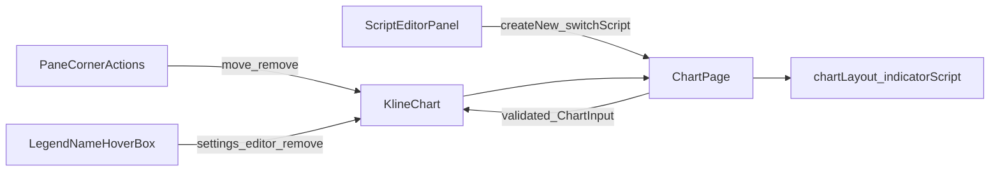

# Sprint2.1 迭代文档

> 状态：**进行中**（实现已落地；手工挂图待单实例补跑）
> 关联：[改进需求文档](./Sprint2.1-改进需求文档.md)、[Sprint2 迭代文档](./Sprint2迭代文档.md)、[v0.2 release 文档](../release文档.md)、[UI-Controller 与 Chart 系统架构](../UI-Controller与Chart系统架构.md)、[开发计划](../../../../.cursor/plans/sprint2.1改进计划_15d7b64c.plan.md)

---

## 1. 当前迭代目标

把 Sprint2 已上线的图例操作、复权缺省、脚本编辑器提示/菜单改到可稳定点击、默认前复权、文案与入口更接近 TradingView。不改 Script 语法、ChartInput 与 E1–E8 事件表。

### 1.1 目标声明

| # | 目标 | 验收口径 |
|---|---|---|
| G1 | 副图悬停时，移动/删除固定在窗格右上角 | 十字线在 K 线间移动时按钮不跟着数值左右晃；主图不出现这组右上角按钮 |
| G2 | 悬停指标名称时弹出功能盒 | 盒子盖住下方数值（z-index 更高）；含名称 + 设置 + 打开编辑器 + 删除 |
| G3 | 图表页复权缺省为前复权 | 进入图表页按钮文案为「前复权」，首次 `chart:build` 带 `adjust: 'qfq'` |
| G4 | 编辑器提示可关、文案正确 | 试跑成功显示「测试通过」；新建发布成功显示「新脚本{脚本名}创建成功」；Alert 有关闭按钮 |
| G5 | 脚本名下拉可新建、可选自定义指标 | 「创建新指标」回到新建草稿；「自定义指标」二级菜单选中后载入该脚本 |

### 1.2 范围边界（本迭代不做）

- TradingView 的「隐藏图形」「更多选项」菜单
- 主图右上角窗格工具条（需求明确只要效果二）
- 周期真实行情、分组功能、窗格高度持久化、按实例增量重算
- Script 方言 / ChartInput / `chart:build` 事件表（E1–E8 保持 Sprint2）
- MarketPage 复权缺省、后端 `adjust ?? 'none'` 回退值（图表页始终显式传 `adjust`）
- 更新已有脚本发布成功：需求只给了新建文案，更新成功继续显示「测试通过」

### 1.3 技术选型（本迭代）

| 层 | 选型 |
|---|---|
| 壳 / 构建 | Electron + electron-vite（沿用） |
| UI | React + MUI；副图右上角条 portal 进 LWC `pane.getHTMLElement()`；名称功能盒叠在图例上 |
| 业务 | ChartPage 作 UI Controller；图例 / KlineChart 不调 IPC |
| 数据 / 计算 | 不改表结构、不改 Python 沙箱 |
| 协议 | IPC 与 `ChartInput` 不变；复用 `chartLayout:*` / `indicatorScript:*` |

---

## 2. 功能需求

### 2.1 用户故事

1. **US7** 作为使用者，我在副图右上角固定位置移动/删除窗格，并在悬停指标名时打开设置、源码或删除，从而按钮不再跟着十字线数值乱跑。
2. **US8** 作为使用者，我打开图表页时默认看到前复权行情。
3. **US9** 作为脚本作者，我能看懂并关掉编辑器提示，并从下拉菜单新建或切入自定义指标。

### 2.2 功能清单

| ID | 功能 | 优先级 | 状态 |
|---|---|---|---|
| F01 | 副图悬停：右上角固定上移 / 下移 / 删除（无设置） | Must | 已完成（待手工验收） |
| F02 | 主图不渲染右上角窗格工具条 | Must | 已完成（待手工验收） |
| F03 | 悬停指标名称：功能盒（名称 + 设置 + 打开编辑器 + 删除） | Must | 已完成（待手工验收） |
| F04 | 图例行内按钮移除，不再跟随数值宽度移动 | Must | 已完成（待手工验收） |
| F05 | 图表页复权缺省 `qfq` | Must | 已完成（待手工验收） |
| F06 | 试跑成功文案「测试通过」；Alert 可关闭 | Must | 已完成（待手工验收） |
| F07 | 新建发布成功文案「新脚本{脚本名}创建成功」 | Must | 已完成（待手工验收） |
| F08 | 下拉「创建新指标」初始化新建草稿 | Must | 已完成（待手工验收） |
| F09 | 下拉「自定义指标」二级菜单载入已有脚本 | Must | 已完成（待手工验收） |

### 2.3 非功能需求

- Chart（`KlineChart` / 图例）不直连 IPC，回调上提到 ChartPage
- 不改 Script 方言、不改 ChartInput Schema、不改 E1–E8 执行事件表
- 效果一按钮挂在 pane DOM 内，悬停按钮不误触发窗格 `mouseleave`

---

## 3. 详细设计说明

### 3.1 进程与数据流



ChartPage 仍是唯一下单点。效果一 / 效果二只发回调；打开编辑器走已有 `openEditScriptEditor`；复权缺省变化仍走 Sprint2 的 `executeScripts`（E3）。

### 3.2 目录 / 模块（本迭代涉及）

新增：

```
docs/releases/v0.2/Sprint2/Sprint2.1迭代文档.md
src/renderer/src/pages/chart/PaneCornerActions.tsx
src/renderer/src/pages/chart/LegendNameHoverBox.tsx
```

改动：

```
docs/releases/v0.2/release文档.md
src/renderer/src/pages/ChartPage.tsx
src/renderer/src/pages/chart/KlineChart.tsx
src/renderer/src/pages/chart/PriceLegend.tsx
src/renderer/src/pages/chart/SubpaneLegend.tsx
src/renderer/src/pages/chart/LegendActionButtons.tsx
src/renderer/src/pages/chart/scriptEditor/ScriptEditorPanel.tsx
```

### 3.3 数据模型 / 存储

不改表结构。复权仅改 ChartPage 初始 state：`useState<AdjustType>('qfq')`。

### 3.4 协议 / API / IPC

不新增 IPC。复用：

- `chartLayout:reorder` / `chartLayout:remove` / `chartLayout:update`
- `indicatorScript:try | create | update | list`
- `chart:build`（E3 切复权，缺省变为 qfq）

### 3.5 核心编排

1. 效果一：KlineChart 按副图 pane 取 `pane.getHTMLElement()`，`createPortal` 钉右上角条；仅副图（paneIndex >= 1）
2. 效果二：名称可悬停；功能盒 z-index 高于图例数值；`onOpenEditor(instanceId)` → layout.item.ref → `openEditScriptEditor`
3. 复权：页面挂载默认 `qfq`，与 E1/E3/E6 同一 `executeScripts` 入口
4. 编辑器 banner：试跑成功 / 新建发布成功 / 错误 三分；Alert `onClose`；「创建新指标」重置 draft；「自定义指标」二级菜单切脚本

### 3.6 UI

- 副图右上角条：`position: absolute; top/right`，`right` 预留价格轴，含上移 / 下移 / 删除
- 名称功能盒：横向长条，背景不透明，含名称 + 设置 + 打开编辑器 + 删除
- 脚本名下拉顺序：修改脚本名称 → 创建新指标 → 自定义指标（二级）

### 3.7 契约

| 层级 | 位置 |
|---|---|
| ChartPeriod / AdjustType | 不改 |
| Layout / Script | 不改表结构 |
| ChartInput | 不改 |

---

## 4. 任务步骤

| 步骤 | 任务 | 产出 | 状态 |
|---|---|---|---|
| 1 | 迭代文档 + release 互链 | 本文件、`release文档.md` §4 | 已完成 |
| 2 | US8 复权缺省 | `ChartPage` `qfq` | 已完成 |
| 3 | US7 效果一 | `PaneCornerActions` portal | 已完成 |
| 4 | US7 效果二 | `LegendNameHoverBox` + `onOpenEditor` | 已完成 |
| 5 | US9 提示文案 + 关闭 | `ScriptEditorPanel` banner | 已完成 |
| 6 | US9 下拉菜单 | 创建新指标 + 自定义指标二级菜单 | 已完成 |
| 7 | typecheck + 手工验收 | G1–G5 | 部分完成（typecheck 通过；窗内点验待补跑） |

commit 编码：`TZE-v0.2.2-US{n}-task{m}`。

### 4.1 本地复现命令

```bash
npm run typecheck
npm run dev
```

---

## 5. 测试结果 / 总结反馈

### 5.1 验收清单与结果

| 检查项 | 方式 | 结果 | 说明 |
|---|---|---|---|
| typecheck（node + web） | `npm run typecheck` | 通过 | 2026-09-05 |
| 已起 dev 实例 HMR | 读终端 | 通过 | renderer 热更新成功，无编译错误 |
| G1 副图右上角固定按钮 | 手工 | 待补跑 | 本环境无法点 Electron 窗 |
| G2 名称悬停功能盒 | 手工 | 待补跑 | 同上 |
| G3 复权缺省前复权 | 静态对照 | 符合 | `ChartPage` 初始 `adjust` 为 `qfq`；窗内文案待补跑 |
| G4 编辑器提示文案 / 关闭 | 静态对照 | 符合 | banner 文案与 `Alert onClose` 已接线；窗内待补跑 |
| G5 下拉新建 / 自定义指标 | 静态对照 | 符合 | 菜单项与二级 Menu 已接线；窗内待补跑 |

### 5.2 关键命令记录

```
npm run typecheck
# 2026-09-05  node + web 均通过

npm run dev
# 已有单实例在跑；HMR 更新 ChartPage / KlineChart / ScriptEditorPanel 等，无报错
```

### 5.3 总结反馈

**做得好的地方**

- 效果一 portal 进 LWC pane DOM，按钮位置与图例数值脱钩
- 效果二用独立功能盒叠在名称上，主图只保留这一层
- 编辑器提示拆成 banner，新建成功与试跑成功文案分开
- ChartPage 仍是唯一下单点，未改 IPC / 事件表

**暴露的问题 / 摩擦**

- 本环境没有浏览器工具可以操作 Electron 窗，G1–G5 窗内点验待用户补跑
- 多实例会锁 DuckDB，补跑前保持单实例

---

## 6. 改进目标

### 6.1 短期（下一迭代可做）

1. 补跑 Sprint2 + Sprint2.1 手工验收，把「待补跑」改成有依据的通过 / 失败。
2. 周期真实行情（周/月/季/年）接入 `chart:build`。
3. 「分组」从占位改为可用。

### 6.2 中期

1. 窗格高度 stretch 持久化。
2. 按实例增量重算。
3. 图例「隐藏图形」与更多选项菜单（本迭代明确不做）。

### 6.3 长期

1. Script / Protocol 解耦（Roadmap 3.2）。
2. 指标之后的策略 / 库，仍走同一 Script 框架。

---

## 附录

### A. 相关文档

- [Sprint2.1-改进需求文档.md](./Sprint2.1-改进需求文档.md)
- [Sprint2迭代文档.md](./Sprint2迭代文档.md)
- [Sprint2需求文档.md](./Sprint2需求文档.md)
- [release文档.md](../release文档.md)
- [UI-Controller与Chart系统架构.md](../UI-Controller与Chart系统架构.md)

### B. 常用命令

| 命令 | 用途 |
|---|---|
| `npm run dev` | 开发起窗 |
| `npm run typecheck` | TS 检查 |
