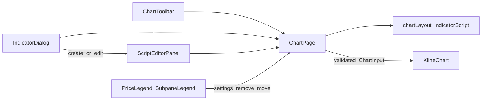
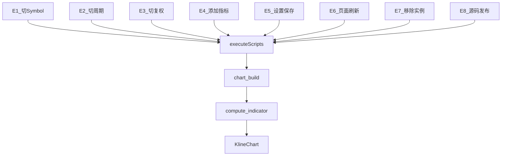

# Sprint2 迭代文档

> 状态：**进行中**（需求一 + 需求二实现已落地；手工挂图待单实例补跑）
> 关联：[需求文档](./Sprint2需求文档.md)、[v0.2 release 文档](../release文档.md)、[UI-Controller 与 Chart 系统架构](../UI-Controller与Chart系统架构.md)、[开发计划](../../../../.cursor/plans/sprint2_ui迭代_b8f8d788.plan.md)

---

## 1. 当前迭代目标

把图表页顶栏、图例操作和脚本编辑器改成接近通达信 / TradingView 的用法，并按 Roadmap 3.4 把「何时执行已上图脚本」收成一张事件表。不改 Script 语法与 ChartInput。

### 1.1 目标声明

| # | 目标 | 验收口径 |
|---|---|---|
| G1 | 顶栏左对齐：symbol、分组、周期、复权、指标，竖线分隔 | 五项从左到右排列；分组文案为「分组」；周期默认「日」，周/月/季/年禁用；复权为单按钮菜单 |
| G2 | 图例可删、可改；副图可上移下移且顺序持久化 | 主图 overlay 与副图按钮与指标弹框同一套回调；主图始终 pane 0；`sort_order` 重启后保持 |
| G3 | 右侧浮层脚本编辑器替代嵌套弹框 | 新建/编辑关闭指标弹框并滑出编辑器；支持改名、切脚本、执行、发布；可拖宽至铺满可视区 |
| G4 | 已上图脚本只在约定事件下重算（Roadmap 3.4） | E1–E6 必触发 `chart:build`；改名 / 移窗格不触发；编辑器「执行」只走 try。对照见 §3.8 / §5.4 |

### 1.2 范围边界（本迭代不做）

- 周 / 月 / 季 / 年真实行情聚合（E2 只接线，不改 `MarketQueryParams`）
- 「分组」真实功能（按钮保持 disabled）
- Script / Protocol 解耦（Roadmap 3.2）
- 按实例增量重算（当前仍是整表 `compute.indicator`）
- 窗格高度 stretch 持久化

### 1.3 技术选型（本迭代）

| 层 | 选型 |
|---|---|
| 壳 / 构建 | Electron + electron-vite（沿用） |
| UI | React + MUI；图例按钮参考 `参考frontend` StatusBar；脚本编辑复用 Monaco |
| 业务 | ChartPage 作 UI Controller；图例 / KlineChart 不调 IPC |
| 数据 / 计算 | `chart_layout_item.sort_order` 交换实现副图排序；不改 Python 沙箱 |
| 协议 | 新增 `chartLayout:reorder`；`indicatorScript:*` 与 `ChartInput` 不变 |

---

## 2. 功能需求

### 2.1 用户故事

1. **US1** 作为使用者，我在图表顶栏从左到右看到 symbol、分组、周期、复权、指标，从而按交易软件习惯操作。
2. **US2** 作为使用者，我在图例上删除、修改指标，并调整副图上下顺序，从而不必打开指标弹框完成日常操作。
3. **US3** 作为脚本作者，我从右侧浮层编辑、测试并发布脚本，从而获得接近 TradingView Pine 编辑器的工作面。
4. **US4** 作为使用者，我在选股、切复权、切周期或刷新后，已上图指标按新行情重算。
5. **US5** 作为使用者，我添加指标或在设置里保存新参数后，图上的线立即按新实例 / 新参数重算。
6. **US6** 作为使用者，我只改脚本名或只移动副图时，图上的线不重算。

### 2.2 功能清单

| ID | 功能 | 优先级 | 状态 |
|---|---|---|---|
| F01 | 顶栏左对齐 + 竖线：symbol / 分组 / 周期 / 复权 / 指标 | Must | 已完成（待手工验收） |
| F02 | 分组文案改为「分组」（仍 disabled） | Must | 已完成（待手工验收） |
| F03 | 周期按钮菜单：日可选，周月季年禁用 | Must | 已完成（待手工验收） |
| F04 | 复权改为单按钮 + 菜单 | Must | 已完成（待手工验收） |
| F05 | 图例删除 / 设置（主图 overlay + 副图，按 layout instance） | Must | 已完成（待手工验收） |
| F06 | 副图上移下移；主图固定首位 | Must | 已完成（待手工验收） |
| F07 | `chartLayout:reorder` 持久化 `sort_order` | Must | 已完成（待手工验收） |
| F08 | 右侧浮层脚本编辑器：新建 / 修改 / 改名 / 切脚本 / 执行 / 发布 / 拖宽 | Must | 已完成（待手工验收） |
| F09 | E1 切 Symbol → `chart:build` | Must | 已符合 |
| F10 | E3 切复权 → `chart:build` | Must | 已符合 |
| F11 | E4 添加指标 / E5 设置保存 → `chart:build` | Must | 已完成（E5 无变化不 build） |
| F12 | E6 页面挂载 + 顶栏刷新 → `chart:build` | Must | 已完成（刷新走 `scriptRunNonce`） |
| F13 | E2 `period` 进入执行入口依赖 | Must | 已完成（真实行情仍不做） |
| F14 | 改名 / 移窗格不走 `chart:build` | Must | 已完成（移窗格用 `pane.moveTo`） |

### 2.3 非功能需求

- Chart（`KlineChart` / 图例）不直连 IPC，回调上提到 ChartPage
- 不改 Script 方言、不改 ChartInput Schema
- 周期真实行情不进 `MarketQueryParams`；E2 只要求入口依赖包含 `period`
- 已上图脚本的执行只从事件表发出；编辑器「执行」不得冒充图表执行事件

---

## 3. 详细设计说明

### 3.1 进程与数据流



ChartPage 是唯一下单点。图例删除 / 设置走 `chartLayout:*` 后 `executeScripts`；移窗格只 `chartLayout:reorder` + `setLayout`，由 KlineChart `pane.moveTo` 换位。脚本试跑 / 发布走 `indicatorScript:try | create | update`。已上图脚本的重算统一走 `executeScripts` → `chart:build` → `compute.indicator`（见 §3.8）。

### 3.2 目录 / 模块（本迭代涉及）

新增：

```
docs/releases/v0.2/Sprint2/Sprint2迭代文档.md
src/renderer/src/pages/chart/ChartToolbar.tsx              # 顶栏
src/renderer/src/pages/chart/LegendActionButtons.tsx       # 图例图标按钮
src/renderer/src/pages/chart/IndicatorSettingsDialog.tsx   # 从 IndicatorDialog 抽出
src/renderer/src/pages/chart/scriptEditor/ScriptEditorPanel.tsx
```

改动：

```
src/renderer/src/pages/ChartPage.tsx                       # executeScripts 事件入口；period/settingsItem/scriptDraft
src/renderer/src/pages/chart/syncPrimitiveSeries.ts        # subplotPaneOrder 按 layout；alignSubpaneOrder / moveTo
src/renderer/src/pages/chart/PriceLegend.tsx               # overlay 按 instance 分组 + 按钮
src/renderer/src/pages/chart/SubpaneLegend.tsx             # instanceId / 上下移禁用位 + 按钮
src/renderer/src/pages/chart/KlineChart.tsx                # buildOverlays 分组、回调透传
src/renderer/src/pages/chart/IndicatorDialog.tsx           # 只留列表；编辑入口改为打开浮层
src/renderer/src/pages/chart/scriptEditor/ScriptSourceEditor.tsx  # 支持 sx 覆盖高度
src/shared/types/chart.ts                                  # ChartPeriod（仅 UI）
src/shared/types/chartLayout.ts                            # LayoutReorderDirection
src/main/db/chartLayoutRepository.ts                       # swapSortOrder
src/main/services/applicationService.ts                    # reorderChartIndicator
src/main/ipc/registerHandlers.ts                           # chartLayout:reorder
src/preload/index.ts / index.d.ts                          # chartLayout.reorder
```

### 3.3 数据模型 / 存储

`chart_layout_item.sort_order` 沿用旧字段：`chartLayoutRepository.swapSortOrder(idA, idB)` 在一个事务里交换两条记录的 `sort_order` 并刷新 `chart_layout.updated_at`。副图视觉顺序 = layout `sortOrder` → `subplotPaneOrder` → LWC `pane.moveTo`，不再为换序走 `chart:build`。重启后顺序保持。脚本编辑器宽度存 localStorage 键 `trading-zone.chart.scriptEditorWidth`。

### 3.4 协议 / API / IPC

- 新增 `chartLayout:reorder`，入参 `{ id: string, direction: 'up' | 'down' }`，返回更新后的 `ChartLayout`
- 错误：id 不存在、脚本不存在、主图指标调序（`manifest.overlay === true`）、已在首/末位
- `indicatorScript:try | create | update` 不改
- `chart:build` / `MarketQueryParams` 不改（周期不进后端）

### 3.5 核心编排

1. 顶栏：`useEffect([selectedCode, adjust, period, scriptRunNonce])` → `executeScripts`（E1/E2/E3/E6）；`period` 不进 `chart.build`
2. 图例：删除 / 设置保存（params 有变化）→ IPC → `applyLayoutAndExecute`；移窗格 → `chartLayout:reorder` + `setLayout`，不 build
3. reorder：`applicationService.reorderChartIndicator` 只在副图实例序列内取邻居，交换 `sort_order`；KlineChart `alignSubpaneOrder` 用 `pane.moveTo`
4. 编辑器：执行 = try；发布源码 = try 通过后 update + `applyLayoutAndExecute`；改名只 `applyScripts`
5. 已上图唯一入口：`executeScripts` → `window.api.chart.build`；顶栏刷新 `refreshAll` 后 `scriptRunNonce++`，避免与挂载 effect 双发

### 3.6 UI

- 顶栏五项左起 one-by-one，`Divider orientation="vertical"` 分隔
- 图例容器仍 `pointerEvents: none`，按钮区单独 `auto`；主图按 instance 分组显示（组标题为脚本 key）
- 脚本编辑器：`position: absolute; right: 0`，`zIndex: 20` 高于图例（z 2），挂在股票列表 + 图表的公共容器上，左缘拖拽可拉到整页宽；顶行标题 + 关闭；第二行 space-between（脚本名下拉 → 改名 / 切脚本，执行图标，发布脚本）

### 3.7 契约

| 层级 | 位置 |
|---|---|
| ChartPeriod | `src/shared/types/chart.ts`（仅前端） |
| Layout / Script | 不改表结构；新增 reorder IPC |
| ChartInput | 不改 |

### 3.8 执行脚本事件模型（Roadmap 3.4）

目标形态：用户动作 → 事件 ID → 唯一入口 `executeScripts` → `chart:build`。编辑器 try 不在此图内。



实现后路径（2026-09-05，对照 `ChartPage.tsx` / `KlineChart.tsx` / `syncPrimitiveSeries.ts`）：

| 事件 | 当前路径 | 结论 |
|---|---|---|
| E1 切 Symbol | `setSelectedCode` → `useEffect` → `executeScripts` | 符合 |
| E2 切周期 | `period` 在同一 `useEffect` 依赖中 | 符合（行情仍为日线） |
| E3 切复权 | `setAdjust` → 同一 `useEffect` | 符合 |
| E4 添加指标 | `applyLayoutAndExecute` | 符合 |
| E5 设置改参 | `paramsEqual` 有变化才 `applyLayoutAndExecute` | 符合 |
| E6 页面刷新 | 挂载靠 `selectedCode` effect；顶栏刷新 `scriptRunNonce++` | 符合 |
| E7 移除实例 | `applyLayoutAndExecute` | 允许，符合 |
| E8 源码发布 | `handleUpdateScript` → `applyLayoutAndExecute` | 允许，符合 |
| 改名 | 只 `applyScripts` | 符合 |
| 移窗格 | `setLayout` + `pane.moveTo` | 符合 |
| 编辑器执行 | `indicatorScript:try` | 符合 |

---

## 4. 任务步骤

| 步骤 | 任务 | 产出 | 状态 |
|---|---|---|---|
| 1 | 迭代文档 + release 互链 | 本文件、`release文档.md` §4 | 已完成 |
| 2 | US1 顶栏 | `ChartToolbar` 接入 `ChartPage` | 已完成 |
| 3 | US2 图例 + reorder | `LegendActionButtons`、`IndicatorSettingsDialog`、`chartLayout:reorder` 全链路 | 已完成 |
| 4 | US3 脚本编辑器 | `ScriptEditorPanel`，`IndicatorDialog` 入口改接线 | 已完成 |
| 5 | 需求一验收 | typecheck 通过；手工挂图待补跑 | 部分完成 |
| 6 | 需求二：补事件表 + 代码审计 | `Sprint2需求文档.md` 需求二；本文件 §3.8 / §5.4 | 已完成 |
| 7 | US4/US5：E2 接线；E6 刷新按钮必执行；E5 无变化不重算 | `executeScripts` + `scriptRunNonce` + `paramsEqual` | 已完成 |
| 8 | US6：改名 / 移窗格不 `chart:build` | `handleRenameScript` / `handleMovePane` + `alignSubpaneOrder` | 已完成 |
| 9 | 需求二手工验收 | §2 需求文档 Given/When/Then | 待补跑 |

commit 编码沿用流程规范：`TZE-v0.2.2-US{n}-task{m}`。

### 4.1 本地复现命令

```bash
npm run typecheck
npm run dev
```

---

## 5. 测试结果 / 总结反馈

### 5.1 验收清单与结果

| 检查项 | 方式 | 结果 | 说明 |
|---|---|---|---|
| typecheck（node + web） | `npm run typecheck` | 通过 | 2026-09-03；需求二改完后 2026-09-05 再跑通过 |
| 主 / preload / renderer 构建与起窗 | `npm run dev` | 通过 | 三段 bundle 成功，Electron 启动，python worker ready |
| G1 顶栏布局 / 周期 / 复权 | 手工 | 待补跑 | 需在已起的实例里点一遍 |
| G2 图例删改移 + 顺序持久化 | 手工 | 待补跑 | 需两个副图指标互换后重启确认 |
| G3 编辑器开合 / 执行 / 发布 / 拖宽 | 手工 | 待补跑 | |
| G4 事件表对照（实现后静态） | 读 `ChartPage` / `KlineChart` | 符合 | 见 §3.8；Electron 窗内 Given/When/Then 待单实例补跑 |
| `npm run lint` | `eslint --cache .` | 失败（既有问题） | `ConfigError: Unexpected key "endOfLine"`，与本迭代改动无关 |

手工验收未在本轮完成的原因：本机已有一个先启动的 dev 实例占用行情库 `market.duckdb`，第二个实例 `market:coverage` 报「另一个程序正在使用此文件」，股票列表拉不到，图表页停在空态。补跑前需先关掉多余实例并重启 dev（主进程要重启才会注册新的 `chartLayout:reorder`）。

### 5.2 关键命令记录

```
npm run typecheck
# 2026-09-03  node + web 均通过
# 2026-09-05  node + web 均通过（需求二接线后）

npm run dev
# 2026-09-03
# electron main process built successfully
# electron preload scripts built successfully
# dev server running for the electron renderer process
# [pythonBridge] ready: python 3.13.2, imports 全 true
# 并发实例导致：_duckdb.IOException: Cannot open file "...market.duckdb"（环境问题，非本次改动）

npm run lint
# ConfigError: Config (unnamed): Unexpected key "endOfLine" found.   ← 既有配置问题
```

### 5.3 总结反馈

**做得好的地方**

- 顶栏、图例操作、脚本编辑器三块都从 `ChartPage` 单点下单，Chart 侧仍不碰 IPC，分层没有被这次 UI 改造破坏
- 副图换序持久化 `sort_order`，视觉换位走 LWC `pane.moveTo`，不再为换序整表 `chart:build`
- 图例按 layout instance 分组，删除 / 设置作用对象与指标弹框完全一致
- 已上图重算收成 `executeScripts`，刷新用 `scriptRunNonce`，与挂载 effect 不双发

**暴露的问题 / 摩擦**

- 周期按钮仍是 UI 占位：E2 已接线，周/月/季/年真实行情未做
- `npm run lint` 因既有 eslint 配置报错，无法作为本迭代门禁
- 多实例并发会锁死 DuckDB，手工验收前必须先收敛到单实例
- 本环境无法用浏览器工具点 Electron 窗，需求二 Given/When/Then 待用户在已起实例里补跑

### 5.4 需求二实现摘要

静态对照结论：**事件表已对齐**。`executeScripts` 是唯一 `chart:build` 入口；E5 无变化跳过；改名只更 scripts；移窗格只改 layout 并由 Chart 层 `moveTo`。整表重算（非按实例增量）仍是本迭代允许项。

---

## 6. 改进目标

### 6.1 短期（本迭代剩余 / 下一迭代可做）

1. 补跑需求一 + 需求二手工验收，把 §5.1 的「待补跑」改成有依据的通过 / 失败。
2. 周期真实行情（周/月/季/年）接入 `chart:build`（E2 从「只接线」变成真切换时间框架）。
3. 「分组」从占位改为可用。
4. 修掉 `eslint.config.mjs` 的 `endOfLine` 配置错误，让 lint 重新可用。

### 6.2 中期

1. 窗格高度 stretch 持久化。
2. 按实例增量重算，避免每次事件都整表 `compute.indicator`。

### 6.3 长期

1. Script / Protocol 解耦（Roadmap 3.2）。
2. 指标之后的策略 / 库，仍走同一 Script 框架。

---

## 附录

### A. 相关文档

- [Sprint2需求文档.md](./Sprint2需求文档.md)
- [release文档.md](../release文档.md)
- [UI-Controller与Chart系统架构.md](../UI-Controller与Chart系统架构.md)
- [Sprint1迭代文档.md](../Sprint1/Sprint1迭代文档.md)

### B. 常用命令

| 命令 | 用途 |
|---|---|
| `npm run dev` | 开发起窗 |
| `npm run typecheck` | TS 检查 |
