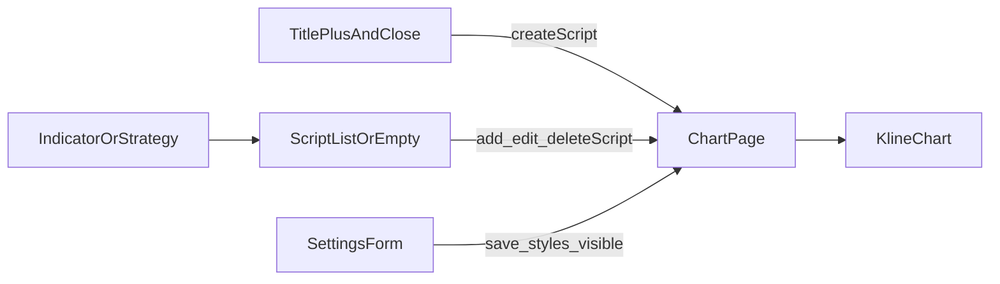

# Sprint3 迭代文档

> 状态：**进行中**（实现已落地；Electron 窗内点验待补跑）
> 关联：[需求文档](./Sprint3需求文档.md)、[v0.2 release 文档](../release文档.md)、[Sprint2.1 迭代文档](../Sprint2/Sprint2.1迭代文档.md)、[开发计划](../../../../.cursor/plans/sprint3迭代与计划_292baa81.plan.md)

---

## 1. 当前迭代目标

把指标目录弹框和设置弹框改成固定尺寸、两栏/网格布局，去掉已被图表接管的「当前布局」操作。

### 1.1 目标声明

| # | 目标 | 验收口径 |
|---|---|---|
| G1 | 指标与策略弹框 | 标题「指标与策略」加粗；无「当前布局」、无底部关闭区；右上角叉号；标题右侧加号新建脚本；左栏「指标 / 策略」，右栏名称+key+图标按钮；行悬停与图标悬停对齐图例按钮；空态图标+文案居中；固定宽高，列表滚动 |
| G2 | 指标设置弹框 | 更窄；右上角叉号；参数两列（名称 / 控件，输入框无 title）；样式四列（显示 / 名称 / 颜色 / 线宽）；MACD 直方图按分组行渲染 |

### 1.2 范围边界（本迭代不做）

- 策略后端、策略脚本模型、把脚本真正分成 indicator/strategy
- Script 方言、`chart:build` 事件表、ChartInput Schema
- 恢复「当前布局」里的设置/删除（图表图例已有）
- TradingView「隐藏全部图形 / 更多选项」

### 1.3 技术选型（本迭代）

| 层 | 选型 |
|---|---|
| 壳 / 构建 | Electron + electron-vite（沿用） |
| UI | React + MUI；图标按钮悬停复用图例 `ToolbarButton` |
| 业务 | ChartPage 作 UI Controller；弹框只回调，不直连 IPC |
| 数据 / 计算 | `params.styles[plotId].visible` 缺省 true；renderer 过滤隐藏 plot |
| 协议 | IPC 与 `ChartInput` 不变；复用 `chartLayout:*` / `indicatorScript:*` |

---

## 2. 功能需求

### 2.1 用户故事

1. **US10** 作为使用者，我在「指标与策略」弹框里按左侧分类浏览脚本，用加号新建、用行内图标添加到图表 / 编辑 / 删除，不再在弹框里管理当前布局。
2. **US11** 作为使用者，我在更窄的设置弹框里按网格改参数和样式，并能勾选是否显示某条图形。

### 2.2 功能清单

| ID | 功能 | 优先级 | 状态 |
|---|---|---|---|
| F01 | 弹框标题「指标与策略」加粗；标题右侧加号新建；右上角叉号；去掉底部关闭区 | Must | 已完成（待手工验收） |
| F02 | 去掉「当前布局」；ChartPage 不再向弹框传布局实例的设置/删除 | Must | 已完成（待手工验收） |
| F03 | 左栏「指标 / 策略」；右栏名称+key+添加/编辑/删除图标；行与图标悬停 | Must | 已完成（待手工验收） |
| F04 | 指标/策略空态：上方图标、下方文案，水平垂直居中 | Must | 已完成（待手工验收） |
| F05 | 弹框固定宽高，列表超出滚动 | Must | 已完成（待手工验收） |
| F06 | 设置框收窄 + 右上角叉号；底部保留取消/保存 | Must | 已完成（待手工验收） |
| F07 | 参数两列 grid（名称 / 控件，输入框无 title） | Must | 已完成（待手工验收） |
| F08 | 样式四列 grid；histogram 分组行（标题行 + 涨色/跌色） | Must | 已完成（待手工验收） |
| F09 | `styles.visible` 缺省 true；renderer 过滤隐藏 plot | Must | 已完成（待手工验收） |

### 2.3 非功能需求

- ChartPage 仍是唯一下单点；弹框不直连 IPC
- 不改 Script 方言、不改 ChartInput Schema、不改 E1–E8 执行事件表
- 策略列表本迭代恒空，只做 UI 占位
- 删除脚本仍：布局已引用时禁用

---

## 3. 详细设计说明

### 3.1 进程与数据流



ChartPage 仍是唯一下单点。弹框只发回调；打开编辑器走已有 `openNewScriptEditor` / `openEditScriptEditor`；改 `visible` 走现有 `chartLayout:update`。

### 3.2 目录 / 模块（本迭代涉及）

改动：

新增：

```
docs/releases/v0.2/Sprint3/Sprint3迭代文档.md
src/renderer/src/pages/chart/ChartIconButton.tsx
```

改动：

```
docs/releases/v0.2/release文档.md
src/renderer/src/pages/chart/IndicatorDialog.tsx
src/renderer/src/pages/chart/IndicatorSettingsDialog.tsx
src/renderer/src/pages/chart/ManifestFieldsForm.tsx
src/renderer/src/pages/chart/LegendActionButtons.tsx
src/renderer/src/pages/ChartPage.tsx
src/shared/types/chartLayout.ts
src/shared/chart/indicatorScript.ts
src/renderer/src/pages/chart/syncPrimitiveSeries.ts
src/renderer/src/pages/chart/KlineChart.tsx
```

### 3.3 数据模型 / 存储

不改表结构。`PlotStyleParams` 增加 `visible?: boolean`，缺省 `true`。旧布局经 `normalizeParams` 补默认值。

### 3.4 协议 / API / IPC

不新增 IPC。复用：

- `chartLayout:add` / `chartLayout:update` / `indicatorScript:list` / `indicatorScript:remove`
- `chart:build`（改参数 / 样式 / visible 仍走现有更新路径）

### 3.5 核心编排

1. 指标弹框：左栏切「指标 / 策略」；指标列出全部用户脚本；策略恒空
2. 行操作：添加 → `chartLayout.add`；编辑 → 打开脚本编辑器；删除脚本 → `indicatorScript.remove`（被布局引用则禁用）
3. 设置表单：`inputs` 两列、`styles` 四列；histogram 第一行 checkbox+名称，随后涨色/跌色
4. 保存后 `normalizeParams`；`filterPrimitivesByLayout` 按 `instanceId` + plot 短名丢掉 `visible === false` 的 primitive

### 3.6 UI

- 指标弹框：固定约 `600×480`；标题加粗 + 加号 + 叉号；左栏约 `120px`
- 空态：图标在上、文案在下，右栏水平垂直居中
- 设置弹框：宽约 `420px`；右上角叉号；底部取消/保存
- 样式行用 `StylePalette` 弹出调色板（色板 + 不透明度 + 线宽厚度）；直方图涨跌色不显示厚度
- 图标悬停：与图例按钮一致（`#ed6c02` + `rgba(0,0,0,0.06)`）

### 3.7 契约

| 层级 | 位置 |
|---|---|
| PlotStyleParams.visible | `src/shared/types/chartLayout.ts` |
| assert / normalize | `src/shared/chart/indicatorScript.ts` |
| ChartInput | 不改 |
| Python plot() | 不改；隐藏序列仍计算，只是不画 |

---

## 4. 任务步骤

| 步骤 | 任务 | 产出 | 状态 |
|---|---|---|---|
| 1 | 迭代文档 + release 互链 | 本文件、`release文档.md` §4 | 已完成 |
| 2 | 抽/复用图标按钮悬停样式 | `ChartIconButton.tsx` | 已完成 |
| 3 | 重做 IndicatorDialog | 固定框、两栏、空态、去当前布局 | 已完成 |
| 4 | 收窄设置框 + 叉号 | `IndicatorSettingsDialog` | 已完成 |
| 5 | 参数/样式 grid + histogram 分组行 | `ManifestFieldsForm` | 已完成 |
| 6 | `visible` 入 styles 并在 renderer 过滤 | `chartLayout.ts` / `indicatorScript.ts` / `syncPrimitiveSeries.ts` | 已完成 |
| 7 | typecheck + 手工验收 | G1–G2 | 部分完成（typecheck 通过；窗内点验待补跑） |

commit 编码：`TZE-v0.2.3-US{n}-task{m}`。

### 4.1 本地复现命令

```bash
npm run typecheck
npm run dev
```

---

## 5. 测试结果 / 总结反馈

### 5.1 验收清单与结果

| 检查项 | 方式 | 结果 | 说明 |
|---|---|---|---|
| typecheck（node + web） | `npm run typecheck` | 通过 | 2026-09-06；顺手修了 `KlineChart.plotCellOf` 的 Element/HTMLElement |
| 已起 dev 实例 HMR | 读终端 | 通过 | renderer 热更新 IndicatorDialog / Settings / ManifestFieldsForm，无编译错误 |
| G1 指标与策略弹框 | 手工 | 待补跑 | 本环境无法点 Electron 窗 |
| G2 指标设置弹框 / histogram 分组行 | 手工 | 待补跑 | 同上 |
| F09 取消勾选后图形消失 | 手工 | 待补跑 | 同上 |

### 5.2 关键命令记录

```
npm run typecheck
# 2026-09-06  node + web 均通过

npm run dev
# 已有单实例在跑；HMR 更新 IndicatorDialog / IndicatorSettingsDialog / ManifestFieldsForm 等，无报错
```

### 5.3 总结反馈

**做得好的地方**

- 指标弹框去掉「当前布局」，和 Sprint2.1 图例操作对齐，职责不再重复
- 图标按钮抽到 `ChartIconButton`，悬停与图例一致
- `visible` 只进 `params.styles`，不改 Python / ChartInput；旧布局经 normalize 缺省显示

**暴露的问题 / 摩擦**

- 本环境没有浏览器工具可以操作 Electron 窗，G1–G2 窗内点验待用户补跑
- 隐藏 plot 仍会在 Python 侧重算，只是 renderer 不画
- 策略左栏是占位，列表恒空

---

## 6. 改进目标

### 6.1 短期（下一迭代可做）

1. 补跑 Sprint2 + Sprint2.1 + Sprint3 手工验收。
2. 策略列表从占位改为真实模型。
3. 隐藏 plot 时跳过 Python 计算（本迭代仍计算、只是不画）。

### 6.2 中期

1. 周期真实行情（周/月/季/年）接入 `chart:build`。
2. 窗格高度 stretch 持久化。
3. 按实例增量重算。

### 6.3 长期

1. Script / Protocol 解耦（Roadmap 3.2）。
2. 指标之后的策略 / 库，仍走同一 Script 框架。

---

## 附录

### A. 相关文档

- [Sprint3需求文档.md](./Sprint3需求文档.md)
- [Sprint2.1迭代文档.md](../Sprint2/Sprint2.1迭代文档.md)
- [release文档.md](../release文档.md)
- [开发计划](../../../../.cursor/plans/sprint3迭代与计划_292baa81.plan.md)

### B. 常用命令

| 命令 | 用途 |
|---|---|
| `npm run dev` | 开发起窗 |
| `npm run typecheck` | TS 检查 |
