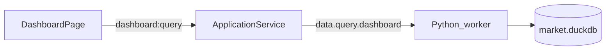

# Sprint4.1 迭代文档

> 状态：**进行中**（实现已落地；`npm run typecheck` 通过；`acceptance:v02s4` 因本机已有真实行情与 fixture 断言冲突未过，非本迭代契约回归；Electron 窗内点验待补跑）
> 关联：[需求文档](./Sprint4.1需求文档.md)、[Sprint4 迭代文档](./Sprint4迭代文档.md)、[v0.2 release 文档](../release文档.md)、[开发计划](../../../../.cursor/plans/sprint4.1_仪表盘改进_8cfba67c.plan.md)

---

## 1. 当前迭代目标

把 Sprint4 四宫格仪表盘改成可调三格，并对调宫格内容、补齐截止日期、涨跌幅排序与统计多窗格对齐。

### 1.1 目标声明

| # | 目标 | 验收口径 |
|---|---|---|
| G1 | 三格可调布局 | 左上 K 线 / 左下指数列表 / 右侧统计；默认左右 1/2，左上 3/4、左下 1/4；横向两侧最小 1/4；左上高度 50%–75%（左下因此 25%–50%） |
| G2 | K 线截止日期 | 标题行展示当前选中指数 K 线最后一根 `trade_date`（`YYYY-MM-DD`） |
| G3 | 涨跌幅排序 | 指数列表「涨跌幅」列可点；组内三态（默认 → 降序 → 升序） |
| G4 | 统计多窗格对齐 | 两融、成交额各用一个 `createChart` + `addPane`，曲线与变化柱共用时间轴；两融图例为色线 + 描述 |

### 1.2 范围边界（本迭代不做）

- 不改 DuckDB / Python worker / `dashboard:query` 契约
- 不做右下第四格内容
- 不复用图表页 `KlineChart`
- 不改 Script / Protocol
- 布局比例不持久化
- 不以需求原文「左下 2/3」为准（与左上 1/2–3/4 冲突，已确认取左上约束）

### 1.3 技术选型（本迭代）

| 层 | 选型 |
|---|---|
| 壳 / 构建 | Electron + electron-vite（沿用） |
| UI | React + MUI；本地 pointer 拖拽条（不引入新依赖）；统计图 `lightweight-charts` `addPane` |
| 业务 | `DashboardPage` 编排；仍走 `dashboard:query` |
| 数据 / 计算 | 不改表结构、不改查询层 |
| 协议 | IPC `dashboard:query` 不变 |

---

## 2. 功能需求

### 2.1 用户故事

1. **US15** 作为使用者，我打开仪表盘能看到左侧上下为 K 线与指数列表、右侧为统计，并能拖动分割条在约定范围内改比例，从而按自己习惯看盘。
2. **US16** 作为使用者，我能按涨跌幅给指数列表排序，从而快速找到领涨/领跌指数。
3. **US17** 作为使用者，我在统计区看到两融/成交额的曲线与变化柱对齐同一日期轴，并用色线图例区分序列。

### 2.2 功能清单

| ID | 功能 | 优先级 | 状态 |
|---|---|---|---|
| F01 | 四宫格改为左二右一三格，默认 1/2 × 3/4+1/4 | Must | 已完成（待手工验收） |
| F02 | 横向两侧最小 1/4；左上高度钳制 50%–75% | Must | 已完成（待手工验收） |
| F03 | 左上 K 线、左下指数列表、右侧统计 | Must | 已完成（待手工验收） |
| F04 | K 线标题行数据截止日期 | Must | 已完成（待手工验收） |
| F05 | 涨跌幅列组内三态排序 | Must | 已完成（待手工验收） |
| F06 | 两融/成交额单图表多窗格对齐日期 | Must | 已完成（待手工验收） |
| F07 | 两融图例改为色线 + 描述 | Must | 已完成（待手工验收） |

### 2.3 非功能需求

- Renderer 只改仪表盘 UI，不新增 IPC
- 统计图不复用 `KlineChart`，只复用 LWC `addPane` 模式
- 拖拽不引入第三方 split 库
- 大盘 / 宽基分组在排序后仍保留

---

## 3. 详细设计说明

### 3.1 进程与数据流



查询路径与 Sprint4 相同。本迭代只改 `DashboardPage` 如何摆放与绘制已返回的 `DashboardQueryResult`。

### 3.2 目录 / 模块（本迭代涉及）

新增：

```
src/renderer/src/pages/dashboard/DashboardSplit.tsx
```

改动：

```
src/renderer/src/pages/dashboard/DashboardPage.tsx
src/renderer/src/pages/dashboard/IndexListPanel.tsx
src/renderer/src/pages/dashboard/StatCharts.tsx
src/renderer/src/pages/dashboard/StatsPanel.tsx
docs/releases/v0.2/Sprint4/Sprint4.1迭代文档.md
docs/releases/v0.2/release文档.md
```

### 3.3 数据模型 / 存储

不改表。截止日期取 `bars` 最后一根 `trade_date`，空则回退 `as_of` 或选中指数 `trade_date`。

### 3.4 协议 / API / IPC

不变：`dashboard:query` / `window.api.dashboard.query()`。

### 3.5 核心编排

1. 打开仪表盘 → 按选中 `ts_code` 调 `dashboard:query`（与 Sprint4 相同）
2. 左下点选指数 → 更新 `selected` → 左上 K 线与截止日期随 `bars` 更新
3. 分割条拖动只改本地百分比 state，不写配置、不重拉数据

### 3.6 UI

三格（外层左右 split + 左侧上下 split）：

- 左上：精简日 K；标题 `{名称} 日K` + 截止日期
- 左下：大盘 / 宽基分组表；涨跌幅 `TableSortLabel`
- 右侧：可滚动；两融（多窗格）→ 成交额（多窗格）→ 涨跌家数；flex 约 2:2:1

默认：左右 50/50，左上 75%、左下 25%。钳制：左右各 ≥25%；左上 ∈ [50%, 75%]。

两融/成交额：pane 0 曲线（两融另加右轴上证收盘），pane 1 红绿变化柱；共用 `timeScale`。图例叠在曲线窗格左上：色线样条 + 描述。

### 3.7 契约

本迭代不改 JSON Schema / Python 模型。TypeScript 仍用 `src/shared/types/dashboard.ts`。

---

## 4. 任务步骤

| 步骤 | 任务 | 产出 | 状态 |
|---|---|---|---|
| 1 | 迭代文档骨架 + release 互链 | 本文件、`release文档.md` §4 | 已完成 |
| 2 | 三格 split 布局 + 内容对调 | `DashboardSplit` / `DashboardPage` | 已完成 |
| 3 | K 线标题截止日期 | `DashboardPage` Pane extra | 已完成 |
| 4 | 涨跌幅排序 | `IndexListPanel` | 已完成 |
| 5 | 两融/成交额 `addPane` + 色线图例 | `StatCharts` / `StatsPanel` | 已完成 |
| 6 | typecheck + `acceptance:v02s4` + 窗内点验 | 命令输出 | 部分完成（见 §5） |
| 7 | 回填本文档测试节 | §5 | 已完成 |

commit 编码：`TZE-v0.2.4-1-US{n}-task{m}`。

### 4.1 本地复现命令

```bash
npm run typecheck
npm run acceptance:v02s4
npm run dev
```

---

## 5. 测试结果 / 总结反馈

### 5.1 验收清单与结果

| 检查项 | 方式 | 结果 | 说明 |
|---|---|---|---|
| typecheck（node + web） | `npm run typecheck` | 通过 | 2026-09-09 |
| fixture 查询回归 | `npm run acceptance:v02s4` | 未通过（环境） | 本机 `market.duckdb` 已有真实窗口数据；fixture 仍能写入（index=36），但列表/K 线断言读到实盘值而非 9999/2 bars。本迭代未改查询契约 |
| G1 三格布局 / 钳制 | 手工 `npm run dev` | 待补跑 | 实现已落地 |
| G2 截止日期 | 手工 | 待补跑 | 标题行「截至 YYYY-MM-DD」 |
| G3 涨跌幅排序 | 手工 | 待补跑 | 组内三态 |
| G4 多窗格对齐 + 图例 | 手工 | 待补跑 | `addPane` + 色线样条 |

### 5.2 关键命令记录

```
npm run typecheck
# 2026-09-09  node + web 均通过

npm run acceptance:v02s4
# ===== v0.2 Sprint4 Acceptance =====
# PASS | python ready | python=3.13.2
# PASS | seed dashboard fixture | index=36; margin=6; limit=10
# PASS | display indices count | count=14
# FAIL | 深证成指成交量用深圳A指合成 | vol=644070574.1（实盘，非 fixture 9999）
# FAIL | selected kline bars | bars=7（窗口内实盘根数，非 fixture 2）
# FAIL | margin totals in 亿元 | 实盘汇总值
# PASS | turnover series present
# FAIL | breadth counts and 9-bin histogram | 实盘家数
# FAIL | 创业板指K线成交量用创业板综合成 | vol=实盘
# FAILED: 5
# 说明：清空本机行情库后重跑该脚本可回到 Sprint4 的 ALL PASSED；本迭代禁止为此擦库。
```

### 5.3 总结反馈

**做得好的地方**

- 只改 Renderer，查询 / DuckDB / IPC 不动
- 分割条无新依赖，钳制与确认后的左上 50%–75% 一致
- 统计图与图表页同样走 LWC 多窗格，时间轴天然对齐

**暴露的问题 / 摩擦**

- `acceptance:v02s4` 把 fixture 写进用户 `market.duckdb`，有真实同步数据后断言必炸；后续应隔离临时库
- 与正在跑的 `npm run dev` 同时验收会抢 DuckDB 文件锁
- Electron 窗内布局 / 拖拽钳制 / 图例待用户点验

---

## 6. 改进目标

### 6.1 短期（下一迭代可做）

1. Electron 窗内点验本迭代布局 / 排序 / 多窗格（若本轮未点完）。
2. 补跑有 Token 的看板全窗口回填（承接 Sprint4）。
3. 布局比例是否写入本地配置。

### 6.2 中期

1. 右下宫格内容（Sprint4 遗留；本迭代已取消第四格，若恢复需另定布局）。
2. 看板水位单独可视化。
3. `limit_status` 与涨跌分布下钻到个股列表。

### 6.3 长期

1. Script / Protocol 解耦。
2. 策略 / 库功能。

---

## 附录

### A. 相关文档

- [Sprint4.1需求文档.md](./Sprint4.1需求文档.md)
- [Sprint4迭代文档.md](./Sprint4迭代文档.md)
- [release文档.md](../release文档.md)

### B. 常用命令

| 命令 | 用途 |
|---|---|
| `npm run dev` | 开发起窗 |
| `npm run typecheck` | TS 检查 |
| `npm run acceptance:v02s4` | v0.2 Sprint4 无头验收（契约回归） |
