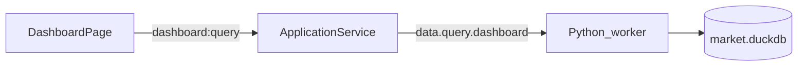

# Sprint4.2 迭代文档

> 状态：**进行中**（实现已落地；`npm run typecheck` 与隔离库 `acceptance:v02s4` 通过；Electron 窗内点验待补跑）
> 关联：[需求文档](./Sprint4.2需求文档.md)、[开发计划](../../../../.cursor/plans/sprint4.2_涨跌停历史曲线.plan.md)、[Sprint4 迭代文档](./Sprint4迭代文档.md)、[Sprint4.1 迭代文档](./Sprint4.1迭代文档.md)、[Tushare 目标数据接口文档](./Sprint4%20tushare目标数据接口文档.md)、[v0.2 release 文档](../release文档.md)

---

## 1. 当前迭代目标

在仪表盘统计格里，于涨跌家数与九档直方图下方补上涨停 / 跌停家数的历史双曲线，日期轴与两融、成交额同一查询窗口。

### 1.1 目标声明

| # | 目标 | 验收口径 |
|---|---|---|
| G1 | 查询出序列 | `dashboard:query` 的 `breadth` 增加 `series`；按 `start_date`–`end_date` 逐日给出 `limit_up_count` / `limit_down_count`；末日点与当日四数中的涨停、跌停一致 |
| G2 | 统计格双曲线 | 九档直方图下方新图；两条线（涨停红、跌停绿）；图例为色线 + 描述；空序列不报错 |
| G3 | 契约回归 | `npm run typecheck` 通过；验收断言 `series` 至少 2 个交易日，且最后一点等于当日涨停/跌停家数 |

### 1.2 范围边界（本迭代不做）

- 不新拉 Tushare，不改 `market_day` / `dashboard_backfill` 同步路径
- 不新建日级汇总表（查询层对已有明细 `GROUP BY trade_date`）
- 不画上涨 / 下跌 / 九档的历史曲线
- 不做盘中实时涨跌停
- 不用 `limit_list_d`，不下钻个股列表
- 不改三格布局与两融 / 成交额图
- 不隔离验收库（承接 Sprint4.1 遗留）

### 1.3 技术选型（本迭代）

| 层 | 选型 |
|---|---|
| 壳 / 构建 | Electron + electron-vite（沿用） |
| UI | React + MUI；`lightweight-charts` 单图双 `LineSeries`（不复用 `AlignedStatChart` 的变化柱窗格） |
| 业务 | `DashboardPage` / `StatsPanel`；仍走 `dashboard:query` |
| 数据 / 计算 | DuckDB 已有 `stock_limit_status` + `daily_bar`；查询时按日聚合 |
| 协议 | IPC `dashboard:query` 不变；响应 `breadth` 增 `series` |

---

## 2. 功能需求

### 2.1 用户故事

1. **US18** 作为使用者，我在统计格里除了看当天涨跌家数和九档分布，还能看到涨停、跌停家数随交易日变化的两条曲线，从而判断情绪是在升温还是降温。

### 2.2 功能清单

| ID | 功能 | 优先级 | 状态 |
|---|---|---|---|
| F01 | 查询层按窗口聚合涨停/跌停家数序列 | Must | 已完成 |
| F02 | `DashboardBreadth` / Pydantic / JSON Schema 增加 `series` | Must | 已完成 |
| F03 | fixture 至少写入两个交易日的涨跌状态，供序列断言 | Must | 已完成 |
| F04 | 直方图下方双曲线图 + 色线图例 | Must | 已完成（待手工验收） |
| F05 | 验收断言序列长度与末日对齐当日四数 | Must | 已完成 |

### 2.3 非功能需求

- 过滤规则与当日四数相同：`daily_bar INNER JOIN stock_limit_status`，且 `vol > 0`
- 涨停 `limit_status ∈ {2,3}`，跌停 `{5,6}`，与现 `_compute_breadth` 一致
- 序列窗口用查询参数，不用「只取 `MAX(trade_date)`」
- 全窗口约数百万行 JOIN，DuckDB 一次 `GROUP BY` 完成，不在 Python 里逐日扫明细
- Renderer 不直连 DuckDB；不新增 IPC 方法

---

## 3. 详细设计说明

### 3.1 进程与数据流



同步路径不变：主动「更新数据」时，`market_day` / `dashboard_backfill` 已把 `daily_basic.limit_status` 写入 `stock_limit_status`。本迭代只改查询与展示。

查询增量：

1. 当日四数 + 九档：仍用 `latest_limit_trade_date()` + `_compute_breadth`（现有逻辑）。
2. 历史曲线：新增按 `start_date`–`end_date` 的日聚合，写入 `breadth.series`。
3. 前端 `DashboardPage` 仍只传 `ts_code`；Main 补默认窗口（`20240101`～今天），与两融 / 成交额相同。

### 3.2 目录 / 模块（本迭代涉及）

改动（实现时）：

```
python/worker/db/market_db.py
python/worker/handlers/dashboard_query.py
python/worker/handlers/market_seed.py
python/worker/models.py
src/shared/types/dashboard.ts
contracts/dashboard.query.response.json
src/renderer/src/pages/dashboard/StatsPanel.tsx
src/renderer/src/pages/dashboard/BreadthHistoryChart.tsx
src/main/acceptance/runV02Sprint4.ts
```

### 3.3 数据模型 / 存储

不建新表。沿用：

- `stock_limit_status(ts_code, trade_date, limit_status, synced_at)`
- `daily_bar`（`pct_chg` / `vol`；本序列只用 `vol` 过滤）

查询 SQL 意向：

```sql
SELECT d.trade_date,
       SUM(CASE WHEN s.limit_status IN (2, 3) THEN 1 ELSE 0 END) AS limit_up_count,
       SUM(CASE WHEN s.limit_status IN (5, 6) THEN 1 ELSE 0 END) AS limit_down_count
FROM daily_bar d
INNER JOIN stock_limit_status s
  ON d.ts_code = s.ts_code AND d.trade_date = s.trade_date
WHERE d.trade_date >= ?
  AND d.trade_date <= ?
  AND d.vol IS NOT NULL
  AND d.vol > 0
GROUP BY d.trade_date
ORDER BY d.trade_date
```

`series` 最后一点的两个家数，必须等于同一 `trade_date` 上当日四数的涨停 / 跌停（同一套过滤）。

### 3.4 协议 / API / IPC

| 层级 | 名称 | 变化 |
|---|---|---|
| IPC | `dashboard:query` | 方法名不变 |
| Python | `data.query.dashboard` | `breadth` 增 `series` |
| Preload | `window.api.dashboard.query()` | 入参不变 |

`breadth.series` 元素：

| 字段 | 类型 | 含义 |
|---|---|---|
| `trade_date` | `string` | `YYYYMMDD` |
| `limit_up_count` | `number` | 当日涨停家数 |
| `limit_down_count` | `number` | 当日跌停家数 |

不复用 `DashboardSeriesPoint`（那是亿元 `value` / `change` / 上证 `close`）。

### 3.5 核心编排

1. `query_dashboard` 算完当日 `breadth` 后，再 `fetch_breadth_limit_series(start, end)`。
2. 把序列挂到 `DashboardBreadth.series`。
3. `StatsPanel` → `BreadthBlock`：四数 → 九档 → 新图。
4. 无 `series` 或长度为 0：图表占位为空，四数 / 直方图仍可显示。

### 3.6 UI

统计格右侧滚动区，涨跌块自上而下：

1. 标题「涨跌家数」
2. 上涨 / 涨停 / 下跌 / 跌停四数（不变）
3. 九档直方图（不变）
4. **新图**：单 `createChart`、左轴、两条 `LineSeries`；涨停 `#ef5350`，跌停 `#26a69a`；图例色线 +「涨停家数」「跌停家数」

不把变化柱做成第二窗格（需求只要两条曲线）。

### 3.7 契约

| 层级 | 位置 |
|---|---|
| JSON Schema | `contracts/dashboard.query.response.json`（`breadth` 允许 `series`） |
| TypeScript | `src/shared/types/dashboard.ts` |
| Python | `python/worker/models.py` |

---

## 4. 任务步骤

| 步骤 | 任务 | 产出 | 状态 |
|---|---|---|---|
| 1 | DuckDB 按日聚合涨停/跌停 | `fetch_breadth_limit_series` | 已完成 |
| 2 | 查询结果挂上 `breadth.series` | `dashboard_query` + Pydantic / TS / Schema | 已完成 |
| 3 | fixture 补第二日涨跌状态 | `market_seed.py` | 已完成 |
| 4 | 直方图下双曲线图 | `BreadthHistoryChart` + `StatsPanel` | 已完成（待手工验收） |
| 5 | 验收断言序列 | `runV02Sprint4.ts` | 已完成 |
| 6 | typecheck + 窗内点验 | 命令记录 / 手工 | typecheck 通过；窗内待补跑 |

### 4.1 本地复现命令

```bash
npm run typecheck
npm run acceptance:v02s4
npm run dev
```

有 Token 时在配置页「更新数据」，确认 `stock_limit_status` 窗口已齐后再看曲线是否拉满。

---

## 5. 测试结果 / 总结反馈

### 5.1 验收清单与结果

| 检查项 | 方式 | 结果 | 说明 |
|---|---|---|---|
| G1 `breadth.series` 与末日对齐 | 隔离库 `acceptance:v02s4` | 通过 | `n=2; last lu=1 ld=2; day=20240103` |
| G2 直方图下双曲线 + 图例 | 手工 `npm run dev` | 待补跑 | 实现已落地 |
| G3 typecheck | `npm run typecheck` | 通过 | 2026-09-12 |
| 当日四数 / 九档不被改坏 | 隔离库 `acceptance:v02s4` | 通过 | 原断言仍 PASS |

### 5.2 关键命令记录

```
npm run typecheck
# 2026-09-12  node + web 均通过

# 隔离 userData 跑 acceptance（本机实盘库会污染默认 userData）
npx cross-env V02_SPRINT4_ACCEPTANCE=1 electron-vite dev -- --user-data-dir=%TEMP%\tz-accept-*
# PASS | breadth limit-up/down history series | n=2; last={"trade_date":"20240103","limit_up_count":1,"limit_down_count":2}; day=20240103
# ALL PASSED
```

### 5.3 总结反馈

**做得好的地方**

- 查询层一次 `GROUP BY` 出序列，不改同步、不新拉 Tushare。
- 修复 `fetch_breadth_rows` 循环内误 `return`（仅返回首行），避免当日四数与序列不一致。

**暴露的问题 / 摩擦**

- 默认 `acceptance:v02s4` 写入用户 `market.duckdb`，有实盘数据时断言会炸；需 `--user-data-dir` 隔离或后续改验收库。
- 本机若 `limit_status` 回填不齐，曲线会短于两融 / 成交额，属数据水位问题。
- G2 窗内双曲线 / 图例待用户点验。

---

## 6. 改进目标

### 6.1 短期（下一迭代可做）

1. 窗内点验本迭代双曲线（若本轮未点完）。
2. 补跑有 Token 的看板全窗口回填，使涨跌停曲线与两融窗口对齐。
3. 验收改用临时库，避免 fixture 污染实盘。

### 6.2 中期

1. 若全窗口 `GROUP BY` 变慢，再落日级汇总表（同步日写一行，查询不再扫明细）。
2. `limit_status` / 九档下钻到个股列表。
3. 上涨 / 下跌家数曲线（若产品需要）。

### 6.3 长期

1. Script / Protocol 解耦。
2. 策略 / 库功能。

---

## 附录

### A. 相关文档

- [Sprint4.2需求文档.md](./Sprint4.2需求文档.md)
- [开发计划](../../../../.cursor/plans/sprint4.2_涨跌停历史曲线.plan.md)
- [Sprint4迭代文档.md](./Sprint4迭代文档.md)
- [Sprint4.1迭代文档.md](./Sprint4.1迭代文档.md)
- [Sprint4 tushare目标数据接口文档.md](./Sprint4%20tushare目标数据接口文档.md)

### B. 常用命令

| 命令 | 用途 |
|---|---|
| `npm run dev` | 开发起窗 |
| `npm run typecheck` | TS 检查 |
| `npm run acceptance:v02s4` | 看板 fixture 查询回归（将含 `series`） |
