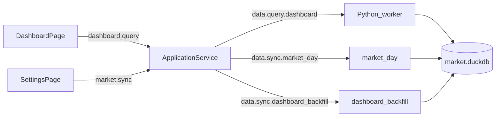

# Sprint4 迭代文档

> 状态：**进行中**（实现已落地；`npm run typecheck` 与 `acceptance:v02s4` 通过；Electron 窗内仪表盘点验待补跑）
> 关联：[需求文档](./Sprint4需求文档.md)、[Tushare 目标数据接口文档](./Sprint4%20tushare目标数据接口文档.md)、[v0.2 release 文档](../release文档.md)、[Sprint3 迭代文档](../Sprint3/Sprint3迭代文档.md)、[开发计划](../../../../.cursor/plans/sprint4_仪表盘迭代_0aa2997a.plan.md)

---

## 1. 当前迭代目标

把看板四类数据入库，并做成默认主页的四宫格仪表盘。

### 1.1 目标声明

| # | 目标 | 验收口径 |
|---|---|---|
| G1 | 数据入库 | 16 只指数日线、两融三所、涨跌状态与股票日线同一窗口可增量补齐；已 complete 的股票日不重拉 `daily` |
| G2 | 查询接口 | `dashboard:query` 一次返回列表（成交合成）、K 线、两融/成交额序列、涨跌家数+九档 |
| G3 | 仪表盘主页 | 四宫格；左上列表联动右上日 K；左下三块统计；右下空；侧栏第一项且默认打开 |

### 1.2 范围边界（本迭代不做）

- 右下内容
- 周 / 月 K
- 个股两融（`margin_detail`）
- `limit_list_d`
- 把指数写入 `daily_bar`
- 图表页指标 / 脚本、改 Script / Protocol

### 1.3 技术选型（本迭代）

| 层 | 选型 |
|---|---|
| 壳 / 构建 | Electron + electron-vite（沿用） |
| UI | React + MUI 四宫格；K 线 / 曲线 / 变化柱用 `lightweight-charts` 精简图，不复用 `KlineChart` |
| 业务 | `DashboardPage` 编排；不走 `chart:build` / `ChartInput` |
| 数据 / 计算 | DuckDB 新表 `index_daily` / `margin` / `stock_limit_status`；Tushare `index_daily` / `margin` / `daily_basic.limit_status` |
| 协议 | `data.sync.dashboard_backfill`、`data.query.dashboard`、IPC `dashboard:query` |

---

## 2. 功能需求

### 2.1 用户故事

1. **US12** 作为使用者，我更新数据后能把大盘/宽基指数、两融、涨跌状态入库，从而仪表盘有本地数据可查。
2. **US13** 作为使用者，我打开主页能看到指数列表和当前选中指数的日 K，从而快速看盘。
3. **US14** 作为使用者，我在左下能看到两融余额、沪深京成交额及其变化曲线/柱状图，以及涨跌家数与九档分布。

### 2.2 功能清单

| ID | 功能 | 优先级 | 状态 |
|---|---|---|---|
| F01 | 16 只指数日线入库（含成交源 399107/399102），不写 `daily_bar` | Must | 已完成 |
| F02 | 两融按交易所分行入库 | Must | 已完成 |
| F03 | `daily_basic.limit_status` 入库 | Must | 已完成 |
| F04 | 已 complete 股票日只回填看板，不重拉全市场 daily | Must | 已完成 |
| F05 | `dashboard:query` 合成成交、两融/三市加总、九档分箱 | Must | 已完成（脚本验收通过） |
| F06 | 四宫格仪表盘：列表联动 K 线 | Must | 已完成（待手工验收） |
| F07 | 左下三块统计（两融 / 成交额 / 涨跌家数） | Must | 已完成（待手工验收） |
| F08 | 仪表盘设为默认主页，侧栏新增入口 | Must | 已完成（待手工验收） |

### 2.3 非功能需求

- 指数与股票 `ts_code` 分表
- 成交合成只在查询层；库里同时存成指与成交源
- 较上一交易日用序列中的上一交易日，不用自然日
- 涨停/跌停个股不再计入 ±5% 档
- 空窗（指数上市前）不算失败
- 限流沿用 `wait_for_tushare_slot`
- 涨跌统计只计入同时有日线且有 `limit_status`、且 `vol > 0` 的股票

---

## 3. 详细设计说明

### 3.1 进程与数据流



- 新交易日：[`market_day.py`](../../../../python/worker/handlers/market_day.py) 在 `daily` + `adj_factor` 之后调用 `sync_dashboard_for_date`。看板失败**不**把股票日打成 pending。
- 窗口同步结束后：[`syncMarketWindow`](../../../../src/main/services/applicationService.ts) 再调 `data.sync.dashboard_backfill`。指数按 `ts_code` 区间、两融按区间、`daily_basic` 只补缺失日。

### 3.2 目录 / 模块（本迭代涉及）

新增：

```
src/shared/constants/dashboard.ts
src/shared/types/dashboard.ts
python/worker/dashboard_codes.py
python/worker/handlers/dashboard_sync.py
python/worker/handlers/dashboard_query.py
src/renderer/src/pages/dashboard/
src/main/acceptance/runV02Sprint4.ts
contracts/dashboard.*.json
```

改动：

```
python/worker/db/market_db.py
python/worker/handlers/market_day.py
python/worker/handlers/market_seed.py
python/worker/main.py
python/worker/models.py
src/main/services/applicationService.ts
src/main/ipc/registerHandlers.ts
src/main/index.ts
src/preload/index.ts
src/preload/index.d.ts
src/renderer/src/App.tsx
src/renderer/src/layout/AppShell.tsx
src/shared/types/pythonProtocol.ts
src/shared/types/market.ts
package.json
```

### 3.3 数据模型 / 存储

DuckDB（`market.duckdb`）新表：

- `index_daily(ts_code, trade_date, OHLC, pre_close, change, pct_chg, vol, amount, synced_at)` PK `(ts_code, trade_date)`
- `margin(trade_date, exchange_id, rzye, rqye, rzrqye, synced_at)` PK `(trade_date, exchange_id)`
- `stock_limit_status(ts_code, trade_date, limit_status, synced_at)` PK `(ts_code, trade_date)`

`sync_trade_date.status=complete` 仍只表示股票 `daily` + `adj_factor`。`clear_market` 同时清空三张新表。

入库指数 16 只：大盘 5 + 成交源 2（`399107.SZ` / `399102.SZ`）+ 宽基 9。列表只展示 14 只。

### 3.4 协议 / API / IPC

| 层级 | 名称 |
|---|---|
| Python | `data.sync.dashboard_backfill` |
| Python | `data.query.dashboard` |
| IPC | `dashboard:query` |
| Preload | `window.api.dashboard.query()` |

查询层：

- 深证成指 / 创业板指的 `vol` / `amount` 用成交源同日值；OHLC 仍用成指
- 沪深京成交额 = `000001.SH + 399107.SZ + 899050.BJ` 的 `amount`（千元 / 1e5 → 亿元）
- 两融余额 = `Σ rzrqye`（元 / 1e8 → 亿元）；曲线附带上证 `close`
- 九档：涨停/跌停用 `limit_status ∈ {2,3}` / `{5,6}` 优先占位

### 3.5 核心编排

1. `market:sync` → 股票列表 → plan → 逐日 `market_day`（含看板当日拉取）
2. `dashboard_backfill`：sentinel `000001.SH` 缺日则 16 只区间回填；两融缺日则区间回填；`limit_status` 按缺失交易日补 `daily_basic`
3. 仪表盘按选中 `ts_code` 调 `dashboard:query`

### 3.6 UI

四宫格（`display: grid` 2×2）：

- 左上：大盘 / 宽基分组表（名称、收盘、涨跌幅、成交额亿元），点击联动
- 右上：精简日 K + 成交量
- 左下：可滚动；两融（双轴曲线 + 红绿柱）→ 成交额（同结构）→ 涨跌四数 + 九档直方图
- 右下：空占位

默认页：`AppPage = 'dashboard'`；侧栏第一项「仪表盘」。

### 3.7 契约

| 层级 | 位置 |
|---|---|
| JSON Schema | `contracts/dashboard.query.*.json`、`contracts/dashboard.backfill.*.json` |
| TypeScript | `src/shared/types/dashboard.ts`、`src/shared/constants/dashboard.ts` |
| Python | `python/worker/models.py`、`python/worker/dashboard_codes.py` |

---

## 4. 任务步骤

| 步骤 | 任务 | 产出 | 状态 |
|---|---|---|---|
| 1 | 迭代文档 + release 互链 | 本文件、`release文档.md` §4 | 已完成 |
| 2 | 常量 + DuckDB 三表 + clear | `dashboard` 常量、`market_db` | 已完成 |
| 3 | `market_day` 追加看板拉取 | `market_day.py` / `dashboard_sync.py` | 已完成 |
| 4 | `dashboard_backfill` 接入 `syncMarketWindow` | ApplicationService | 已完成 |
| 5 | `data.query.dashboard` | `dashboard_query.py` | 已完成 |
| 6 | IPC / preload / 契约 | `dashboard:query` | 已完成 |
| 7 | 四宫格仪表盘 | `pages/dashboard/` | 已完成 |
| 8 | 侧栏主页 | `App.tsx` / `AppShell.tsx` | 已完成 |
| 9 | typecheck + `acceptance:v02s4` | 验收脚本 | 已完成 |
| 10 | 回填本文档测试节 | 本节 / §5 | 已完成 |

commit 编码：`TZE-v0.2.4-US{n}-task{m}`。

### 4.1 本地复现命令

```bash
npm run typecheck
npm run acceptance:v02s4
npm run dev
```

有 Token 时在配置页「更新数据」覆盖 `20240101` 至今。已 complete 的股票日只会回填看板；`daily_basic` 按缺失日循环，首次回填会明显变慢。

---

## 5. 测试结果 / 总结反馈

### 5.1 验收清单与结果

| 检查项 | 方式 | 结果 | 说明 |
|---|---|---|---|
| typecheck（node + web） | `npm run typecheck` | 通过 | 2026-09-09 |
| G1/G2 fixture 查询 | `npm run acceptance:v02s4` | 通过 | 14 指数；深证成指 vol=399107 合成 9999；创业板指 vol=8888；两融 11000/1000 亿元；九档 `[1,0,2,1,2,1,1,0,2]` |
| G1 真 Token 全窗口回填 | 配置页更新数据 | 待补跑 | 需本机 Token；`daily_basic` 按日较慢 |
| G3 四宫格主页 | 手工 `npm run dev` | 待补跑 | 本环境未点 Electron 窗 |

### 5.2 关键命令记录

```
npm run typecheck
# 2026-09-09  node + web 均通过

npm run acceptance:v02s4
# ===== v0.2 Sprint4 Acceptance =====
# PASS | python ready | python=3.13.2
# PASS | seed dashboard fixture | index=36; margin=6; limit=10
# PASS | display indices count | count=14
# PASS | 深证成指成交量用深圳A指合成 | vol=9999
# PASS | selected kline bars | selected=000001.SH; bars=2
# PASS | margin totals in 亿元 | value=11000; change=1000
# PASS | turnover series present
# PASS | breadth counts and 9-bin histogram | up=4 lu=1 down=4 ld=2 flat=2
# PASS | 创业板指K线成交量用创业板综合成 | vol=8888
# ALL PASSED
```

### 5.3 总结反馈

**做得好的地方**

- 指数与股票分表，避开 `000001` 号段冲突
- 已 complete 股票日不重拉全市场 `daily`，回填走独立 method
- 查询层合成成交，入库保留成指自身 vol
- 无头验收不覆盖 v0.1 的 `acceptance:s4`

**暴露的问题 / 摩擦**

- 首次 `daily_basic` 按日回填会很慢（窗口内每个缺失交易日一次 HTTP）
- 两融深/北周五数据常滞后，最新交易日可能空窗
- 验收 fixture 会写入本机 `market.duckdb`（与历史 sprint seed 相同）；涨跌统计改为 INNER JOIN `limit_status`，避免和已有 `daily_bar` 串日
- G3 窗内布局 / 红绿柱 / 双轴曲线待用户点验

---

## 6. 改进目标

### 6.1 短期（下一迭代可做）

1. 补跑有 Token 的看板全窗口回填，确认科创综指等空窗不是失败。
2. Electron 窗内点验四宫格、列表联动 K 线、左下三块图。
3. 右下宫格内容。
4. 补跑 Sprint2 / Sprint2.1 / Sprint3 手工验收。

### 6.2 中期

1. 看板水位单独可视化（与股票 complete 日分开）。
2. 周期真实行情（周/月）接入图表页。
3. `limit_status` 与涨跌分布可下钻到个股列表。

### 6.3 长期

1. Script / Protocol 解耦。
2. 策略 / 库功能。

---

## 附录

### A. 相关文档

- [Sprint4需求文档.md](./Sprint4需求文档.md)
- [Sprint4 tushare目标数据接口文档.md](./Sprint4%20tushare目标数据接口文档.md)
- [release文档.md](../release文档.md)
- [开发计划](../../../../.cursor/plans/sprint4_仪表盘迭代_0aa2997a.plan.md)

### B. 常用命令

| 命令 | 用途 |
|---|---|
| `npm run dev` | 开发起窗 |
| `npm run typecheck` | TS 检查 |
| `npm run acceptance:v02s4` | v0.2 Sprint4 无头验收 |
| `npm run acceptance:s4` | v0.1 Sprint4 验收（勿混用） |
