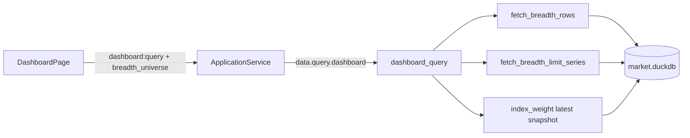

# Sprint5.1 迭代文档

> 状态：**进行中**
> 关联：[需求文档](./Sprint5.1需求文档.md)、[开发计划](../../../../.cursor/plans/sprint5.1_宽基涨停_8f095d2f.plan.md)、[Sprint5 迭代文档](./Sprint5迭代文档.md)、[Sprint4.2 迭代文档](../Sprint4/Sprint4.2迭代文档.md)

---

## 1. 当前迭代目标

在仪表盘涨跌家数格右上角增加全市场 / 沪深300 / 中证2000 选择器，切换后当日四数、九档柱状图、涨跌停历史曲线按所选集合重算。

### 1.1 目标声明

| # | 目标 | 验收口径 |
|---|---|---|
| G1 | 查询按宇宙过滤 | `dashboard:query` 增加 `breadth_universe`；默认 `all` 与现网一致 |
| G2 | 选择器联动三块 | 标题行右上角选择器；切沪深300/中证2000 后三块同时变 |
| G3 | 无成分可理解 | 无 `index_weight` 时为空并提示到配置页更新成分股 |
| G4 | 契约回归 | `typecheck` + `acceptance:v02s51`；默认全市场不破坏 `acceptance:v02s4` |

### 1.2 范围边界（本迭代不做）

- 不新拉 Tushare、不改同步路径
- 不按历史月末快照回溯成分；整段曲线用最新一条月末快照
- 不加其他宽基、不做权重、不下钻个股、不做盘中实时
- 不改两融 / 成交额 / 左侧指数 K 线；选择器不持久化
- 不隔离验收库

### 1.3 技术选型（本迭代）

| 层 | 选型 |
|---|---|
| 壳 / 构建 | Electron + electron-vite（沿用） |
| UI | React + MUI；`BreadthBlock` 标题行 compact `Select` |
| 业务 | `DashboardPage` / `StatsPanel`；`ApplicationService.queryDashboard` 透传 `breadth_universe` |
| 数据 | DuckDB `index_weight` 最新快照子查询过滤 `daily_bar` ⋈ `stock_limit_status` |
| 协议 | IPC `dashboard:query` 不变；请求增 `breadth_universe`；响应 `breadth` 增 `universe` / `constituent_as_of` |

---

## 2. 功能需求

### 2.1 用户故事

1. **US22** 作为使用者，我在仪表盘切换全市场 / 沪深300 / 中证2000，看该集合的涨跌家数、九档分布和涨跌停历史曲线。
2. **US23** 作为使用者，当某指数尚无成分快照时，我能看到明确提示并知道去配置页更新成分股。

### 2.2 功能清单

| ID | 功能 | 优先级 | 状态 |
|---|---|---|---|
| F01 | `breadth_universe` 查询参数 + 成分过滤 SQL | Must | 已完成 |
| F02 | TS / Pydantic / JSON Schema 契约 | Must | 已完成 |
| F03 | fixture 中证2000 样本 + `acceptance:v02s51` | Must | 已完成 |
| F04 | 涨跌家数格右上角选择器 + 空成分提示 | Must | 已完成（待手工验收） |

### 2.3 非功能需求

- 过滤、分箱、涨停 `{2,3}` / 跌停 `{5,6}` 与 Sprint4 `_compute_breadth` 一致
- 切换宇宙时不整页 loading，保留旧 data 直到新结果返回
- Renderer 不直连 DuckDB

---

## 3. 详细设计说明

### 3.1 进程与数据流



### 3.2 目录 / 模块（本迭代涉及）

```
src/shared/constants/dashboard.ts          # DASHBOARD_BREADTH_UNIVERSE_OPTIONS
src/shared/types/dashboard.ts              # breadth_universe / universe / constituent_as_of
python/worker/db/market_db.py              # fetch_breadth_* 可选 index_code
python/worker/handlers/dashboard_query.py  # 按宇宙计算 breadth
src/renderer/src/pages/dashboard/StatsPanel.tsx
src/renderer/src/pages/dashboard/DashboardPage.tsx
src/main/acceptance/runV02Sprint51.ts
```

### 3.3 数据模型 / 存储

- `index_weight`：Sprint5 已有；`index_code` + `trade_date` + `con_code`
- 指数宇宙：`000300.SH`、`932000.CSI`；全市场不传过滤

### 3.4 协议 / API / IPC

- 请求：`DashboardQueryParams.breadth_universe?: 'all' | '000300.SH' | '932000.CSI'`
- 响应：`DashboardBreadth.universe`、`DashboardBreadth.constituent_as_of`
- IPC：`dashboard:query`（不变）

### 3.5 核心编排

1. `DashboardPage` 维护 `breadthUniverse` state，默认 `all`
2. `queryDashboard({ ts_code, breadth_universe })`
3. Python 解析宇宙 → 可选 `index_code` 过滤 → `_compute_breadth` + `fetch_breadth_limit_series`
4. 无快照时 `constituent_as_of: null`，计数全 0

### 3.6 UI

- `BreadthBlock` 标题行：左「涨跌家数」，右 `Select`（全市场 / 沪深300 / 中证2000）
- `constituent_as_of === null` 且非全市场时显示 Alert 提示

---

## 4. 任务步骤

| 步骤 | 任务 | 产出 | 状态 |
|---|---|---|---|
| 1 | 需求 + 迭代文档 | 本文档 | 已完成 |
| 2 | 契约 + Main 透传 | TS / Pydantic / JSON Schema | 已完成 |
| 3 | SQL + query_dashboard | market_db / dashboard_query | 已完成 |
| 4 | fixture 中证2000 | market_seed.py | 已完成 |
| 5 | UI 选择器 | StatsPanel / DashboardPage | 已完成 |
| 6 | 验收 | runV02Sprint51 | 已完成 |

### 4.1 本地复现命令

```bash
npm run typecheck
npm run acceptance:v02s51
npm run dev
```

---

## 5. 测试结果 / 总结反馈

### 5.1 验收清单与结果

| 检查项 | 方式 | 结果 | 说明 |
|---|---|---|---|
| G1 默认全市场 | acceptance:v02s4 | 待补跑 | 不传 breadth_universe；与 Sprint4 共用库 |
| G1 三宇宙过滤 | acceptance:v02s51 | 通过 | fixture 日 20240103 序列点互异 |
| G2 选择器联动 | 手工 | 待补跑 | |
| G3 空成分提示 | acceptance:v02s51 | 通过 | clear_index_weight 后为空 |
| G4 typecheck | npm run typecheck | 通过 | |

### 5.2 关键命令记录

```
npm run typecheck          # PASS
npm run acceptance:v02s51  # ALL PASSED（9 项）
```

### 5.3 总结反馈

**做得好的地方**

- （待迭代结束填写）

**暴露的问题 / 摩擦**

- （待迭代结束填写）

---

## 6. 改进目标

### 6.1 短期（下一迭代可做）

1. 历史曲线按各月末快照回溯成分（消除前视偏差）
2. 扩展更多宽基（上证50、中证500 等）

### 6.2 中期

1. 验收改用临时 userData 库
2. 日级 breadth 汇总表（若全窗口 GROUP BY 变慢）

### 6.3 长期

1. 策略 / 库功能

---

## 附录

### A. 相关文档

- [Sprint5.1需求文档.md](./Sprint5.1需求文档.md)
- [开发计划](../../../../.cursor/plans/sprint5.1_宽基涨停_8f095d2f.plan.md)

### B. 常用命令

| 命令 | 用途 |
|---|---|
| `npm run dev` | 开发起窗 |
| `npm run typecheck` | TS 检查 |
| `npm run acceptance:v02s51` | Sprint5.1 无头验收 |
