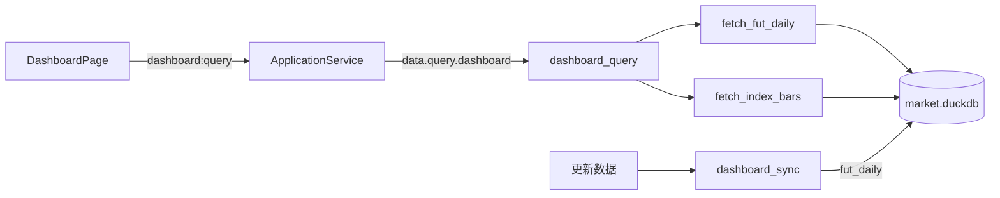
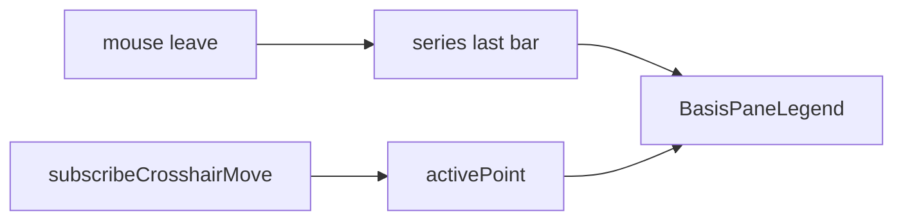

# Sprint5.2 迭代文档

> 状态：**进行中**
> 关联：[需求文档](./Sprint5.2需求文档.md)、[开发计划](../../../../.cursor/plans/sprint5.2_股指期货基差.plan.md)、[基差图例开发计划](../../../../.cursor/plans/sprint5.2_基差图例.plan.md)、[Sprint5.1 迭代文档](./Sprint5.1迭代文档.md)

---

## 1. 当前迭代目标

入库四只股指期货主力收盘，在仪表盘涨跌家数下方展示「期现收盘 + 基差直方图」，并在每张图主窗格给出十字线跟随的三项图例。

### 1.1 目标声明

| # | 目标 | 验收口径 |
|---|---|---|
| G1 | 分表入库主力收盘 | DuckDB 新表 `fut_daily`；仅 `IH.CFX` / `IF.CFX` / `IC.CFX` / `IM.CFX` 的 `close` |
| G2 | 「更新数据」带期货 | 按日增量与窗口回填走现有看板同步；门控看四码是否已有目标日 |
| G3 | 查询出基差序列 | `dashboard:query` 返回 `basis`，顺序 IH → IF → IC → IM；`basis = spot_close − fut_close` |
| G4 | 四宫格双窗格 | 涨跌家数下「基差」四图；上窗格双曲线，下窗格直方图且正上负下标数值 |
| G5 | 契约回归 | `typecheck` + `acceptance:v02s52` |
| G6 | 主窗格图例 | 四图主窗格显示期指价格 / 现货价格 / 基差；十字线跟随；基差按正负着色 |

### 1.2 范围边界（本迭代不做）

- 连续合约期限结构、`fut_mapping`、结算价、年化贴水
- 盘中实时、分钟线、图表页期货标的
- 改两融 / 成交额 / 涨跌家数 / 左侧 K 线
- 基差落库、隔离验收库
- 两融 / 成交额 / 涨跌停等其它仪表盘图例

### 1.3 技术选型（本迭代）

| 层 | 选型 |
|---|---|
| 壳 / 构建 | Electron + electron-vite（沿用） |
| UI | React + MUI；lightweight-charts `addPane` + HTML overlay 图例 |
| 业务 | `StatsPanel` 新增基差块；`queryDashboard` 透传已有日期窗 |
| 数据 | DuckDB `fut_daily`；JOIN 已有 `index_daily`；Tushare `fut_daily` |
| 协议 | IPC `dashboard:query` 不变；响应增 `basis`；图例增量不改契约 |

---

## 2. 功能需求

### 2.1 用户故事

1. **US24** 作为使用者，我在涨跌家数下方看到 IH / IF / IC / IM 四只主力相对现货的收盘曲线和基差柱。
2. **US25** 作为使用者，我点「更新数据」后，期货主力收盘与指数一起补齐，基差图有数。
3. **US26** 作为使用者，我在每张基差图主窗格看到期指价格、现货价格和基差；十字线移动时三项一起变，基差按正负着色。

### 2.2 功能清单

| ID | 功能 | 优先级 | 状态 |
|---|---|---|---|
| F01 | `fut_daily` 表 + upsert / 查询 / clear | Must | 已完成 |
| F02 | 同步拉四条主力收盘 | Must | 已完成 |
| F03 | `basis` 契约 + query JOIN 现货 | Must | 已完成 |
| F04 | 四宫格双窗格 UI + 柱标注 | Must | 已完成 |
| F05 | fixture + `acceptance:v02s52` | Must | 已完成 |
| F06 | 主窗格三项图例 + 十字线跟随 + 基差正负色 | Must | 已完成 |

### 2.3 非功能需求

- 期货与指数分表；`amount` 单位不同，禁止混入 `index_daily`
- 回填按码 + 区间，不要按日循环四次以上之外的浪费调用（增量按日 4 次或当日 `exchange=CFFEX` 一次过滤均可）
- Renderer 不直连 DuckDB；限流沿用 `wait_for_tushare_slot`
- 图例 `pointerEvents: none`，不挡十字线；不改 `StatLegend` 以免回归其它统计图

---

## 3. 详细设计说明

### 3.1 进程与数据流



「更新数据」在现有指数 / 两融 / 涨跌状态之后追加主力收盘。查询层按交易日 JOIN，现算基差。

图例只读已有 `series`，不新增 IPC：



### 3.2 目录 / 模块（本迭代涉及）

```
src/shared/constants/dashboard.ts
src/shared/types/dashboard.ts
python/worker/dashboard_codes.py
python/worker/db/market_db.py
python/worker/handlers/dashboard_sync.py
python/worker/handlers/dashboard_query.py
python/worker/handlers/market_seed.py
python/worker/models.py
contracts/dashboard.query.response.json
src/renderer/src/pages/dashboard/StatsPanel.tsx
src/renderer/src/pages/dashboard/BasisGrid.tsx
src/renderer/src/pages/dashboard/BasisProductChart.tsx  # 图例增量改此文件
src/main/acceptance/runV02Sprint52.ts
src/main/index.ts / package.json
```

### 3.3 数据模型 / 存储

```sql
CREATE TABLE IF NOT EXISTS fut_daily (
  ts_code VARCHAR NOT NULL,
  trade_date VARCHAR NOT NULL,
  close DOUBLE,
  synced_at TIMESTAMP NOT NULL,
  PRIMARY KEY (ts_code, trade_date)
);
```

| 品种 | 主力 | 现货 |
|---|---|---|
| IH | `IH.CFX` | `000016.SH` |
| IF | `IF.CFX` | `000300.SH` |
| IC | `IC.CFX` | `000905.SH` |
| IM | `IM.CFX` | `000852.SH` |

### 3.4 协议 / API / IPC

- 请求：不新增字段；窗口沿用 `start_date` / `end_date`
- 响应：`basis: DashboardBasisProduct[]`，固定四项、顺序不可乱
- 每项：`product, fut_code, spot_code, name, series[{ trade_date, fut_close, spot_close, basis }]`
- 只在两边都有收盘的交易日产出点；缺一侧则跳过该日
- IPC 名不变；图例增量不改契约 / `acceptance:v02s52`

### 3.5 核心编排

1. 常量表 `DASHBOARD_BASIS_PRODUCTS`（TS / Python 对齐）
2. 同步：缺日则 `pro.fut_daily(ts_code, …)`，只取 `close`
3. 查询：四码 `fut_daily` ⋈ 对应 `index_daily.close`
4. `StatsPanel` 涨跌家数块下渲染 `BasisGrid`
5. `BasisProductChart` 用 overlay + `subscribeCrosshairMove` 驱动主窗格图例

### 3.6 UI

- 分类标题：「基差」（无选择器）
- 四图纵向排列，序：IH → IF → IC → IM
- 每格标题为品种代码（可附现货名，如「IH · 上证50」）
- 单 `createChart` + `addPane(false)`：pane0 双 `LineSeries`，pane1 `HistogramSeries`
- 正柱 `UP_COLOR`、负柱 `DOWN_COLOR`；标注在柱顶 / 柱底
- 全窗口每日都标会重叠：可见范围内标注，过密则抽稀（最多约 20 个），十字线仍能读精确值
- 主窗格图例：`position: absolute; top: 4` 水平居中叠在图顶（上窗格）；`pointerEvents: none`
- 三项：期指价格（`STAT_VALUE_COLOR` + `fut_close` 两位小数）、现货价格（`STAT_CLOSE_COLOR` + `spot_close` 两位小数）、基差（红绿并排色块 + `spot_close − fut_close`，数字 `>= 0` 红否则绿）
- 默认最新一根；`subscribeCrosshairMove` 按 `yyyymmddToChartTime` 对齐当日；无 time / 找不到点则回退最新一根
- 空序列走 `ChartPlaceholder`，不渲染图例；不改 `StatLegend`

---

## 4. 任务步骤

| 步骤 | 任务 | 产出 | 状态 |
|---|---|---|---|
| 1 | 需求 + 迭代文档 + 开发计划 | 本文档与 plan | 已完成 |
| 2 | 常量 + `fut_daily` 表 | dashboard.ts / dashboard_codes / market_db | 已完成 |
| 3 | 同步增量 / 回填 | dashboard_sync | 已完成 |
| 4 | 查询 JOIN + 三端契约 | dashboard_query / models / contracts | 已完成 |
| 5 | fixture 四品种两日 | market_seed | 已完成 |
| 6 | 四宫格双窗格 UI | BasisGrid / BasisProductChart / StatsPanel | 已完成 |
| 7 | 验收脚本 | runV02Sprint52 + package.json | 已完成 |
| 8 | 主窗格图例增量 | 需求 / 迭代 / 基差图例 plan + BasisProductChart | 已完成 |

### 4.1 本地复现命令

```bash
npm run typecheck
npm run acceptance:v02s52
npm run dev
```

---

## 5. 测试结果 / 总结反馈

### 5.1 验收清单与结果

| 检查项 | 方式 | 结果 | 说明 |
|---|---|---|---|
| G1 表与四码 | acceptance:v02s52 | 待补跑 | 代码已落地；脚本本增量未重跑 |
| G2 同步门控 | 手工 / live | 待补跑 | 需 Token；空窗不失败 |
| G3 公式与顺序 | acceptance:v02s52 | 待补跑 | `basis === spot − fut`；IH→IM |
| G4 四图 | 手工 | 待补跑 | 涨跌家数下方；正上负下标注 |
| G5 typecheck | npm run typecheck | 通过 | 2026-09-12 `typecheck:node` + `typecheck:web` 均 0 |
| G6 主窗格图例 | 手工 | 待补跑 | 代码已落地、HMR 无报错；十字线跟随需在 Electron 窗内确认 |

### 5.2 关键命令记录

```
> npm run typecheck
> typecheck:node  tsc --noEmit -p tsconfig.node.json --composite false
> typecheck:web   tsc --noEmit -p tsconfig.web.json --composite false
（exit 0，2026-09-12）
```

### 5.3 总结反馈

**做得好的地方**

- 基差查询现算、分表入库，图例增量不改契约

**暴露的问题 / 摩擦**

- 首版图例只有期指 / 现货色条、无数、不跟十字线
- 其它仪表盘图例仍未统一（留给后续）

---

## 6. 改进目标

### 6.1 短期（下一迭代可做）

1. 当月 / 次月期限结构与年化贴水
2. 格标题展示当日基差与升贴水一字
3. 两融 / 成交额 / 涨跌停图例对齐本增量（备忘录「仪表盘图例」）

### 6.2 中期

1. `fut_mapping` 显示当日主力月合约（如 IF2509）
2. 验收改用临时 userData 库

### 6.3 长期

1. 图表页把期指当标的
2. 盘中基差（更高积分 / 实时源）

---

## 附录

### A. 相关文档

- [Sprint5.2需求文档.md](./Sprint5.2需求文档.md)
- [开发计划](../../../../.cursor/plans/sprint5.2_股指期货基差.plan.md)
- [基差图例开发计划](../../../../.cursor/plans/sprint5.2_基差图例.plan.md)
- [Sprint4 tushare目标数据接口文档](../Sprint4/Sprint4%20tushare目标数据接口文档.md)

### B. 常用命令

| 命令 | 用途 |
|---|---|
| `npm run dev` | 开发起窗 |
| `npm run typecheck` | TS 检查 |
| `npm run acceptance:v02s52` | Sprint5.2 无头验收（数据契约，不含图例） |
