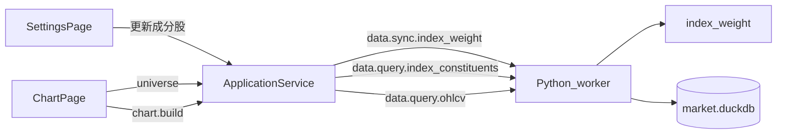

# Sprint5 迭代文档

> 状态：**进行中**（实现已落地；`npm run typecheck` 与隔离库 `acceptance:v02s5` 通过；Electron 窗内点验待补跑）
> 关联：[需求文档](./Sprint5需求文档.md)、[开发计划](../../../../.cursor/plans/sprint5_指数成分_49c53001.plan.md)、[Sprint4 迭代文档](../Sprint4/Sprint4迭代文档.md)、[Sprint4 tushare目标数据接口文档](../Sprint4/Sprint4%20tushare目标数据接口文档.md)

---

## 1. 当前迭代目标

用 Tushare `index_weight` 按月入库 14 只看板指数成分快照；配置页独立「更新成分股」；图表页选择器在「全市场 / 指数标的 / 成分股」之间切换，指数标的走 `index_daily`。

### 1.1 目标声明

| # | 目标 | 验收口径 |
|---|---|---|
| G1 | 月度成分入库 | 14 只指数写入同一 `index_weight` 表；`trade_date` 为月末快照日；当月空则保留上月 |
| G2 | 独立更新 | 配置页「更新成分股」与「更新数据」分开；已有最近可得快照则 skip HTTP |
| G3 | 列表选择器 | `StockPicker` 标题换分组选择器；切换后列表与选中标的变为宇宙第一项 |
| G4 | 双行情源 | 指数标的读 `index_daily`（成指/创业板指成交量仍 Sprint4 替换）；全市场与成分读 `daily_bar`；指数标的禁用复权 |

### 1.2 范围边界（本迭代不做）

- MarketPage 选择器、权重 UI、盘中实时、按日成分、历史回填、一指数一表
- 改仪表盘三格布局
- 隔离验收库（承接 Sprint4.2 遗留）

### 1.3 技术选型（本迭代）

| 层 | 选型 |
|---|---|
| 壳 / 构建 | Electron + electron-vite（沿用） |
| UI | React + MUI；`StockPicker` 用 `Select` + `ListSubheader` |
| 业务 | `ChartPage` / `SettingsPage`；`ApplicationService` |
| 数据 | DuckDB `index_weight`；Tushare `index_weight`；`query_ohlcv_arrow` 指数分支读 `index_daily` |
| 协议 | `data.sync.index_weight`、`data.query.index_constituents`；IPC `market:syncIndexWeights`、`market:indexConstituents` |

---

## 2. 功能需求

### 2.1 用户故事

1. **US19** 作为使用者，我在配置页单独更新成分股，不重拉全市场日线。
2. **US20** 作为使用者，我在图表页切到某指数成分，只看该指数股票并定位到列表第一只。
3. **US21** 作为使用者，我切到大盘/宽基指数分组，把指数当标的看日线 K 线。

### 2.2 功能清单

| ID | 功能 | 优先级 | 状态 |
|---|---|---|---|
| F01 | `index_weight` 表 + 月度同步 | Must | 已完成 |
| F02 | 成分查询 + `query_ohlcv` 指数分支 | Must | 已完成 |
| F03 | 三端契约 + IPC + ApplicationService | Must | 已完成 |
| F04 | 配置页「更新成分股」 | Must | 已完成 |
| F05 | 图表页分组选择器 + 宇宙切换 | Must | 已完成（待手工验收） |
| F06 | fixture + `acceptance:v02s5` | Must | 已完成 |

### 2.3 非功能需求

- 14 次 HTTP/月（每指数一次），沿用 `wait_for_tushare_slot`
- 当月接口空窗当成功，不覆盖已有上月快照
- 成分列表与 `stocks` 表 JOIN，保持股票表原序
- Renderer 不直连 DuckDB

---

## 3. 详细设计说明

### 3.1 进程与数据流



### 3.2 表结构

```sql
CREATE TABLE IF NOT EXISTS index_weight (
  index_code VARCHAR NOT NULL,
  trade_date VARCHAR NOT NULL,
  con_code VARCHAR NOT NULL,
  weight DOUBLE,
  synced_at TIMESTAMP NOT NULL,
  PRIMARY KEY (index_code, trade_date, con_code)
);
```

### 3.3 选择器宇宙

| universeId | 列表来源 | K 线来源 |
|---|---|---|
| `all` | `stocks.list()` | `daily_bar` |
| `index:market` | 5 只大盘指数 | `index_daily` |
| `index:broad` | 9 只宽基指数 | `index_daily` |
| `constituents:{ts_code}` | 最新成分 ∩ stocks | `daily_bar` |

### 3.4 关键路径

| 层级 | 路径 |
|---|---|
| 同步 | `python/worker/handlers/index_weight_sync.py` |
| 查询 | `python/worker/handlers/index_constituents.py` |
| DB | `python/worker/db/market_db.py` |
| Main | `src/main/services/applicationService.ts` |
| UI | `src/renderer/src/pages/StockPicker.tsx`、`ChartPage.tsx`、`SettingsPage.tsx` |
| 验收 | `src/main/acceptance/runV02Sprint5.ts` |

---

## 4. 任务步骤

| 步骤 | 任务 | 产出 | 状态 |
|---|---|---|---|
| 1 | 修订需求 + 迭代文档 | `Sprint5需求文档.md`、`Sprint5迭代文档.md` | 已完成 |
| 2 | DuckDB + sync/query + index OHLCV | `market_db.py`、handlers | 已完成 |
| 3 | 契约 + IPC | types、contracts、preload | 已完成 |
| 4 | 配置页按钮 | `SettingsPage.tsx` | 已完成 |
| 5 | 图表页选择器 | `StockPicker` + `ChartPage` | 已完成（待手工验收） |
| 6 | fixture + 验收 | `runV02Sprint5.ts` | 已完成 |

### 4.1 本地复现命令

```bash
npm run typecheck
npm run acceptance:v02s5
npm run dev
```

---

## 5. 测试结果 / 总结反馈

### 5.1 验收清单与结果

| 检查项 | 方式 | 结果 | 说明 |
|---|---|---|---|
| G1 成分入库与查询 | 隔离库 `acceptance:v02s5` | 通过 | `as_of=20240131; codes=000001.SZ,000002.SZ,000003.SZ` |
| G2 指数 OHLCV 分支 | 隔离库 `acceptance:v02s5` | 通过 | 上证指数 `count=2`；深证成指 `vol=9999` |
| G3 同步 skip 门控 | 隔离库 `acceptance:v02s5` | 跳过 | 本机无 `TUSHARE_TOKEN`；有 Token 时断言 `skipped>=1` |
| G4 typecheck | `npm run typecheck` | 通过 | 2026-09-12 |
| G5 窗内选择器 | 手工 `npm run dev` | 待补跑 | 实现已落地 |

### 5.2 关键命令记录

```
npm run typecheck
# 2026-09-12  node + web 均通过

# 隔离 userData（默认库可能被其他进程占用）
npx cross-env V02_SPRINT5_ACCEPTANCE=1 electron-vite dev -- --user-data-dir=%TEMP%\tz-s5-accept
# PASS | 沪深300成分查询 | as_of=20240131; codes=000001.SZ,000002.SZ,000003.SZ
# PASS | 上证指数走 index_daily | count=2
# PASS | 深证成指成交量替换 | vol=9999
# ALL PASSED
```

### 5.3 总结反馈

**做得好的地方**

- 统一 `index_weight` 单表 + 月末快照门控，与 Tushare 月度接口对齐。
- `query_ohlcv_arrow` 指数分支一处改动，`chart.build` / 指标试算自动受益。

**暴露的问题 / 摩擦**

- 默认 `acceptance:v02s5` 写入用户 `market.duckdb`，库被占用时会失败；需 `--user-data-dir` 隔离。
- 成分列表经 SQLite `stocks` 过滤，需先有股票列表再展示成分。
- G5 窗内选择器 / 更新成分股按钮待用户点验。

---

## 6. 改进目标

### 6.1 短期

1. 历史成分多月份回填（若产品需要）
2. 权重列展示 / 排序
3. 验收改用临时 userData 库

### 6.2 中期

1. MarketPage 同步选择器
2. ~~成分股下钻到仪表盘统计~~（已拆 Sprint5.1）

### 6.3 长期

1. Script / Protocol 解耦
2. 策略 / 库功能

---

## 附录

### A. 相关文档

- [Sprint5需求文档.md](./Sprint5需求文档.md)
- [开发计划](../../../../.cursor/plans/sprint5_指数成分_49c53001.plan.md)

### B. 常用命令

| 命令 | 用途 |
|---|---|
| `npm run dev` | 开发起窗 |
| `npm run typecheck` | TS 检查 |
| `npm run acceptance:v02s5` | Sprint5 无头验收 |
