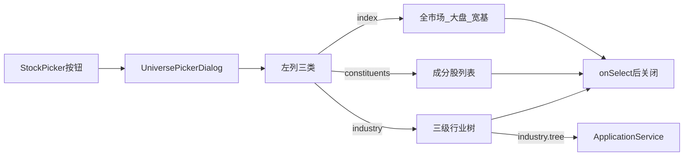

# Sprint6.1 迭代文档

> 状态：**进行中**（实现已落地；`npm run typecheck` 通过；窗内点验待补跑）
> 关联：[需求文档](./Sprint6.1需求文档.md)、[开发计划](../../../../.cursor/plans/sprint6.1_选择器_4ce6b4b8.plan.md)、[Sprint6 迭代文档](./Sprint6迭代文档.md)

---

## 1. 当前迭代目标

图表页标的范围选择器对齐指标与策略选择器的两列弹框。

### 1.1 目标声明

| # | 目标 | 验收口径 |
|---|---|---|
| G1 | 两列布局 | 固定约 `600×480`，左栏约 `120px`，右栏滚动 |
| G2 | 左列三类 | 仅「指数行情 / 成分股 / 行业」 |
| G3 | 右列内容 | 指数行情：全市场 + 大盘指数 + 宽基指数；成分股 / 行业与现网一致 |
| G4 | 样式对齐 | 标题加粗、右侧关闭钮、`DialogContent` 无内边距、左栏右边框，对齐 `IndicatorDialog` |
| G5 | 打开定位 | 按当前 `universeId` 自动选中左列分类 |

### 1.2 范围边界（本迭代不做）

- 改 IPC / SQLite / Python / 契约
- 改申万树与成分查询、面包屑、宇宙 ID 语义
- 提取公共 Dialog 壳
- 新 acceptance 脚本
- 行业树自动展开到当前选中节点

### 1.3 技术选型（本迭代）

| 层 | 选型 |
|---|---|
| 壳 / 构建 | Electron + electron-vite（沿用） |
| UI | React + MUI；`UniversePickerDialog` 复用 `IndicatorDialog` 尺寸与标题栏 |
| 业务 | 仅 Renderer；`resolveUniverseNavTab` 映射左列 |
| 数据 / 计算 | 沿用 Sprint6 `industry:tree` 与 `CHART_UNIVERSE_OPTIONS` |
| 协议 | 不新增 JSON Schema / IPC / Python 方法 |

---

## 2. 功能需求

### 2.1 用户故事

1. 作为使用者，我在图表页打开标的范围选择器，左侧切分类、右侧点一项即切换宇宙并关闭。
2. 作为使用者，我从「指数行情」里能选到全市场，不再单独置顶。
3. 作为使用者，当前宇宙是成分股或行业时，再次打开选择器会落在对应左列。

### 2.2 功能清单

| ID | 功能 | 优先级 | 状态 |
|---|---|---|---|
| F01 | 两列弹框 + 关闭钮 | P0 | 已完成（待手工验收） |
| F02 | 全市场移入「指数行情」右列首位 | P0 | 已完成（待手工验收） |
| F03 | 成分股 / 行业右列保持现逻辑（含展开、loading / error / empty） | P0 | 已完成（待手工验收） |
| F04 | 打开时左列跟随当前宇宙 | P0 | 已完成（待手工验收） |

### 2.3 非功能需求

- Renderer 不直连 SQLite / DuckDB / Tushare
- 切左列不改宇宙；点右列才 `onSelect` + `onClose`
- 不抽公共 Dialog 壳，避免无关重构

---

## 3. 详细设计说明

### 3.1 进程与数据流



行业树仍走 Sprint6 的 `industry:tree`。宇宙切换仍由 `ChartPage` / `StockPicker` 处理，本迭代不改。

### 3.2 目录 / 模块（本迭代涉及）

```
src/shared/constants/chartUniverse.ts
src/renderer/src/pages/chart/UniversePickerDialog.tsx
src/renderer/src/pages/chart/IndicatorDialog.tsx   # 样式对照，不改
src/renderer/src/pages/StockPicker.tsx             # 触发入口，不改
```

### 3.3 数据模型 / 存储

无新表。宇宙 ID 沿用：`all` / `index:market` / `index:broad` / `constituents:{ts_code}` / `industry:{index_code}`。

### 3.4 协议 / API / IPC

不新增通道。打开弹框时仍调用已有 `window.api.industry.tree()`。

### 3.5 核心编排

1. 打开弹框：`tab = resolveUniverseNavTab(universeId)`
2. `all` / `index:market` / `index:broad` → 指数行情
3. `constituents:*` → 成分股
4. `industry:*` → 行业
5. 切左列只换右列内容；点右列调用现有 `onSelect` 后关闭

### 3.6 UI

- 弹框尺寸与 `IndicatorDialog` 相同：`600×480`，左栏 `120px`
- 标题「选择标的范围」加粗，右侧 `ChartIconButton` 关闭
- 指数行情右列：全市场、大盘指数、宽基指数
- 成分股右列：`CHART_UNIVERSE_OPTIONS` 中 `kind === 'constituents'`
- 行业右列：现有 `IndustryNodeRow` Collapse；loading / error / 空数据提示不变

### 3.7 契约

本迭代无新契约。

---

## 4. 任务步骤

| 步骤 | 任务 | 产出 | 状态 |
|---|---|---|---|
| 1 | 需求 + 本迭代 / 开发计划 | `Sprint6.1需求文档.md`、本文档 | 已完成 |
| 2 | `resolveUniverseNavTab` | `chartUniverse.ts` | 已完成 |
| 3 | 两列 Dialog | `UniversePickerDialog.tsx` | 已完成（待手工验收） |
| 4 | typecheck + 窗内点验 | 无新 acceptance | typecheck 已完成；窗内待补跑 |

### 4.1 本地复现命令

```bash
npm run typecheck
npm run dev
```

---

## 5. 测试结果 / 总结反馈

### 5.1 验收清单与结果

| 检查项 | 方式 | 结果 | 说明 |
|---|---|---|---|
| G1/G4 两列样式 | 手工 | 待补跑 | 对齐 `IndicatorDialog`：`600×480`、左栏 `120px`、关闭钮 |
| G2/G3 右列内容 | 手工 | 待补跑 | 全市场在指数行情首位；成分股 / 行业沿用原列表与树 |
| G5 打开定位 | 手工 | 待补跑 | `resolveUniverseNavTab` 已落地；窗内未点验 |
| typecheck | `npm run typecheck` | 通过 | 2026-09-13 node + web |

### 5.2 关键命令记录

```
npm run typecheck
# 2026-09-13  typecheck:node + typecheck:web 均通过
```

### 5.3 总结反馈

**做得好的地方**

- 只改选择器形态，宇宙 ID / IPC / 行业查询都没动。
- 左列定位抽成 `resolveUniverseNavTab`，和现有 `parse*` 函数同一处。

**暴露的问题 / 摩擦**

- Electron 窗内点验本环境无法代跑，需本地 `npm run dev` 打开图表页确认三类右列、定位与关闭。

---

## 6. 改进目标

### 6.1 短期（下一迭代可做）

1. 行业树打开时展开到当前选中节点。
2. 选择器记住上次停留的左列（与当前宇宙不一致时）。

### 6.2 中期

1. 若再出现同类两列弹框，再抽公共壳。
2. 仪表盘「板块总览」复用 Sprint6 成员表。

### 6.3 长期

1. 历史调样与区间成分回放。
2. 2014 / 2021 版本切换。

---

## 附录

### A. 相关文档

- [Sprint6.1需求文档.md](./Sprint6.1需求文档.md)
- [Sprint6迭代文档.md](./Sprint6迭代文档.md)
- [开发计划](../../../../.cursor/plans/sprint6.1_选择器_4ce6b4b8.plan.md)

### B. 常用命令

| 命令 | 用途 |
|---|---|
| `npm run dev` | 开发起窗 |
| `npm run typecheck` | 类型检查 |
