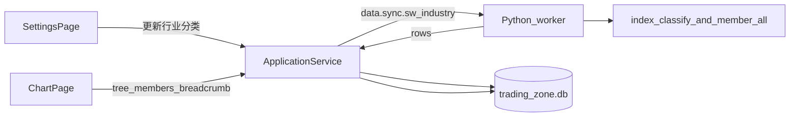

# Sprint6 迭代文档

> 状态：**进行中**（实现已落地；`npm run typecheck` 与隔离库 `acceptance:v02s6` 通过，含本机 Token 真同步；窗内点验待补跑）
> 关联：[需求文档](./Sprint6需求文档.md)、[数据获取可行性分析](./Sprint6数据获取可行性分析.md)、[开发计划](../../../../.cursor/plans/sprint6_申万行业分类.plan.md)、[Sprint5 迭代文档](../Sprint5/Sprint5迭代文档.md)

---

## 1. 当前迭代目标

把申万 2021 三级行业落到本地，图表页用弹框选择行业宇宙，主窗格用面包屑反向定位。

### 1.1 目标声明

| # | 目标 | 验收口径 |
|---|---|---|
| G1 | 分类树入库 | `sw_industry` 为 SW2021 的 31 / 134 / 346；父子键用 `industry_code` |
| G2 | 成分映射入库 | `sw_industry_member` 一只股票一行；与 `stocks` JOIN 后覆盖本地全部在市股 |
| G3 | 独立更新 | 配置页「更新行业分类」与「更新数据 / 更新成分股」分开；约 32 次 HTTP |
| G4 | 四步本地查询 | 全部分类、按父展开层级、按 L1/L2/L3 列成分、按 `ts_code` 取三级面包屑，均不打 Tushare |
| G5 | 选择器弹框 | `StockPicker` 由下拉改为弹框；保留全市场 / 指数 / 成分股，并加入可展开的三级行业 |
| G6 | 面包屑 | 个股主窗格右上角显示 L1 / L2 / L3；点击某一级后宇宙与列表切到该级 |

### 1.2 范围边界（本迭代不做）

- 改 `stocks.industry`，或运行时按票打 `index_member_all`
- 申万行业指数 K 线（`.SI` 不当行情标的）
- `is_new='N'` 历史调样、按日成分
- MarketPage / 仪表盘板块总览
- 权重、实时行情、2014 版分类

### 1.3 技术选型（本迭代）

| 层 | 选型 |
|---|---|
| 壳 / 构建 | Electron + electron-vite（沿用） |
| UI | React + MUI；选择器改 `Dialog` / `Popover`；面包屑放 `ChartToolbar` 右侧 |
| 业务 | `ChartPage` / `SettingsPage` / `ApplicationService` |
| 数据 | SQLite `trading-zone.db` 新表；同步走 Python Tushare，查询不进 DuckDB |
| 协议 | 计划：`data.sync.sw_industry`；IPC `industry:sync` / `industry:tree` / `industry:members` / `industry:breadcrumb` |

---

## 2. 功能需求

### 2.1 用户故事

1. **US22** 作为使用者，我在配置页单独更新行业分类，不重拉日线和指数成分。
2. **US23** 作为使用者，我在图表页弹框里按三级行业选宇宙，左侧只看到该级成分股。
3. **US24** 作为使用者，我看某只股票时能看到它的申万三级面包屑，点其中一级就回到对应列表。

### 2.2 功能清单

| ID | 功能 | 优先级 | 状态 |
|---|---|---|---|
| F01 | SQLite `sw_industry` + `sw_industry_member` | Must | 已完成 |
| F02 | Python 同步 classify + 31 个 L1 成分 | Must | 已完成 |
| F03 | Main 四步查询 + 契约 / IPC | Must | 已完成 |
| F04 | 配置页「更新行业分类」 | Must | 已完成 |
| F05 | 宇宙 `industry:{index_code}` + 弹框选择器 | Must | 已完成（待手工验收） |
| F06 | 主窗格三级面包屑 | Must | 已完成（待手工验收） |
| F07 | fixture + `acceptance:v02s6` | Must | 已完成 |

### 2.3 非功能需求

- 同步约 32 次 HTTP，沿用 `wait_for_tushare_slot`
- 无筛选 `index_member_all` 不得当全量
- 列表 `INNER JOIN stocks`，保持股票表原序
- Renderer 不直连 SQLite / DuckDB / Tushare
- 查询走 Main SQLite，不绕 Python

---

## 3. 详细设计说明

本节为**计划设计**（实现未落地）。数据口径见 [可行性分析](./Sprint6数据获取可行性分析.md)。

### 3.1 进程与数据流



同步对齐 `stocks:sync`：Python 只拉数，Main 写入 SQLite。查询对齐 `stocks:list`：Main 直接读库，不走 DuckDB。

### 3.2 目录 / 模块（本迭代涉及）

```
src/main/db/sqlite.ts
src/main/db/swIndustryRepository.ts          # 计划新增
src/main/services/applicationService.ts
src/main/ipc/registerHandlers.ts
src/main/acceptance/runV02Sprint6.ts         # 计划新增
src/preload/index.ts
src/shared/constants/chartUniverse.ts
src/shared/types/swIndustry.ts               # 计划新增
src/renderer/src/pages/StockPicker.tsx
src/renderer/src/pages/chart/UniversePickerDialog.tsx  # 计划新增
src/renderer/src/pages/chart/IndustryBreadcrumb.tsx    # 计划新增
src/renderer/src/pages/ChartPage.tsx
src/renderer/src/pages/SettingsPage.tsx
python/worker/handlers/sw_industry_sync.py   # 计划新增
python/worker/models.py
python/worker/main.py
contracts/sw_industry.sync.response.json     # 计划新增
```

### 3.3 数据模型 / 存储

```sql
CREATE TABLE IF NOT EXISTS sw_industry (
  index_code    TEXT PRIMARY KEY NOT NULL,
  industry_code TEXT NOT NULL UNIQUE,
  parent_code   TEXT NOT NULL,
  level         TEXT NOT NULL,
  name          TEXT NOT NULL,
  is_pub        TEXT,
  src           TEXT NOT NULL DEFAULT 'SW2021',
  synced_at     TEXT NOT NULL
);

CREATE TABLE IF NOT EXISTS sw_industry_member (
  ts_code   TEXT PRIMARY KEY NOT NULL,
  l1_code   TEXT NOT NULL,
  l2_code   TEXT NOT NULL,
  l3_code   TEXT NOT NULL,
  in_date   TEXT,
  synced_at TEXT NOT NULL
);
```

两套码：`index_code`（`801780.SI`）对齐成员表和宇宙 id；`parent_code` 对齐父节点 `industry_code`（`480000`），L1 为 `0`。

### 3.4 协议 / API / IPC（计划）

| 通道 | 用途 | 返回要点 |
|---|---|---|
| `industry:sync` | 配置页更新 | `classify_count` / `member_count` / `member_fetched` / `skipped_not_in_stocks` / `errors` |
| `industry:tree` | 弹框建树 | 全部分类节点，或按 `parent_code` 展开 |
| `industry:members` | 按级列成分 | `{ index_code }` → `ts_code[]`（已与 stocks 相交） |
| `industry:breadcrumb` | 个股反向三级 | `{ ts_code }` → `{ l1, l2, l3 }` 或 `null` |

宇宙 id：`industry:{index_code}`，例如 `industry:801780.SI`。`ChartUniverseKind` 增加 `industry`。行为对齐成分股：列表是股票，K 线走 `daily_bar`。

### 3.5 核心编排

**同步**

1. 要求已有 Token；建议先有 `stocks`（无股票则成员写入 0 行，树仍入库）
2. Python：`index_classify(src='SW2021')` 一次 + 31 个 L1 `index_member_all(l1_code, is_new='Y')`
3. Main：整表替换 `sw_industry`；成员只保留 `ts_code IN stocks`，并删掉本次未出现的行

**查询（本地四步）**

1. 全部分类：`SELECT * FROM sw_industry`
2. 层级：`WHERE parent_code = :parentIndustryCode`
3. 成分：按节点 `level` 滤 `l1_code` / `l2_code` / `l3_code`，再 `JOIN stocks`
4. 反向：`sw_industry_member` 按 `ts_code` 取三码，再 join 分类表取名

**宇宙切换**

`ChartPage.resolvePickerStocks` 增加 `industry:` 分支：`industry:members` → 用 `ts_code` 集合过滤 `allStocks`。

### 3.6 UI

- `StockPicker` 顶部不再用长 `Select`。触发按钮打开弹框：左侧/上部仍是全市场、指数行情、成分股；行业区用可展开三级树（数据来自 `industry:tree`）。
- 选中行业节点：`universeId = industry:{index_code}`，列表切到该级成分，并选中第一只。
- 无行业数据：行业区提示到配置页更新，与成分股空态同一口径。
- `ChartToolbar` 右侧（主窗格右上）放面包屑。仅个股显示；指数标的或查无成员则不渲染。点击 L1/L2/L3 调用与选择器相同的 `onUniverseChange`。

### 3.7 契约（计划）

| 层级 | 位置 |
|---|---|
| JSON Schema | `contracts/sw_industry.sync.response.json` |
| TypeScript | `src/shared/types/swIndustry.ts`、`chartUniverse.ts` |
| Python | `python/worker/models.py`、`sw_industry_sync.py` |

---

## 4. 任务步骤

| 步骤 | 任务 | 产出 | 状态 |
|---|---|---|---|
| 1 | 需求 + 可行性 + 本迭代/开发计划 | `docs/releases/v0.2/Sprint6/`、`.cursor/plans/sprint6_申万行业分类.plan.md` | 已完成 |
| 2 | SQLite 表 + repository | `sqlite.ts`、`swIndustryRepository.ts` | 已完成 |
| 3 | Python 同步 + 契约 + IPC + 配置页按钮 | handler、preload、`SettingsPage` | 已完成 |
| 4 | 四步查询 API | tree / members / breadcrumb | 已完成 |
| 5 | 宇宙 + 弹框选择器 | `chartUniverse.ts`、`UniversePickerDialog`、`ChartPage` | 已完成（待手工验收） |
| 6 | 面包屑 | `IndustryBreadcrumb`、`ChartToolbar` | 已完成（待手工验收） |
| 7 | fixture + `acceptance:v02s6` + typecheck | `runV02Sprint6.ts` | 已完成 |
| 8 | 窗内点验 | 选择器 / 面包屑 / 更新按钮 | 待开始 |

### 4.1 本地复现命令

```bash
npm run typecheck
npm run acceptance:v02s6
npm run dev
```

隔离库（计划，对齐 Sprint5）：

```bash
npx cross-env V02_SPRINT6_ACCEPTANCE=1 electron-vite dev -- --user-data-dir=%TEMP%\tz-s6-accept
```

---

## 5. 测试结果 / 总结反馈

### 5.1 验收清单与结果

| 检查项 | 方式 | 结果 | 说明 |
|---|---|---|---|
| G1/G2/G4 本地查询 | 隔离库 `acceptance:v02s6` | 通过 | 树 6 节点；L2 parent=`480000`；银行成分仅 `000001.SZ`；面包屑三级正确 |
| G3 真同步 | 隔离库 + Token | 通过 | `classify=511; fetched=5902; stored=3; stocks=3; errors=0` |
| G5/G6 窗内 | `npm run dev` | 待补跑 | 实现已落地 |
| typecheck | `npm run typecheck` | 通过 | 2026-09-12 |

### 5.2 关键命令记录

```
npm run typecheck
# 2026-09-12  node + web 均通过

npx cross-env V02_SPRINT6_ACCEPTANCE=1 electron-vite dev -- --user-data-dir=%TEMP%\tz-s6-accept
# PASS | tree / children / members / breadcrumb
# PASS | sync sw_industry live | skipped (no token)

# 隔离库 + TUSHARE_TOKEN
# PASS | sync sw_industry live | classify=511; fetched=5902; stored=3; stocks=3; errors=0
# ALL PASSED
```

### 5.3 总结反馈

**做得好的地方**

- 先实测再定方案：无筛选 3000 行截断、父子键是 `industry_code` 都已踩过。
- 同步与查询分层清楚：Python 只拉数，Main 写/读 SQLite，UI 不绕 DuckDB。

**暴露的问题 / 摩擦**

- 默认 `acceptance:v02s6` 写入当前 userData；需 `--user-data-dir` 隔离。
- 窗内弹框 / 面包屑 / 「更新行业分类」待用户点验。

---

## 6. 改进目标

### 6.1 短期（下一迭代可做）

1. 仪表盘「板块总览」（备忘录项）：一级涨跌家数 / 强度，复用本迭代成员表。
2. 行业宇宙空态与成分股空态文案统一收口。

### 6.2 中期

1. 申万行业指数日线（若要看 `.SI` K 线，另接行情接口，不混进 `stocks`）。
2. 选择器弹框记住上次展开的一级。

### 6.3 长期

1. 历史调样（`is_new='N'`）与区间成分回放。
2. 2014 / 2021 版本切换（本迭代锁 SW2021）。

---

## 附录

### A. 相关文档

- [Sprint6需求文档.md](./Sprint6需求文档.md)
- [Sprint6数据获取可行性分析.md](./Sprint6数据获取可行性分析.md)
- [sprint6_申万行业分类.plan.md](../../../../.cursor/plans/sprint6_申万行业分类.plan.md)
- [Sprint5迭代文档.md](../Sprint5/Sprint5迭代文档.md)

### B. 常用命令

| 命令 | 用途 |
|---|---|
| `npm run dev` | 开发起窗 |
| `npm run typecheck` | 类型检查 |
| `npm run acceptance:v02s6` | Sprint6 隔离验收（落地后） |
