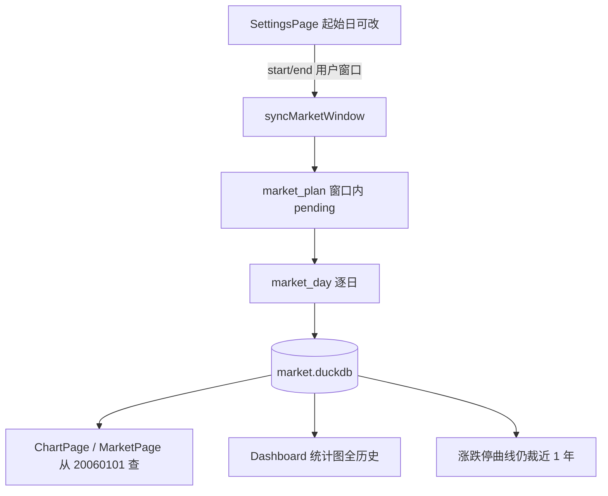

# Sprint7 迭代文档

> 状态：**进行中**（实现已落地；`npm run typecheck` 与隔离库 `acceptance:v02s7` 通过；配置页 / 仪表盘视口窗内点验待补跑）
> 关联：[需求文档](./Sprint7需求分析.md)、[Sprint6 迭代文档](../Sprint6/Sprint6迭代文档.md)

---

## 1. 当前迭代目标

把行情下沿放到 `20060101`，配置页放开起始日以便按 2～3 年分段回填；图表与仪表盘按品种实际首日展示已入库数据；`stock_limit_status` 随日线一并补齐。

### 1.1 目标声明

| # | 目标 | 验收口径 |
|---|---|---|
| G1 | 下沿 20060101 | 起始日不能早于 `20060101`；品种无更早数据则从首根起 |
| G2 | 起始日可改 | 配置页起始日可编辑；「更新数据」把用户 `start_date` / `end_date` 传给现有同步 |
| G3 | 分段增量 | 已有 2024+ complete 时，把起始改到 2006、截止改到 2008，只补该段；不删已有行 |
| G4 | 图表/行情序列 | 日 K 从该代码库内最早一根开始，不再被 `20240101` 截断 |
| G5 | 仪表盘四图 | 指数 K、两融、成交额、基差序列覆盖库内全历史；默认视口仍近 1 年，可向左拖 |
| G6 | 涨跌状态 | `stock_limit_status` 与日线同一窗口补齐 |

### 1.2 范围边界（本迭代不做）

- 指数 / 两融 / 期指改「按代码区间一次拉」
- 同步后台化、可取消、断点续传 UI
- 涨跌停历史曲线拉到 2006（仍近 1 年）
- 按 `list_date` 裁剪全市场日线
- 改 DuckDB schema / 新 Tushare 接口

### 1.3 技术选型（本迭代）

| 层 | 选型 |
|---|---|
| 壳 / 构建 | Electron + electron-vite（沿用） |
| UI | React + MUI；配置页起始日 `TextField type=date` 解禁 |
| 业务 | `SettingsPage` / `ChartPage` / `MarketPage` / `DashboardPage` / `ApplicationService` |
| 数据 / 计算 | 现有 DuckDB `market.duckdb` 按日增量；不改表 |
| 协议 | 沿用 `data.sync.market_plan` / `market_day` / `data.query.dashboard`；不新增 method |

---

## 2. 功能需求

### 2.1 用户故事

1. **US25** 作为使用者，我可以把更新窗口的起始日改到不早于 2006-01-01 的任意交易日，按两三年一段向前补历史。
2. **US26** 作为使用者，已有 2024 年之后的数据时，向前补全不会清掉已下载的交易日。
3. **US27** 作为使用者，图表页日 K 从该品种库内第一根开始，不再停在 2024-01-01。
4. **US28** 作为使用者，仪表盘指数 K、两融、成交额、基差能看到库内全历史（默认视口近一年，可向左拖）。

### 2.2 功能清单

| ID | 功能 | 优先级 | 状态 |
|---|---|---|---|
| F01 | `MARKET_SYNC_EARLIEST` / `MARKET_SYNC_DEFAULT_START`；Main 校验起始日 | Must | 已完成 |
| F02 | 配置页放开起始日并下发用户窗口 | Must | 已完成（待手工验收） |
| F03 | 图表页 / 行情页 / `chart.build` 从 20060101 查到库内 max_date | Must | 已完成 |
| F04 | 仪表盘统计图全历史；`breadth.series` 仍裁近 1 年 | Must | 已完成（待手工验收视口） |
| F05 | `stock_limit_status` 随 `market_day` 同窗口回填 | Must | 已具备（随窗口扩大） |
| F06 | `acceptance:v02s7` 隔离库验收 | Must | 已完成 |

### 2.3 非功能需求

- 一次拉满 2006→今可接受阻塞，但默认起始日仍为 20240101，避免误点十八年
- 缩小窗口不删数据；`status=complete` 的交易日跳过
- 空窗品种（科创综指、北证50、中证2000/A500、IM、2010 年前两融）按有数据那天起，不报错
- Renderer 不直连 DuckDB / Tushare
- 查询默认截止日用今天，不再用过期的 `20251231`

---

## 3. 详细设计说明

### 3.1 进程与数据流



配置页把用户窗口交给现有 `syncMarketWindow`。`market_plan` 只对窗口内非 complete 日调用 `market_day`（日线 + 复权 + 指数 + 两融 + 涨跌状态 + 期指）。读侧查询下沿改为 `MARKET_SYNC_EARLIEST`，DuckDB 只返回实际有的 bar。

### 3.2 目录 / 模块（本迭代涉及）

```
src/shared/constants/market.ts
src/main/services/applicationService.ts
src/renderer/src/pages/SettingsPage.tsx
src/renderer/src/pages/ChartPage.tsx
src/renderer/src/pages/MarketPage.tsx
python/worker/handlers/dashboard_query.py
python/worker/handlers/market_seed.py
src/main/acceptance/runV02Sprint7.ts
src/main/index.ts
package.json
```

### 3.3 数据模型 / 存储

不改 DuckDB schema。扩大的是同一组表的日期覆盖：`daily_bar`、`adj_factor`、`index_daily`、`margin`、`fut_daily`、`stock_limit_status`、`sync_trade_date`。

### 3.4 协议 / API / IPC

不新增 IPC。`market:sync` 已接收 `start_date` / `end_date`；配置页此前把起始日写死为常量。Main 在 `syncMarketWindow` 内拒绝 `start_date < 20060101`。

`dashboard:query` 默认 `start_date` 改为 `MARKET_SYNC_EARLIEST`。Python `query_dashboard` 对 `breadth.series` 按 `end_date` 往前一年裁切。

### 3.5 核心编排（ApplicationService 等）

1. 校验 `start_date` / `end_date` 格式，且 `start >= 20060101`、`start <= end`。
2. 现有 `market_plan` → 逐日 `market_day` → `dashboard_backfill`。
3. `queryOhlcv` / `buildChartInput` / `tryIndicatorScript` 缺省窗口：`20060101` ～ 今天。
4. `queryDashboard` 缺省窗口：`20060101` ～ 今天；涨跌停序列在 Python 侧再裁一年。

### 3.6 UI

- 配置页起始日可编辑；`min=2006-01-01`，`max=截止日`；默认 `20240101`。
- 文案说明：可分段拉取、缩小窗口不删、一次拉满会很慢。
- 图表 / 行情查询从 `MARKET_SYNC_EARLIEST` 到 `coverage.max_date \|\| today`。
- 仪表盘视口仍 `applyLastYearVisibleRange`。

### 3.7 契约（若有）

| 层级 | 位置 |
|---|---|
| TypeScript | `src/shared/constants/market.ts` |
| Python | `python/worker/handlers/dashboard_query.py` |

无新 JSON Schema。

---

## 4. 任务步骤

| 步骤 | 任务 | 产出 | 状态 |
|---|---|---|---|
| 1 | 更新需求 + 迭代文档骨架 | `docs/releases/v0.2/Sprint7/` | 已完成 |
| 2 | 日期常量与 Main 校验 | `market.ts` / `applicationService.ts` | 已完成 |
| 3 | 配置页放开起始日 | `SettingsPage.tsx` | 已完成 |
| 4 | 图表 / 行情查询窗 | `ChartPage.tsx` / `MarketPage.tsx` | 已完成 |
| 5 | 仪表盘全历史 + breadth 裁一年 | `dashboard_query.py` | 已完成 |
| 6 | `acceptance:v02s7` + typecheck | `runV02Sprint7.ts` | 已完成 |

### 4.1 本地复现命令

```bash
npm run typecheck
npm run acceptance:v02s7
npx cross-env V02_SPRINT7_ACCEPTANCE=1 electron-vite dev -- --user-data-dir=%TEMP%\tz-s7-accept
npm run dev
```

---

## 5. 测试结果 / 总结反馈

### 5.1 验收清单与结果

| 检查项 | 方式 | 结果 | 说明 |
|---|---|---|---|
| G1 起始日早于 20060101 被拒绝 | 隔离库 `acceptance:v02s7` | 通过 | `start_date must be >= 20060101` |
| G3 2006 窗口 pending 不含已 complete 的 2024 日 | 隔离库 `acceptance:v02s7` | 通过 | pending=`20060104,20060105`；2024 complete 仍被跳过 |
| G4 查询 20060101 能返回 2006 fixture 日 K | 隔离库 `acceptance:v02s7` | 通过 | `count=2; first=20060104`；缺省窗口同样 |
| G5 仪表盘指数 K 含 2006 | 隔离库 `acceptance:v02s7` | 通过 | `bars=20060104,20060105` |
| G5 默认视口仍近一年 | `npm run dev` | 待补跑 | 仍走 `applyLastYearVisibleRange` |
| G2 配置页起始日可改 | `npm run dev` | 待补跑 | 实现已落地 |
| 有 Token 分段真回填（如 2006–2007） | 手工 | 待补跑 | 不塞进 CI |
| typecheck | `npm run typecheck` | 通过 | 2026-09-14 |

### 5.2 关键命令记录

```
npm run typecheck
# 2026-09-14  node + web 均通过

npx cross-env V02_SPRINT7_ACCEPTANCE=1 electron-vite dev -- --user-data-dir=%TEMP%\tz-s7-accept
# PASS | start_date before 20060101 rejected | start_date must be >= 20060101
# PASS | 2006-2008 window pending excludes 2024 complete days | pending=20060104,20060105; complete=0
# PASS | 2024 complete days still skipped after earlier window plan | complete=20240102,20240103; pending=
# PASS | query from 20060101 returns 2006 fixture bars | count=2; first=20060104
# PASS | queryOhlcv default start is 20060101 | count=2; first=20060104
# PASS | dashboard index bars include 2006 window | bars=20060104,20060105
# ALL PASSED
```

### 5.3 总结反馈

**做得好的地方**

- 沿用按日增量管道，不改 schema。

**暴露的问题 / 摩擦**

- 一次拉满十八年墙钟可能 8～15 小时，故默认起始日仍为 20240101。

---

## 6. 改进目标

### 6.1 短期（下一迭代可做）

1. 若分段回填仍嫌慢：历史段指数 / 两融 / 期指改区间拉取，减少按日 HTTP。
2. 补跑有 Token 的 2006–2007 真回填，核对空窗品种。

### 6.2 中期

1. 同步可取消 / 断点提示（现有逐日进度可续，但无显式取消）。
2. 仪表盘默认视口与「看全历史」入口做成明确控件。

### 6.3 长期

1. 千万级 `daily_bar` / `adj_factor` / `stock_limit_status` 的磁盘与查询观测。
2. 图表超长日 K 的按需窗口 / 降采样（当前 4800 根仍可接受）。

---

## 附录

### A. 相关文档

- [Sprint7需求分析.md](./Sprint7需求分析.md)
- [Sprint6迭代文档.md](../Sprint6/Sprint6迭代文档.md)

### B. 常用命令

| 命令 | 用途 |
|---|---|
| `npm run dev` | 开发起窗 |
| `npm run typecheck` | TS 检查 |
| `npm run acceptance:v02s7` | Sprint7 隔离验收 |
