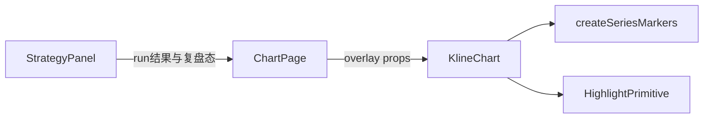

# Sprint8.1 迭代文档

> 状态：**进行中**（实现已落地；`npm run typecheck` 通过；图表页手工点验待补跑）
> 关联：[需求文档](./Sprint8.1需求文档.md)、[开发计划](../../../../.cursor/plans/sprint8.1_图表复盘_8a21b76c.plan.md)、[Sprint8 迭代文档](./Sprint8迭代文档.md)、[Sprint8 需求文档](./Sprint8需求文档.md)、[Chart 架构](../UI-Controller与Chart系统架构.md)

Sprint8 已完成策略 list/run 与平级面板列表。本轮只补图表闭环（复盘五按钮、买卖点标记、复盘高亮）。细则来自 Sprint8 §6.1 与需求原稿 3.1 / 3.2。

---

## 1. 当前迭代目标

在图表页执行 `MingSystemVer1` 后：主图 K 线下方出现买红/卖绿标记；列表五按钮进入复盘后，当前行强调，主图对该根 K 线整列铺背景高亮（买浅红 / 卖浅绿 / 非买卖浅灰），且不压过蜡烛。

### 1.1 目标声明

| # | 目标 | 验收口径 |
|---|---|---|
| G1 | 列表复盘状态机 | 五按钮可用/禁用符合位置；开始后当前行强调、可点选；切到可视区外时该行滚到列表底部；取消后回到纯列表 |
| G2 | 主图买卖点图标 | 执行成功后买点 K 线下方红色图标、卖点下方绿色图标；关面板或清空结果后标记消失 |
| G3 | 复盘高亮 | 开始复盘后选中 K 线主图整列铺背景（买浅红 / 卖浅绿 / 非买卖浅灰），不压过蜡烛；取消复盘或关面板时图表退出高亮 |

### 1.2 范围边界（本迭代不做）

- 因子开关 / 参数调参
- 卖出算法（止损 / 止盈）；本轮 `sell_signal` 仍恒为 false，卖点 Tab 与卖点标记允许空
- 不匹配因子的失败原因标签
- 指数 / 期指通用读数层
- 改 Python worker、IPC、`contracts/strategy.*`、`ChartInput` schema
- 新隔离验收脚本（本轮纯 Renderer 视觉；`acceptance:v02s8` 仍覆盖 list/run）
- 策略脚本化

### 1.3 技术选型（本迭代）

| 层 | 选型 |
|---|---|
| 壳 / 构建 | Electron + electron-vite（沿用） |
| UI | React + MUI；复用 `ChartIconButton`；`KlineChart` 扩展 overlay props |
| 业务 | `ChartPage` 作 UI Controller，持有 overlay；`StrategyPanel` 管复盘状态机 |
| 数据 / 计算 | 沿用 Sprint8 `strategy.run` 的 `stats + series`；不改 DuckDB |
| 协议 | 不新增 JSON Schema / IPC / Python 方法 |

---

## 2. 功能需求

### 2.1 用户故事

1. **US33** 作为使用者，我在策略面板四个 Tab 都能用五按钮进入复盘，当前行会强调，切到看不见的行时列表滚到该行位于可视区底部。
2. **US34** 作为使用者，策略执行成功后，主图买点 K 线下方有红色标记、卖点下方有绿色标记；关掉面板后标记消失。
3. **US35** 作为使用者，开始复盘后主图对选中 K 线整列铺浅色背景且不压过蜡烛；取消复盘或关面板后高亮消失。

### 2.2 功能清单

| ID | 功能 | 优先级 | 状态 |
|---|---|---|---|
| F01 | 五按钮：上一根、刷新（回第一条）、开始↔取消、下一根 | Must | 已完成（待手工验收） |
| F02 | 未开始、或已在列表第一/最后一根时，对应按钮不可用 | Must | 已完成（待手工验收） |
| F03 | 复盘中点击行即可选中；按钮切行若在可视区外，滚到列表底部 | Must | 已完成（待手工验收） |
| F04 | `KlineChart` 买卖点 `createSeriesMarkers`（可参考仪表盘 `BasisProductChart.tsx`） | Must | 已完成（待手工验收） |
| F05 | 主图高亮 custom primitive，与现有 primitive series 生命周期对齐 | Must | 已完成（待手工验收） |
| F06 | 关面板 / 切策略 / 取消复盘时清高亮；关面板 / 切策略 / 清空结果 / 换标的与复权时清标记 | Must | 已完成（待手工验收） |

### 2.3 非功能需求

- Chart 不 IPC、不改 `ChartInput`；overlay 由 `ChartPage` 注入 `KlineChart`（见 Chart 架构：UI Controller 下单，Chart 只消费）
- 高亮 primitive **不**进入 `syncPrimitiveSeries` / `ChartInput.primitives`，避免指标增删误删 overlay
- 策略 `series.time` 为 `YYYYMMDD`，K 线时间为 `YYYY-MM-DD`；设 marker / highlight 前必须 `yyyymmddToIso`，禁止 8 位日期直接 cast 给 LWC
- 图表页不 import 仪表盘 `format.ts`；复用 `src/shared/constants/market.ts` 的 `yyyymmddToIso`
- 取消复盘只清高亮，买卖点标记保留
- 换标的 / 换复权必须清面板 `result` 与 overlay，避免旧买卖点画到新图上

---

## 3. 详细设计说明

本节描述已落地路径。策略结果经 `ChartPage` 的 overlay state 注入 `KlineChart`；标记走 candle 上的 `createSeriesMarkers`；高亮为 `ReplayHighlightPrimitive`，不进入 `syncPrimitiveSeries`。

### 3.1 进程与数据流



策略计算仍走 Sprint8：`strategy:run` → ApplicationService → Python worker。本轮不改这条链。新增的是 UI Controller 把 overlay 注入 Chart。

### 3.2 目录 / 模块（本迭代涉及）

```
src/renderer/src/pages/chart/strategyOverlay.ts
src/renderer/src/pages/chart/StrategyPanel.tsx
src/renderer/src/pages/ChartPage.tsx
src/renderer/src/pages/chart/KlineChart.tsx
src/renderer/src/pages/chart/ReplayHighlightPrimitive.ts
src/renderer/src/pages/chart/ChartIconButton.tsx           # 复用，未改
src/shared/constants/market.ts                             # 复用 yyyymmddToIso
src/renderer/src/pages/dashboard/BasisProductChart.tsx     # markers 参考，未改
```

不改 `syncPrimitiveSeries.ts` 的指标 diff；不改 `python/`、`contracts/`、preload / IPC。

### 3.3 数据模型 / 存储

不改 DuckDB / SQLite。Overlay 只活在 Renderer 内存：

- `markers`: `{ timeIso, side: 'buy' | 'sell' }[]`（来自全量 `result.series` 的信号行）
- `highlight`: `{ timeIso, kind: 'buy' | 'sell' | 'neutral' } | null`

`kind`：`buy_signal` 真 → `buy`；`sell_signal` 真 → `sell`；否则 `neutral`。买卖同时为真时优先 `buy`（本轮策略不会出现）。

时间对照：

| 来源 | 字段 | 格式 |
|---|---|---|
| `strategy.run` series | `time` | `YYYYMMDD` |
| `ChartInput.candle[]` | `time` | `YYYY-MM-DD` |
| overlay / LWC | `timeIso` | `YYYY-MM-DD`（经 `yyyymmddToIso`） |

### 3.4 协议 / API / IPC

不新增 Python 方法或 IPC。沿用 `strategy:list` / `strategy:run`。

`KlineChart` 增量 props（不进 `ChartInput`）：

- `overlay`：`markers` + `highlight`
- `focusTimeIso?: string | null`：复盘当前行，用于 `timeScale` 滚到可见

`StrategyPanel` 回调：`onOverlayChange(overlay)`，由 `ChartPage` 写入 `strategyOverlay` 再传给 `KlineChart`。关面板时 `overlay = null`。

### 3.5 核心编排

1. `handleRun` 成功：重置复盘；按全量 `series` 算出 `markers`；`highlight = null`。
2. 点「开始」：`replayActive = true`，选中 `tabRows[0]`，上报 `highlight`；主图若该根不在可见区则滚动。
3. 上一根 / 下一根 / 刷新 / 点行：只改当前索引与 `highlight`，不改 `markers`。
4. 点「取消」：`replayActive = false`，去掉行强调，`highlight = null`，`markers` 保留。
5. 切 Tab：索引绑定新的 `tabRows`；若仍在复盘且新列表非空，选中第一行；空列表则去掉高亮并禁用导航。
6. 关面板 / 换策略（`key={selectedStrategy.id}` remount）/ 换标的 / 换复权：`overlay = null`，面板丢弃 `result`。

### 3.6 UI

**复盘五按钮**（所有 Tab 公共，放在列选择 / 排序附近、列表上方）

- 左→右：上一根、刷新回第一条、开始↔取消、下一根；复用 `ChartIconButton`
- 未开始、`tabRows.length === 0`、已在第一/最后一根：对应按钮不可用
- 开始后该按钮变为取消

**列表**

- 默认纯列表（可浏览，点击不驱动图表）
- 复盘中：当前行背景强调；可点行选中
- 按钮切到可视区外：列表容器对目标行 `scrollIntoView({ block: 'end' })`

**图表**

- 执行返回后：`position: 'belowBar'`；买红 `#ef5350`、卖绿 `#26a69a`（与 `KlineChart` 涨跌色一致）
- 复盘高亮：竖条宽度 ≈ 一根 bar，铺满主图 pane 高度，`zOrder` 在蜡烛之下
- 颜色建议：买 `rgba(239,83,80,0.18)`、卖 `rgba(38,166,154,0.18)`、非买卖 `rgba(0,0,0,0.08)`
- 选中时间若不在当前可见区，`timeScale` 滚到该根可见；不把缩放改成「强行铺满」

状态：未执行无标记；卖点 Tab 空表不报错；执行中沿用 Sprint8 禁用；失败仍用页内错误文案。

### 3.7 契约

本迭代无新 JSON Schema。Overlay 类型在 [`strategyOverlay.ts`](../../../../src/renderer/src/pages/chart/strategyOverlay.ts)，不进 `pythonProtocol.ts`。

---

## 4. 任务步骤

| 步骤 | 任务 | 产出 | 状态 |
|---|---|---|---|
| 1 | 需求 + 迭代文档 + 开发计划；回链 Sprint8 | `Sprint8.1需求文档.md`、本文档、`.cursor/plans/sprint8.1_图表复盘_8a21b76c.plan.md` | 已完成 |
| 2 | overlay 类型与 `StrategyPanel` → `ChartPage` 回调 | `strategyOverlay.ts`、`StrategyPanel.tsx`、`ChartPage.tsx` | 已完成 |
| 3 | 五按钮状态机、行选中、列表滚到底 | `StrategyPanel.tsx` | 已完成 |
| 4 | `KlineChart` markers（YYYYMMDD → ISO） | `KlineChart.tsx` | 已完成 |
| 5 | highlight primitive + 退出清理 | `ReplayHighlightPrimitive.ts`、`KlineChart.tsx` | 已完成 |
| 6 | 换标的 / 关面板 / 切策略清理 | `ChartPage.tsx`、`StrategyPanel.tsx` | 已完成 |
| 7 | typecheck + 图表页手工清单 | 无新 acceptance | typecheck 已完成；手工待补跑 |

### 4.1 本地复现命令

```bash
npm run typecheck
npm run dev
npm run acceptance:v02s8
```

手工清单：卖点 Tab 空表、「取消」后标记仍在、关面板后标记与高亮全无、换标的后旧标记消失、复盘切行列表滚到底且主图可见该根。

---

## 5. 测试结果 / 总结反馈

### 5.1 验收清单与结果

| 检查项 | 方式 | 结果 | 说明 |
|---|---|---|---|
| G1 五按钮状态机 / 行强调 / 列表滚到底 | `npm run dev` 手工 | 待补跑 | 实现已落地 |
| G2 买卖点标记；关面板后消失 | `npm run dev` 手工 | 待补跑 | 本轮卖点允许 0 个标记 |
| G3 复盘高亮；取消或关面板退出 | `npm run dev` 手工 | 待补跑 | `drawBackground` + `zOrder: bottom` |
| F06 换标的 / 换复权清 overlay | `npm run dev` 手工 | 待补跑 | `tsCode` / `adjust` 变化会丢弃 result |
| typecheck | `npm run typecheck` | 通过 | 2026-09-17 node + web |
| 回归 `acceptance:v02s8` | 隔离库 | 待补跑 | 本轮未改 Python / IPC |

### 5.2 关键命令记录

```
npm run typecheck
# 2026-09-17  typecheck:node + typecheck:web 均通过
```

### 5.3 总结反馈

**做得好的地方**

- 开迭代前把 overlay 与 `ChartInput` / `syncPrimitiveSeries` 切开，避免指标 diff 误删标记。
- 时间格式（YYYYMMDD → ISO）写进范围约束，这是 marker 静默丢失的主要风险。

**暴露的问题 / 摩擦**

- `StrategyPanel` 的 `key` 只跟策略 id，换标的不会 remount；本轮在 `tsCode` / `adjust` 变化时主动清 result 与 overlay。
- 原稿只写了列表滚动；高亮若画在可见区外则看不见，故主图用 `setVisibleLogicalRange` 平移（保持当前跨度）滚到该根。
- Electron 窗内点验本环境无法代跑，需本地 `npm run dev` 打开图表页确认标记、高亮与清理。

---

## 6. 改进目标

### 6.1 短期（下一迭代可做）

1. 补跑 Sprint8 图表页手工点验（弹框加号 / 平级面板拖宽 / 统计与四 Tab），与本轮复盘同一页面顺带确认。
2. 复盘切 Tab 时若新列表含同一日期，可保留选中时间而不是总是回到第一行。

### 6.2 中期

1. 因子开关与参数调参（需求总述）；面板可改 `squeeze_period` / `wr_n` / `k` / 成交量倍数等后再执行。
2. 按 [`自研策略说明.md`](../../../../python/worker/strategies/自研策略说明.md) 补止损、止盈，使卖点 Tab 与绿色标记有数据。
3. 计算过程打失败原因标签（如不符合挤牌），供自选列表筛选。

### 6.3 长期

1. 策略脚本化，与指标脚本同一套沙箱 / 编辑器，而不是只硬编码注册表。
2. 多数据源读数（大盘 / 宽基 / 期指）作为策略基类能力，供后续策略使用。

---

## 附录

### A. 相关文档

- [Sprint8.1需求文档.md](./Sprint8.1需求文档.md)
- [开发计划](../../../../.cursor/plans/sprint8.1_图表复盘_8a21b76c.plan.md)
- [Sprint8迭代文档.md](./Sprint8迭代文档.md)（§6.1 为 8.1 草案来源）
- [Sprint8需求文档.md](./Sprint8需求文档.md)（整包愿景）
- [UI-Controller与Chart系统架构.md](../UI-Controller与Chart系统架构.md)
- [`KlineChart.tsx`](../../../../src/renderer/src/pages/chart/KlineChart.tsx)
- [`strategyOverlay.ts`](../../../../src/renderer/src/pages/chart/strategyOverlay.ts)
- [`ReplayHighlightPrimitive.ts`](../../../../src/renderer/src/pages/chart/ReplayHighlightPrimitive.ts)
- [`BasisProductChart.tsx`](../../../../src/renderer/src/pages/dashboard/BasisProductChart.tsx)（markers 参考）

### B. 常用命令

| 命令 | 用途 |
|---|---|
| `npm run dev` | 开发起窗 |
| `npm run typecheck` | TS 检查 |
| `npm run acceptance:v02s8` | Sprint8 隔离验收（本轮回归用） |
