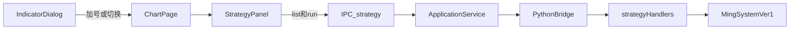

# Sprint8 迭代文档

> 状态：**进行中**（实现已落地；`npm run typecheck` 与隔离库 `acceptance:v02s8` 通过；图表页手工点验待补跑）
> 关联：[需求文档](./Sprint8需求文档.md)、[开发计划](../../../../.cursor/plans/sprint8_策略闭环_f5b7d9cc.plan.md)、[Sprint8.1 迭代文档](./Sprint8.1迭代文档.md)、[Sprint7 迭代文档](../Sprint7/Sprint7迭代文档.md)、策略草稿 [`python/worker/strategies/MingSystemVer1.py`](../../../../python/worker/strategies/MingSystemVer1.py)

需求原稿仍是整包愿景（含图表买卖点图标与复盘高亮）。**本轮只做策略执行闭环**；图表交互与列表复盘按钮放到 **Sprint8.1**，见 [Sprint8.1迭代文档.md](./Sprint8.1迭代文档.md) 与 [§6.1](#61-短期下一迭代-sprint81)。

---

## 1. 当前迭代目标

在图表页选中内置策略 `MingSystemVer1`，经右侧平级策略面板执行后，能看到最小统计（买入信号数量、总 K 线数）以及买/卖/混合/自选序列列表。不要求把买卖点画到主图上。

### 1.1 目标声明

| # | 目标 | 验收口径 |
|---|---|---|
| G1 | 策略标准化输出 | `MingSystemVer1.run` 返回 `{ stats, series }`；`stats` 含 `buy_count`、`bar_count`；`series` 每行必有 `time` / OHLCV / `buy_signal` / `sell_signal` |
| G2 | list / run 跨进程 | `strategy.list` 能列出 `ming_system_ver1`；`strategy.run` 入参为策略 id + 标的 + 日期区间 + 复权，Electron 只转发、不维护第二份类映射 |
| G3 | 弹框选策略 | 「指标与策略」弹框的策略分类加载列表；加号打开面板；已选行底色加深且图标为正确、不可点；其他行加号变为切换 |
| G4 | 平级策略面板 | 图表右侧从右展开、与标的列表/图表平级（非脚本编辑器那种覆盖层）；整高、可拖宽，最大不超过图表可视区一半（不含标的列表）；关闭即取消选中并卸下面板 |
| G5 | 执行结果展示 | 时间选择器 + 执行；统计按键值对自适应排布；四 Tab 列表（买点 / 卖点 / 买卖混合 / 自选）；列选择、时间排序、自选过滤。卖点 Tab 允许空表 |
| G6 | 隔离验收 | `acceptance:v02s8` 覆盖 list / run；图表页路径手工点验 |

### 1.2 范围边界（本迭代不做）

**放到 Sprint8.1（细则见 §6.1）：**

- 列表复盘五按钮（上一根 / 刷新 / 开始↔取消 / 下一根）及切行时自动滚到可视区底部
- 执行后主图买卖点图标（买红、卖绿，K 线下方）
- 复盘高亮模式（买浅红 / 卖浅绿 / 非买卖浅灰，整列高度、不压过 K 线）
- 退出复盘时图表一并退出高亮

**更后（8.1 也不做）：**

- 因子开关、因子参数调参（需求总述有，功能拆分未写进本轮）
- 卖出算法（止损 / 止盈）；本轮 `sell_signal` 恒为 false
- 不匹配因子的失败原因标签
- 指数 / 期指通用读数层（v1 只用股票日线 + 复权；`query_ohlcv_arrow` 对仪表盘指数已有分支，不新做一套）

### 1.3 技术选型（本迭代）

| 层 | 选型 |
|---|---|
| 壳 / 构建 | Electron + electron-vite（沿用） |
| UI | React + MUI；新平级 `StrategyPanel`；复用 `ChartPage` 标的列表拖宽与 `ChartIconButton` |
| 业务 | `ChartPage` 作 UI Controller；`ApplicationService` 转发 list / run |
| 数据 / 计算 | 现有 DuckDB `market.duckdb`；`query_ohlcv_arrow`；不改表 |
| 协议 | 新增 Python `strategy.list` / `strategy.run`；IPC `strategy:list` / `strategy:run`；msgpack 沿用 |

---

## 2. 功能需求

### 2.1 用户故事

1. **US29** 作为使用者，我在「指标与策略」弹框的策略分类里能看到内置策略，点加号后右侧出现策略面板。
2. **US30** 作为使用者，我在面板里选日期区间并执行，能看到买入信号数量、总 K 线数。
3. **US31** 作为使用者，我能在买点 / 卖点 / 买卖混合 / 自选四个列表里查看带日期和 OHLCV 的序列，并切换列与时间排序。
4. **US32** 作为使用者，我可以关掉面板或改选另一个策略；同时只选中一个策略。

### 2.2 功能清单

| ID | 功能 | 优先级 | 状态 |
|---|---|---|---|
| F01 | 策略基类标准化 `{ stats, series }`；`MingSystemVer1` 接入 worker | Must | 已完成 |
| F02 | Python 策略注册表（id → 类 / 显示名） | Must | 已完成 |
| F03 | `strategy.list` / `strategy.run` + 契约 / TS 类型 | Must | 已完成 |
| F04 | IPC `strategy:list` / `strategy:run`；preload；ApplicationService 转发 | Must | 已完成 |
| F05 | `IndicatorDialog` 策略 Tab：列表、加号、已选、切换 | Must | 已完成（待手工验收） |
| F06 | `ChartPage` 右侧平级策略面板：拖宽上限、标题、关闭 | Must | 已完成（待手工验收） |
| F07 | 时间选择 + 执行；统计键值自适应 | Must | 已完成（待手工验收） |
| F08 | 四 Tab 列表、必选/可选列、时间升降序、自选过滤 | Must | 已完成（待手工验收） |
| F09 | `acceptance:v02s8` 隔离库 list / run | Must | 已完成 |

### 2.3 非功能需求

- Renderer 不直连 DuckDB / Tushare；策略计算只在 Python worker
- 策略注册表以 Python 为唯一数据源，Electron 不复制类映射
- `series` 经现有 msgpack 帧传输；日期用 `YYYYMMDD` 或 ISO 字符串，bool 用布尔，禁止把 NaN 原样打进结果
- 面板与脚本编辑器互不替代：编辑器仍覆盖图表；策略面板占布局宽度
- 长序列列表保持可滚动；列选择缺省只开必选列（日期、OHLCV、买点、卖点）
- 卖点 Tab 无数据时为空态，不报错

---

## 3. 详细设计说明

本节描述已落地路径。现状：[`Strategy.py`](../../../../python/worker/strategies/Strategy.py) 的 `run()` 返回 `{ stats, series }`；[`MingSystemVer1.py`](../../../../python/worker/strategies/MingSystemVer1.py) 输出全序列并补 `sell_signal=false`；[`IndicatorDialog.tsx`](../../../../src/renderer/src/pages/chart/IndicatorDialog.tsx) 策略 Tab 加载 `strategy:list`；worker 注册 `strategy.list` / `strategy.run`。

### 3.1 进程与数据流



主路径：Renderer 调 `strategy:list` / `strategy:run` → Preload → `ApplicationService` → `PythonBridge.call` → worker handler 按 `strategy_id` 实例化并 `run` → 返回 `stats + series` → 面板渲染。不写 SQLite，不改 `ChartInput` / `chart:build`。

### 3.2 目录 / 模块（本迭代涉及）

```
contracts/strategy.list.response.json
contracts/strategy.run.request.json
contracts/strategy.run.response.json
python/worker/strategies/Strategy.py
python/worker/strategies/MingSystemVer1.py
python/worker/strategies/__init__.py          # 或 registry.py：id → 类/显示名
python/worker/handlers/strategy.py
python/worker/main.py
src/shared/types/pythonProtocol.ts
src/main/services/applicationService.ts
src/main/ipc/registerHandlers.ts
src/preload/index.ts
src/preload/index.d.ts
src/renderer/src/pages/chart/IndicatorDialog.tsx
src/renderer/src/pages/ChartPage.tsx
src/renderer/src/pages/chart/StrategyPanel.tsx
src/main/acceptance/runV02Sprint8.ts
package.json                                  # acceptance:v02s8
```

CLI [`python/worker/strategies/main.py`](../../../../python/worker/strategies/main.py) 可继续本地 print，不作为 IPC 入口。

### 3.3 数据模型 / 存储

不改 DuckDB / SQLite schema。读数走现有 `market_db.query_ohlcv_arrow(ts_code, start, end, adjust)`（股票日线 + 复权；仪表盘指数代码已有 `index_daily` 分支）。

`series` 行最小字段：

- 必有：`time`、`open`、`high`、`low`、`close`、`vol`、`buy_signal`、`sell_signal`
- 可选：计算过程列（`wr`、`in_squeeze`、`strong_k` 等），供列选择器勾选，缺省不显示
- 本轮 `sell_signal` 全部为 `false`

`stats` 最小占位：`buy_count`、`bar_count`。面板按键值对渲染，便于以后加字段。

### 3.4 协议 / API / IPC

| 方向 | 名称 | 作用 |
|---|---|---|
| Python | `strategy.list` | 返回内置策略 `{ id, name }[]` |
| Python | `strategy.run` | 执行指定策略 |
| IPC | `strategy:list` | 转发给 Python |
| IPC | `strategy:run` | 转发给 Python |

`strategy.run` 入参：

```json
{
  "strategy_id": "ming_system_ver1",
  "ts_code": "002518.SZ",
  "start_date": "20200101",
  "end_date": "20260915",
  "adjust": "qfq"
}
```

`adjust`：`none` \| `qfq` \| `hfq`。未知 `strategy_id` 返回 `invalid_params`。无行情时 `series` 为空数组、`bar_count=0`，不把整次调用打成失败。

`strategy.run` 返回（形状）：

```json
{
  "strategy_id": "ming_system_ver1",
  "ts_code": "002518.SZ",
  "start_date": "20200101",
  "end_date": "20260915",
  "adjust": "qfq",
  "stats": { "buy_count": 12, "bar_count": 1600 },
  "series": [
    {
      "time": "20240102",
      "open": 1, "high": 1, "low": 1, "close": 1, "vol": 1,
      "buy_signal": true,
      "sell_signal": false
    }
  ]
}
```

`PYTHON_METHODS` 增 `strategyList: 'strategy.list'`、`strategyRun: 'strategy.run'`。

### 3.5 核心编排（ApplicationService 等）

1. `listStrategies()`：`pythonBridge.call(strategy.list)`，原样返回。
2. `runStrategy(params)`：校验 `strategy_id` / `ts_code` 非空，日期与复权同 `market:query` 口径，再 `pythonBridge.call(strategy.run, params)`。
3. Python handler：`STRATEGY_REGISTRY[strategy_id]` 构造实例（写入标的、区间、复权）→ `read_data` → `compute_algorithm` → `analyze_result` → `output_result` 得到拼接对象。
4. `output_result` 不再只 `print`；CLI `main.py` 若需调试可在拿到对象后再打印。

### 3.6 UI

**弹框（`IndicatorDialog`）**

- 打开策略 Tab 时调 `strategy:list`。
- 每一行：名称 + 右侧图标按钮。
- 未选中：加号；点击后关闭弹框，`ChartPage` 选中该策略并展开面板。
- 已选中行：背景加深，图标为正确、不可点。
- 其他行：加号改为切换；点击即换策略（清空上一份执行结果）。

**策略面板（新，平级）**

- 布局：`标的列表 | 图表 | 策略面板`。区别于 `ScriptEditorPanel` 的 z-index 覆盖。
- 整高；拖拽改宽；最大宽度 ≤ 图表可视区一半（计算时不含标的列表宽度）。可复用 `ChartPage` 左侧 splitter 模式。
- 顶栏：标题 = 策略显示名；关闭 → 取消选中、卸下面板、丢弃结果。
- 其下：起始日、结束日、`执行` 图标按钮。缺省区间建议与当前图表查询窗一致（标的已选时）。
- 统计：横向 `键（加粗）：值`；一行几对随面板宽度自适应，列宽对齐。
- Tabs：`买点`（`buy_signal`）/ `卖点`（`sell_signal`，本轮可空）/ `买卖混合`（任一信号）/ `自选数据`（全序列，不区分命中）。
- 自选 Tab：列表上方另有起止日 + 查询，过滤 `series`。
- 列选择：日期、OHLCV、买点、卖点必选；其余字段可选、缺省不选。
- 默认时间降序，可切升序。
- 本轮列表为纯列表：可浏览、可点行（不必驱动图表）。复盘五按钮见 8.1。

状态：未选策略无面板；执行中禁用按钮；失败用页内错误文案；空序列显示空态。

### 3.7 契约（若有）

| 层级 | 位置 |
|---|---|
| JSON Schema | `contracts/strategy.list.response.json`、`strategy.run.request.json`、`strategy.run.response.json` |
| TypeScript | `src/shared/types/pythonProtocol.ts`；preload `WindowApi` |
| Python | `python/worker/handlers/strategy.py`、`python/worker/strategies/__init__.py`、`MingSystemVer1.output_result` |

---

## 4. 任务步骤

| 步骤 | 任务 | 产出 | 状态 |
|---|---|---|---|
| 1 | 迭代文档 + 开发计划冻结范围 | 本文件；`.cursor/plans/sprint8_策略闭环_f5b7d9cc.plan.md` | 已完成 |
| 2 | 契约与 TS / Python 类型 | `contracts/strategy.*.json`、`pythonProtocol.ts` | 已完成 |
| 3 | 基类标准化返回；MingSystem 接 `stats + series`（`sell_signal` 恒 false） | `Strategy.py`、`MingSystemVer1.py` | 已完成 |
| 4 | 注册表 + worker handler | `strategies/` 注册、`handlers/strategy.py`、`main.py` | 已完成 |
| 5 | ApplicationService / IPC / preload | `applicationService.ts`、`registerHandlers.ts`、`preload` | 已完成 |
| 6 | 弹框策略 Tab | `IndicatorDialog.tsx` | 已完成 |
| 7 | 平级面板布局：拖宽、标题、关闭、时间、执行 | `ChartPage.tsx`、`StrategyPanel.tsx` | 已完成 |
| 8 | 统计键值 + 四 Tab 列表 + 列选择 + 排序 + 自选过滤 | `StrategyPanel.tsx` | 已完成 |
| 9 | `acceptance:v02s8` + typecheck；图表页手工闭环 | `runV02Sprint8.ts`、`package.json` | 已完成（手工待补跑） |

### 4.1 本地复现命令

```bash
npm run typecheck
npm run acceptance:v02s8
npx cross-env V02_SPRINT8_ACCEPTANCE=1 electron-vite dev -- --user-data-dir=%TEMP%\tz-s8-accept
npm run dev
```

---

## 5. 测试结果 / 总结反馈

### 5.1 验收清单与结果

| 检查项 | 方式 | 结果 | 说明 |
|---|---|---|---|
| G1 标准化 `{ stats, series }` | 隔离库 `acceptance:v02s8` | 通过 | fixture 3 根；必有字段齐全；`sell_signal` 全 false |
| G2 `strategy.list` 含 `ming_system_ver1` | `acceptance:v02s8` | 通过 | `ming_system_ver1` |
| G2 未知 id 拒绝 | `acceptance:v02s8` | 通过 | `[invalid_params] unknown strategy_id` |
| G2 无行情空序列 | `acceptance:v02s8` | 通过 | `bar_count=0; series=0` |
| G2 `strategy.run` 返回 bar_count | `acceptance:v02s8` | 通过 | `bar_count=3; series=3; buy_count=0` |
| G3 弹框加号 / 已选 / 切换 | `npm run dev` 手工 | 待补跑 | 实现已落地 |
| G4 平级面板拖宽上限 | `npm run dev` 手工 | 待补跑 | 最大不超过图表可视区一半 |
| G5 统计 + 买点列表 | `npm run dev` 手工 | 待补跑 | 卖点 Tab 允许空 |
| G5 自选过滤 / 列选择 / 排序 | `npm run dev` 手工 | 待补跑 | |
| 本轮不出现买卖点图标与复盘高亮 | 对照 §1.2 | 待确认 | 范围门禁；未改 `KlineChart` |
| typecheck | `npm run typecheck` | 通过 | 2026-09-17 |

### 5.2 关键命令记录

```
npm run typecheck
# 2026-09-17  node + web 均通过

npx cross-env V02_SPRINT8_ACCEPTANCE=1 electron-vite dev -- --user-data-dir=%TEMP%\tz-s8-accept
# PASS | python ready | python=3.13.2
# PASS | strategy.list includes ming_system_ver1 | ming_system_ver1
# PASS | unknown strategy_id rejected | [invalid_params] unknown strategy_id
# PASS | missing bars returns empty series | bar_count=0; series=0
# PASS | strategy.run returns fixture bars and required fields | bar_count=3; series=3; buy_count=0; rowsOk=true
# ALL PASSED
```

### 5.3 总结反馈

**做得好的地方**

- 开迭代前把整包需求拆成 8 / 8.1，避免面板 + 主图 primitive 同一轮膨胀。
- 策略注册表只在 Python；Electron 只转发 list / run。
- NaN / numpy 标量在 `output_result` 收成 msgpack 可传的 null / bool / float。

**暴露的问题 / 摩擦**

- 需求总述写了因子开关 / 调参，功能拆分未列；本轮明确不做，避免半套参数 UI。
- 短窗口 fixture 买点为 0（squeeze 窗口不够），验收不强制 `buy_count > 0`；真实行情需手工点验买点 Tab。
- 原稿验收「图表页面完成整个闭环」易被理解成含图标；本轮闭环停在面板列表。

---

## 6. 改进目标

### 6.1 短期（下一迭代 Sprint8.1）

已升格为 [Sprint8.1 迭代文档](./Sprint8.1迭代文档.md)、[Sprint8.1 需求文档](./Sprint8.1需求文档.md)、[开发计划](../../../../.cursor/plans/sprint8.1_图表复盘_8a21b76c.plan.md)。下文保留草案原文，便于对照。

下一子迭代可直接把下列三条升成 8.1 的 G1–G3 / 功能清单。依赖本轮已落地的 `series.buy_signal` / `sell_signal`、策略面板列表，以及「当前选中行」状态（本轮列表可先能点选，但不驱动图表）。

**目标声明（拟定 8.1）**

| # | 目标 | 验收口径 |
|---|---|---|
| G1 | 列表复盘状态机 | 五按钮可用/禁用符合位置；开始后当前行强调、可点选；切到可视区外时该行滚到列表底部；取消后回到纯列表 |
| G2 | 主图买卖点图标 | 执行成功后买点 K 线下方红色图标、卖点下方绿色图标；关面板或清空结果后标记消失 |
| G3 | 复盘高亮 | 开始复盘后选中 K 线主图整列铺背景（买浅红 / 卖浅绿 / 非买卖浅灰），不压过蜡烛；取消复盘或关面板时图表退出高亮 |

**功能清单（拟定 8.1）**

| ID | 功能 | 优先级 |
|---|---|---|
| F01 | 五按钮：上一根、刷新（回第一条）、开始↔取消、下一根 | Must |
| F02 | 未开始、或已在列表第一/最后一根时，对应按钮不可用 | Must |
| F03 | 复盘中点击行即可选中；按钮切行若在可视区外，滚到列表底部 | Must |
| F04 | `KlineChart` 买卖点 `createSeriesMarkers`（可参考仪表盘 `BasisProductChart.tsx`） | Must |
| F05 | 主图高亮 custom primitive，与现有 primitive series 生命周期对齐 | Must |
| F06 | 关面板 / 切策略 / 取消复盘时同时清标记与高亮 | Must |

**交互细则（从需求原稿迁入，8.1 照此实现）**

复盘按钮是所有 Tab 的公共操作，目的是「在数据列表中切换选中的 K 线，并在图表上高亮」，从而复盘。

由左到右五个图标按钮：

1. **上一根 K 线**：切到列表中上一条。未开始，或已在第一根时不可用。
2. **刷新**：回到第一根。未开始时不可用。
3. **开始**：进入复盘模式，选中第一条数据，图表进入高亮模式。点击后该按钮变为「取消」。
4. **取消**：退出复盘模式，图表退出高亮。点击后该按钮变回「开始」。
5. **下一根 K 线**：切到列表中下一条。未开始，或已在最后一根时不可用。

列表：

- 默认纯列表；复盘中选中行用背景色强调。
- 除按钮外支持直接点击选中。
- 按钮切到可视区外的行时，滚动条保证该行出现在可视区**底部**。

图表：

- `执行` 返回后：买点 K 线下方红色图标，卖点 K 线下方绿色图标。`KlineChart` 需支持标记。
- 复盘开始后进入高亮：被选中 K 线在主图上，以该根 K 线宽度铺满整个高度。高亮不得压过 K 线：卖点浅绿色、买点浅红色、非买卖点浅灰色。
- 结束复盘后图表一并退出高亮。

实现落点：[`KlineChart.tsx`](../../../../src/renderer/src/pages/chart/KlineChart.tsx)、[`syncPrimitiveSeries.ts`](../../../../src/renderer/src/pages/chart/syncPrimitiveSeries.ts)、策略面板复盘状态；markers 可参考 [`BasisProductChart.tsx`](../../../../src/renderer/src/pages/dashboard/BasisProductChart.tsx)。高亮不是 LWC 现成 API，需要自定义 primitive，并避开与指标 series 增删的冲突。

**8.1 仍不做：** 因子开关 / 调参、卖出算法、失败原因标签、指数 / 期指通用读数层。

### 6.2 中期

1. 因子开关与参数调参（需求总述）；面板可改 `squeeze_period` / `wr_n` / `k` / 成交量倍数等后再执行。
2. 按 [`自研策略说明.md`](../../../../python/worker/strategies/自研策略说明.md) 补止损、止盈，使卖点 Tab 有数据。
3. 计算过程打失败原因标签（如不符合挤牌），供自选列表筛选。

### 6.3 长期

1. 策略脚本化，与指标脚本同一套沙箱 / 编辑器，而不是只硬编码注册表。
2. 多数据源读数（大盘 / 宽基 / 期指）作为策略基类能力，供后续策略使用。

---

## 附录

### A. 相关文档

- [Sprint8需求文档.md](./Sprint8需求文档.md)（整包愿景；本轮以本文 §1.2 / §6.1 收窄）
- [开发计划](../../../../.cursor/plans/sprint8_策略闭环_f5b7d9cc.plan.md)
- [Sprint8.1迭代文档.md](./Sprint8.1迭代文档.md)
- [Sprint8.1需求文档.md](./Sprint8.1需求文档.md)
- [Sprint8.1 开发计划](../../../../.cursor/plans/sprint8.1_图表复盘_8a21b76c.plan.md)
- [Sprint7迭代文档.md](../Sprint7/Sprint7迭代文档.md)
- [`python/worker/strategies/MingSystemVer1.py`](../../../../python/worker/strategies/MingSystemVer1.py)
- [`python/worker/strategies/自研策略说明.md`](../../../../python/worker/strategies/自研策略说明.md)

### B. 常用命令

| 命令 | 用途 |
|---|---|
| `npm run dev` | 开发起窗 |
| `npm run typecheck` | TS 检查 |
| `npm run acceptance:v02s8` | Sprint8 隔离验收 |
