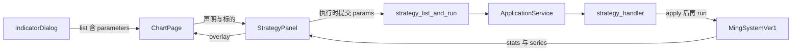

# Sprint9.2 迭代文档

> 状态：**进行中**（代码与自动验收已通过；图表页手工点验待补跑）
> 关联：[需求文档](./Sprint9.2需求文档.md)、[开发计划](../../../../.cursor/plans/sprint9.2_策略调参.plan.md)、[Sprint9 迭代文档](./Sprint9迭代文档.md)、[Sprint8 迭代文档](../Sprint8/Sprint8迭代文档.md)、[Sprint8.1 迭代文档](../Sprint8/Sprint8.1迭代文档.md)、[自研策略说明](../../../../python/worker/strategies/自研策略说明.md)

策略参数已经写在 `MingSystemVer1` 的类属性上，策略面板执行时却只传标的、区间和复权。本轮把声明交给策略类，面板按声明填值，`strategy.run` 带上这组值再出买卖点。

---

## 1. 当前迭代目标

在图表页打开策略面板后，配置区出现该策略声明的参数（缺省为代码当前值）。使用者改完再点执行，统计、四个 Tab 和主图标记按这组参数重算。只改输入、不点执行，画面保持上一次结果。

### 1.1 目标声明

| # | 目标 | 验收口径 |
|---|---|---|
| G1 | 策略声明参数，列表能下发 | `strategy.list` 里 `ming_system_ver1` 带六项参数；缺省为代码当前值（`wr_n=3`、`vol_y=1`、`range_mode=co`）；选项文案是「收−开 / 收−低」 |
| G2 | 面板在执行前填参并拦住非法值 | 配置区按声明画控件，不写死字段名；空值、非数、越界、非法枚举不发请求，提示与日期错误同一层级；执行中控件不可改；无声明时仍只有日期和执行 |
| G3 | 执行使用提交的参数 | `strategy.run` 的 `params` 写入策略实例后再计算。同一标的、区间、复权下，改一个会改变序列的参数，结果与缺省不同；不传 `params` 与显式传入全部缺省一致 |
| G4 | 买卖点通路保持原样 | 成功返回后统计、四 Tab、复盘、主图标记的更新方式不变。改参数但不执行时，这些表面仍是上一次执行的结果。`sell_signal` 仍恒为 false |

### 1.2 范围边界（本迭代不做）

- 在界面里新建策略，或把调过的参数存成方案、写入 SQLite / 布局。关面板或重开应用后回到声明缺省
- 改一个数字就自动重跑，或做参数扫描、网格寻优
- 止损系数 `z`、止盈系数 `w`，以及卖出算法。不改滤网公式
- 复盘五按钮、列表列选择、图表高亮、标记颜色
- Sprint9.1 的 Tabs 样式、统计行位置、三段分割线
- 复用指标 `input.int` / `ManifestFieldsForm`（控件集合对不上，且绑的是脚本 `inputs` / `styles`）
- 把说明文档里的 `wr_n=6`、`vol_y=1.5` 当成界面缺省

### 1.3 技术选型（本迭代）

| 层 | 选型 |
|---|---|
| 壳 / 构建 | Electron + electron-vite（沿用） |
| UI | React + MUI。配置区新增参数表单：整数 / 小数用数字框，枚举用 `Select`。不改 `KlineChart` |
| 业务 | 声明在策略类上。`ChartPage` 把列表里的声明传给 `StrategyPanel`。面板只在点击执行时提交 |
| 数据 / 计算 | 不改 DuckDB、不改 `read_data` 的行情读取。参数在 `compute_algorithm` 之前写到实例属性 |
| 协议 | 扩展 `strategy.list` 与 `strategy.run` 请求。响应形状不变，以便 Sprint8 验收继续只看 `stats` / `series` |

---

## 2. 功能需求

### 2.1 用户故事

1. **US40** 作为使用者，我打开策略面板就能看到这条策略声明的参数和缺省值，不用翻 Python 源码。
2. **US41** 作为使用者，我改完参数再点执行，买卖点、统计和主图标记换成这组参数的结果。
3. **US42** 作为使用者，我改了参数但还没执行时，列表和主图仍停在上一次结果上。
4. **US43** 作为使用者，我换股票或改日期时，已经填的参数还在；换成另一条策略时，面板换成那条策略的声明和缺省。
5. **US44** 作为使用者，我填了空值、越界或非法选项时，面板提示错误，不会悄悄用缺省跑一遍。

### 2.2 功能清单

| ID | 功能 | 优先级 | 状态 |
|---|---|---|---|
| F01 | 策略参数模型：`int` / `float` / `enum`，含标题、缺省、可选上下界、枚举选项 | Must | 已完成 |
| F02 | `MingSystemVer1` 声明六项，缺省只有这一处来源，并在计算前应用到实例 | Must | 已完成 |
| F03 | `strategy.list` 每条策略带 `parameters`；空数组表示没有可调参数 | Must | 已完成 |
| F04 | `strategy.run` 增加可选 `params`。缺键用缺省；未知键、类型错误、越界、非法枚举拒绝 | Must | 已完成 |
| F05 | IPC 与 `ApplicationService` 转发 `params` | Must | 已完成 |
| F06 | 面板配置区按声明画表单；长标题换行后输入控件左缘对齐 | Must | 已完成 |
| F07 | 执行前本地校验，非法不发请求；执行中禁用；改值不清结果 | Must | 已完成 |
| F08 | `acceptance:v02s92`：列表缺省、拒绝非法、不传参与显式缺省一致、改参后序列不同 | Must | 已完成 |

### 2.3 非功能需求

- Renderer 不直连 Python。声明从已有 `strategy:list` 来，提交走已有 `strategy:run`
- 面板不写 `MingSystemVer1` 的字段名。换策略只依赖 `key={strategyId}` 重挂后的新声明
- 数值上下界只用于拒绝无意义输入，不改变缺省算法。本轮下限：周期类至少 1（`squeeze_period` 至少 2），系数至少 0；不设上限
- JSON 没有整数类型。`int` 拒绝布尔和非整数值（`3.0` 可收成 3）；`float` 接受有限数；`enum` 只接受选项里的字符串
- 响应不回显 `params`，避免牵动 Sprint8 对 `series` 字段的断言
- 卖点列保持恒为否

---

## 3. 详细设计说明

本节与当前代码一致。声明在策略类上，列表下发 `parameters`，执行请求带上 `params`，面板按声明画表单。

[`MingSystemVer1`](../../../../python/worker/strategies/MingSystemVer1.py) 的六项类属性从 `MING_PARAMETERS` 取值，滤网公式未改。构造函数仍只收标的、区间、复权。[`strategy_run`](../../../../python/worker/handlers/strategy.py) 在 `run()` 之前调用 `apply_parameters`。[`parseStrategyRunParams`](../../../../src/main/ipc/registerHandlers.ts) 与 [`runStrategy`](../../../../src/main/services/applicationService.ts) 把 `params` 交给 worker。[`StrategyPanel`](../../../../src/renderer/src/pages/chart/StrategyPanel.tsx) 在日期行之上按声明画表单，只有点击执行才提交。成功后的统计、列表和 [`onOverlayChange`](../../../../src/renderer/src/pages/chart/strategyOverlay.ts) 仍走原来的路径。

### 3.1 进程与数据流



打开「指标与策略」时，现有 `strategy:list` 多返回每条策略的 `parameters`。[`ChartPage`](../../../../src/renderer/src/pages/ChartPage.tsx) 已经把选中的 `StrategyInfo` 放在 state 里，只需把 `parameters` 传进面板。面板不另开接口。

执行时请求在原有字段之外带 `params`。worker 校验并写入实例属性，再走现有 `read_data` → `compute_algorithm` → `analyze_result` → `output_result`。返回体不新增字段。面板用现在的 `setResult` 刷新列表，并用现在的 overlay 刷新主图。

### 3.2 目录 / 模块（本迭代涉及）

```
python/worker/strategies/params.py              新增：参数模型与 apply
python/worker/strategies/Strategy.py            增加 parameters / apply_parameters
python/worker/strategies/MingSystemVer1.py      六项声明；类属性从声明取缺省
python/worker/strategies/__init__.py            list_strategies 带上 parameters
python/worker/handlers/strategy.py              run 接收并应用 params
contracts/strategy.list.response.json           策略项增加 parameters
contracts/strategy.run.request.json             增加可选 params
src/shared/types/pythonProtocol.ts              StrategyInfo / StrategyRunParams
src/main/ipc/registerHandlers.ts                parseStrategyRunParams 转发 params
src/main/services/applicationService.ts         runStrategy 转发 params
src/renderer/src/pages/ChartPage.tsx            把 parameters 传给面板
src/renderer/src/pages/chart/StrategyPanel.tsx  配置区表单、本地校验、随请求提交
src/main/acceptance/runV02Sprint92.ts           新增隔离验收
src/main/index.ts                               接入 V02_SPRINT92_ACCEPTANCE；ACCEPTANCE_USER_DATA 可改验收用的 userData
package.json                                    acceptance:v02s92
```

不改 [`KlineChart.tsx`](../../../../src/renderer/src/pages/chart/KlineChart.tsx)、[`strategyOverlay.ts`](../../../../src/renderer/src/pages/chart/strategyOverlay.ts)、[`contracts/strategy.run.response.json`](../../../../contracts/strategy.run.response.json)。

### 3.3 参数声明

声明跟策略类走，不放进 React，也不复用指标的 `ParamField`（那边的控件是 `int` / `float` / `bool`，没有枚举）。

拟定字段：

| 字段 | 控件 | 标题 | 缺省 | 下限 | 选项 |
|---|---|---|---|---|---|
| `squeeze_period` | int | 标准差 / ATR 周期 | 20 | 2 | |
| `wr_n` | int | 过去 n 日波幅 | 3 | 1 | |
| `range_mode` | enum | 信号 K 波幅 | `co` | | `co` 收−开，`cl` 收−低 |
| `k` | float | 波幅系数 | 0.6 | 0 | |
| `vol_x` | int | 成交量均线天数 | 5 | 1 | |
| `vol_y` | float | 成交倍量 | 1 | 0 | |

`MingSystemVer1.parameters` 是缺省的唯一来源。类属性从这份声明赋值，避免界面缺省和算法缺省各写一个数。`apply_parameters` 在 `run()` 之前把校验后的值设到实例上，现有 `self.squeeze_period` 这类读取不用改公式。

未出现在声明里的键拒绝。声明里有、请求里没有的键用缺省。`params` 省略或 `{}` 等价于全部缺省。

下限只挡住滚动窗口为 0、系数为负这类算不下去或改变滤网含义的输入。本轮不设上限。

### 3.4 协议 / IPC

`strategy.list` 每一项在 `id`、`name` 之外增加 `parameters` 数组。元素字段：`name`、`title`、`widget`（`int` | `float` | `enum`）、`default`，以及可选的 `min`、`max`、`options`（`value` + `label`）。没有可调参数时数组为空。更新 schema 的 `additionalProperties`，把这些字段放进允许列表。

`strategy.run` 请求增加可选 `params` 对象。schema 只限制值是数字或字符串；键是否合法由该策略的声明判断，避免把 `MingSystemVer1` 的六个名字写死在契约里。

Main 进程今天会丢掉未列出的字段。[`parseStrategyRunParams`](../../../../src/main/ipc/registerHandlers.ts) 与 [`runStrategy`](../../../../src/main/services/applicationService.ts) 必须把 `params` 原样交给 worker。类型和上下界的权威校验在 Python，这样验收脚本直接调 `applicationService` 时也能拒绝非法值。面板在发请求前再挡一层，让空输入不会变成 `0` 送出去。

非法时沿用现有 worker 错误（`invalid_params`），面板用现在的 `Alert` 显示，与「起始日不能晚于结束日」相同。

### 3.5 核心编排

1. `list_strategies` 把每个类的 `parameters` 序列化进列表。
2. 使用者点执行。面板先检查日期，再按声明检查每个控件。不过就 `setError` 并返回。
3. `strategy_run` 构造策略（标的、区间、复权不变），调用 `apply_parameters`，再 `run()`。
4. 返回体仍是 `strategy_id`、`ts_code`、`start_date`、`end_date`、`adjust`、`stats`、`series`。

### 3.6 UI

表单放在现有配置块里、日期行上面，和执行按钮同一段。不另做弹框。

- 两列：`minmax(8.5rem, max-content)` 放标题，`minmax(0, 1fr)` 放控件。标题允许换行，不用省略号，这样「标准差 / ATR 周期」变高时，右侧输入框仍共用一条左缘
- 枚举显示「收−开」「收−低」，提交值仍是 `co` / `cl`
- 打开面板时用声明缺省填表。换策略时现有 `key={selectedStrategy.id}` 会重挂面板，缺省跟着新策略走
- 换标的或改日期不重挂面板，已填参数保留
- 编辑控件不调用 `setResult`，也不触发 `onOverlayChange`。只有 `handleRun` 成功才替换结果并重置复盘，这是现在的行为
- `disabled || running` 时参数框与日期框一起不可用
- `parameters` 为空或缺失时不渲染表单

### 3.7 契约

| 层级 | 位置 |
|---|---|
| JSON Schema | `contracts/strategy.list.response.json`、`contracts/strategy.run.request.json`（响应 schema 不改） |
| TypeScript | `src/shared/types/pythonProtocol.ts` 的 `StrategyInfo`、`StrategyRunParams` |
| Python | `python/worker/strategies/params.py`、`handlers/strategy.py` 的 `StrategyRunParams` |

---

## 4. 任务步骤

| 步骤 | 任务 | 产出 | 状态 |
|---|---|---|---|
| 1 | 参数模型与 `MingSystemVer1` 六项声明；计算前应用到实例 | `params.py`、策略基类与明氏策略 | 已完成 |
| 2 | `strategy.list` / `strategy.run` 携带并校验 `params` | handler + 两份 request/list schema | 已完成 |
| 3 | IPC 与 `ApplicationService` 转发 `params` | `registerHandlers.ts`、`applicationService.ts`、共享类型 | 已完成 |
| 4 | 面板配置区表单、本地校验、随执行提交 | `StrategyPanel.tsx`、`ChartPage.tsx` | 已完成 |
| 5 | 隔离验收 `acceptance:v02s92` | `runV02Sprint92.ts`、`package.json` | 已完成 |
| 6 | 图表页手工点验 G2 / G4 的「不执行不刷新」和窄面板对齐 | 点验记录 | 待开始 |

### 4.1 本地复现命令

```bash
npm run dev
npm run typecheck
npm run acceptance:v02s92
npm run acceptance:v02s8
```

本机 `market.duckdb` 约 3.2GB。`acceptance:v02s8` 会 `clearMarket`，直接跑会清空真实行情，且超过 worker 的 120 秒超时。回归时设置 `ACCEPTANCE_USER_DATA` 指向空目录。`acceptance:v02s92` 在库文件不小于 32MB 时跳过整库清空，只写入夹具代码 `__ACCEPTANCE_S92__.SZ`。

---

## 5. 测试结果 / 总结反馈

### 5.1 验收清单与结果

| 检查项 | 方式 | 结果 | 说明 |
|---|---|---|---|
| G1 列表六项与代码缺省 | `acceptance:v02s92` | 通过 | 缺省 `20 / 3 / co / 0.6 / 5 / 1`，选项「收−开」「收−低」 |
| G2 非法值不发请求、执行中禁用、空声明不画表单 | 手工 | 待补跑 | 表单已接上，未在图表页点验 |
| G3 不传参与显式缺省的 `buy_signal` 一致 | `acceptance:v02s92` | 通过 | 三根夹具均为 `false,false,false`；`sell_signal` 仍为 false |
| G3 改 `range_mode=cl` 后序列与缺省不同 | `acceptance:v02s92` | 通过 | `impulse` 由 `0.5,0.5,0.5` 变为 `1,1,1`。`buy_count` 两侧都是 0 |
| G3 未知键、越界、非法枚举被拒绝 | `acceptance:v02s92` | 通过 | `nope`、`wr_n=0`、`range_mode=xx` 均为 `invalid_params`，没有当成缺省跑成功 |
| G4 真实标的上改一个参数，买点数量或日期变化；不执行则画面不变 | 手工 | 待补跑 | 夹具太短，买点差异放到图表页 |
| Sprint8 策略闭环回归 | `acceptance:v02s8` | 通过 | 不传 `params` 仍返回 3 根夹具，必填字段齐全，`buy_count=0` |

### 5.2 关键命令记录

`npm run typecheck` 通过。

两条验收都设置了 `ACCEPTANCE_USER_DATA`（临时空目录）。本地真实库 `market.duckdb` 体积保持 3389009920 字节。

`npm run acceptance:v02s92`：`ALL PASSED`。列表六项缺省与文案正确；三处非法 `params` 为 `invalid_params`；省略参数与显式缺省的 `buy_signal` 都是 `false,false,false`；`range_mode=cl` 的 `impulse` 为 `1,1,1`，缺省为 `0.5,0.5,0.5`。

`npm run acceptance:v02s8`：`ALL PASSED`。`ming_system_ver1` 仍在列表中；未知 `strategy_id` 被拒绝；缺 K 线返回空序列；夹具 3 根、`buy_count=0`、必填字段齐全。

### 5.3 总结反馈

**做得好的地方**

- 六项缺省只写在 `MING_PARAMETERS`，类属性从这份声明取值，界面和算法不会各持一套数。
- 非法参数在面板和 worker 都拒绝。Main 重组请求时带上 `params`，验收直接走 `applicationService.runStrategy`。
- 三根夹具产生不了买点，自动验收改看 `impulse`。`range_mode=cl` 与缺省的序列不同，说明参数进了算法。

**暴露的问题 / 摩擦**

- 说明文档的 `wr_n=6`、`vol_y=1.5` 与正在运行的类属性不一致。本轮缺省锁在代码上，文档数字留到以后单独立项，避免调参上线同时改了策略行为。
- Sprint8 的三根 K 线夹具产生不了挤压买点。买点数量仍要到图表页手工点验。
- 本机行情库约 3.2GB。`clearMarket` 会超过 120 秒，并且会删掉已有日线。Sprint9.2 在大库上跳过整库清空；Sprint8 回归改用 `ACCEPTANCE_USER_DATA`。
- 图表页尚未点验：非法值是否停在 Alert、执行中是否锁住控件、只改数字不执行时列表和主图是否保持不动。

---

## 6. 改进目标

### 6.1 短期（下一迭代可做）

1. 按说明文档实现止损 `z`、止盈 `w`，卖点不再恒为否；这两项再进入同一份参数声明
2. 补上 Sprint9.1 的 Tabs 样式、统计行靠右、配置 / 统计 / 买卖点三段分割线
3. 若手工点验确认某项需要上限，再给声明补 `max`，面板和 worker 一起生效

### 6.2 中期

1. 把一组参数存成方案，下次打开面板可以选回来，而不是只活在当前面板状态里
2. 对齐说明文档与代码的缺省（`wr_n`、`vol_y`），单独验收「缺省一变，历史买点会变」

### 6.3 长期

1. 策略脚本化：声明方式与指标 `inputs()` 合成一套，面板仍然只消费声明
2. 在固定区间上扫描参数，比较买点数量，而不是每次手改再执行

---

## 附录

### A. 相关文档

- [Sprint9.2需求文档.md](./Sprint9.2需求文档.md)
- [开发计划](../../../../.cursor/plans/sprint9.2_策略调参.plan.md)
- [Sprint9.1改进文档.md](./Sprint9.1改进文档.md)
- [自研策略说明](../../../../python/worker/strategies/自研策略说明.md)
- [Sprint8迭代文档.md](../Sprint8/Sprint8迭代文档.md)

### B. 常用命令

| 命令 | 用途 |
|---|---|
| `npm run dev` | 开发起窗，手工点验策略面板 |
| `npm run typecheck` | TS 检查 |
| `npm run acceptance:v02s92` | 本轮列表、校验与参数是否进算法 |
| `ACCEPTANCE_USER_DATA` | 验收前指向空目录时，`clearMarket` 不会碰到本机行情库 |
| `npm run acceptance:v02s8` | 回归不传 `params` 的策略闭环 |
