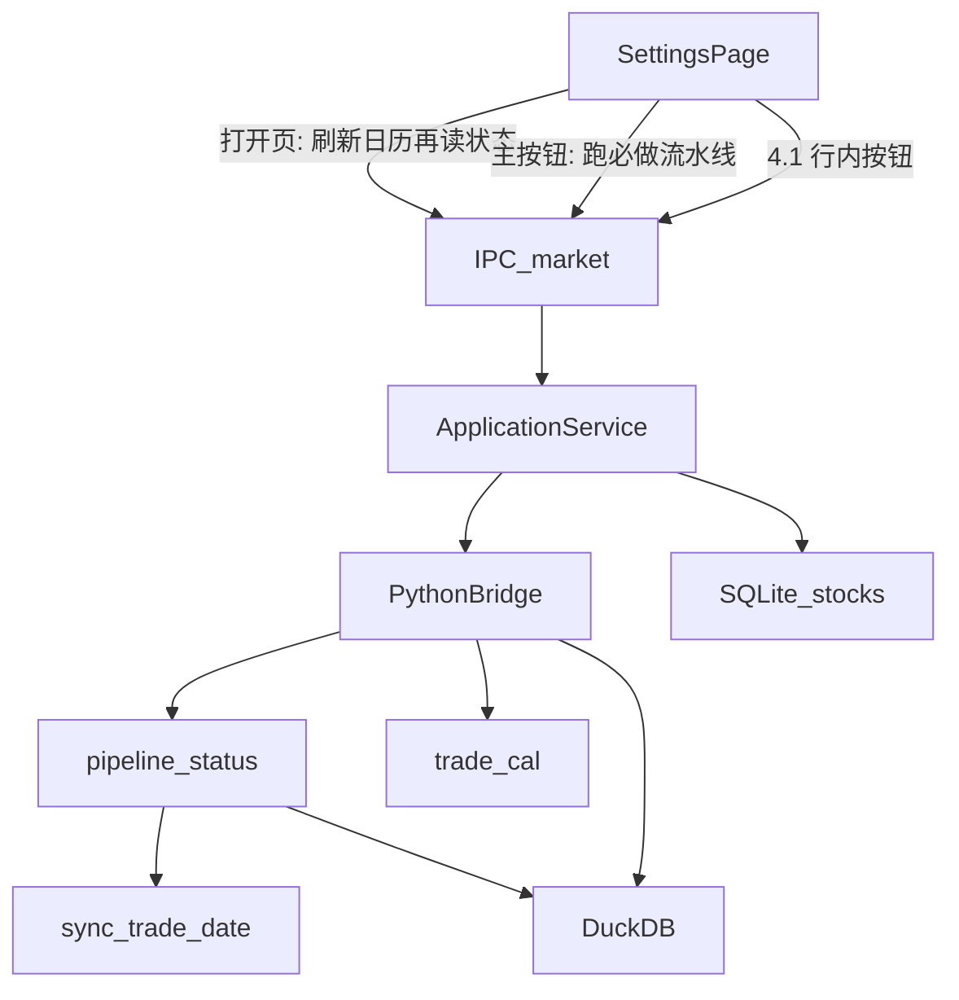

# Sprint9 迭代文档

> 状态：**实现完成，隔离验收 ALL PASSED**（`acceptance:v02s9` 14/14；配置页与图表页手工点验待补跑）
> 关联：[需求文档](./Sprint9需求文档.md)、[数据架构分析](./Sprint9数据架构分析.md)、[日线停牌与退市 Review](./Sprint9日线停牌与退市Review.md)、[开发计划](../../../../.cursor/plans/sprint9_数据获取与清洗.plan.md)、[Sprint8 迭代文档](../Sprint8/Sprint8迭代文档.md)、[架构文档](../../v0.1/trading-zone-electron架构文档.md)

本轮按需求文档交付：**重构配置页数据拉取（状态机 + 固定区间流水线）**，以及 **退市股票名单 / 图表分类**。UI 参考 [更新数据卡片.png](./更新数据卡片.png)。

---

## 1. 当前迭代目标

配置页不再让使用者自选更新窗口。打开数据管理即可看到各数据集是否已初始化、是否最新；一键跑必做流水线，股票日线按代码写死的默认段分批拉取并用水位断点；图表可选「退市股票」。

### 1.1 目标声明

| # | 目标 | 验收口径 |
|---|---|---|
| G1 | 取消用户更新窗口 | 配置页主路径无起止日选择；区间写死在代码。`自定义管理数据` 按钮可见但不可用 |
| G2 | 步骤两问状态机 | 每步返回 `initialized` / `fresh` / 覆盖起止；必做步骤折叠为全局 `初始` / `待更新` / `最新`。4.1 等可选步不改变主按钮文案 |
| G3 | 日线水位与闩锁 | **不得删除** `sync_trade_date`。默认段 `[20240101, 最近已收盘]` 拉全后置位初始化闩锁；此后缺一天是待更新，不是未开始。禁止用 `MAX(trade_date)` 代替水位 |
| G4 | 必做流水线 | 主按钮：初始→`初始化数据`，待更新→`更新数据`，最新→`数据已更新`（不可用）。已完成步骤跳过；支持断点。打开页面只自动刷新交易日历 |
| G5 | 日线历史子步 | `4.1` `[20210101, 20240101)` 行内按钮，倒序解锁；该闭区间水位全 `complete` 即完成，不因今天过一天而变待更新 |
| G6 | 退市名单与图表分类 | `stock_basic` 同时拉上市/退市；SQLite `stocks` 存 `list_status` / `delist_date`；图表宇宙新增「退市股票」；默认全市场仍只上市 |
| G7 | 隔离验收 | `acceptance:v02s9` 覆盖状态折叠、日线闩锁、水位不删、退市字段；配置页 / 图表页手工点验 |

### 1.2 范围边界（本迭代不做）

- 自定义管理数据（自选区间补数）——按钮占位，不实现
- 停牌占位 / `suspend_d` / 策略按日历滚动（见 Review H1/H2，不进本轮）
- 同步后台化、可取消、跨进程断点 UI 以外的队列
- 删除或替换 `sync_trade_date`；用截至日期法统一判定所有步骤
- 股票日线历史下沿早于 `MARKET_SYNC_EARLIEST`（`20060101`）；全量外沿 2000 只适用于指数 / 期指 / 两融，并按品种上市日裁剪
- 因子 / 策略 / 看板宽度口径改造

### 1.3 技术选型（本迭代）

| 层 | 选型 |
|---|---|
| 壳 / 构建 | Electron + electron-vite（沿用） |
| UI | React + MUI；配置页改为数据管理卡片（参考 PNG）；图表宇宙选项追加退市 |
| 业务 | `SettingsPage` 作页面控制器；`ApplicationService` 编排必做流水线；Python 负责各步覆盖判定与行情拉取 |
| 数据 / 计算 | DuckDB：`trade_cal` / `daily_bar` / `adj_factor` / **`sync_trade_date` 必须保留** / 指数 / 两融 / 期指 / 成分。SQLite：`stocks` 增退市字段；行业分类沿用 |
| 协议 | 新增 pipeline 状态 / 运行 method 与 IPC；沿用 `market_plan` / `market_day` / `stock_list` / `index_weight` / `sw_industry`，拆开指数与两融、期指的按日旁路 |

---

## 2. 功能需求

### 2.1 用户故事

1. **US33** 作为使用者，我打开数据管理页就能看到全局状态和每一步的覆盖区间、步骤状态，不必自己记更新窗口。
2. **US34** 作为使用者，首次（或尚未拉完底盘时）点「初始化数据」，必做步骤按序执行，中断后再次点击从断点继续，已完成步骤不重跑。
3. **US35** 作为使用者，底盘已在、只缺新的已收盘日后，按钮变成「更新数据」，只补过期或有空洞的必做步骤。
4. **US36** 作为使用者，全部必做步骤最新时按钮显示「数据已更新」且不可点；下一已收盘日再打开应变回待更新。
5. **US37** 作为使用者，我可以按行内按钮倒序补 `4.1` 历史日线；未完成上一段时下一段锁定。
6. **US38** 作为使用者，更新股票列表会纳入新上市、把退市代码归入退市分类；图表默认全市场仍是在市，可选「退市股票」查看历史 K 线。
7. **US39** 作为使用者，我仍能「清除所有数据」；「自定义管理数据」本轮不可用。

### 2.2 功能清单

| ID | 功能 | 优先级 | 状态 |
|---|---|---|---|
| F01 | 去掉配置页更新窗口；主按钮三态文案 | Must | 已完成 |
| F02 | 步骤列表：必做 1–9 + 可选 4.1；覆盖列展示起始～截至 | Must | 已完成 |
| F03 | 每步 `initialized()` / `fresh()`；全局只折叠必做步骤 | Must | 已完成 |
| F04 | 打开页只刷新交易日历；失败降级本地日历 | Must | 已完成 |
| F05 | 日线默认段分批 + **保留水位表** + 初始化单向闩锁 | Must | 已完成 |
| F06 | 全量步骤：日历、指数、期指、两融按区间拉；不建新水位表 | Must | 已完成 |
| F07 | `market_day` 不再顺带拉指数 / 两融 / 期指；涨跌停仍随日线 | Must | 已完成 |
| F08 | 历史子步 4.1 行内按钮、倒序解锁；同一张水位表 | Must | 已完成 |
| F09 | 股票列表拉 `L`+`D`；`list_status` / `delist_date`；未再返回的原 L 代码标记退市 | Must | 已完成 |
| F10 | 步骤 5 退市列表为派生（跟随 3 与 4 默认段） | Must | 已完成 |
| F11 | 图表宇宙「退市股票」；默认全市场过滤 `list_status=L` | Must | 已完成 |
| F12 | 清除所有数据含闩锁；自定义管理按钮禁用 | Must | 已完成 |
| F13 | `acceptance:v02s9` 隔离库 | Must | 已完成 |

### 2.3 非功能需求

- Renderer 不直连 DuckDB / Tushare / SQLite
- 日频对齐「最近已收盘开市日」，交易时段不把「今天未收盘」判成待更新
- 初始化闩锁单向：缺最新一天不得清掉；清除所有数据才复位
- 已有库迁移：若水位已覆盖 `[20240101, 最近已收盘]`，首次读状态时补置日线闩锁，避免老用户被当成未开始
- 步骤失败 / 部分完成要能在列表看出，不能看起来像空白未开始
- 进行中主按钮与行内按钮不可用，沿用现有 `market:syncProgress` 进度通道（可扩展 `stage` / `step_id`）
- 4.1 不参与全局折叠

---

## 3. 详细设计说明

本节记录实际落地的增量。

**改造前：** 配置页 [`SettingsPage.tsx`](../../../../src/renderer/src/pages/SettingsPage.tsx) 自选 `startDate`/`endDate`，点「更新数据」走 [`syncMarketWindow`](../../../../src/main/services/applicationService.ts)（先 `stock_list`，再 `market_plan`，再逐日 `market_day`）。[`market_day.py`](../../../../python/worker/handlers/market_day.py) 在日线/复权之后调用 `sync_dashboard_for_date`，把指数、两融、涨跌停、期指绑在同一天。成分股、行业是另两个按钮。`stocks` 只拉 `list_status=L`，无退市日。

### 3.1 进程与数据流



打开页：Renderer → `market:refreshCalendar` → `data.sync.trade_cal` → `data.meta.pipeline_status`。日历失败不阻断状态接口，失败信息挂在响应的 `calendar_error` 上，整页仍用本地日历出状态。

主按钮：`market:runPipeline` 按必做步骤顺序执行，已 `fresh` 的跳过，未开始或 stale 的进入该步拉取。日线步内部：`data.meta.pipeline_plan` 用固定窗口 + 水位算出 pending 日 → 逐日 `data.sync.market_day` → 写 `sync_trade_date`。

### 3.2 目录 / 模块（本迭代涉及）

```
contracts/pipeline.status.response.json         新增：两问 + 全局态响应
contracts/pipeline.run.request.json             新增：单步运行请求
contracts/stock_list.request|response.json      增 list_status / delist_date / L,D
src/shared/constants/pipeline.ts                新增：步骤清单、序号、标题、固定区间（TS 侧真源）
src/shared/types/pipeline.ts                    新增：步骤态 / 全局态 / 运行结果
python/worker/pipeline_steps.py                 新增：步骤 id、固定窗口、闩锁步集合（镜像 TS）
python/worker/handlers/pipeline_status.py       新增：各步两问 + 全局折叠 + 最近已收盘开市日
python/worker/handlers/pipeline_run.py          新增：trade_cal / 指数 / 期指 / 两融 / 成分 分窗拉取 + 日线 plan
python/worker/handlers/market_day.py            去掉指数/两融/期指旁路，只留涨跌停
python/worker/handlers/dashboard_sync.py        sync_dashboard_for_date → sync_limit_status_for_date
python/worker/handlers/stock_list.py            L+D，list_status / delist_date
python/worker/handlers/market_seed.py           新增 seed_pipeline_fixture（验收用）
python/worker/db/market_db.py                   新增 sync_step_state 与各步覆盖查询；sync_trade_date 保留
src/main/db/sqlite.ts                           stocks 增 list_status / delist_date + 迁移
src/main/db/stocksRepository.ts                 listAll 只在市；listDelisted；markMissingAsDelisted
src/main/db/swIndustryRepository.ts             成员口径限定在市；countNodes
src/main/services/applicationService.ts         流水线编排 + 状态合并 + 失败留痕
src/main/ipc/registerHandlers.ts                refreshCalendar / pipelineStatus / runPipeline / runStep / listDelisted
src/preload/index.ts | index.d.ts
src/renderer/src/pages/SettingsPage.tsx         数据管理卡片
src/shared/constants/chartUniverse.ts           退市宇宙
src/renderer/src/pages/chart/UniversePickerDialog.tsx | ChartPage.tsx
src/main/acceptance/runV02Sprint9.ts            隔离验收
```

### 3.3 数据模型 / 存储

**必须保留（DuckDB）**

```sql
-- 现有，本迭代不得 DROP
CREATE TABLE IF NOT EXISTS sync_trade_date (
  trade_date VARCHAR PRIMARY KEY,
  bar_count INTEGER NOT NULL,
  adj_count INTEGER NOT NULL,
  status VARCHAR NOT NULL,
  synced_at TIMESTAMP NOT NULL
);
```

日线是否拉过某开市日，只认 `status='complete' AND bar_count>0`。4 与 4.1 共用此表，用日期落在哪一段来区分。

**闩锁表（DuckDB，已落地）**

```sql
CREATE TABLE IF NOT EXISTS sync_step_state (
  step_id VARCHAR PRIMARY KEY,
  initialized INTEGER NOT NULL,
  initialized_at TIMESTAMP,
  last_sync_date VARCHAR,
  last_synced_at TIMESTAMP
);
```

`initialized` 是单向闩锁：`pipeline_status` 读到某步第一次 `fresh` 就置位，之后缺新一天不清零，只有 `clear_market` 复位。这条规则同时解决老库迁移——水位已覆盖默认段的库，第一次读状态就补上 `daily_bar` 闩锁，不需要单独的迁移脚本。

`last_sync_date` 给快照类步骤（日历、股票列表、行业分类）当新鲜度标尺：记下跑那次的「最近已收盘开市日」，下一个已收盘日到来就变待更新。

**SQLite `stocks` 增量**

现有列保持；新增：

- `list_status TEXT NOT NULL DEFAULT 'L'`
- `delist_date TEXT`

`upsertMany` 写入本次返回的 L 与 D。本次 L 集合未包含、库中仍为 L 的代码：若 D 接口有则更新为 D + `delist_date`，否则至少把 `list_status` 标为 D（避免退市后名字永远停在上市态，见 Review D2）。

步骤 5 不另建行情表：退市宇宙 = `list_status='D'` 的 `stocks`（历史日线仍在 DuckDB，按代码可查）。

**日线分批区间（代码常量，非 UI）**

| step_id | 区间 | 必做 |
|---|---|---|
| `daily_bar` | `[20240101, 最近已收盘]` | 是 |
| `daily_bar_2021`（4.1） | `[20210101, 20240101)` | 否 |

更早闭区间按三年一块、下沿不低于 `20060101`，用同一套配置生成；本轮 UI 至少跑通 4.1。全量类外沿 `20000101`～最近已收盘，按品种上市日裁剪。

### 3.4 协议 / API / IPC

现有保留：`data.sync.stock_list`（改为 `L,D`）、`data.sync.market_plan`、`data.sync.market_day`、`data.sync.index_weight`、`data.sync.sw_industry`、`data.admin.clear_market`、`data.meta.market_coverage`。`market:sync` 这条带用户窗口的 IPC 已删除；`applicationService.syncMarketWindow` 只留给历史验收脚本，不再挂在主路径上。

**新增 Python**

| method | 作用 |
|---|---|
| `data.sync.trade_cal` | 刷交易日历；历史已在则只重刷当年（休市调整） |
| `data.sync.pipeline_step` | 执行 Python 侧单步：日历 / 指数 / 成分 / 期指 / 两融 |
| `data.meta.pipeline_status` | 各步两问 + 覆盖区间 + 全局折叠；日线只读水位与闩锁 |
| `data.meta.pipeline_plan` | 日线步的固定窗口与 pending 开市日（只问水位） |
| `data.meta.mark_step` | 快照步跑完后记下当时的最近已收盘开市日 |
| `data.test.seed_pipeline_fixture` | 验收用：离线把 DuckDB 侧必做步骤铺成最新 |

**新增 IPC**

| 通道 | 作用 |
|---|---|
| `market:refreshCalendar` | 打开页刷日历，再返回状态；失败降级为本地日历 + `calendar_error` |
| `market:pipelineStatus` | 合并 Python 覆盖 + SQLite 名单/行业计数 + 运行中/失败标记 |
| `market:runPipeline` | 必做流水线；进度 `market:syncProgress`（带 `step_id`） |
| `market:runStep` | 可选步 4.1；父步未初始化则拒绝 |
| `stocks:listDelisted` | 图表退市宇宙 |

步骤状态值：`not_started` / `stale` / `fresh` / `running` / `failed`。全局：`init` / `stale` / `fresh` / `running`。

`pipeline_status` 响应形状：

```json
{
  "global": "init",
  "last_closed_trade_date": "20260918",
  "steps": [
    {
      "id": "daily_bar",
      "required": true,
      "status": "not_started",
      "initialized": false,
      "fresh": false,
      "coverage_start": null,
      "coverage_end": null,
      "error": null
    }
  ]
}
```

### 3.5 核心编排（ApplicationService 等）

1. `refreshCalendar()`：无 Token 或刷新失败时把原因放进 `calendar_error`，然后照常返回 `pipelineStatus()`。
2. `getPipelineStatus()`：把 `stocks` 在市 / 退市计数与行业分类计数传给 Python，Python 算出全部步骤态；Main 再叠加「进行中」与上一轮失败留痕（`lastStepErrors`），失败步显示 `failed` 而不是空白。
3. `runPipeline()`：若已在同步则拒绝（沿用 `marketSyncing`）。先读一次状态，`fresh` 的步跳过；其余按 1→9 顺序执行，单步失败不中断后续步，失败信息留在该步上。
4. `runPipelineStep('daily_bar_2021')`：父步 `daily_bar` 未初始化则拒绝；区间 `[20210101, 20231231]` 的 pending 日来自同一张水位表。
5. `syncStockList()`：拉 L 与 D，写 `list_status`/`delist_date`；本次 L 集合未包含、库中仍为 L 的代码统一标 D（空集合直接跳过，避免误伤全表）。
6. `clearMarket()`：Python 清 DuckDB 各表行（**表结构保留**）+ 清空 `sync_step_state`；Main 同时清掉失败留痕与进度。SQLite 股票名单与 Token 仍保留，和改造前一致。

**各步判定（实现时按此写，禁止统一对日历截至日）**

| 步骤 | initialized | fresh |
|---|---|---|
| 1 日历 | 本地有开市日 | `last_sync_date` 等于当前最近已收盘开市日 |
| 2 指数 | 闩锁（首次 fresh 时置位） | `DASHBOARD_ALL_INDEX_CODES` 每个代码都有数据且右端 ≥ 最近已收盘 |
| 3 名单 | `stocks` 在市非空 | `last_sync_date` 等于当前最近已收盘开市日；不对齐交易日序列 |
| 4 日线默认段 | 闩锁 | `[20240101, 最近已收盘]` 每个开市日水位都 `complete`（只读 `sync_trade_date`） |
| 4.1 | 闭区间水位全 complete（与 fresh 合并） | 同左，且不随「今天」推进 |
| 5 退市 | 派生：3 与 4 的 initialized 都真 | 3 与 4 都 fresh |
| 6 成分 | `index_weight` 非空 | 已有快照的指数全部 ≥ 上一自然月（账号取不到的指数不拖住全局） |
| 7 行业 | 分类表非空 | `last_sync_date` 等于当前最近已收盘开市日 |
| 8 期指 | 闩锁 | 四个主力合约右端都 ≥ 最近已收盘 |
| 9 两融 | 闩锁 | 沪深两市末日相等，且 ≥ 最近已收盘的前一个开市日（容一天公布差） |

「最近已收盘开市日」= 交易日历里 ≤ 边界的最大开市日；本地时间 17:00 之前边界取昨天，交易时段不会把「今天还没收盘」判成待更新。

日线未开始：默认段内还有开市日不是 `complete`（含左端底盘从未覆盖）。断点续拉只问水位，不问闩锁。

### 3.6 UI

配置页改为数据管理卡片（参考 PNG 骨架，文案用本需求步骤名，不使用 PNG 里的占位步骤名）：

- 顶栏：全局主按钮（初始化数据 / 更新数据 / 数据已更新，最新时不可点）、清除所有数据、自定义管理数据（禁用）；右上角显示「截至 最近已收盘开市日」
- 步骤表：序号、数据处理步骤（副行给 `detail` 或失败原因）、覆盖区间（起始 ～ 截至）、当前状态（未开始 / 待更新 / 最新 / 进行中 / 失败）
- 4.1 作为缩进子行；未完成时该行显示行内「更新」按钮，完成后换回状态芯片；父步未初始化则禁用并给出提示
- 起始日 / 结束日 DatePicker、「更新成分股」「更新行业分类」独立按钮全部移除——后两者已是步骤 6 / 7
- 进行中：主按钮与行内按钮禁用 + 进度条；进度事件带 `step_id` / `step_index` / `step_total`，当前步显示「进行中」
- 无 Token：不可跑同步，状态仍按本地库展示，并在日历提示里说明未刷新

图表：[`chartUniverse.ts`](../../../../src/shared/constants/chartUniverse.ts) 增加 `delisted`；[`UniversePickerDialog.tsx`](../../../../src/renderer/src/pages/chart/UniversePickerDialog.tsx) 入口；[`ChartPage.tsx`](../../../../src/renderer/src/pages/ChartPage.tsx) `applyUniverse` 按 `list_status` 过滤。默认全市场 = L。选股器 / 行业成员默认仍 INNER JOIN 在市（本轮不改行业口径，除非列表过滤已自然排除 D）。

### 3.7 契约（若有）

| 层级 | 位置 |
|---|---|
| JSON Schema | `contracts/pipeline.status.response.json`、`contracts/pipeline.run.request.json`、`contracts/stock_list.{request,response}.json` |
| TypeScript | `src/shared/constants/pipeline.ts`、`src/shared/types/pipeline.ts`、`pythonProtocol.ts`、`stock.ts`、preload `AppApi` |
| Python | `pipeline_steps.py`、`pipeline_status.py`、`pipeline_run.py`、`stock_list.py`、`market_day.py`、`market_db.py` |

步骤 id、序号、标题、固定区间在 `src/shared/constants/pipeline.ts` 与 `python/worker/pipeline_steps.py` 各存一份，按 `dashboard.ts` / `dashboard_codes.py` 的既有做法互为镜像；Python 只回 id 与状态，中文标题由 Renderer 映射。

---

## 4. 任务步骤

| 步骤 | 任务 | 产出 | 状态 |
|---|---|---|---|
| 1 | 冻结需求、迭代文档、开发计划 | 本文件；`.cursor/plans/sprint9_数据获取与清洗.plan.md` | 已完成 |
| 2 | 契约与类型：pipeline 状态 / 运行；Stock 增退市字段 | `contracts/pipeline.*.json`、`shared/constants/pipeline.ts`、`shared/types/pipeline.ts`、`pythonProtocol.ts`、`stock.ts` | 已完成 |
| 3 | DuckDB `sync_step_state`；**保留** `sync_trade_date`；clear 时清闩锁 | `market_db.py` | 已完成 |
| 4 | `pipeline_status`：各步两问 + 日线只读水位；首次 fresh 自动补置闩锁（兼顾老库） | `pipeline_steps.py`、`pipeline_status.py` | 已完成 |
| 5 | 拆 `market_day` 旁路；步骤 2/8/9 走区间分窗拉取 | `market_day.py`、`dashboard_sync.py`、`pipeline_run.py` | 已完成 |
| 6 | 日线默认段 / 4.1 固定窗口接入 plan+day；主按钮流水线与断点 | `applicationService.ts`、`pipeline_run.py` | 已完成 |
| 7 | 刷日历 IPC；打开页先日历后状态 | `registerHandlers.ts`、`preload`、`SettingsPage.tsx` | 已完成 |
| 8 | 股票列表 L+D、SQLite 迁移、残留 L 标记、步骤 5 派生 | `stock_list.py`、`sqlite.ts`、`stocksRepository.ts`、`swIndustryRepository.ts` | 已完成 |
| 9 | 配置页 UI：去窗口、步骤表、三态主按钮、4.1 行内按钮、自定义禁用 | `SettingsPage.tsx` | 已完成 |
| 10 | 图表宇宙退市分类 | `chartUniverse.ts`、`UniversePickerDialog.tsx`、`ChartPage.tsx` | 已完成 |
| 11 | `acceptance:v02s9` + typecheck；配置页 / 图表手工 | `runV02Sprint9.ts`、`package.json`、`index.ts` | 已完成（手工点验待补） |

### 4.1 本地复现命令

```bash
npm run typecheck
npx cross-env V02_SPRINT9_ACCEPTANCE=1 electron-vite dev -- --user-data-dir=%TEMP%\tz-s9-accept
npm run acceptance:v02s9
npm run dev
```

`acceptance:v02s9` 会清空 DuckDB 行情并写入 `stocks` / `sw_industry` 夹具，**务必带 `--user-data-dir` 跑在隔离目录**。

---

## 5. 测试结果 / 总结反馈

### 5.1 验收清单与结果

| 检查项 | 方式 | 结果 | 说明 |
|---|---|---|---|
| G1 无用户更新窗口 | 代码 + 手工配置页 | 代码 PASS / 手工待补跑 | `market:sync` IPC 与起止 DatePicker 已删；自定义管理按钮 `disabled` |
| G2 全局三态折叠 | `acceptance:v02s9` | PASS | `4.1 未开始不把全局打成初始`：`global=fresh`，`daily_bar_2021` `required=false` 且 `not_started` |
| G3 水位表仍在 | `acceptance:v02s9` | PASS | `clear_market` 只 `DELETE` 不 `DROP`；清库后仍能写回，`complete_days=1` |
| G3 闩锁单向 | `acceptance:v02s9` | PASS | 多一个无水位的开市日 → `daily_bar=stale`、`initialized=true`、`global=stale` |
| G3 禁止 MAX 代替水位 | `acceptance:v02s9` | PASS | 只补最新一天并写入日线 → `daily_bar=not_started`、`fresh=false` |
| G4 打开页只刷日历 | 代码 + 手工 | 代码 PASS / 手工待补跑 | `refreshCalendar` 失败写 `calendar_error`，状态接口照常返回 |
| G5 4.1 闭区间 | `acceptance:v02s9` | PASS | 闭区间水位全 complete → `fresh`；同时 `daily_bar` 已 `stale`，说明不随「今天」推进 |
| G6 退市字段与图表分类 | `acceptance:v02s9` + 手工 | 代码 PASS / 图表手工待补跑 | `listAll` 只在市、`listDelisted` 只退市；未返回的 L 被标 D（`changed=1`）；空集合不误伤（`=0`） |
| 清除数据复位闩锁 | `acceptance:v02s9` | PASS | 清库后 `global=init`、`daily_bar.initialized=false` |
| 派生退市步骤 | `acceptance:v02s9` | PASS | 步骤 3 与 4 都 fresh 时 `delisted=fresh` |
| 无 Token 拒绝跑流水线 | `acceptance:v02s9` | PASS | 抛 `Tushare token 未配置` |
| 拆旁路后仪表盘回归 | `acceptance:v02s52` | PASS | 17/17，基差四品种与空期货降级都在 |
| 策略 / 记忆窗口回归 | `acceptance:v02s8`、`acceptance:v02s7` | PASS | 5/5、7/7 |
| 配置页主按钮文案 | `npm run dev` 手工 | 待补跑 | 初始 / 待更新 / 最新 |
| typecheck | `npm run typecheck` | PASS | node + web 均无错 |

### 5.2 关键命令记录

```
npm run typecheck                                  → node + web 通过

npx cross-env V02_SPRINT9_ACCEPTANCE=1 electron-vite dev -- --user-data-dir=%TEMP%\tz-s9-accept
===== v0.2 Sprint9 Acceptance =====
PASS | python ready | python=3.13.2
PASS | 清库后全局为初始，日线未开始
PASS | 水位有洞时日线未开始（MAX(trade_date) 不能代替水位）
PASS | 默认段拉全后日线最新并置位闩锁 | detail=水位 5/5 个开市日
PASS | 4.1 未开始不把全局打成初始 | global=fresh daily_bar_2021=not_started
PASS | 派生的退市步骤跟随步骤 3 与步骤 4
PASS | 缺最新一天是待更新且闩锁不回退 | daily_bar=stale+init global=stale
PASS | 4.1 闭区间拉全后保持最新 | detail=水位 3/3 个开市日
PASS | 清除所有数据复位闩锁
PASS | sync_trade_date 仍在（清库只删行不删表） | complete_days=1
PASS | 默认股票宇宙只含在市，退市另起一份 | listed=2 delisted=1
PASS | 本次未返回的在市代码被标记退市 | changed=1
PASS | 空的在市集合不会误伤全表
PASS | 无 Token 时拒绝跑流水线
ALL PASSED

回归：acceptance:v02s52 (17/17)、acceptance:v02s8 (5/5)、acceptance:v02s7 (7/7) 均 ALL PASSED
```

> `npm run lint` 在本机因既有 `eslint.config.mjs` 里的 `endOfLine` 键报 `ConfigError`，与本轮改动无关，未修。

### 5.3 总结反馈

**做得好的地方**

- 需求把「用户窗口 / 统一截至日期法」和「日线水位」拆开，避免再走 Sprint7 记忆窗口的路
- 闩锁规则最后收敛成一句话——「第一次读到 fresh 就置位，只有清库能复位」。老库迁移因此不需要单独脚本：已有 2016 起日线的用户第一次打开页面就自动补上 `daily_bar` 闩锁
- 日线窗口与 pending 日完全留在 Python（`pipeline_plan`），Main 不再自己算区间，「代码写死区间」这条约束只有一个落点

**暴露的问题 / 摩擦**

- 拆掉 `market_day` 的旁路后，指数 / 两融 / 期指改成分窗区间拉取，窗口大小（指数 5 年、两融 1 年）是按 Tushare 单次行数上限估的，真实全量首拉还没跑过，可能要按接口回包再调
- 步骤 6 成分股的 fresh 对「账号取不到的指数」网开一面（只看已有快照的指数），否则一个权限缺口就会让主按钮永远停在待更新；代价是缺失的指数不会在主流程里报警，只在 `detail` 里显示 `快照 N/14`
- 步骤 9 两融允许一个开市日的公布差，意味着当天傍晚的两融要等下一轮流水线才补
- 隔离验收要写 `stocks` / `sw_industry` 夹具，跑在真实 userData 上会污染名单与行业树，只能靠 `--user-data-dir` 约束

---

## 6. 改进目标

### 6.1 短期（下一迭代可做）

1. 自定义管理数据：高级自选区间，仍不参与主状态机（`syncMarketWindow` 已留在 `applicationService` 可直接复用）
2. 4.2+ 历史块按三年配置一次性铺进步骤表（下沿 `20060101`）：`pipeline_steps.py` 与 `constants/pipeline.ts` 各加一行即可
3. 全量步骤首拉的分窗大小按真实回包校准，必要时按行数自适应切窗
4. complete 日增加「当日只数 vs 近 20 日中位数」告警（Review C2），不改变水位表
5. 步骤 6 缺失指数在 UI 上给一个显式提示，而不是只留在 `detail`

### 6.2 中期

1. 同步后台化、可取消、进度可离开配置页
2. 停牌：`suspend_d` 或「有 adj 无 daily」标记；策略 rolling 的日历语义（Review H1）
3. 两融两市对齐的专用 UI 提示

### 6.3 长期

1. 数据质量契约（OHLC、inf/nan）与看板 / 日线清洗函数合一
2. 流水线步骤插件化，新数据集只加谓词与拉取器

---

## 附录

### A. 相关文档

- [Sprint9需求文档.md](./Sprint9需求文档.md)
- [Sprint9数据架构分析.md](./Sprint9数据架构分析.md)
- [Sprint9日线停牌与退市Review.md](./Sprint9日线停牌与退市Review.md)
- [开发计划](../../../../.cursor/plans/sprint9_数据获取与清洗.plan.md)
- [Sprint8迭代文档.md](../Sprint8/Sprint8迭代文档.md)
- [Sprint9.2需求文档.md](./Sprint9.2需求文档.md)、[Sprint9.2迭代文档.md](./Sprint9.2迭代文档.md)、[开发计划](../../../../.cursor/plans/sprint9.2_策略调参.plan.md)

### B. 常用命令

| 命令 | 用途 |
|---|---|
| `npm run dev` | 开发起窗 |
| `npm run typecheck` | TS 检查 |
| `npm run acceptance:v02s9` | 本轮验收；务必加 `-- --user-data-dir=...` 跑隔离目录 |
| `npm run acceptance:v02s8` | 回归策略闭环 |
| `npm run acceptance:v02s52` | 拆旁路后回归仪表盘基差 / 指数 |
